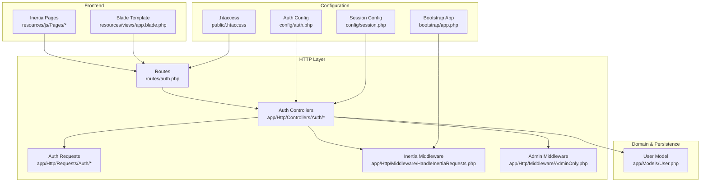
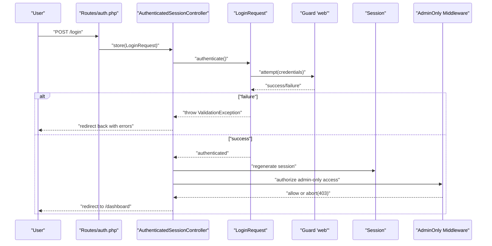
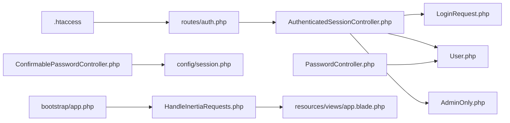
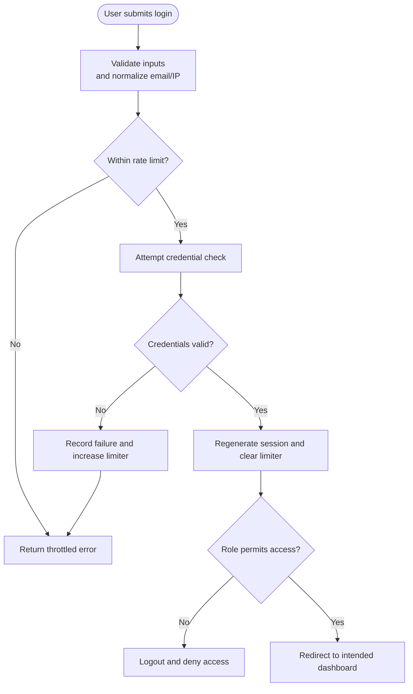

# Security Best Practices

<cite>
**Referenced Files in This Document**
- [AuthenticatedSessionController.php](file://app/Http/Controllers/Auth/AuthenticatedSessionController.php)
- [LoginRequest.php](file://app/Http/Requests/Auth/LoginRequest.php)
- [User.php](file://app/Models/User.php)
- [auth.php](file://config/auth.php)
- [auth.php](file://routes/auth.php)
- [AdminOnly.php](file://app/Http/Middleware/AdminOnly.php)
- [session.php](file://config/session.php)
- [ConfirmablePasswordController.php](file://app/Http/Controllers/Auth/ConfirmablePasswordController.php)
- [PasswordController.php](file://app/Http/Controllers/Auth/PasswordController.php)
- [HandleInertiaRequests.php](file://app/Http/Middleware/HandleInertiaRequests.php)
- [.htaccess](file://public/.htaccess)
- [app.php](file://bootstrap/app.php)
- [app.blade.php](file://resources/views/app.blade.php)
</cite>

## Table of Contents
1. [Introduction](#introduction)
2. [Project Structure](#project-structure)
3. [Core Components](#core-components)
4. [Architecture Overview](#architecture-overview)
5. [Detailed Component Analysis](#detailed-component-analysis)
6. [Dependency Analysis](#dependency-analysis)
7. [Performance Considerations](#performance-considerations)
8. [Troubleshooting Guide](#troubleshooting-guide)
9. [Conclusion](#conclusion)
10. [Appendices](#appendices)

## Introduction
This document provides comprehensive security documentation for the EDUfa application with a focus on authentication, authorization, and data protection. It explains how Laravel’s built-in mechanisms are configured and used, highlights secure coding practices for validation and input handling, outlines role-based access control patterns, and details safe session and password handling. Guidance is also included for secure file uploads, security headers, HTTPS enforcement, and Content Security Policy (CSP) implementation. Finally, it presents secure controller patterns, request validation approaches, authentication flows, and recommended testing and assessment techniques.

## Project Structure
The application follows a layered MVC architecture with dedicated controllers under app/Http/Controllers, request validation under app/Http/Requests, middleware under app/Http/Middleware, and configuration under config. Routes are grouped by authentication state in routes/auth.php. The frontend integrates with Inertia.js and Blade templates under resources/views.

**Diagram sources**
- [auth.php](file://routes/auth.php)
- [AuthenticatedSessionController.php](file://app/Http/Controllers/Auth/AuthenticatedSessionController.php)
- [LoginRequest.php](file://app/Http/Requests/Auth/LoginRequest.php)
- [User.php](file://app/Models/User.php)
- [AdminOnly.php](file://app/Http/Middleware/AdminOnly.php)
- [HandleInertiaRequests.php](file://app/Http/Middleware/HandleInertiaRequests.php)
- [auth.php](file://config/auth.php)
- [session.php](file://config/session.php)
- [app.php](file://bootstrap/app.php)
- [.htaccess](file://public/.htaccess)
- [app.blade.php](file://resources/views/app.blade.php)

**Section sources**
- [auth.php](file://routes/auth.php)
- [app.php](file://bootstrap/app.php)

## Core Components
- Authentication Controllers: Manage login, logout, password confirmation, and password updates.
- Request Validators: Enforce input validation and rate-limiting during authentication.
- User Model: Defines roles and password hashing behavior.
- Middleware: Protects routes and shares authenticated user context.
- Session Configuration: Controls cookie security and session lifecycle.
- Frontend Integration: Shares authenticated state via Inertia middleware.

Key security-relevant responsibilities:
- Controllers enforce guest vs. authenticated routing and restrict admin-only actions.
- Requests validate inputs and throttle brute-force attempts.
- User model ensures hashed passwords and role checks.
- Middleware enforces authorization policies and exposes user context.
- Session configuration sets secure defaults for cookies and SameSite behavior.

**Section sources**
- [AuthenticatedSessionController.php](file://app/Http/Controllers/Auth/AuthenticatedSessionController.php)
- [LoginRequest.php](file://app/Http/Requests/Auth/LoginRequest.php)
- [User.php](file://app/Models/User.php)
- [AdminOnly.php](file://app/Http/Middleware/AdminOnly.php)
- [HandleInertiaRequests.php](file://app/Http/Middleware/HandleInertiaRequests.php)
- [session.php](file://config/session.php)

## Architecture Overview
The authentication and authorization architecture centers around:
- Route groups enforcing guest vs. authenticated contexts.
- Controllers orchestrating authentication state and redirects.
- Request validators performing validation and rate limiting.
- Middleware applying role-based access control and sharing user context.
- Configuration files defining guards, providers, session cookies, and security headers.

**Diagram sources**
- [auth.php](file://routes/auth.php)
- [AuthenticatedSessionController.php](file://app/Http/Controllers/Auth/AuthenticatedSessionController.php)
- [LoginRequest.php](file://app/Http/Requests/Auth/LoginRequest.php)
- [AdminOnly.php](file://app/Http/Middleware/AdminOnly.php)

## Detailed Component Analysis

### Authentication Controllers
- Purpose: Handle login, logout, password confirmation, and password updates.
- Security behavior:
  - Login uses a validated request object and regenerates the session after successful authentication.
  - Logout invalidates the session and regenerates the CSRF token.
  - Password confirmation validates against the current password and records confirmation time in the session.
  - Password updates validate current password and new password rules, then hash and store the new password.

Recommended secure implementation patterns:
- Always regenerate session on successful login.
- Invalidate and regenerate session on logout.
- Use request validation with strong password rules and current password verification.
- Avoid exposing sensitive fields in responses.

**Section sources**
- [AuthenticatedSessionController.php](file://app/Http/Controllers/Auth/AuthenticatedSessionController.php)
- [ConfirmablePasswordController.php](file://app/Http/Controllers/Auth/ConfirmablePasswordController.php)
- [PasswordController.php](file://app/Http/Controllers/Auth/PasswordController.php)

### Request Validation and Rate Limiting
- Purpose: Validate inputs and protect against brute-force login attempts.
- Security behavior:
  - Validates presence and format of email and password.
  - Implements rate limiting per email+IP with lockout events and throttling messages.
  - Uses a throttle key derived from normalized email and client IP.

Secure coding practices:
- Keep validation strict and fail fast.
- Use rate limiter keys that bind to user identity and device characteristics.
- Provide minimal, localized error messages to avoid leaking account existence.

**Section sources**
- [LoginRequest.php](file://app/Http/Requests/Auth/LoginRequest.php)

### User Role Management and Authorization
- Purpose: Define roles and access control helpers.
- Security behavior:
  - Roles include admin and editor.
  - Helper methods determine admin/editor status and combined admin-access eligibility.
  - Controllers check role membership to gate admin-only areas.

Access control patterns:
- Use middleware aliases to apply admin-only restrictions.
- Combine role checks with route-level middleware for defense-in-depth.
- Avoid hardcoding role checks; centralize in model helpers or middleware.

**Section sources**
- [User.php](file://app/Models/User.php)
- [AdminOnly.php](file://app/Http/Middleware/AdminOnly.php)

### Session Management and CSRF Protection
- Purpose: Secure session cookies and CSRF protection.
- Security behavior:
  - Session driver configured via environment variable.
  - Secure, HttpOnly, and SameSite cookie attributes configurable.
  - CSRF mitigations handled by Laravel’s built-in protections and frontend integration.
  - .htaccess ensures proper handling of Authorization and XSRF-Token headers.

Best practices:
- Enable HTTPS-only cookies in production.
- Prefer SameSite=strict or strict Lax depending on cross-site needs.
- Regenerate session ID after login and logout.
- Use CSRF tokens and consider frontend token synchronization.

**Section sources**
- [session.php](file://config/session.php)
- [.htaccess](file://public/.htaccess)

### Frontend Integration and Shared Context
- Purpose: Share authenticated user context to the frontend.
- Security behavior:
  - Inertia middleware shares the current user to the frontend.
  - Blade template loads Vite assets and Inertia head.

Guidelines:
- Avoid leaking sensitive user attributes to the frontend.
- Use server-side rendering for pages requiring immediate auth context.
- Ensure frontend does not store sensitive session identifiers.

**Section sources**
- [HandleInertiaRequests.php](file://app/Http/Middleware/HandleInertiaRequests.php)
- [app.blade.php](file://resources/views/app.blade.php)

### Configuration and Defaults
- Purpose: Centralize security-sensitive configuration.
- Security behavior:
  - Authentication guard and provider configured for session-based authentication.
  - Password reset broker settings define token lifetime and throttling.
  - Session cookie attributes include secure, httpOnly, and sameSite options.
  - Bootstrap registers middleware and aliases.

Recommendations:
- Review and harden defaults for production environments.
- Ensure APP_KEY is strong and rotated periodically.
- Configure HTTPS enforcement at the web server or load balancer level.

**Section sources**
- [auth.php](file://config/auth.php)
- [session.php](file://config/session.php)
- [app.php](file://bootstrap/app.php)

## Dependency Analysis

**Diagram sources**
- [auth.php](file://routes/auth.php)
- [AuthenticatedSessionController.php](file://app/Http/Controllers/Auth/AuthenticatedSessionController.php)
- [LoginRequest.php](file://app/Http/Requests/Auth/LoginRequest.php)
- [User.php](file://app/Models/User.php)
- [AdminOnly.php](file://app/Http/Middleware/AdminOnly.php)
- [ConfirmablePasswordController.php](file://app/Http/Controllers/Auth/ConfirmablePasswordController.php)
- [PasswordController.php](file://app/Http/Controllers/Auth/PasswordController.php)
- [HandleInertiaRequests.php](file://app/Http/Middleware/HandleInertiaRequests.php)
- [session.php](file://config/session.php)
- [app.php](file://bootstrap/app.php)
- [.htaccess](file://public/.htaccess)
- [app.blade.php](file://resources/views/app.blade.php)

**Section sources**
- [auth.php](file://routes/auth.php)
- [app.php](file://bootstrap/app.php)

## Performance Considerations
- Use database-backed sessions for horizontal scaling and centralized invalidation.
- Tune rate limiter limits and lockout durations to balance security and usability.
- Minimize frontend payload sizes and leverage caching for static assets.
- Apply middleware selectively to reduce overhead on public routes.

## Troubleshooting Guide
Common issues and resolutions:
- Login throttling: Verify rate limiter keys and ensure consistent email normalization and IP capture.
- Session fixation: Confirm session regeneration on login and logout.
- Authorization failures: Check middleware alias registration and role helper logic.
- CSRF/XSRF errors: Ensure frontend respects SameSite and CSRF token policies.
- HTTPS cookie problems: Validate secure flag and SameSite settings in session configuration.

**Section sources**
- [LoginRequest.php](file://app/Http/Requests/Auth/LoginRequest.php)
- [AuthenticatedSessionController.php](file://app/Http/Controllers/Auth/AuthenticatedSessionController.php)
- [AdminOnly.php](file://app/Http/Middleware/AdminOnly.php)
- [session.php](file://config/session.php)

## Conclusion
The EDUfa application leverages Laravel’s robust authentication and session infrastructure, complemented by explicit middleware and request validation to enforce secure access patterns. By maintaining strong defaults, centralizing role checks, and applying CSRF and cookie security configurations, the system achieves a solid baseline for authentication, authorization, and data protection. Continued vigilance in deployment hardening, monitoring, and regular security assessments will further strengthen resilience.

## Appendices

### Secure Coding Patterns Checklist
- Always validate inputs with strict rules and fail securely.
- Regenerate session IDs after authentication and logout.
- Enforce role-based access control via middleware and helper methods.
- Hash and rotate secrets; avoid storing plaintext credentials.
- Use HTTPS-only cookies and appropriate SameSite policies.
- Implement rate limiting for authentication endpoints.
- Sanitize and escape output consistently to mitigate XSS.
- Avoid storing sensitive data in client-side storage.

### Authentication Flow Reference

**Diagram sources**
- [LoginRequest.php](file://app/Http/Requests/Auth/LoginRequest.php)
- [AuthenticatedSessionController.php](file://app/Http/Controllers/Auth/AuthenticatedSessionController.php)
- [User.php](file://app/Models/User.php)