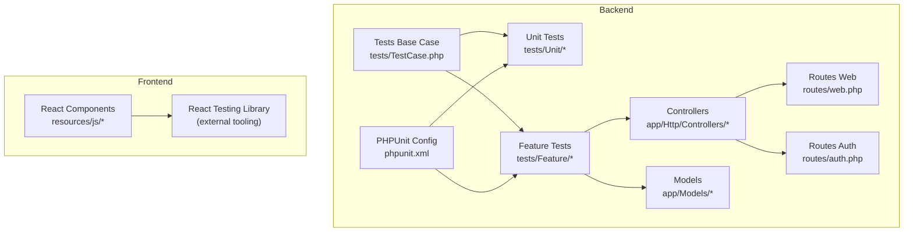
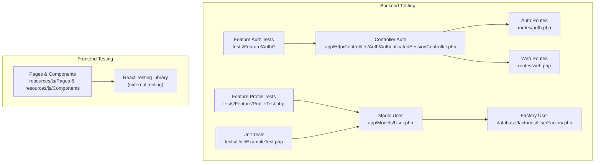
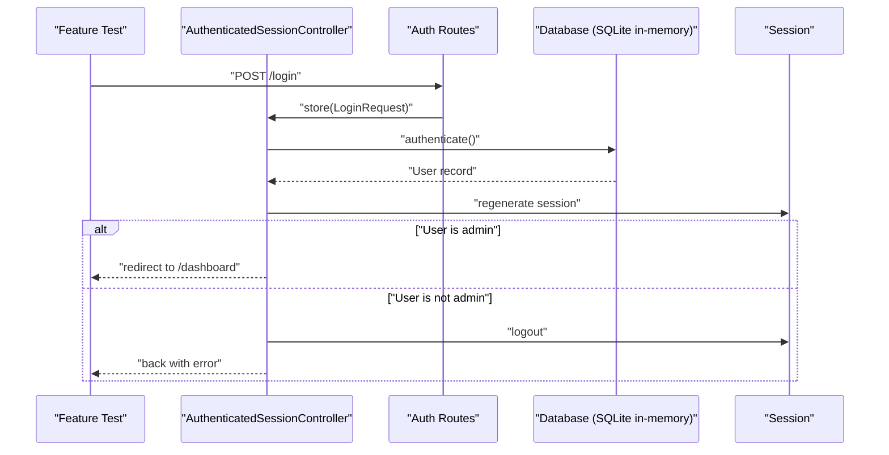
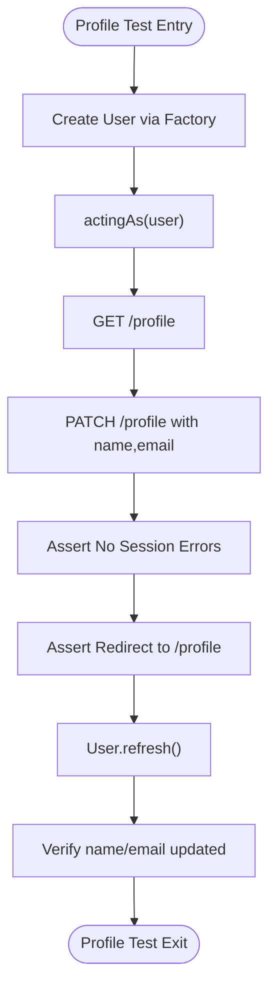
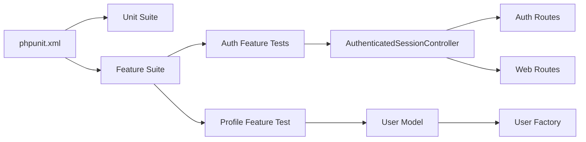

# Testing Strategy and Implementation

<cite>
**Referenced Files in This Document**
- [phpunit.xml](file://phpunit.xml)
- [composer.json](file://composer.json)
- [package.json](file://package.json)
- [TestCase.php](file://tests/TestCase.php)
- [AuthenticationTest.php](file://tests/Feature/Auth/AuthenticationTest.php)
- [RegistrationTest.php](file://tests/Feature/Auth/RegistrationTest.php)
- [ProfileTest.php](file://tests/Feature/ProfileTest.php)
- [ExampleTest.php (Feature)](file://tests/Feature/ExampleTest.php)
- [ExampleTest.php (Unit)](file://tests/Unit/ExampleTest.php)
- [AuthenticatedSessionController.php](file://app/Http/Controllers/Auth/AuthenticatedSessionController.php)
- [User.php](file://app/Models/User.php)
- [UserFactory.php](file://database/factories/UserFactory.php)
- [web.php](file://routes/web.php)
- [auth.php](file://routes/auth.php)
</cite>

## Table of Contents
1. [Introduction](#introduction)
2. [Project Structure](#project-structure)
3. [Core Components](#core-components)
4. [Architecture Overview](#architecture-overview)
5. [Detailed Component Analysis](#detailed-component-analysis)
6. [Dependency Analysis](#dependency-analysis)
7. [Performance Considerations](#performance-considerations)
8. [Troubleshooting Guide](#troubleshooting-guide)
9. [Conclusion](#conclusion)
10. [Appendices](#appendices)

## Introduction
This document defines a comprehensive testing strategy for the EDUfa application, covering PHPUnit-based backend testing (unit, feature, and integration tests) and React Testing Library-based frontend component testing. It outlines testing patterns for controllers, models, and database interactions, along with frontend component testing and user interaction simulation. It also documents test organization, naming conventions, fixture management, authentication flows, form submissions, API endpoints, and React component behaviors. Guidance is included for test data management, mocking strategies, database testing approaches, writing effective tests, continuous integration setup, and test coverage reporting.

## Project Structure
The repository follows a layered Laravel structure with dedicated testing directories and a clear separation between backend and frontend concerns:
- Backend tests reside under tests/Unit and tests/Feature, organized by domain (e.g., Auth).
- Controllers and models are located under app/Http/Controllers and app/Models respectively.
- Routes are defined under routes/, with web.php and auth.php handling application and authentication endpoints.
- Frontend React components and pages are under resources/js/.
- Test configuration is centralized in phpunit.xml, with Composer scripts for running tests.

**Diagram sources**
- [TestCase.php:1-11](file://tests/TestCase.php#L1-L11)
- [phpunit.xml:1-37](file://phpunit.xml#L1-L37)
- [web.php:1-137](file://routes/web.php#L1-L137)
- [auth.php:1-44](file://routes/auth.php#L1-L44)

**Section sources**
- [phpunit.xml:1-37](file://phpunit.xml#L1-L37)
- [composer.json:1-91](file://composer.json#L1-L91)
- [package.json:1-49](file://package.json#L1-L49)

## Core Components
This section summarizes the testing stack and configuration:
- PHPUnit configuration defines test suites for Unit and Feature, sets environment variables for testing (including SQLite in-memory database), and includes the application source for coverage.
- Composer scripts provide a unified entry point for running tests via Artisan.
- The base test case class extends Laravel’s base test case, enabling database refresh per test and Inertia rendering support.

Key configuration highlights:
- Test suites: Unit and Feature directories.
- Environment overrides for fast, isolated testing (SQLite in-memory, array caches, sync queues, array mailer).
- Coverage inclusion for app directory.

**Section sources**
- [phpunit.xml:7-19](file://phpunit.xml#L7-L19)
- [phpunit.xml:20-35](file://phpunit.xml#L20-L35)
- [composer.json:51-54](file://composer.json#L51-L54)
- [TestCase.php:1-11](file://tests/TestCase.php#L1-L11)

## Architecture Overview
The testing architecture integrates Laravel’s HTTP testing capabilities with controller-driven flows and Eloquent models, while frontend testing leverages React Testing Library for component-level assertions and user interaction simulations.

**Diagram sources**
- [AuthenticationTest.php:1-55](file://tests/Feature/Auth/AuthenticationTest.php#L1-L55)
- [ProfileTest.php:1-100](file://tests/Feature/ProfileTest.php#L1-L100)
- [AuthenticatedSessionController.php:1-58](file://app/Http/Controllers/Auth/AuthenticatedSessionController.php#L1-L58)
- [User.php:1-47](file://app/Models/User.php#L1-L47)
- [UserFactory.php:1-46](file://database/factories/UserFactory.php#L1-L46)
- [auth.php:1-44](file://routes/auth.php#L1-L44)
- [web.php:1-137](file://routes/web.php#L1-L137)

## Detailed Component Analysis

### Backend Testing Patterns

#### Authentication Flow Testing
Authentication tests validate login, logout, and invalid credentials scenarios. They use database refresh to ensure isolation and rely on factories to provision users.

Key patterns:
- Use RefreshDatabase trait for clean state per test.
- Create users via factories.
- Assert authentication state and redirects.
- Validate guest state after logout.

Representative tests:
- [AuthenticationTest.php:1-55](file://tests/Feature/Auth/AuthenticationTest.php#L1-L55)
- [RegistrationTest.php:1-32](file://tests/Feature/Auth/RegistrationTest.php#L1-L32)

**Diagram sources**
- [AuthenticatedSessionController.php:28-43](file://app/Http/Controllers/Auth/AuthenticatedSessionController.php#L28-L43)
- [auth.php:13-31](file://routes/auth.php#L13-L31)
- [AuthenticationTest.php:20-31](file://tests/Feature/Auth/AuthenticationTest.php#L20-L31)

**Section sources**
- [AuthenticationTest.php:1-55](file://tests/Feature/Auth/AuthenticationTest.php#L1-L55)
- [RegistrationTest.php:1-32](file://tests/Feature/Auth/RegistrationTest.php#L1-L32)
- [AuthenticatedSessionController.php:1-58](file://app/Http/Controllers/Auth/AuthenticatedSessionController.php#L1-L58)
- [auth.php:1-44](file://routes/auth.php#L1-L44)

#### Profile Management Testing
Profile tests validate profile page rendering, updates, email verification behavior, account deletion, and password confirmation requirements.

Patterns:
- Use actingAs to simulate authenticated users.
- Assert session errors and redirects.
- Refresh models to reflect persisted changes.
- Validate email verification timestamps.

Reference:
- [ProfileTest.php:1-100](file://tests/Feature/ProfileTest.php#L1-L100)

**Diagram sources**
- [ProfileTest.php:13-44](file://tests/Feature/ProfileTest.php#L13-L44)

**Section sources**
- [ProfileTest.php:1-100](file://tests/Feature/ProfileTest.php#L1-L100)

#### Unit Testing Patterns
Unit tests focus on isolated PHP logic and model behaviors without HTTP requests or database persistence.

Patterns:
- Extend PHPUnit\Framework\TestCase.
- Keep tests fast and deterministic.
- Use factories for model creation when needed.

References:
- [ExampleTest.php (Unit):1-17](file://tests/Unit/ExampleTest.php#L1-L17)

**Section sources**
- [ExampleTest.php (Unit):1-17](file://tests/Unit/ExampleTest.php#L1-L17)

#### Feature Testing Patterns
Feature tests validate end-to-end HTTP flows, including route resolution, middleware enforcement, and controller actions.

Patterns:
- Use RefreshDatabase for database isolation.
- Assert HTTP status codes, redirects, and inertia-rendered props.
- Leverage actingAs for authenticated scenarios.

References:
- [ExampleTest.php (Feature):1-20](file://tests/Feature/ExampleTest.php#L1-L20)
- [web.php:68-134](file://routes/web.php#L68-L134)

**Section sources**
- [ExampleTest.php (Feature):1-20](file://tests/Feature/ExampleTest.php#L1-L20)
- [web.php:1-137](file://routes/web.php#L1-L137)

### Frontend Testing Strategy with React Testing Library
Frontend testing focuses on component-level behavior and user interaction simulation using React Testing Library. Recommended practices:
- Render components in isolation with appropriate contexts (e.g., Inertia layouts).
- Simulate user interactions (clicks, typing) and assert DOM changes.
- Test form submission flows, validation messages, and navigation.
- Mock external dependencies (e.g., API clients) at the boundaries.
- Use screen queries to assert presence/absence of elements and accessibility attributes.

Guidelines:
- Place component tests alongside components under resources/js/.
- Prefer user-event for realistic interactions.
- Keep tests focused on behavior, not implementation details.
- Snapshot testing should be limited to layout primitives.

[No sources needed since this section provides general guidance]

### Test Organization and Naming Conventions
Recommended conventions:
- Directory structure mirrors domain: tests/Feature/Auth, tests/Feature/Admin.
- Class names end with Test (e.g., AuthenticationTest.php).
- Method names describe behavior: test_login_screen_can_be_rendered().
- Fixture management:
  - Use factories for deterministic model creation.
  - Seeders for initial dataset consistency across environments.
- Group related tests in the same class to share setUp/tearDown logic.

[No sources needed since this section provides general guidance]

### Database Testing Approaches
Approach:
- Use SQLite in-memory database for speed and isolation.
- Apply RefreshDatabase per test to reset schema and data.
- Seeders for baseline data; factories for dynamic test data.
- Assertions on model states and database records.

References:
- [phpunit.xml:26-28](file://phpunit.xml#L26-L28)
- [UserFactory.php:1-46](file://database/factories/UserFactory.php#L1-L46)
- [User.php:1-47](file://app/Models/User.php#L1-L47)

**Section sources**
- [phpunit.xml:20-35](file://phpunit.xml#L20-L35)
- [UserFactory.php:1-46](file://database/factories/UserFactory.php#L1-L46)
- [User.php:1-47](file://app/Models/User.php#L1-L47)

### Mocking Strategies
Recommended strategies:
- Mock external services at boundaries (HTTP clients, third-party APIs).
- Use mockery for dependency injection mocks in unit tests.
- For HTTP tests, stub only the parts necessary to isolate the component under test.
- Avoid over-mocking; prefer real factories and in-memory database for integration-like tests.

[No sources needed since this section provides general guidance]

### Continuous Integration Setup
Recommended CI pipeline steps:
- Install dependencies (Composer and npm).
- Prepare database and run migrations.
- Execute tests via Composer script: composer run test.
- Collect coverage (if configured) and artifacts.

References:
- [composer.json:51-54](file://composer.json#L51-L54)

**Section sources**
- [composer.json:51-54](file://composer.json#L51-L54)

### Test Coverage Reporting
Coverage configuration:
- Include app directory for coverage collection.
- Run with coverage enabled via PHPUnit CLI options if desired.
- Integrate coverage reports in CI for trend monitoring.

References:
- [phpunit.xml:15-19](file://phpunit.xml#L15-L19)

**Section sources**
- [phpunit.xml:15-19](file://phpunit.xml#L15-L19)

## Dependency Analysis
This section maps test dependencies and their relationships to backend components.

**Diagram sources**
- [phpunit.xml:7-14](file://phpunit.xml#L7-L14)
- [AuthenticationTest.php:1-55](file://tests/Feature/Auth/AuthenticationTest.php#L1-L55)
- [ProfileTest.php:1-100](file://tests/Feature/ProfileTest.php#L1-L100)
- [AuthenticatedSessionController.php:1-58](file://app/Http/Controllers/Auth/AuthenticatedSessionController.php#L1-L58)
- [auth.php:1-44](file://routes/auth.php#L1-L44)
- [web.php:1-137](file://routes/web.php#L1-L137)
- [User.php:1-47](file://app/Models/User.php#L1-L47)
- [UserFactory.php:1-46](file://database/factories/UserFactory.php#L1-L46)

**Section sources**
- [phpunit.xml:1-37](file://phpunit.xml#L1-L37)
- [AuthenticationTest.php:1-55](file://tests/Feature/Auth/AuthenticationTest.php#L1-L55)
- [ProfileTest.php:1-100](file://tests/Feature/ProfileTest.php#L1-L100)
- [AuthenticatedSessionController.php:1-58](file://app/Http/Controllers/Auth/AuthenticatedSessionController.php#L1-L58)
- [auth.php:1-44](file://routes/auth.php#L1-L44)
- [web.php:1-137](file://routes/web.php#L1-L137)
- [User.php:1-47](file://app/Models/User.php#L1-L47)
- [UserFactory.php:1-46](file://database/factories/UserFactory.php#L1-L46)

## Performance Considerations
- Use SQLite in-memory database for fast test runs.
- Minimize external service calls; mock when possible.
- Prefer factories over heavy seeding for dynamic data.
- Keep tests small and focused to reduce runtime.
- Use database transactions sparingly; RefreshDatabase ensures isolation but may increase overhead.

[No sources needed since this section provides general guidance]

## Troubleshooting Guide
Common issues and resolutions:
- Database state leakage: Ensure RefreshDatabase is used in feature tests.
- Authentication failures: Verify actingAs usage and middleware guards.
- Redirect assertions: Confirm route names and intended destinations.
- CSRF/token errors: Use Laravel’s built-in helpers or ensure proper form setup.
- Coverage gaps: Include app directory and run with coverage flags.

[No sources needed since this section provides general guidance]

## Conclusion
The EDUfa testing strategy combines robust backend feature and unit tests with clear patterns for authentication, profile management, and database interactions. By leveraging factories, in-memory databases, and Laravel’s HTTP testing capabilities, the suite remains fast, reliable, and maintainable. Extending the strategy to include React Testing Library for frontend components will ensure comprehensive coverage across the full stack.

[No sources needed since this section summarizes without analyzing specific files]

## Appendices

### Appendix A: Example Test Scenarios and References
- Authentication login and logout: [AuthenticationTest.php:1-55](file://tests/Feature/Auth/AuthenticationTest.php#L1-L55)
- User registration: [RegistrationTest.php:1-32](file://tests/Feature/Auth/RegistrationTest.php#L1-L32)
- Profile update and delete: [ProfileTest.php:1-100](file://tests/Feature/ProfileTest.php#L1-L100)
- Basic feature test: [ExampleTest.php (Feature):1-20](file://tests/Feature/ExampleTest.php#L1-L20)
- Basic unit test: [ExampleTest.php (Unit):1-17](file://tests/Unit/ExampleTest.php#L1-L17)

**Section sources**
- [AuthenticationTest.php:1-55](file://tests/Feature/Auth/AuthenticationTest.php#L1-L55)
- [RegistrationTest.php:1-32](file://tests/Feature/Auth/RegistrationTest.php#L1-L32)
- [ProfileTest.php:1-100](file://tests/Feature/ProfileTest.php#L1-L100)
- [ExampleTest.php (Feature):1-20](file://tests/Feature/ExampleTest.php#L1-L20)
- [ExampleTest.php (Unit):1-17](file://tests/Unit/ExampleTest.php#L1-L17)