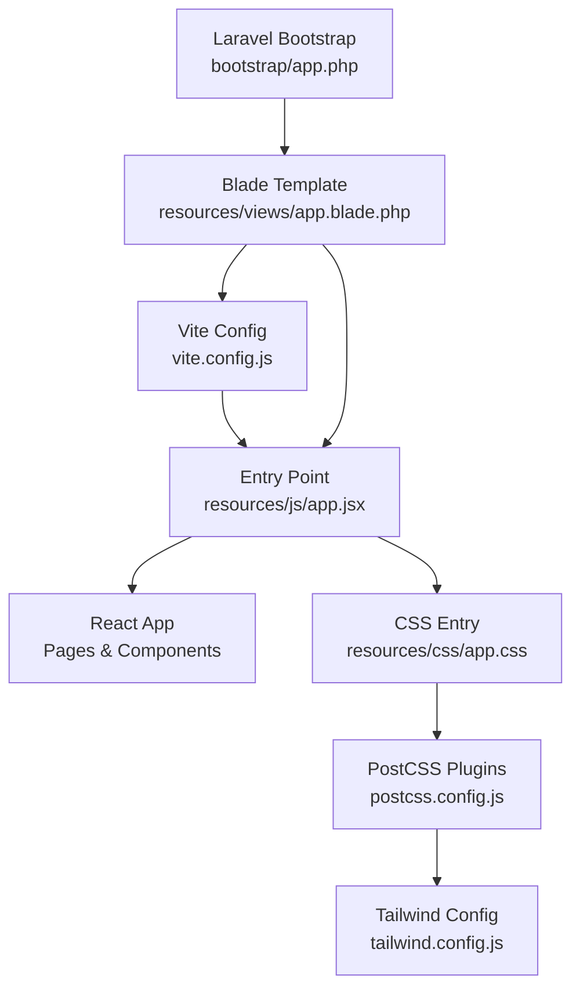
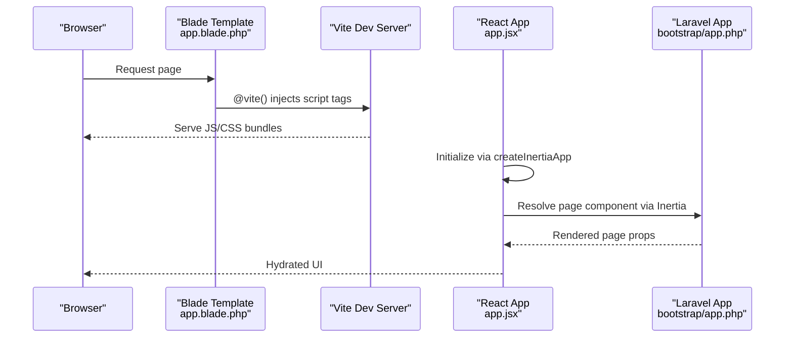
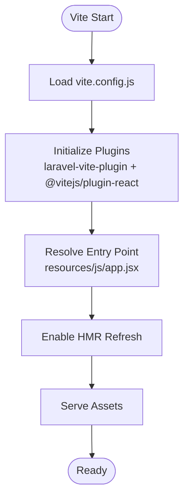
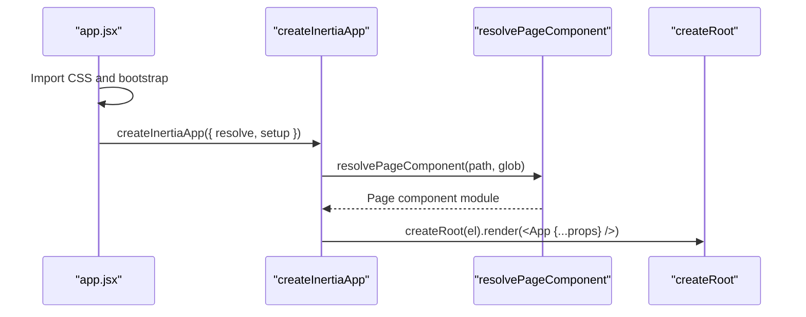
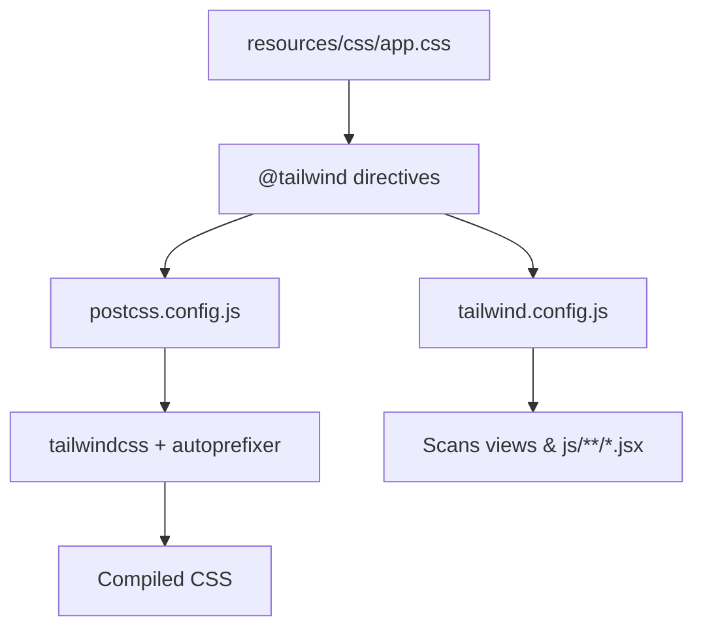
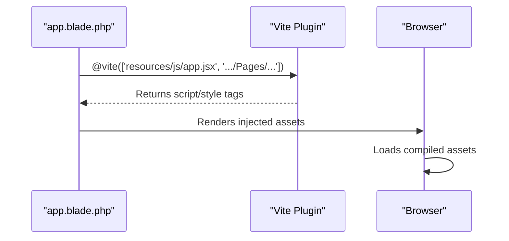
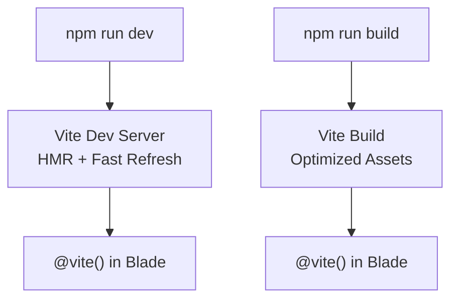
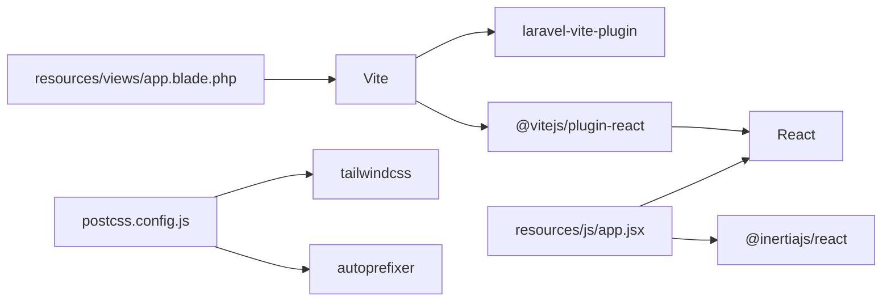

# Build Process and Vite Configuration

<cite>
**Referenced Files in This Document**
- [vite.config.js](file://vite.config.js)
- [package.json](file://package.json)
- [jsconfig.json](file://jsconfig.json)
- [postcss.config.js](file://postcss.config.js)
- [tailwind.config.js](file://tailwind.config.js)
- [resources/js/app.jsx](file://resources/js/app.jsx)
- [resources/css/app.css](file://resources/css/app.css)
- [resources/views/app.blade.php](file://resources/views/app.blade.php)
- [bootstrap/app.php](file://bootstrap/app.php)
</cite>

## Table of Contents
1. [Introduction](#introduction)
2. [Project Structure](#project-structure)
3. [Core Components](#core-components)
4. [Architecture Overview](#architecture-overview)
5. [Detailed Component Analysis](#detailed-component-analysis)
6. [Dependency Analysis](#dependency-analysis)
7. [Performance Considerations](#performance-considerations)
8. [Troubleshooting Guide](#troubleshooting-guide)
9. [Conclusion](#conclusion)

## Introduction
This document explains the build process and Vite configuration for the project. It covers how Vite integrates with Laravel and React via Inertia, how assets are bundled and optimized, and how development and production builds differ. It also documents the asset pipeline for JavaScript, CSS, and static resources, along with caching, performance optimization, and deployment preparation.

## Project Structure
The build system centers around Vite’s configuration and a small set of supporting files:
- Vite configuration defines plugins, entry points, and refresh behavior.
- Package scripts orchestrate development and production builds.
- Tailwind CSS and PostCSS configure styling.
- Blade templates inject Vite-managed assets into the application layout.
- The React application initializes via an Inertia bootstrapper.

**Diagram sources**
- [vite.config.js:1-14](file://vite.config.js#L1-L14)
- [resources/js/app.jsx:1-26](file://resources/js/app.jsx#L1-L26)
- [resources/css/app.css:1-30](file://resources/css/app.css#L1-L30)
- [postcss.config.js:1-7](file://postcss.config.js#L1-L7)
- [tailwind.config.js:1-42](file://tailwind.config.js#L1-L42)
- [resources/views/app.blade.php:1-57](file://resources/views/app.blade.php#L1-L57)
- [bootstrap/app.php:1-28](file://bootstrap/app.php#L1-L28)

**Section sources**
- [vite.config.js:1-14](file://vite.config.js#L1-L14)
- [package.json:1-49](file://package.json#L1-L49)
- [jsconfig.json:1-11](file://jsconfig.json#L1-L11)
- [postcss.config.js:1-7](file://postcss.config.js#L1-L7)
- [tailwind.config.js:1-42](file://tailwind.config.js#L1-L42)
- [resources/js/app.jsx:1-26](file://resources/js/app.jsx#L1-L26)
- [resources/css/app.css:1-30](file://resources/css/app.css#L1-L30)
- [resources/views/app.blade.php:1-57](file://resources/views/app.blade.php#L1-L57)
- [bootstrap/app.php:1-28](file://bootstrap/app.php#L1-L28)

## Core Components
- Vite configuration
  - Uses the Laravel Vite plugin to integrate with Laravel’s Blade templating and automatic HMR.
  - Registers the React plugin for JSX transformation and fast refresh.
  - Sets the single JavaScript entry point and enables refresh on file changes.
- Package scripts
  - Provides dev and build commands wired to Vite.
- Asset entry points
  - JavaScript entry imports CSS and the application bootstrap.
  - CSS entry imports Tailwind directives and theme layers.
- Blade integration
  - Injects Vite runtime and preloads assets for both development and production.
  - Supports per-page dynamic entries via the Laravel Vite helpers.

**Section sources**
- [vite.config.js:5-13](file://vite.config.js#L5-L13)
- [package.json:5-8](file://package.json#L5-L8)
- [resources/js/app.jsx:1-26](file://resources/js/app.jsx#L1-L26)
- [resources/css/app.css:1-30](file://resources/css/app.css#L1-L30)
- [resources/views/app.blade.php:26-29](file://resources/views/app.blade.php#L26-L29)

## Architecture Overview
The build pipeline connects Blade, Vite, React, and Inertia to deliver a modern frontend integrated with Laravel.

**Diagram sources**
- [resources/views/app.blade.php:26-29](file://resources/views/app.blade.php#L26-L29)
- [resources/js/app.jsx:10-25](file://resources/js/app.jsx#L10-L25)
- [bootstrap/app.php:13-24](file://bootstrap/app.php#L13-L24)

## Detailed Component Analysis

### Vite Configuration
- Plugins
  - Laravel Vite Plugin: Integrates with Laravel, resolves page components, and enables HMR refresh.
  - React Plugin: Enables JSX transform and React Fast Refresh during development.
- Entry point
  - Single entry at resources/js/app.jsx.
- Refresh behavior
  - Automatic refresh enabled for rapid development feedback.

**Diagram sources**
- [vite.config.js:5-13](file://vite.config.js#L5-L13)

**Section sources**
- [vite.config.js:5-13](file://vite.config.js#L5-L13)

### JavaScript Entry and Bootstrapping
- Entry point
  - Imports CSS and the application bootstrap.
  - Initializes Inertia with page resolution and React root rendering.
- Environment variable
  - Reads VITE_APP_NAME to customize the document title.
- Page resolution
  - Uses the Laravel Vite helper to resolve page components dynamically.

**Diagram sources**
- [resources/js/app.jsx:10-25](file://resources/js/app.jsx#L10-L25)

**Section sources**
- [resources/js/app.jsx:1-26](file://resources/js/app.jsx#L1-L26)

### CSS Pipeline and Styling
- CSS entry
  - Imports Tailwind layers and defines theme layers for base styles and dark mode.
- PostCSS
  - Tailwind and Autoprefixer configured via postcss.config.js.
- Tailwind
  - Scans Blade and React source files for class usage.
  - Extends fonts and colors, and registers plugins.

**Diagram sources**
- [resources/css/app.css:1-30](file://resources/css/app.css#L1-L30)
- [postcss.config.js:1-7](file://postcss.config.js#L1-L7)
- [tailwind.config.js:7-12](file://tailwind.config.js#L7-L12)

**Section sources**
- [resources/css/app.css:1-30](file://resources/css/app.css#L1-L30)
- [postcss.config.js:1-7](file://postcss.config.js#L1-L7)
- [tailwind.config.js:1-42](file://tailwind.config.js#L1-L42)

### Blade Integration and Asset Injection
- Dynamic entries
  - @vite() injects both the shared entry and the current page component.
- Hot reload support
  - @viteReactRefresh provides React Fast Refresh in development.
- Inertia hydration
  - @inertia and @inertiaHead render the React application and head metadata.

**Diagram sources**
- [resources/views/app.blade.php:26-29](file://resources/views/app.blade.php#L26-L29)

**Section sources**
- [resources/views/app.blade.php:26-29](file://resources/views/app.blade.php#L26-L29)

### Development vs Production Builds
- Development
  - Run the dev server using the dev script.
  - Vite serves assets with HMR and React Fast Refresh.
- Production
  - Run the build script to generate optimized assets.
  - Blade continues to inject assets via @vite(), which resolves hashed filenames automatically.

**Diagram sources**
- [package.json:5-8](file://package.json#L5-L8)
- [resources/views/app.blade.php:26-29](file://resources/views/app.blade.php#L26-L29)

**Section sources**
- [package.json:5-8](file://package.json#L5-L8)

### Cache Busting and Asset Versioning
- Vite automatically hashes output filenames in production builds.
- Blade’s @vite() helper resolves the latest asset URLs, ensuring cache-busting without manual intervention.

**Section sources**
- [resources/views/app.blade.php:26-29](file://resources/views/app.blade.php#L26-L29)

### Performance Optimization Techniques
- Code splitting
  - Per-page component resolution via Inertia reduces initial payload.
- Tree shaking
  - Vite and modern bundling minimize unused code.
- CSS optimization
  - Tailwind purges unused styles based on configured content globs.
- Preloading
  - Laravel middleware adds link headers for preloaded assets.

**Section sources**
- [tailwind.config.js:7-12](file://tailwind.config.js#L7-L12)
- [bootstrap/app.php:14-17](file://bootstrap/app.php#L14-L17)

### Bootstrap and Polyfills
- The project does not include a dedicated JavaScript bootstrap file in the provided context.
- React and related libraries are included via dependencies; ensure browsers meet library requirements.
- Consider adding a separate bootstrap entry if global initialization logic is needed.

**Section sources**
- [resources/js/app.jsx:1-2](file://resources/js/app.jsx#L1-L2)
- [package.json:24-47](file://package.json#L24-L47)

### Browser Compatibility and Polyfills
- No explicit polyfill configuration is present in the build files.
- If targeting older browsers, configure a polyfill loader or include a dedicated polyfill entry in the Vite config.

**Section sources**
- [vite.config.js:5-13](file://vite.config.js#L5-L13)

## Dependency Analysis
- Vite plugins
  - laravel-vite-plugin depends on Vite and Laravel’s Blade integration.
  - @vitejs/plugin-react depends on Vite and React.
- Build scripts
  - npm scripts delegate to Vite for dev/build tasks.
- CSS toolchain
  - Tailwind and Autoprefixer are orchestrated via postcss.config.js.
- Frontend stack
  - React, Inertia, and UI libraries are declared as dependencies.

**Diagram sources**
- [vite.config.js:2-3](file://vite.config.js#L2-L3)
- [package.json:9-22](file://package.json#L9-L22)
- [postcss.config.js:1-7](file://postcss.config.js#L1-L7)
- [resources/js/app.jsx:4-6](file://resources/js/app.jsx#L4-L6)
- [resources/views/app.blade.php:26-29](file://resources/views/app.blade.php#L26-L29)

**Section sources**
- [vite.config.js:2-3](file://vite.config.js#L2-L3)
- [package.json:9-22](file://package.json#L9-L22)
- [postcss.config.js:1-7](file://postcss.config.js#L1-L7)
- [resources/js/app.jsx:4-6](file://resources/js/app.jsx#L4-L6)
- [resources/views/app.blade.php:26-29](file://resources/views/app.blade.php#L26-L29)

## Performance Considerations
- Keep the entry point minimal; defer heavy initialization to pages/components.
- Use lazy loading for large components to reduce initial bundle size.
- Tailwind scanning should be scoped to avoid unnecessary CSS generation.
- Prefer CSS-in-JS or component-scoped styles only when necessary to maintain efficient purging.

## Troubleshooting Guide
- Vite dev server not starting
  - Ensure the dev script is available and dependencies are installed.
- Assets not updating in development
  - Verify HMR is enabled and the refresh option is active in the Vite config.
- CSS not applying
  - Confirm Tailwind directives are present and Tailwind is scanning the correct paths.
- Page component not resolving
  - Ensure the page filename matches the route and the resolver glob includes the Pages directory.
- Production build fails
  - Check for missing dependencies or unsupported syntax; transpile as needed.

**Section sources**
- [package.json:5-8](file://package.json#L5-L8)
- [vite.config.js:7-11](file://vite.config.js#L7-L11)
- [tailwind.config.js:7-12](file://tailwind.config.js#L7-L12)
- [resources/js/app.jsx:12-16](file://resources/js/app.jsx#L12-L16)

## Conclusion
The build system leverages Vite, Laravel’s Vite plugin, React, and Inertia to provide a modern, efficient frontend workflow. Development benefits from HMR and Fast Refresh, while production builds deliver optimized, cache-busted assets. Tailwind and PostCSS streamline styling, and Blade seamlessly injects assets into the Laravel application. By following the outlined practices and troubleshooting tips, teams can maintain a robust and performant build pipeline.