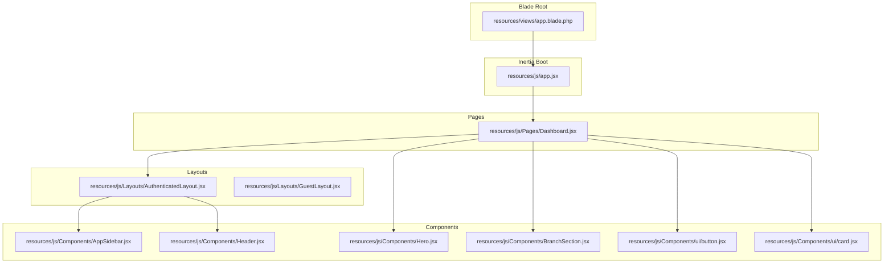
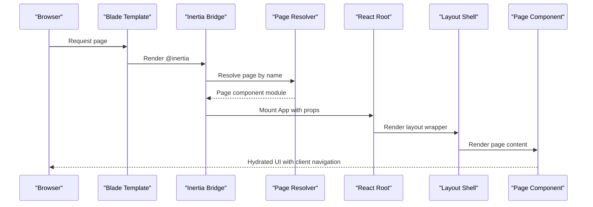
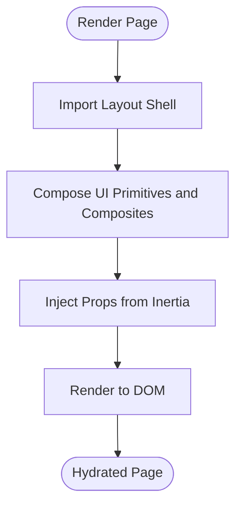
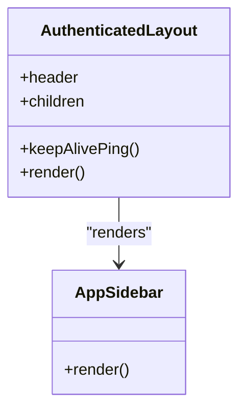
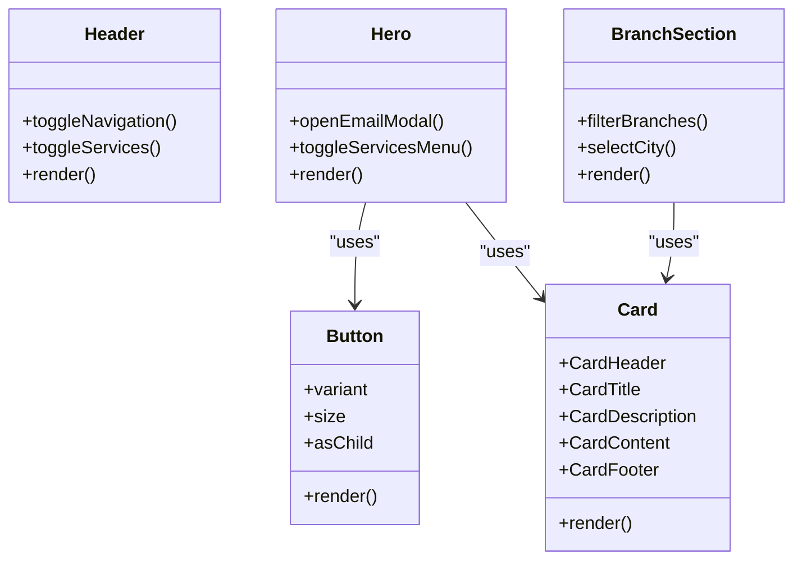
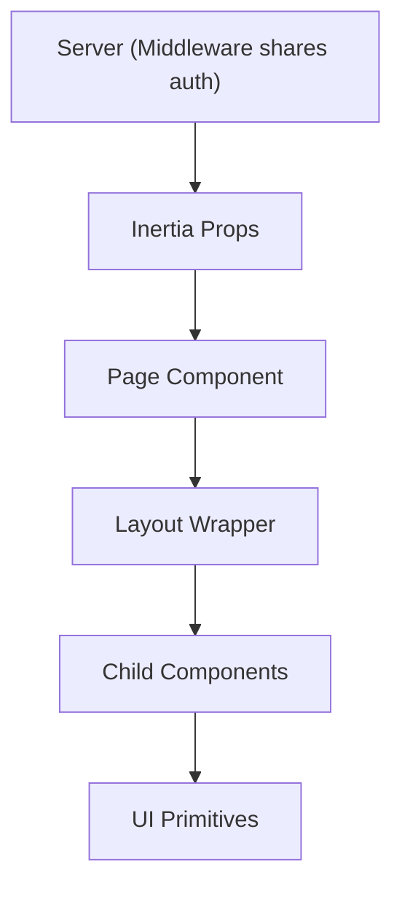
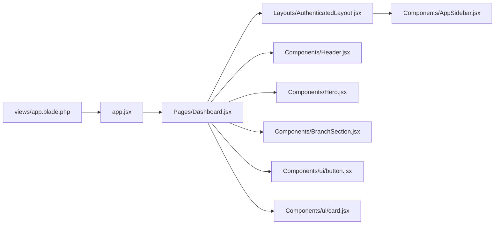

# Component Architecture and Organization

<cite>
**Referenced Files in This Document**
- [app.jsx](file://resources/js/app.jsx)
- [app.blade.php](file://resources/views/app.blade.php)
- [HandleInertiaRequests.php](file://app/Http/Middleware/HandleInertiaRequests.php)
- [AuthenticatedLayout.jsx](file://resources/js/Layouts/AuthenticatedLayout.jsx)
- [GuestLayout.jsx](file://resources/js/Layouts/GuestLayout.jsx)
- [AppSidebar.jsx](file://resources/js/Components/AppSidebar.jsx)
- [AuthenticatedLayout.jsx](file://resources/js/Layouts/AuthenticatedLayout.jsx)
- [Dashboard.jsx](file://resources/js/Pages/Dashboard.jsx)
- [Header.jsx](file://resources/js/Components/Header.jsx)
- [Hero.jsx](file://resources/js/Components/Hero.jsx)
- [BranchSection.jsx](file://resources/js/Components/BranchSection.jsx)
- [button.jsx](file://resources/js/Components/ui/button.jsx)
- [card.jsx](file://resources/js/Components/ui/card.jsx)
</cite>

## Table of Contents
1. [Introduction](#introduction)
2. [Project Structure](#project-structure)
3. [Core Components](#core-components)
4. [Architecture Overview](#architecture-overview)
5. [Detailed Component Analysis](#detailed-component-analysis)
6. [Dependency Analysis](#dependency-analysis)
7. [Performance Considerations](#performance-considerations)
8. [Troubleshooting Guide](#troubleshooting-guide)
9. [Conclusion](#conclusion)

## Introduction
This document explains the component architecture and organization of the frontend built with React and Inertia.js. It covers the hierarchical structure of Pages, Components, and Layouts directories, component composition patterns, lifecycle considerations, prop passing strategies, and integration with Inertia.js for server-side rendering and client-side navigation. Practical guidance on naming conventions, folder structure best practices, reusability, modularity, and maintainability is also included.

## Project Structure
The frontend is organized into three primary areas:
- Pages: Route-level React components that render complete views for authenticated and guest users.
- Components: Reusable UI primitives and composite components used across pages.
- Layouts: Page wrappers that define shared shell, navigation, and container behavior.

High-level structure:
- resources/js/Pages: Route-level pages such as admin dashboards and guest landing pages.
- resources/js/Components: Reusable UI components and composites (e.g., buttons, cards, headers, sections).
- resources/js/Layouts: Layout shells for authenticated and guest experiences.
- resources/js/Components/ui: Atomic UI primitives following a consistent design system.
- resources/views/app.blade.php: Blade root template that boots the Inertia/React application.
- resources/js/app.jsx: Inertia bootstrapper that resolves pages and mounts the React root.

**Diagram sources**
- [app.blade.php:25-34](file://resources/views/app.blade.php#L25-L34)
- [app.jsx:10-25](file://resources/js/app.jsx#L10-L25)
- [AuthenticatedLayout.jsx:11-52](file://resources/js/Layouts/AuthenticatedLayout.jsx#L11-L52)
- [AppSidebar.jsx:35-163](file://resources/js/Components/AppSidebar.jsx#L35-L163)
- [Dashboard.jsx:1-215](file://resources/js/Pages/Dashboard.jsx#L1-L215)
- [Header.jsx:9-186](file://resources/js/Components/Header.jsx#L9-L186)
- [Hero.jsx:33-295](file://resources/js/Components/Hero.jsx#L33-L295)
- [BranchSection.jsx:4-135](file://resources/js/Components/BranchSection.jsx#L4-L135)
- [button.jsx:36-48](file://resources/js/Components/ui/button.jsx#L36-L48)
- [card.jsx:4-60](file://resources/js/Components/ui/card.jsx#L4-L60)

**Section sources**
- [app.blade.php:25-34](file://resources/views/app.blade.php#L25-L34)
- [app.jsx:10-25](file://resources/js/app.jsx#L10-L25)
- [AuthenticatedLayout.jsx:11-52](file://resources/js/Layouts/AuthenticatedLayout.jsx#L11-L52)
- [AppSidebar.jsx:35-163](file://resources/js/Components/AppSidebar.jsx#L35-L163)
- [Dashboard.jsx:1-215](file://resources/js/Pages/Dashboard.jsx#L1-L215)
- [Header.jsx:9-186](file://resources/js/Components/Header.jsx#L9-L186)
- [Hero.jsx:33-295](file://resources/js/Components/Hero.jsx#L33-L295)
- [BranchSection.jsx:4-135](file://resources/js/Components/BranchSection.jsx#L4-L135)
- [button.jsx:36-48](file://resources/js/Components/ui/button.jsx#L36-L48)
- [card.jsx:4-60](file://resources/js/Components/ui/card.jsx#L4-L60)

## Core Components
This section outlines the foundational building blocks and their roles:
- Inertia bootstrapper: Resolves page components and mounts the React root with progress indicators.
- Blade root: Provides Vite-powered assets and Inertia integration for SSR and hydration.
- Layouts: Provide shared containers, navigation, and responsive shell behavior.
- UI primitives: Consistent, theme-driven components with variant and size APIs.
- Composite components: Feature-focused components composed from primitives and layouts.

Key responsibilities:
- app.jsx: Defines page resolution glob, title transformation, and mounting behavior.
- app.blade.php: Loads routes, hot reload helpers, Vite bundles, and renders the Inertia shell.
- HandleInertiaRequests middleware: Shares auth state globally to the frontend.
- AuthenticatedLayout: Wraps page content with sidebar provider, header, and main content area.
- AppSidebar: Navigation menu and user actions integrated with routing and active states.
- UI primitives (button, card): Provide consistent styling and composition patterns.

**Section sources**
- [app.jsx:10-25](file://resources/js/app.jsx#L10-L25)
- [app.blade.php:25-34](file://resources/views/app.blade.php#L25-L34)
- [HandleInertiaRequests.php:30-38](file://app/Http/Middleware/HandleInertiaRequests.php#L30-L38)
- [AuthenticatedLayout.jsx:11-52](file://resources/js/Layouts/AuthenticatedLayout.jsx#L11-L52)
- [AppSidebar.jsx:35-163](file://resources/js/Components/AppSidebar.jsx#L35-L163)
- [button.jsx:36-48](file://resources/js/Components/ui/button.jsx#L36-L48)
- [card.jsx:4-60](file://resources/js/Components/ui/card.jsx#L4-L60)

## Architecture Overview
The frontend uses Inertia.js to bridge Laravel’s server-side rendering with a React SPA-like experience. The flow:
- Laravel renders the Blade root and injects Inertia props.
- Inertia loads the configured page component via the resolver.
- The page composes layout shells and reusable components.
- Navigation triggers client-side transitions while preserving server context.

**Diagram sources**
- [app.blade.php:25-34](file://resources/views/app.blade.php#L25-L34)
- [app.jsx:10-25](file://resources/js/app.jsx#L10-L25)
- [AuthenticatedLayout.jsx:11-52](file://resources/js/Layouts/AuthenticatedLayout.jsx#L11-L52)
- [Dashboard.jsx:1-215](file://resources/js/Pages/Dashboard.jsx#L1-L215)

## Detailed Component Analysis

### Pages
- Purpose: Route-level views that receive data from the backend and render layout-wrapped content.
- Composition: Pages import layout shells and compose UI primitives and composite components.
- Example: Dashboard page composes statistics, lists, links, and layout wrappers.

**Diagram sources**
- [Dashboard.jsx:1-215](file://resources/js/Pages/Dashboard.jsx#L1-L215)
- [AuthenticatedLayout.jsx:11-52](file://resources/js/Layouts/AuthenticatedLayout.jsx#L11-L52)

**Section sources**
- [Dashboard.jsx:1-215](file://resources/js/Pages/Dashboard.jsx#L1-L215)

### Layouts
- Purpose: Provide shared shell, navigation, and responsive containers.
- Composition: Layouts wrap page content and expose slots for header and children.
- Example: AuthenticatedLayout integrates sidebar provider, header, and main content area.

**Diagram sources**
- [AuthenticatedLayout.jsx:11-52](file://resources/js/Layouts/AuthenticatedLayout.jsx#L11-L52)
- [AppSidebar.jsx:35-163](file://resources/js/Components/AppSidebar.jsx#L35-L163)

**Section sources**
- [AuthenticatedLayout.jsx:11-52](file://resources/js/Layouts/AuthenticatedLayout.jsx#L11-L52)
- [AppSidebar.jsx:35-163](file://resources/js/Components/AppSidebar.jsx#L35-L163)

### Components
- UI primitives: Provide variant and size APIs for consistent styling.
- Composite components: Encapsulate feature-specific behavior and state.
- Examples:
  - Header: Navigation, dropdowns, and floating elements.
  - Hero: Rich hero with animations, modal portal, and service selection.
  - BranchSection: Searchable, map-backed location listings.

**Diagram sources**
- [Header.jsx:9-186](file://resources/js/Components/Header.jsx#L9-L186)
- [Hero.jsx:33-295](file://resources/js/Components/Hero.jsx#L33-L295)
- [BranchSection.jsx:4-135](file://resources/js/Components/BranchSection.jsx#L4-L135)
- [button.jsx:36-48](file://resources/js/Components/ui/button.jsx#L36-L48)
- [card.jsx:4-60](file://resources/js/Components/ui/card.jsx#L4-L60)

**Section sources**
- [Header.jsx:9-186](file://resources/js/Components/Header.jsx#L9-L186)
- [Hero.jsx:33-295](file://resources/js/Components/Hero.jsx#L33-L295)
- [BranchSection.jsx:4-135](file://resources/js/Components/BranchSection.jsx#L4-L135)
- [button.jsx:36-48](file://resources/js/Components/ui/button.jsx#L36-L48)
- [card.jsx:4-60](file://resources/js/Components/ui/card.jsx#L4-L60)

### Component Lifecycle and Prop Drilling
- Lifecycle: Pages mount inside layouts; components initialize state on mount; keep-alive pings are scheduled in the authenticated layout to prevent timeouts.
- Prop drilling: Data flows from the server (shared via middleware) to pages and down to child components. Prefer minimal prop drilling by leveraging shared props and local state where appropriate.
- Communication: Components communicate primarily through props and event handlers; complex state can be encapsulated within components or managed higher up in the tree.

**Diagram sources**
- [HandleInertiaRequests.php:30-38](file://app/Http/Middleware/HandleInertiaRequests.php#L30-L38)
- [Dashboard.jsx:1-215](file://resources/js/Pages/Dashboard.jsx#L1-L215)
- [AuthenticatedLayout.jsx:11-52](file://resources/js/Layouts/AuthenticatedLayout.jsx#L11-L52)

**Section sources**
- [HandleInertiaRequests.php:30-38](file://app/Http/Middleware/HandleInertiaRequests.php#L30-L38)
- [AuthenticatedLayout.jsx:14-23](file://resources/js/Layouts/AuthenticatedLayout.jsx#L14-L23)
- [Dashboard.jsx:1-215](file://resources/js/Pages/Dashboard.jsx#L1-L215)

### Component Communication Strategies
- Props: Pass data down the tree; use shape-based props for clarity.
- Events: Use callbacks to propagate actions upward.
- Shared state: Keep small shared state close to consumers; avoid excessive lifting.
- Routing: Use Inertia’s route helpers to navigate without reloading the page.

[No sources needed since this section provides general guidance]

### Naming Conventions and Folder Structure Best Practices
- Pages: Feature-based grouping under resources/js/Pages (e.g., Admin/Activities/Index.jsx).
- Components: Group reusable UI primitives under resources/js/Components/ui; composite components under resources/js/Components.
- Layouts: One layout per user context (AuthenticatedLayout, GuestLayout).
- File naming: PascalCase for components, kebab-case for pages; keep related files together.

[No sources needed since this section provides general guidance]

## Dependency Analysis
The following diagram shows key dependencies among the main pieces:

**Diagram sources**
- [app.jsx:10-25](file://resources/js/app.jsx#L10-L25)
- [app.blade.php:25-34](file://resources/views/app.blade.php#L25-L34)
- [Dashboard.jsx:1-215](file://resources/js/Pages/Dashboard.jsx#L1-L215)
- [AuthenticatedLayout.jsx:11-52](file://resources/js/Layouts/AuthenticatedLayout.jsx#L11-L52)
- [AppSidebar.jsx:35-163](file://resources/js/Components/AppSidebar.jsx#L35-L163)
- [Header.jsx:9-186](file://resources/js/Components/Header.jsx#L9-L186)
- [Hero.jsx:33-295](file://resources/js/Components/Hero.jsx#L33-L295)
- [BranchSection.jsx:4-135](file://resources/js/Components/BranchSection.jsx#L4-L135)
- [button.jsx:36-48](file://resources/js/Components/ui/button.jsx#L36-L48)
- [card.jsx:4-60](file://resources/js/Components/ui/card.jsx#L4-L60)

**Section sources**
- [app.jsx:10-25](file://resources/js/app.jsx#L10-L25)
- [app.blade.php:25-34](file://resources/views/app.blade.php#L25-L34)
- [Dashboard.jsx:1-215](file://resources/js/Pages/Dashboard.jsx#L1-L215)
- [AuthenticatedLayout.jsx:11-52](file://resources/js/Layouts/AuthenticatedLayout.jsx#L11-L52)
- [AppSidebar.jsx:35-163](file://resources/js/Components/AppSidebar.jsx#L35-L163)
- [Header.jsx:9-186](file://resources/js/Components/Header.jsx#L9-L186)
- [Hero.jsx:33-295](file://resources/js/Components/Hero.jsx#L33-L295)
- [BranchSection.jsx:4-135](file://resources/js/Components/BranchSection.jsx#L4-L135)
- [button.jsx:36-48](file://resources/js/Components/ui/button.jsx#L36-L48)
- [card.jsx:4-60](file://resources/js/Components/ui/card.jsx#L4-L60)

## Performance Considerations
- Lazy loading: Use dynamic imports for heavy pages or components to reduce initial bundle size.
- Conditional rendering: Avoid rendering heavy components until needed (e.g., modals, dropdowns).
- Keep-alive pings: Prevent unnecessary reloads during idle sessions.
- CSS and assets: Ensure Tailwind purging and Vite optimization are configured for production.

[No sources needed since this section provides general guidance]

## Troubleshooting Guide
- Page not resolving: Verify the page name matches the resolver pattern and file exists under the Pages directory.
- Layout not rendering: Ensure the page wraps content with the intended layout and that the layout imports required UI providers.
- Props missing: Confirm the middleware shares the expected props and that the page consumes them correctly.
- Navigation issues: Use Inertia route helpers consistently and ensure routes are defined on the backend.

**Section sources**
- [app.jsx:10-25](file://resources/js/app.jsx#L10-L25)
- [HandleInertiaRequests.php:30-38](file://app/Http/Middleware/HandleInertiaRequests.php#L30-L38)
- [AuthenticatedLayout.jsx:11-52](file://resources/js/Layouts/AuthenticatedLayout.jsx#L11-L52)

## Conclusion
The project follows a clean separation of concerns: Pages represent route-level views, Layouts provide shared shells, and Components encapsulate reusable UI and features. Inertia.js enables seamless navigation and SSR while maintaining a modular, maintainable React codebase. Adhering to naming conventions, minimizing prop drilling, and leveraging shared props ensures scalability and readability across the component hierarchy.