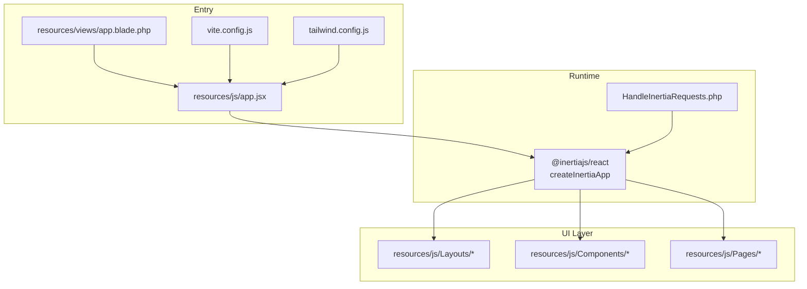
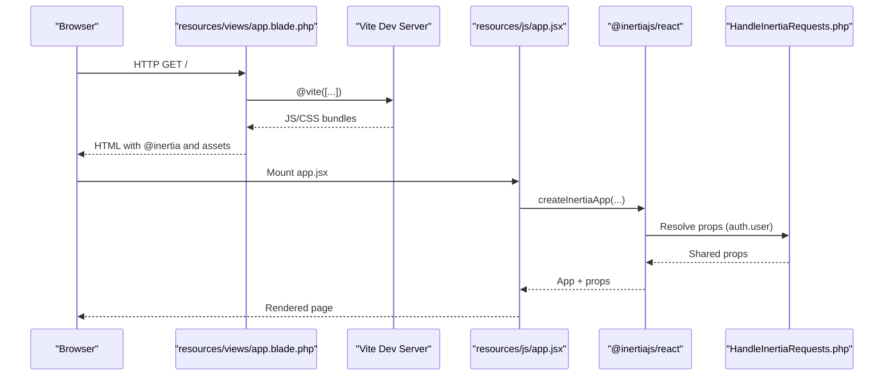
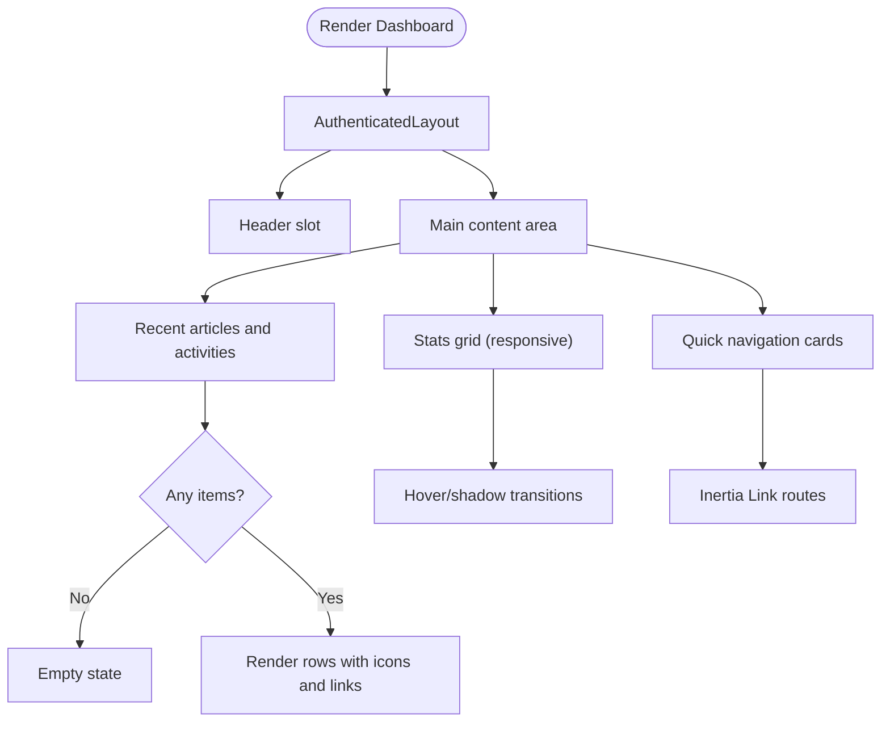
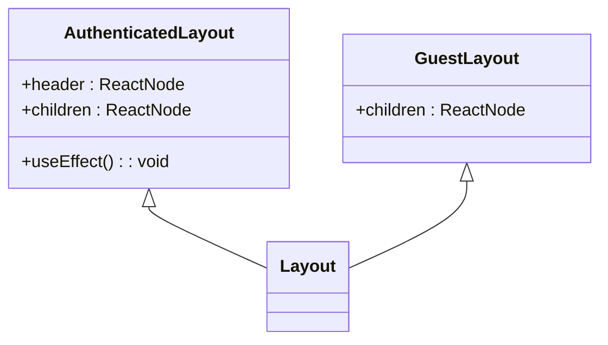
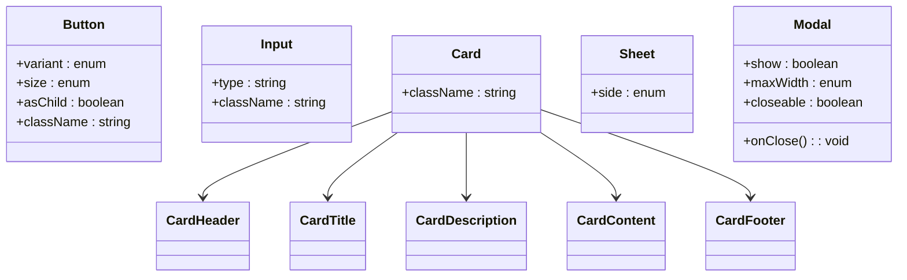
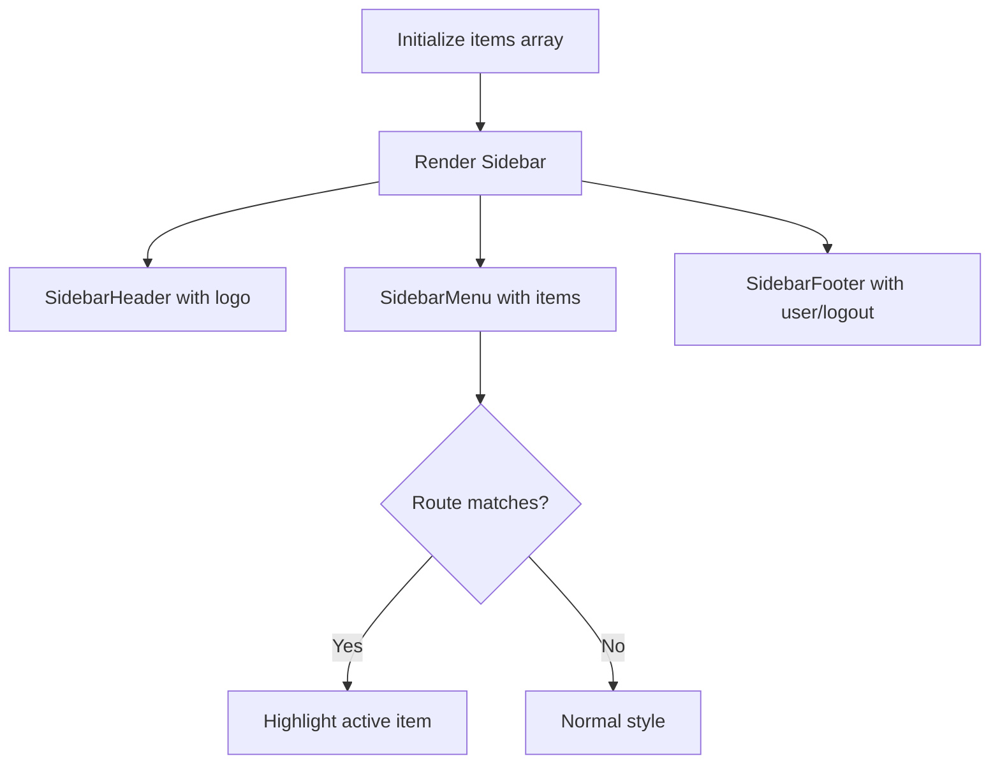
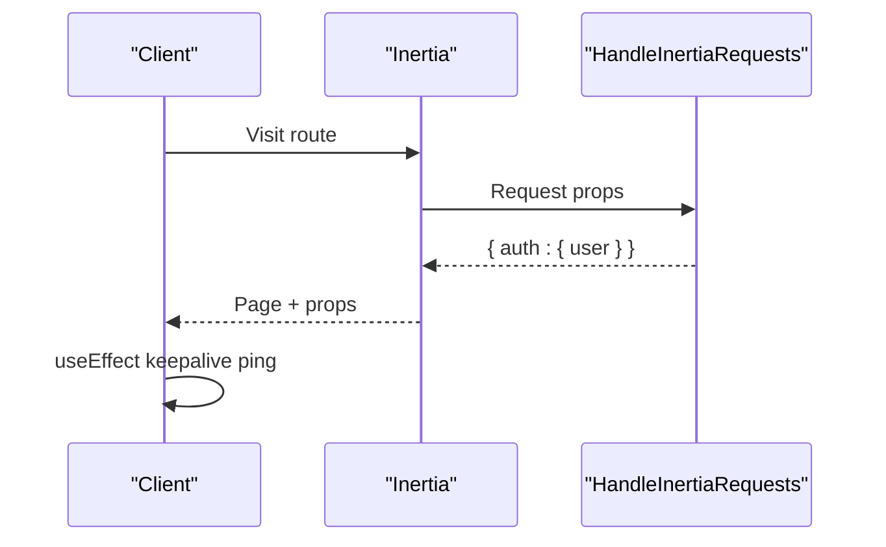
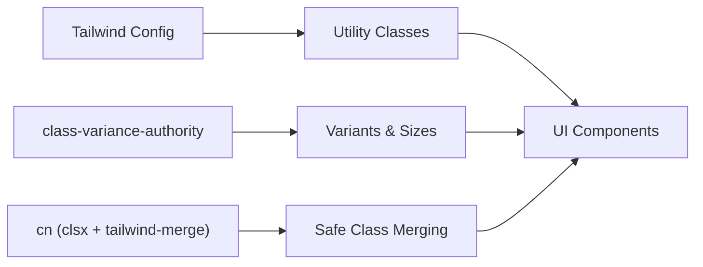
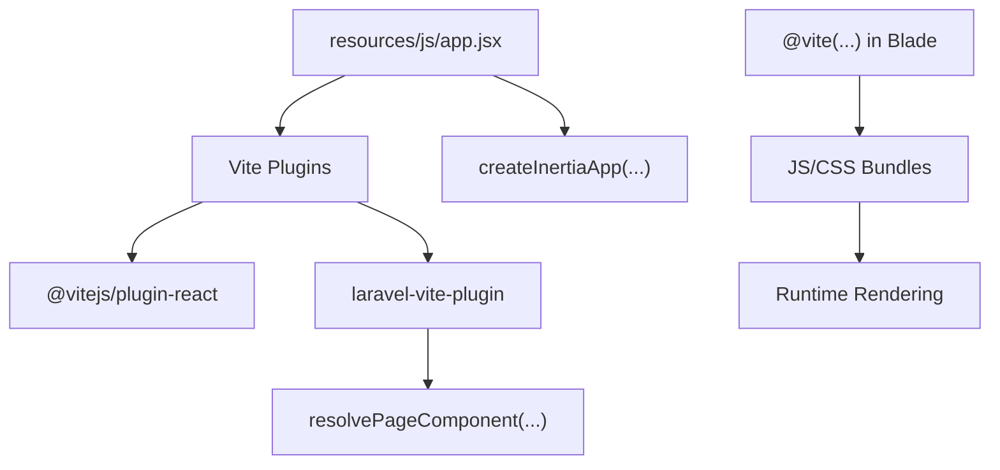
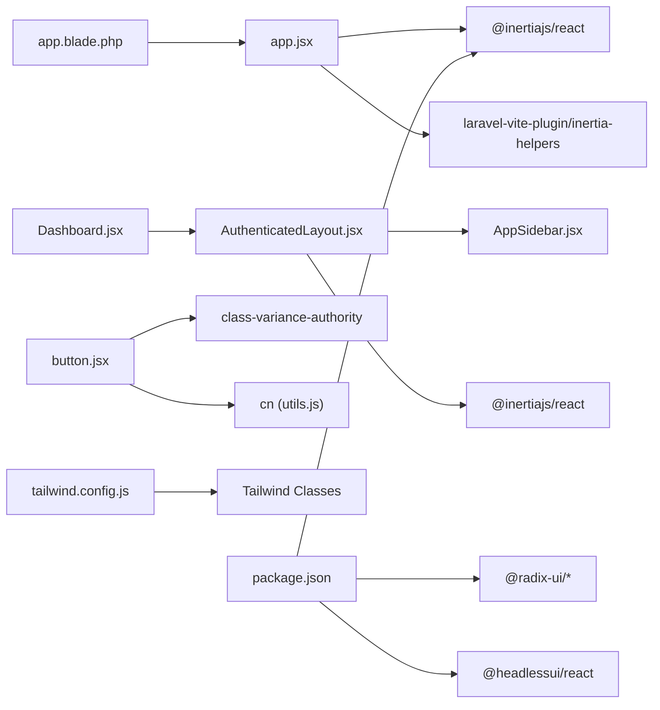

# Frontend Architecture (React + Inertia.js)

<cite>
**Referenced Files in This Document**
- [app.jsx](file://resources/js/app.jsx)
- [vite.config.js](file://vite.config.js)
- [tailwind.config.js](file://tailwind.config.js)
- [app.blade.php](file://resources/views/app.blade.php)
- [HandleInertiaRequests.php](file://app/Http/Middleware/HandleInertiaRequests.php)
- [AuthenticatedLayout.jsx](file://resources/js/Layouts/AuthenticatedLayout.jsx)
- [GuestLayout.jsx](file://resources/js/Layouts/GuestLayout.jsx)
- [AppSidebar.jsx](file://resources/js/Components/AppSidebar.jsx)
- [button.jsx](file://resources/js/Components/ui/button.jsx)
- [input.jsx](file://resources/js/Components/ui/input.jsx)
- [card.jsx](file://resources/js/Components/ui/card.jsx)
- [sheet.jsx](file://resources/js/Components/ui/sheet.jsx)
- [Modal.jsx](file://resources/js/Components/Modal.jsx)
- [Dashboard.jsx](file://resources/js/Pages/Dashboard.jsx)
- [utils.js](file://resources/js/lib/utils.js)
- [use-mobile.js](file://resources/js/hooks/use-mobile.js)
- [package.json](file://package.json)
</cite>

## Table of Contents
1. [Introduction](#introduction)
2. [Project Structure](#project-structure)
3. [Core Components](#core-components)
4. [Architecture Overview](#architecture-overview)
5. [Detailed Component Analysis](#detailed-component-analysis)
6. [Dependency Analysis](#dependency-analysis)
7. [Performance Considerations](#performance-considerations)
8. [Troubleshooting Guide](#troubleshooting-guide)
9. [Conclusion](#conclusion)
10. [Appendices](#appendices)

## Introduction
This document explains the React frontend architecture integrated with Inertia.js in this Laravel application. It covers component-based design with Pages, Components, and Layouts; state management via Inertia’s props and reactive updates; React patterns using functional components and hooks; styling with TailwindCSS and custom component utilities; and the Vite build pipeline with asset management. Practical examples demonstrate composition, prop handling, event management, responsive design, accessibility, and performance optimization.

## Project Structure
The frontend is organized around a clear separation of concerns:
- Pages: Route-driven React components under resources/js/Pages
- Layouts: Shared page containers under resources/js/Layouts
- Components: Reusable UI primitives and composite components under resources/js/Components
- Utilities: Shared helpers under resources/js/lib and hooks under resources/js/hooks
- Entry and build: resources/js/app.jsx, vite.config.js, tailwind.config.js, and resources/views/app.blade.php

**Diagram sources**
- [app.jsx:1-26](file://resources/js/app.jsx#L1-L26)
- [app.blade.php:1-57](file://resources/views/app.blade.php#L1-L57)
- [vite.config.js:1-14](file://vite.config.js#L1-L14)
- [tailwind.config.js:1-42](file://tailwind.config.js#L1-L42)
- [HandleInertiaRequests.php:1-40](file://app/Http/Middleware/HandleInertiaRequests.php#L1-L40)

**Section sources**
- [app.jsx:1-26](file://resources/js/app.jsx#L1-L26)
- [app.blade.php:1-57](file://resources/views/app.blade.php#L1-L57)
- [vite.config.js:1-14](file://vite.config.js#L1-L14)
- [tailwind.config.js:1-42](file://tailwind.config.js#L1-L42)

## Core Components
- Pages: Route-resolved React components rendered by Inertia. Example: Dashboard page composes layouts and UI components.
- Layouts: Container components that wrap page content and manage navigation and shell UI. Examples: AuthenticatedLayout and GuestLayout.
- Components: Reusable primitives and composite widgets. Examples: button, input, card, sheet, Modal, AppSidebar.
- Utilities: Shared helpers like cn for Tailwind merging and hooks like useIsMobile for responsive logic.

Key patterns:
- Functional components with hooks for state and effects
- Composition via props and children
- Event handling via Inertia links and form actions
- Styling via Tailwind utilities and component-level variants

**Section sources**
- [Dashboard.jsx:1-215](file://resources/js/Pages/Dashboard.jsx#L1-L215)
- [AuthenticatedLayout.jsx:1-54](file://resources/js/Layouts/AuthenticatedLayout.jsx#L1-L54)
- [GuestLayout.jsx:1-19](file://resources/js/Layouts/GuestLayout.jsx#L1-L19)
- [button.jsx:1-49](file://resources/js/Components/ui/button.jsx#L1-L49)
- [input.jsx:1-20](file://resources/js/Components/ui/input.jsx#L1-L20)
- [card.jsx:1-61](file://resources/js/Components/ui/card.jsx#L1-L61)
- [sheet.jsx:1-123](file://resources/js/Components/ui/sheet.jsx#L1-L123)
- [Modal.jsx:1-66](file://resources/js/Components/Modal.jsx#L1-L66)
- [AppSidebar.jsx:1-164](file://resources/js/Components/AppSidebar.jsx#L1-L164)
- [utils.js:1-7](file://resources/js/lib/utils.js#L1-L7)
- [use-mobile.js:1-20](file://resources/js/hooks/use-mobile.js#L1-L20)

## Architecture Overview
The runtime integrates Vite, Inertia, and Blade:
- resources/js/app.jsx bootstraps Inertia and resolves pages via laravel-vite-plugin helpers
- resources/views/app.blade.php injects Vite assets and renders the Inertia root
- app/Http/Middleware/HandleInertiaRequests.php shares auth state to the client
- Tailwind compiles styles based on configured content globs

**Diagram sources**
- [app.blade.php:25-34](file://resources/views/app.blade.php#L25-L34)
- [app.jsx:10-25](file://resources/js/app.jsx#L10-L25)
- [HandleInertiaRequests.php:30-38](file://app/Http/Middleware/HandleInertiaRequests.php#L30-L38)

## Detailed Component Analysis

### Pages: Dashboard
- Purpose: Administrative dashboard rendering statistics and recent activity lists
- Props: Receives stats and lists from server-rendered props
- Composition: Uses AuthenticatedLayout, Lucide icons, and styled cards
- Styling: Extensive Tailwind utilities for responsive grids and hover states

**Diagram sources**
- [Dashboard.jsx:5-215](file://resources/js/Pages/Dashboard.jsx#L5-L215)
- [AuthenticatedLayout.jsx:11-53](file://resources/js/Layouts/AuthenticatedLayout.jsx#L11-L53)

**Section sources**
- [Dashboard.jsx:1-215](file://resources/js/Pages/Dashboard.jsx#L1-L215)

### Layouts: AuthenticatedLayout and GuestLayout
- AuthenticatedLayout: Provides sidebar shell, header, and main content container; includes periodic keep-alive ping
- GuestLayout: Minimal wrapper for auth-related pages with centered card layout

**Diagram sources**
- [AuthenticatedLayout.jsx:11-53](file://resources/js/Layouts/AuthenticatedLayout.jsx#L11-L53)
- [GuestLayout.jsx:4-18](file://resources/js/Layouts/GuestLayout.jsx#L4-L18)

**Section sources**
- [AuthenticatedLayout.jsx:1-54](file://resources/js/Layouts/AuthenticatedLayout.jsx#L1-L54)
- [GuestLayout.jsx:1-19](file://resources/js/Layouts/GuestLayout.jsx#L1-L19)

### Components: UI Primitives and Composites
- button.jsx: Variant and size system using class-variance-authority and cn
- input.jsx: ForwardRef input with Tailwind base classes
- card.jsx: Composite card with header/title/description/content/footer parts
- sheet.jsx: Radix-based drawer/modal-like panel with side variants
- Modal.jsx: Headless UI modal with transitions and configurable max widths

**Diagram sources**
- [button.jsx:36-48](file://resources/js/Components/ui/button.jsx#L36-L48)
- [input.jsx:4-16](file://resources/js/Components/ui/input.jsx#L4-L16)
- [card.jsx:4-60](file://resources/js/Components/ui/card.jsx#L4-L60)
- [sheet.jsx:47-63](file://resources/js/Components/ui/sheet.jsx#L47-L63)
- [Modal.jsx:8-19](file://resources/js/Components/Modal.jsx#L8-L19)

**Section sources**
- [button.jsx:1-49](file://resources/js/Components/ui/button.jsx#L1-L49)
- [input.jsx:1-20](file://resources/js/Components/ui/input.jsx#L1-L20)
- [card.jsx:1-61](file://resources/js/Components/ui/card.jsx#L1-L61)
- [sheet.jsx:1-123](file://resources/js/Components/ui/sheet.jsx#L1-L123)
- [Modal.jsx:1-66](file://resources/js/Components/Modal.jsx#L1-L66)

### Navigation: AppSidebar
- Purpose: Collapsible sidebar with menu items, active state detection, and logout action
- Behavior: Uses useSidebar state to adapt visuals; integrates with Inertia routes and icons

**Diagram sources**
- [AppSidebar.jsx:35-163](file://resources/js/Components/AppSidebar.jsx#L35-L163)

**Section sources**
- [AppSidebar.jsx:1-164](file://resources/js/Components/AppSidebar.jsx#L1-L164)

### State Management with Inertia.js
- Shared props: Authenticated user is shared via the Inertia middleware
- Reactive updates: Props update automatically on navigation; keep-alive ping prevents session timeout
- Form interactions: Use Inertia forms and Link actions for seamless navigation without full reloads

**Diagram sources**
- [HandleInertiaRequests.php:30-38](file://app/Http/Middleware/HandleInertiaRequests.php#L30-L38)
- [AuthenticatedLayout.jsx:14-23](file://resources/js/Layouts/AuthenticatedLayout.jsx#L14-L23)

**Section sources**
- [HandleInertiaRequests.php:1-40](file://app/Http/Middleware/HandleInertiaRequests.php#L1-L40)
- [AuthenticatedLayout.jsx:1-54](file://resources/js/Layouts/AuthenticatedLayout.jsx#L1-L54)

### Styling Approach
- TailwindCSS: Configured with custom fonts and brand palette; content scanning includes JSX and Blade
- Utility-first: Components apply Tailwind classes directly for rapid iteration
- Variants: Button and Sheet components use class-variance-authority for consistent variants
- Merging utilities: cn combines clsx and tailwind-merge to avoid conflicting classes

**Diagram sources**
- [tailwind.config.js:14-41](file://tailwind.config.js#L14-L41)
- [button.jsx:7-34](file://resources/js/Components/ui/button.jsx#L7-L34)
- [sheet.jsx:28-45](file://resources/js/Components/ui/sheet.jsx#L28-L45)
- [utils.js:4-6](file://resources/js/lib/utils.js#L4-L6)

**Section sources**
- [tailwind.config.js:1-42](file://tailwind.config.js#L1-L42)
- [button.jsx:1-49](file://resources/js/Components/ui/button.jsx#L1-L49)
- [sheet.jsx:1-123](file://resources/js/Components/ui/sheet.jsx#L1-L123)
- [utils.js:1-7](file://resources/js/lib/utils.js#L1-L7)

### Build Process and Asset Management
- Vite: Single entry app.jsx; laravel-vite-plugin handles hot module replacement and page resolution
- Assets: Blade injects @vite for dev and production builds; @inertiaHead and @inertia render the app
- Dependencies: React, Inertia, Radix UI, Headless UI, TipTap, GSAP, and others

**Diagram sources**
- [vite.config.js:5-12](file://vite.config.js#L5-L12)
- [app.jsx:10-25](file://resources/js/app.jsx#L10-L25)
- [app.blade.php:26-29](file://resources/views/app.blade.php#L26-L29)

**Section sources**
- [vite.config.js:1-14](file://vite.config.js#L1-L14)
- [app.jsx:1-26](file://resources/js/app.jsx#L1-L26)
- [app.blade.php:1-57](file://resources/views/app.blade.php#L1-L57)
- [package.json:1-49](file://package.json#L1-L49)

## Dependency Analysis
- Inertia integration: app.jsx depends on @inertiajs/react and laravel-vite-plugin helpers; Blade provides @vite and @inertia
- Layouts depend on components and Inertia primitives (Head, Link)
- UI components depend on Radix UI, Headless UI, and Tailwind utilities
- Styling relies on Tailwind config and cn utility

**Diagram sources**
- [app.jsx:4-6](file://resources/js/app.jsx#L4-L6)
- [app.blade.php:26-34](file://resources/views/app.blade.php#L26-L34)
- [AuthenticatedLayout.jsx:1-10](file://resources/js/Layouts/AuthenticatedLayout.jsx#L1-L10)
- [AppSidebar.jsx:1-34](file://resources/js/Components/AppSidebar.jsx#L1-L34)
- [button.jsx:1-6](file://resources/js/Components/ui/button.jsx#L1-L6)
- [utils.js:1-7](file://resources/js/lib/utils.js#L1-L7)
- [tailwind.config.js:1-42](file://tailwind.config.js#L1-L42)
- [Dashboard.jsx:1-3](file://resources/js/Pages/Dashboard.jsx#L1-L3)
- [package.json:9-47](file://package.json#L9-L47)

**Section sources**
- [app.jsx:1-26](file://resources/js/app.jsx#L1-L26)
- [app.blade.php:1-57](file://resources/views/app.blade.php#L1-L57)
- [AuthenticatedLayout.jsx:1-54](file://resources/js/Layouts/AuthenticatedLayout.jsx#L1-L54)
- [AppSidebar.jsx:1-164](file://resources/js/Components/AppSidebar.jsx#L1-L164)
- [button.jsx:1-49](file://resources/js/Components/ui/button.jsx#L1-L49)
- [utils.js:1-7](file://resources/js/lib/utils.js#L1-L7)
- [tailwind.config.js:1-42](file://tailwind.config.js#L1-L42)
- [Dashboard.jsx:1-215](file://resources/js/Pages/Dashboard.jsx#L1-L215)
- [package.json:1-49](file://package.json#L1-L49)

## Performance Considerations
- Keep-alive ping: Prevents session timeouts during long admin sessions
- Efficient layouts: Use minimal re-renders; pass only necessary props
- Component reuse: Prefer small, composable primitives to reduce duplication
- Tailwind purging: Ensure content globs include all JSX and Blade templates to minimize bundle size
- Lazy loading: Group heavy components and defer non-critical assets
- Vite HMR: Leverage fast refresh during development

**Section sources**
- [AuthenticatedLayout.jsx:14-23](file://resources/js/Layouts/AuthenticatedLayout.jsx#L14-L23)
- [tailwind.config.js:7-12](file://tailwind.config.js#L7-L12)

## Troubleshooting Guide
- Inertia page not resolving: Verify page path and glob pattern in app.jsx and route naming
- Styles missing: Confirm Tailwind content globs include JSX and Blade paths
- Session timeout: Check keep-alive effect and server-side session configuration
- Build errors: Ensure Vite plugin order and React plugin are present in vite.config.js

**Section sources**
- [app.jsx:10-25](file://resources/js/app.jsx#L10-L25)
- [tailwind.config.js:7-12](file://tailwind.config.js#L7-L12)
- [AuthenticatedLayout.jsx:14-23](file://resources/js/Layouts/AuthenticatedLayout.jsx#L14-L23)
- [vite.config.js:5-12](file://vite.config.js#L5-L12)

## Conclusion
This architecture cleanly separates Pages, Layouts, and Components while leveraging Inertia for seamless navigation and state sharing. TailwindCSS and component variants enable consistent, maintainable styling. Vite streamlines development and production builds. Following the patterns documented here ensures scalable UI development and strong developer ergonomics.

## Appendices

### Practical Examples Index
- Component composition: Dashboard.jsx composes AuthenticatedLayout and UI components
- Prop handling: Pages receive props from server via Inertia middleware
- Event management: Inertia Link and route helpers replace full-page reloads
- Responsive design: Grids and spacing scale with Tailwind breakpoints
- Accessibility: Semantic components and screen-reader-friendly labels
- Performance: Keep-alive ping and efficient component design

**Section sources**
- [Dashboard.jsx:1-215](file://resources/js/Pages/Dashboard.jsx#L1-L215)
- [AuthenticatedLayout.jsx:1-54](file://resources/js/Layouts/AuthenticatedLayout.jsx#L1-L54)
- [button.jsx:1-49](file://resources/js/Components/ui/button.jsx#L1-L49)
- [tailwind.config.js:1-42](file://tailwind.config.js#L1-L42)