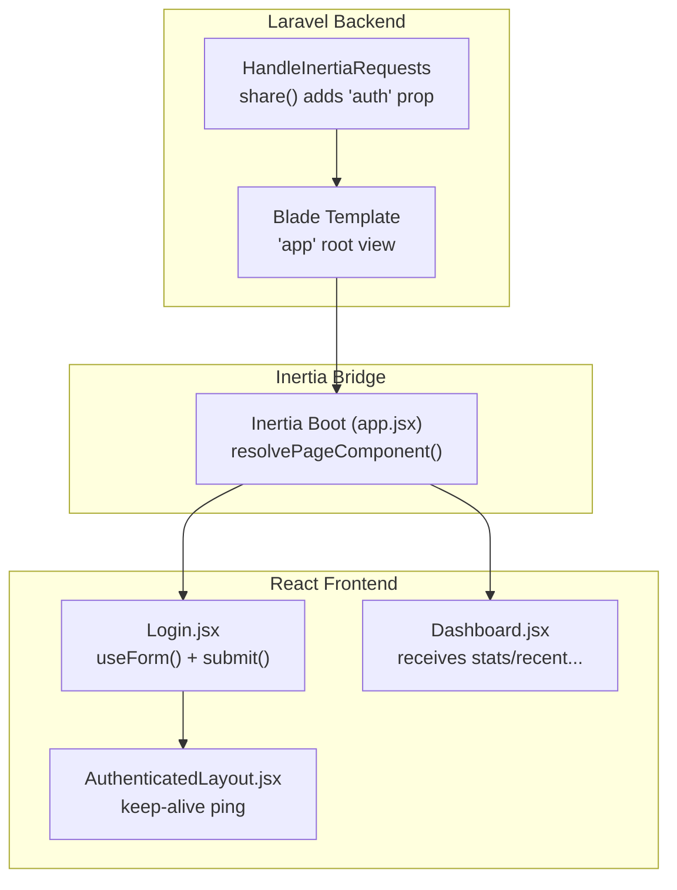
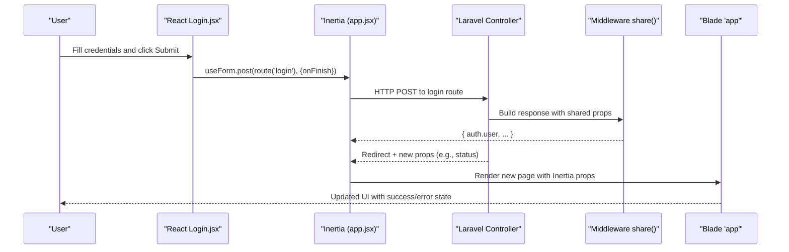
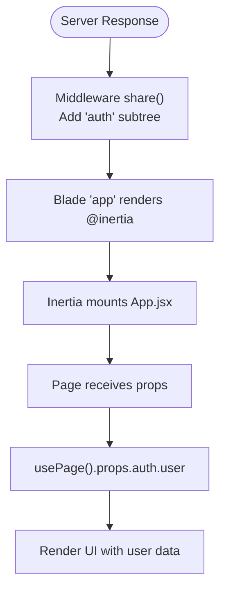
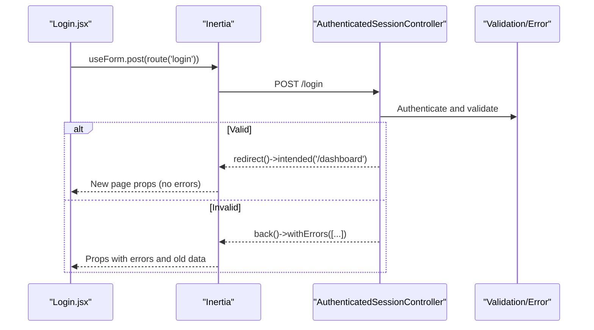
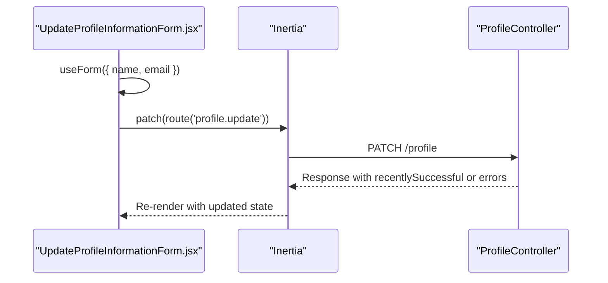
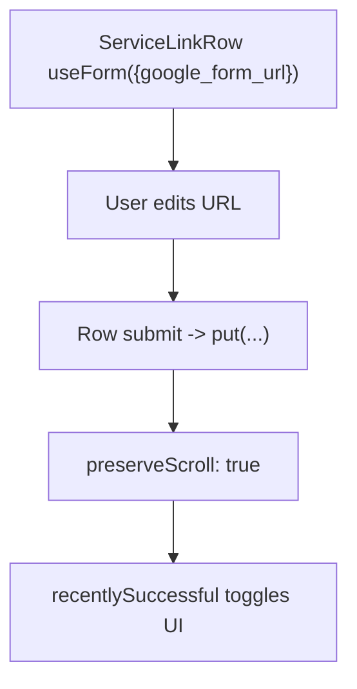
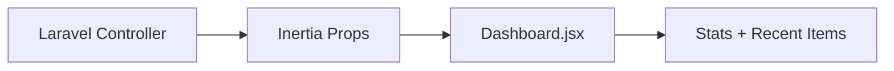
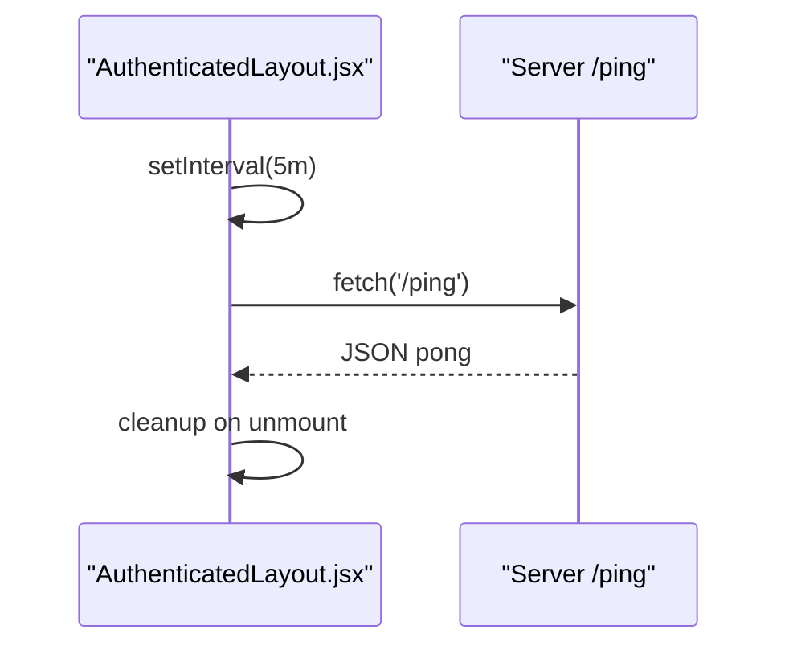
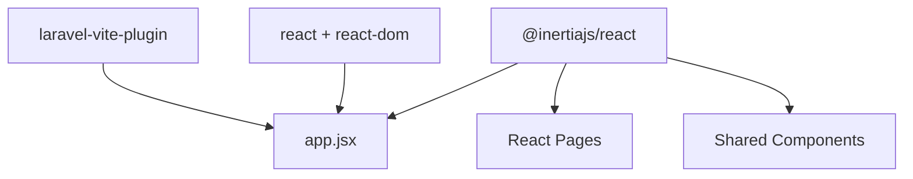

# State Management with Inertia.js

<cite>
**Referenced Files in This Document**
- [HandleInertiaRequests.php](file://app/Http/Middleware/HandleInertiaRequests.php)
- [app.jsx](file://resources/js/app.jsx)
- [app.blade.php](file://resources/views/app.blade.php)
- [AuthenticatedSessionController.php](file://app/Http/Controllers/Auth/AuthenticatedSessionController.php)
- [Login.jsx](file://resources/js/Pages/Auth/Login.jsx)
- [AuthenticatedLayout.jsx](file://resources/js/Layouts/AuthenticatedLayout.jsx)
- [Dashboard.jsx](file://resources/js/Pages/Dashboard.jsx)
- [InputError.jsx](file://resources/js/Components/InputError.jsx)
- [TextInput.jsx](file://resources/js/Components/TextInput.jsx)
- [Edit.jsx](file://resources/js/Pages/Profile/Edit.jsx)
- [UpdateProfileInformationForm.jsx](file://resources/js/Pages/Profile/Partials/UpdateProfileInformationForm.jsx)
- [Services/Index.jsx](file://resources/js/Pages/Admin/Services/Index.jsx)
- [Activities/Index.jsx](file://resources/js/Pages/Admin/Activities/Index.jsx)
- [composer.json](file://composer.json)
- [package.json](file://package.json)
</cite>

## Table of Contents
1. [Introduction](#introduction)
2. [Project Structure](#project-structure)
3. [Core Components](#core-components)
4. [Architecture Overview](#architecture-overview)
5. [Detailed Component Analysis](#detailed-component-analysis)
6. [Dependency Analysis](#dependency-analysis)
7. [Performance Considerations](#performance-considerations)
8. [Troubleshooting Guide](#troubleshooting-guide)
9. [Conclusion](#conclusion)

## Introduction
This document explains how the project implements state management using Inertia.js to seamlessly bridge the Laravel backend and React frontend. It focuses on the inertiaProp pattern, shared data handling, client–server state coordination, form handling, validation feedback, error state management, reactive state patterns, redirects, and performance considerations. Practical examples demonstrate how React components receive server-provided props, manage form state via Inertia’s useForm, and coordinate with Laravel’s request–response lifecycle.

## Project Structure
The integration centers around three pillars:
- Laravel middleware that defines shared props and root template
- Blade template that renders the Inertia root and injects assets
- React app bootstrapped by Inertia that resolves pages and mounts components

**Diagram sources**
- [HandleInertiaRequests.php:30-38](file://app/Http/Middleware/HandleInertiaRequests.php#L30-L38)
- [app.blade.php:26-34](file://resources/views/app.blade.php#L26-L34)
- [app.jsx:10-25](file://resources/js/app.jsx#L10-L25)
- [Login.jsx:8-20](file://resources/js/Pages/Auth/Login.jsx#L8-L20)
- [Dashboard.jsx:5](file://resources/js/Pages/Dashboard.jsx#L5)
- [AuthenticatedLayout.jsx:14-23](file://resources/js/Layouts/AuthenticatedLayout.jsx#L14-L23)

**Section sources**
- [HandleInertiaRequests.php:15-38](file://app/Http/Middleware/HandleInertiaRequests.php#L15-L38)
- [app.blade.php:26-34](file://resources/views/app.blade.php#L26-L34)
- [app.jsx:10-25](file://resources/js/app.jsx#L10-L25)

## Core Components
- Shared props via middleware: The middleware augments the Inertia payload with an auth.user subtree so React components can read user context directly from props.
- Root template: The Blade app template loads routes, Vite assets, and the Inertia runtime, rendering the initial page.
- Inertia boot: The React app initializes Inertia, resolves page components, and mounts them with props.
- Forms and validation: React components use useForm to bind inputs to reactive state, submit via Inertia verbs, and render server-side validation errors.

Key patterns:
- inertiaProp pattern: Props like auth.user and status are passed from Laravel to React via Inertia.
- Reactive state: useForm manages form data, errors, processing flags, and recentlySuccessful states.
- Client–server coordination: Components call Inertia verbs (post/patch/put) to mutate server state; redirects and new props are handled automatically.

**Section sources**
- [HandleInertiaRequests.php:30-38](file://app/Http/Middleware/HandleInertiaRequests.php#L30-L38)
- [app.blade.php:26-34](file://resources/views/app.blade.php#L26-L34)
- [app.jsx:10-25](file://resources/js/app.jsx#L10-L25)
- [Login.jsx:8-20](file://resources/js/Pages/Auth/Login.jsx#L8-L20)

## Architecture Overview
The flow below shows how a login submission moves from React to Laravel and back, including shared props and error propagation.

**Diagram sources**
- [Login.jsx:15-20](file://resources/js/Pages/Auth/Login.jsx#L15-L20)
- [app.jsx:10-25](file://resources/js/app.jsx#L10-L25)
- [AuthenticatedSessionController.php:28-42](file://app/Http/Controllers/Auth/AuthenticatedSessionController.php#L28-L42)
- [HandleInertiaRequests.php:30-38](file://app/Http/Middleware/HandleInertiaRequests.php#L30-L38)
- [app.blade.php:26-34](file://resources/views/app.blade.php#L26-L34)

## Detailed Component Analysis

### Shared Data and inertiaProp Pattern
- Middleware adds auth.user to every Inertia response, enabling components to read user context from props.auth.user.
- Blade template sets up the root view and injects Inertia runtime and assets.
- React app resolves pages and mounts them with props supplied by Laravel.

**Diagram sources**
- [HandleInertiaRequests.php:30-38](file://app/Http/Middleware/HandleInertiaRequests.php#L30-L38)
- [app.blade.php:26-34](file://resources/views/app.blade.php#L26-L34)
- [app.jsx:10-25](file://resources/js/app.jsx#L10-L25)

**Section sources**
- [HandleInertiaRequests.php:30-38](file://app/Http/Middleware/HandleInertiaRequests.php#L30-L38)
- [app.blade.php:26-34](file://resources/views/app.blade.php#L26-L34)
- [app.jsx:10-25](file://resources/js/app.jsx#L10-L25)

### Login Form Handling and Validation Feedback
- LoginForm binds inputs to useForm state and submits via post.
- On submit, onFinish resets the password field; processing disables the button; errors display via InputError.
- Controller validates and redirects with status messages; React reads status and displays feedback.

**Diagram sources**
- [Login.jsx:8-20](file://resources/js/Pages/Auth/Login.jsx#L8-L20)
- [AuthenticatedSessionController.php:28-42](file://app/Http/Controllers/Auth/AuthenticatedSessionController.php#L28-L42)

**Section sources**
- [Login.jsx:8-20](file://resources/js/Pages/Auth/Login.jsx#L8-L20)
- [AuthenticatedSessionController.php:18-42](file://app/Http/Controllers/Auth/AuthenticatedSessionController.php#L18-L42)
- [InputError.jsx:1-11](file://resources/js/Components/InputError.jsx#L1-L11)

### Profile Update Forms and Reactive State
- UpdateProfileInformationForm initializes useForm with user data from props.auth.user.
- Inputs update data via setData; submission uses patch to save changes.
- Recently successful state and processing flags drive UI feedback.

**Diagram sources**
- [UpdateProfileInformationForm.jsx:14-24](file://resources/js/Pages/Profile/Partials/UpdateProfileInformationForm.jsx#L14-L24)

**Section sources**
- [UpdateProfileInformationForm.jsx:8-24](file://resources/js/Pages/Profile/Partials/UpdateProfileInformationForm.jsx#L8-L24)
- [Edit.jsx:6-34](file://resources/js/Pages/Profile/Edit.jsx#L6-L34)

### Managing Complex State Scenarios (Admin Services)
- Services/Index.jsx demonstrates row-level form state with useForm per row.
- Uses put to persist updates while preserving scroll position.
- Conditionally styles inputs and buttons based on recentlySuccessful and data state.

**Diagram sources**
- [Services/Index.jsx:9-19](file://resources/js/Pages/Admin/Services/Index.jsx#L9-L19)

**Section sources**
- [Services/Index.jsx:94-135](file://resources/js/Pages/Admin/Services/Index.jsx#L94-L135)

### Dashboard State Coordination
- Dashboard.jsx receives props such as stats and recentArticles/recentActivities from the server.
- Components render lists and links, integrating with navigation routes.

**Diagram sources**
- [Dashboard.jsx:5](file://resources/js/Pages/Dashboard.jsx#L5)

**Section sources**
- [Dashboard.jsx:5-215](file://resources/js/Pages/Dashboard.jsx#L5-L215)

### Keep-Alive Session Management
- AuthenticatedLayout periodically pings /ping to prevent session timeout during long admin sessions.

**Diagram sources**
- [AuthenticatedLayout.jsx:14-23](file://resources/js/Layouts/AuthenticatedLayout.jsx#L14-L23)

**Section sources**
- [AuthenticatedLayout.jsx:11-54](file://resources/js/Layouts/AuthenticatedLayout.jsx#L11-L54)

## Dependency Analysis
External libraries underpinning state management:
- @inertiajs/react: Provides useForm, usePage, router, and head helpers for form state, prop access, and navigation.
- laravel-vite-plugin/inertia-helpers: Resolves page components for SSR-like development.
- react and react-dom: Runtime for mounting and rendering components.

**Diagram sources**
- [package.json:11](file://package.json#L11)
- [package.json:17](file://package.json#L17)
- [package.json:19-22](file://package.json#L19-L22)
- [app.jsx:4-6](file://resources/js/app.jsx#L4-L6)

**Section sources**
- [composer.json:10](file://composer.json#L10)
- [package.json:11-22](file://package.json#L11-L22)
- [app.jsx:4-6](file://resources/js/app.jsx#L4-L6)

## Performance Considerations
- Minimize unnecessary re-renders by scoping useForm to focused areas (e.g., per row in Services/Index).
- Use preserveScroll and preserveState where appropriate to avoid layout thrash during submissions.
- Keep shared props lean; only include essential user/session data in share().
- Debounce or throttle frequent client–server pings (e.g., keep-alive) to reduce network overhead.
- Prefer client-side filtering for small datasets; defer to server pagination for large lists.

## Troubleshooting Guide
Common issues and remedies:
- Validation errors not displaying: Ensure the server returns validation errors and props.errors are present; components should render InputError with message.
- Form state not resetting after submit: Use onFinish handlers to reset specific fields or the entire form state.
- Redirect loops: Verify intended redirects and that middleware share() does not overwrite critical props unintentionally.
- Keep-alive failures: Wrap fetch calls in try/catch and log errors; ensure /ping endpoint returns a simple JSON response.

**Section sources**
- [Login.jsx:103-112](file://resources/js/Pages/Auth/Login.jsx#L103-L112)
- [AuthenticatedLayout.jsx:14-23](file://resources/js/Layouts/AuthenticatedLayout.jsx#L14-L23)

## Conclusion
Inertia.js enables a clean separation of concerns: Laravel handles server-side logic, validation, and shared state; React manages interactive UI and form state. The inertiaProp pattern centralizes user and contextual data in props, while useForm provides a declarative way to bind inputs, track processing, and surface validation errors. By leveraging preserveScroll, recentlySuccessful flags, and periodic keep-alives, the application maintains responsiveness and user trust. Following the patterns demonstrated here ensures scalable, maintainable state management across complex admin workflows.