# Styling, Theming, and TailwindCSS Implementation

<cite>
**Referenced Files in This Document**
- [tailwind.config.js](file://tailwind.config.js)
- [postcss.config.js](file://postcss.config.js)
- [vite.config.js](file://vite.config.js)
- [resources/css/app.css](file://resources/css/app.css)
- [package.json](file://package.json)
- [resources/js/lib/utils.js](file://resources/js/lib/utils.js)
- [resources/js/Components/ui/button.jsx](file://resources/js/Components/ui/button.jsx)
- [resources/js/Components/ui/input.jsx](file://resources/js/Components/ui/input.jsx)
- [resources/js/Components/ui/card.jsx](file://resources/js/Components/ui/card.jsx)
- [resources/js/Components/ui/sidebar.jsx](file://resources/js/Components/ui/sidebar.jsx)
- [resources/js/Components/AppSidebar.jsx](file://resources/js/Components/AppSidebar.jsx)
- [resources/js/Layouts/AuthenticatedLayout.jsx](file://resources/js/Layouts/AuthenticatedLayout.jsx)
- [resources/js/Components/PrimaryButton.jsx](file://resources/js/Components/PrimaryButton.jsx)
- [resources/js/Components/SecondaryButton.jsx](file://resources/js/Components/SecondaryButton.jsx)
- [resources/js/hooks/use-mobile.js](file://resources/js/hooks/use-mobile.js)
</cite>

## Table of Contents
1. [Introduction](#introduction)
2. [Project Structure](#project-structure)
3. [Core Components](#core-components)
4. [Architecture Overview](#architecture-overview)
5. [Detailed Component Analysis](#detailed-component-analysis)
6. [Dependency Analysis](#dependency-analysis)
7. [Performance Considerations](#performance-considerations)
8. [Troubleshooting Guide](#troubleshooting-guide)
9. [Conclusion](#conclusion)

## Introduction
This document explains the styling, theming, and TailwindCSS implementation across the frontend stack. It covers configuration, design tokens, utility-first patterns, component styling architecture, responsive design, dark mode, accessibility, PostCSS processing, CSS optimization, animations, and performance optimization strategies. The project uses TailwindCSS v3 with PostCSS autoprefixing, Vite for builds, and a set of reusable UI primitives built with class variance authority (CVA) and clsx/tailwind-merge for composable styling.

## Project Structure
The styling pipeline is organized around:
- Tailwind configuration extending design tokens and plugins
- PostCSS configuration enabling Tailwind and autoprefixing
- Vite build integrating React and Laravel Vite plugin
- Global CSS layering base tokens and dark mode variables
- Reusable UI components leveraging CVA and utility classes

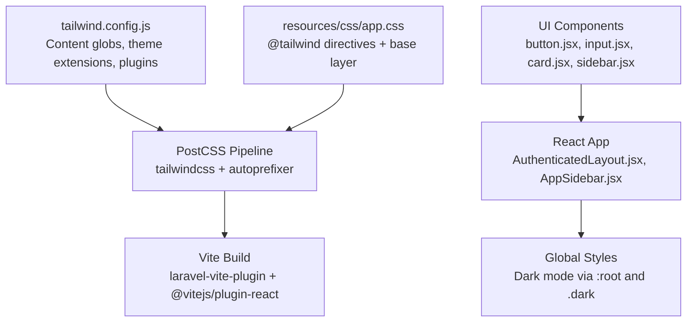

**Diagram sources**
- [tailwind.config.js:1-42](file://tailwind.config.js#L1-L42)
- [postcss.config.js:1-7](file://postcss.config.js#L1-L7)
- [vite.config.js:1-14](file://vite.config.js#L1-L14)
- [resources/css/app.css:1-30](file://resources/css/app.css#L1-L30)
- [resources/js/Components/ui/button.jsx:1-49](file://resources/js/Components/ui/button.jsx#L1-L49)
- [resources/js/Components/ui/input.jsx:1-20](file://resources/js/Components/ui/input.jsx#L1-L20)
- [resources/js/Components/ui/card.jsx:1-61](file://resources/js/Components/ui/card.jsx#L1-L61)
- [resources/js/Components/ui/sidebar.jsx:1-652](file://resources/js/Components/ui/sidebar.jsx#L1-L652)
- [resources/js/Layouts/AuthenticatedLayout.jsx:1-54](file://resources/js/Layouts/AuthenticatedLayout.jsx#L1-L54)
- [resources/js/Components/AppSidebar.jsx:1-164](file://resources/js/Components/AppSidebar.jsx#L1-L164)

**Section sources**
- [tailwind.config.js:1-42](file://tailwind.config.js#L1-L42)
- [postcss.config.js:1-7](file://postcss.config.js#L1-L7)
- [vite.config.js:1-14](file://vite.config.js#L1-L14)
- [resources/css/app.css:1-30](file://resources/css/app.css#L1-L30)

## Core Components
- Design tokens and theme extensions:
  - Font family extension for a modern sans-serif stack
  - Semantic brand palette under an edufa namespace
  - Sidebar color tokens using CSS variables for light/dark modes
- Utility-first primitives:
  - Button with CVA variants and sizes
  - Input with consistent focus and disabled states
  - Card sectioning with header, title, description, content, footer
- Component styling architecture:
  - Centralized cn helper merging classes safely
  - Sidebar provider/context managing state and responsive behavior
  - AppSidebar composing semantic tokens and active states
  - AuthenticatedLayout wiring provider, trigger, and inset content area

**Section sources**
- [tailwind.config.js:14-38](file://tailwind.config.js#L14-L38)
- [resources/css/app.css:5-29](file://resources/css/app.css#L5-L29)
- [resources/js/lib/utils.js:1-7](file://resources/js/lib/utils.js#L1-L7)
- [resources/js/Components/ui/button.jsx:7-34](file://resources/js/Components/ui/button.jsx#L7-L34)
- [resources/js/Components/ui/input.jsx:4-16](file://resources/js/Components/ui/input.jsx#L4-L16)
- [resources/js/Components/ui/card.jsx:4-60](file://resources/js/Components/ui/card.jsx#L4-L60)
- [resources/js/Components/ui/sidebar.jsx:40-132](file://resources/js/Components/ui/sidebar.jsx#L40-L132)
- [resources/js/Components/AppSidebar.jsx:35-163](file://resources/js/Components/AppSidebar.jsx#L35-L163)
- [resources/js/Layouts/AuthenticatedLayout.jsx:11-52](file://resources/js/Layouts/AuthenticatedLayout.jsx#L11-L52)

## Architecture Overview
The styling architecture follows a layered approach:
- Base layer defines CSS variables for theme tokens and dark mode overrides
- Component layer applies Tailwind utilities and CVA variants
- Layout layer orchestrates sidebar behavior and responsive breakpoints
- Build layer compiles Tailwind classes and optimizes CSS

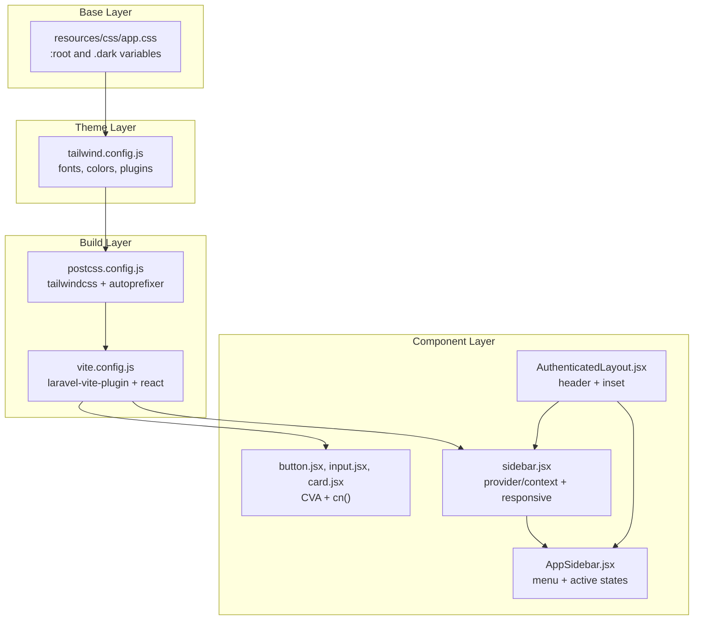

**Diagram sources**
- [resources/css/app.css:1-30](file://resources/css/app.css#L1-L30)
- [tailwind.config.js:6-41](file://tailwind.config.js#L6-L41)
- [postcss.config.js:1-7](file://postcss.config.js#L1-L7)
- [vite.config.js:5-13](file://vite.config.js#L5-L13)
- [resources/js/Components/ui/button.jsx:1-49](file://resources/js/Components/ui/button.jsx#L1-L49)
- [resources/js/Components/ui/input.jsx:1-20](file://resources/js/Components/ui/input.jsx#L1-L20)
- [resources/js/Components/ui/card.jsx:1-61](file://resources/js/Components/ui/card.jsx#L1-L61)
- [resources/js/Components/ui/sidebar.jsx:1-652](file://resources/js/Components/ui/sidebar.jsx#L1-L652)
- [resources/js/Components/AppSidebar.jsx:1-164](file://resources/js/Components/AppSidebar.jsx#L1-L164)
- [resources/js/Layouts/AuthenticatedLayout.jsx:1-54](file://resources/js/Layouts/AuthenticatedLayout.jsx#L1-L54)

## Detailed Component Analysis

### TailwindCSS Configuration and Design Tokens
- Content scanning targets Blade views and JSX files to purge unused styles efficiently
- Theme extensions:
  - Font family: Figtree plus default sans fallback
  - Colors:
    - edufa brand palette (blue, yellow, green, red)
    - sidebar semantic tokens using CSS variables for dynamic light/dark switching
- Plugins:
  - @tailwindcss/forms for form field normalization
  - @tailwindcss/typography for prose styles

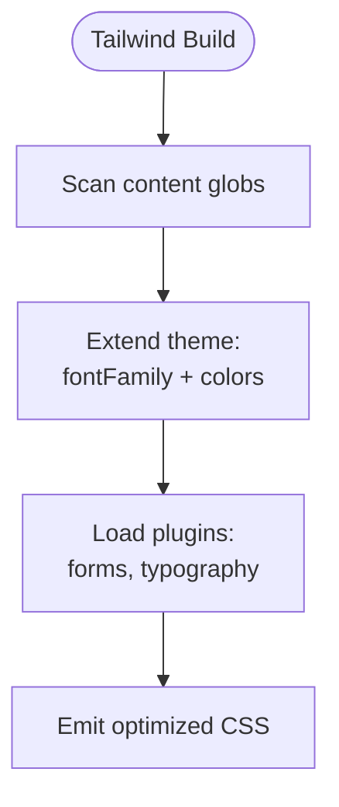

**Diagram sources**
- [tailwind.config.js:7-41](file://tailwind.config.js#L7-L41)

**Section sources**
- [tailwind.config.js:7-41](file://tailwind.config.js#L7-L41)

### Global CSS Variables and Dark Mode
- Base layer defines CSS variables for sidebar tokens in :root and .dark
- Semantic destructive foreground token included for consistent destructive actions
- Dark mode toggled by applying the .dark class to the root element

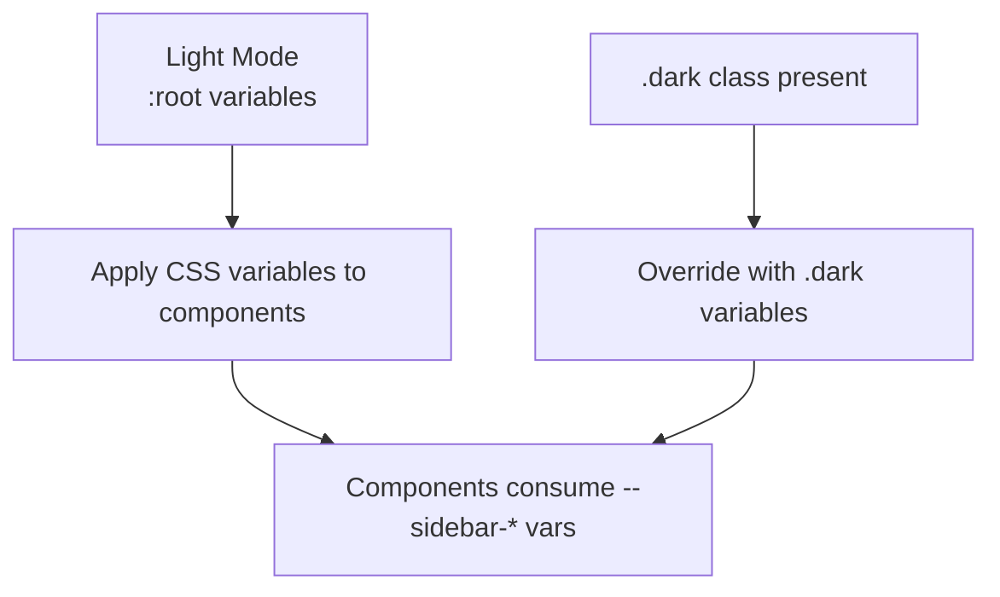

**Diagram sources**
- [resources/css/app.css:5-29](file://resources/css/app.css#L5-L29)

**Section sources**
- [resources/css/app.css:5-29](file://resources/css/app.css#L5-L29)

### Utility-First Primitives and CVA Variants
- Button:
  - CVA defines variants (default, destructive, outline, secondary, ghost, link) and sizes (default, sm, lg, icon)
  - Uses cn() to merge incoming className with computed variant classes
  - Supports asChild via Radix Slot for composition
- Input:
  - Consistent ring, focus, disabled, and placeholder utilities
  - Accepts arbitrary className overrides
- Card:
  - Composed sections: header, title, description, content, footer
  - Uses semantic bg-card and text-card-foreground

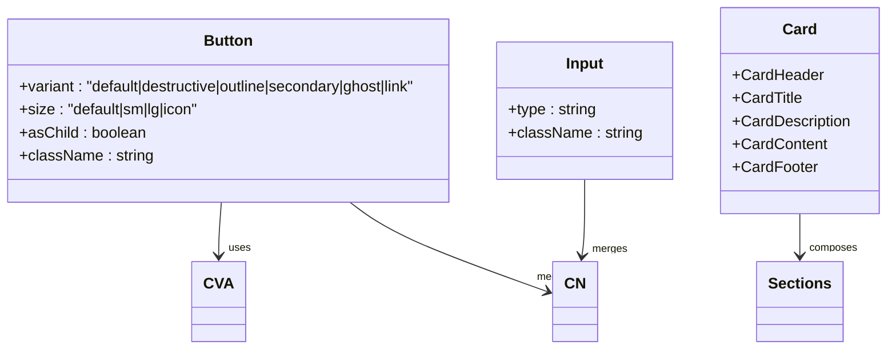

**Diagram sources**
- [resources/js/Components/ui/button.jsx:7-45](file://resources/js/Components/ui/button.jsx#L7-L45)
- [resources/js/Components/ui/input.jsx:4-16](file://resources/js/Components/ui/input.jsx#L4-L16)
- [resources/js/Components/ui/card.jsx:4-60](file://resources/js/Components/ui/card.jsx#L4-L60)

**Section sources**
- [resources/js/Components/ui/button.jsx:7-45](file://resources/js/Components/ui/button.jsx#L7-L45)
- [resources/js/Components/ui/input.jsx:4-16](file://resources/js/Components/ui/input.jsx#L4-L16)
- [resources/js/Components/ui/card.jsx:4-60](file://resources/js/Components/ui/card.jsx#L4-L60)

### Sidebar Component Architecture and Responsive Behavior
- Provider/context manages open/collapsed state, mobile detection, cookie persistence, and keyboard shortcuts
- Responsive behavior:
  - Mobile: Sheet overlay with constrained width
  - Desktop: Fixed sidebar with collapsible icon mode and transitions
- Semantic tokens:
  - Uses sidebar-* CSS variables for border, foreground, accent, ring, etc.
  - Active menu items highlight with brand yellow and subtle shadow
- Composition:
  - Sidebar groups, menu items, buttons, badges, separators, and skeletons
  - Tooltip integration for collapsed tooltips

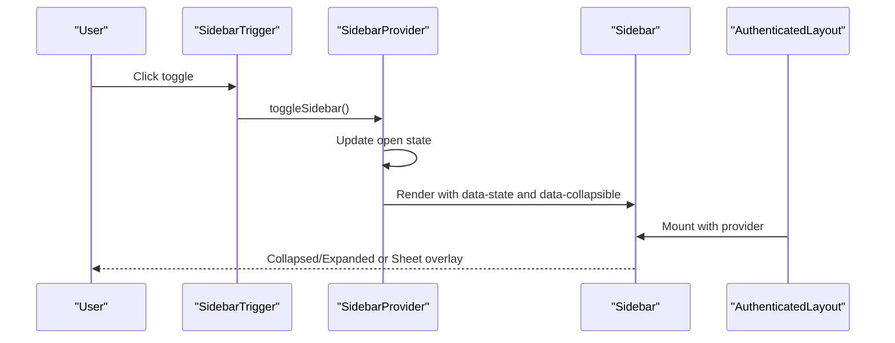

**Diagram sources**
- [resources/js/Components/ui/sidebar.jsx:226-250](file://resources/js/Components/ui/sidebar.jsx#L226-L250)
- [resources/js/Components/ui/sidebar.jsx:40-132](file://resources/js/Components/ui/sidebar.jsx#L40-L132)
- [resources/js/Components/ui/sidebar.jsx:135-226](file://resources/js/Components/ui/sidebar.jsx#L135-L226)
- [resources/js/Layouts/AuthenticatedLayout.jsx:26-51](file://resources/js/Layouts/AuthenticatedLayout.jsx#L26-L51)

**Section sources**
- [resources/js/Components/ui/sidebar.jsx:22-27](file://resources/js/Components/ui/sidebar.jsx#L22-L27)
- [resources/js/Components/ui/sidebar.jsx:40-132](file://resources/js/Components/ui/sidebar.jsx#L40-L132)
- [resources/js/Components/ui/sidebar.jsx:135-226](file://resources/js/Components/ui/sidebar.jsx#L135-L226)
- [resources/js/Components/ui/sidebar.jsx:438-458](file://resources/js/Components/ui/sidebar.jsx#L438-L458)
- [resources/js/Layouts/AuthenticatedLayout.jsx:26-51](file://resources/js/Layouts/AuthenticatedLayout.jsx#L26-L51)

### AppSidebar Theming and Navigation
- Renders main navigation items with Lucide icons and active state highlighting
- Uses semantic sidebar tokens for backgrounds, accents, borders, and rings
- Integrates with Inertia routes and shows user profile in footer
- Active menu items receive brand yellow background, darker text, and subtle shadow

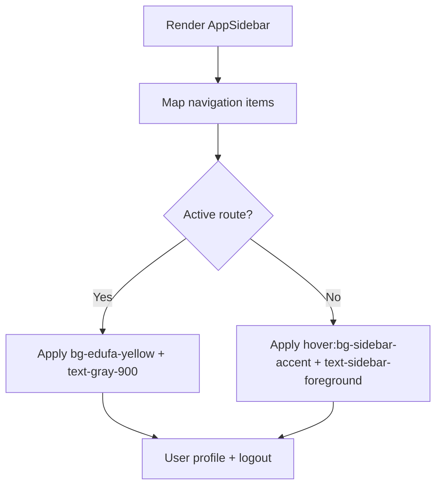

**Diagram sources**
- [resources/js/Components/AppSidebar.jsx:40-77](file://resources/js/Components/AppSidebar.jsx#L40-L77)
- [resources/js/Components/AppSidebar.jsx:105-110](file://resources/js/Components/AppSidebar.jsx#L105-L110)
- [resources/js/Components/AppSidebar.jsx:134-160](file://resources/js/Components/AppSidebar.jsx#L134-L160)

**Section sources**
- [resources/js/Components/AppSidebar.jsx:35-163](file://resources/js/Components/AppSidebar.jsx#L35-L163)

### Layout Integration and Accessibility
- AuthenticatedLayout wraps content with SidebarProvider and injects header with trigger and separator
- Uses semantic border and background tokens for header and content areas
- Accessible markup:
  - Hidden “Toggle Sidebar” text for screen readers
  - Proper focus states via Tailwind utilities on interactive elements

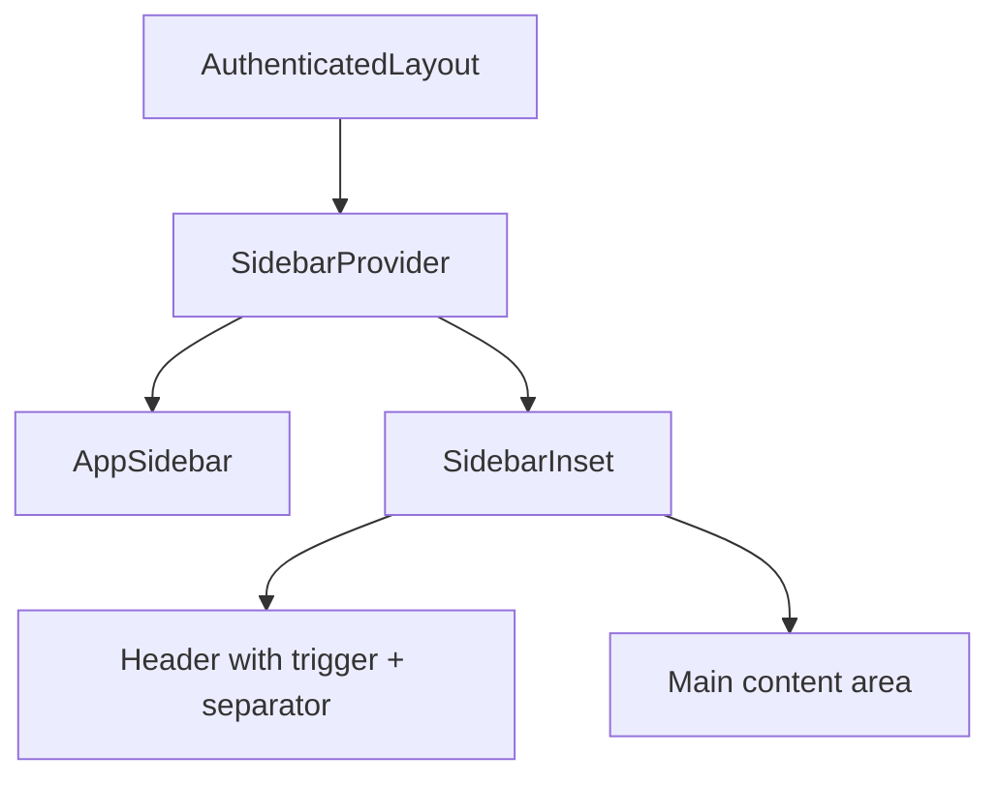

**Diagram sources**
- [resources/js/Layouts/AuthenticatedLayout.jsx:11-52](file://resources/js/Layouts/AuthenticatedLayout.jsx#L11-L52)
- [resources/js/Components/ui/sidebar.jsx:229-249](file://resources/js/Components/ui/sidebar.jsx#L229-L249)

**Section sources**
- [resources/js/Layouts/AuthenticatedLayout.jsx:11-52](file://resources/js/Layouts/AuthenticatedLayout.jsx#L11-L52)
- [resources/js/Components/ui/sidebar.jsx:229-249](file://resources/js/Components/ui/sidebar.jsx#L229-L249)

### Legacy Buttons and Utility Functions
- PrimaryButton and SecondaryButton demonstrate legacy inline styling with Tailwind utilities
- cn helper merges Tailwind classes with optional overrides using clsx and tailwind-merge

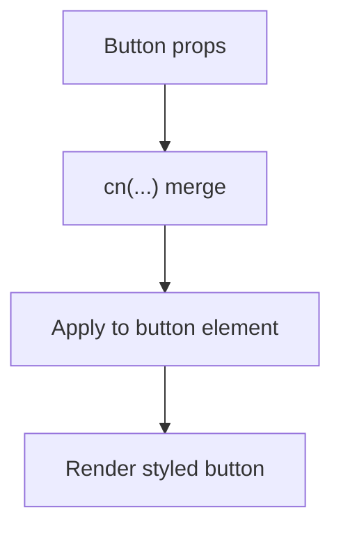

**Diagram sources**
- [resources/js/Components/PrimaryButton.jsx:10-14](file://resources/js/Components/PrimaryButton.jsx#L10-L14)
- [resources/js/Components/SecondaryButton.jsx:12-16](file://resources/js/Components/SecondaryButton.jsx#L12-L16)
- [resources/js/lib/utils.js:4-6](file://resources/js/lib/utils.js#L4-L6)

**Section sources**
- [resources/js/Components/PrimaryButton.jsx:1-21](file://resources/js/Components/PrimaryButton.jsx#L1-L21)
- [resources/js/Components/SecondaryButton.jsx:1-23](file://resources/js/Components/SecondaryButton.jsx#L1-L23)
- [resources/js/lib/utils.js:1-7](file://resources/js/lib/utils.js#L1-L7)

### Responsive Design Patterns
- Mobile breakpoint at 768px using matchMedia and React state
- Sidebar switches to Sheet overlay below breakpoint and fixed layout above
- Icon-collapsible mode reduces sidebar width to icon-only on desktop

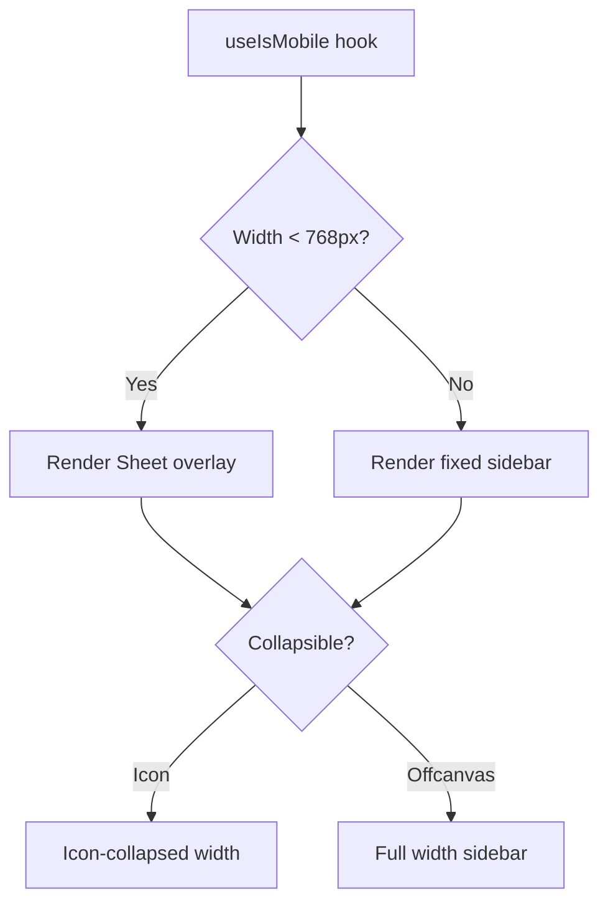

**Diagram sources**
- [resources/js/hooks/use-mobile.js:3-19](file://resources/js/hooks/use-mobile.js#L3-L19)
- [resources/js/Components/ui/sidebar.jsx:164-182](file://resources/js/Components/ui/sidebar.jsx#L164-L182)
- [resources/js/Components/ui/sidebar.jsx:184-224](file://resources/js/Components/ui/sidebar.jsx#L184-L224)

**Section sources**
- [resources/js/hooks/use-mobile.js:1-20](file://resources/js/hooks/use-mobile.js#L1-L20)
- [resources/js/Components/ui/sidebar.jsx:164-182](file://resources/js/Components/ui/sidebar.jsx#L164-L182)
- [resources/js/Components/ui/sidebar.jsx:184-224](file://resources/js/Components/ui/sidebar.jsx#L184-L224)

### Accessibility-Focused Styling
- Focus-visible outlines and ring utilities applied to interactive elements
- Screen-reader-only labels for icon-only controls
- Semantic roles and proper contrast maintained via theme tokens

**Section sources**
- [resources/js/Components/ui/button.jsx:8-44](file://resources/js/Components/ui/button.jsx#L8-L44)
- [resources/js/Components/ui/sidebar.jsx:246](file://resources/js/Components/ui/sidebar.jsx#L246)

### Animation Systems and Transitions
- Component transitions:
  - Sidebar collapses/expands with duration and easing
  - Menu items animate on hover and active states
  - Tooltip visibility controlled by collapsed state and device type
- Motion libraries present in dependencies (GSAP, Framer Motion) for advanced animations; current components rely on CSS transitions and Tailwind utilities

**Section sources**
- [resources/js/Components/ui/sidebar.jsx:93-106](file://resources/js/Components/ui/sidebar.jsx#L93-L106)
- [resources/js/Components/ui/sidebar.jsx:497-508](file://resources/js/Components/ui/sidebar.jsx#L497-L508)

## Dependency Analysis
- Tailwind configuration depends on:
  - Content globs scanning Blade and JSX
  - Theme extensions for fonts and colors
  - Plugins for forms and typography
- PostCSS pipeline depends on Tailwind and Autoprefixer
- Vite integrates Laravel Vite plugin and React plugin
- UI components depend on:
  - CVA for variants
  - clsx and tailwind-merge via cn helper
  - Radix UI primitives for slots and tooltips
  - Lucide React for icons
  - Inertia for routing and page props

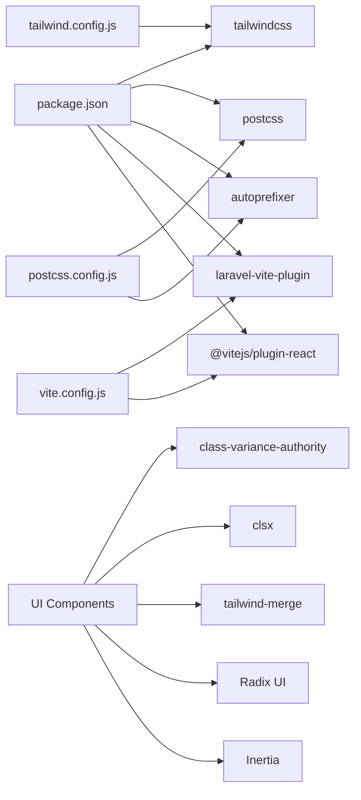

**Diagram sources**
- [package.json:9-48](file://package.json#L9-L48)
- [tailwind.config.js:6-41](file://tailwind.config.js#L6-L41)
- [postcss.config.js:1-7](file://postcss.config.js#L1-L7)
- [vite.config.js:5-13](file://vite.config.js#L5-L13)
- [resources/js/Components/ui/button.jsx:3](file://resources/js/Components/ui/button.jsx#L3)
- [resources/js/lib/utils.js:1-2](file://resources/js/lib/utils.js#L1-L2)
- [resources/js/Components/ui/sidebar.jsx:4-20](file://resources/js/Components/ui/sidebar.jsx#L4-L20)

**Section sources**
- [package.json:9-48](file://package.json#L9-L48)
- [tailwind.config.js:6-41](file://tailwind.config.js#L6-L41)
- [postcss.config.js:1-7](file://postcss.config.js#L1-L7)
- [vite.config.js:5-13](file://vite.config.js#L5-L13)
- [resources/js/Components/ui/button.jsx:3](file://resources/js/Components/ui/button.jsx#L3)
- [resources/js/lib/utils.js:1-2](file://resources/js/lib/utils.js#L1-L2)
- [resources/js/Components/ui/sidebar.jsx:4-20](file://resources/js/Components/ui/sidebar.jsx#L4-L20)

## Performance Considerations
- Purge configuration scans Blade and JSX to remove unused styles
- CSS variables reduce repeated color definitions and enable efficient dark mode switching
- CVA and cn minimize class duplication and improve maintainability
- Vite’s dev server hot module replacement accelerates iteration
- Consider extracting animations to external CSS or using transform-based transitions for GPU acceleration

[No sources needed since this section provides general guidance]

## Troubleshooting Guide
- Tailwind classes not applying:
  - Verify content globs include target files
  - Ensure PostCSS runs tailwindcss and autoprefixer
- Dark mode not switching:
  - Confirm .dark class is toggled on the root element
  - Check CSS variable overrides in :root and .dark
- Sidebar not responding:
  - Confirm SidebarProvider wraps AppSidebar and SidebarInset
  - Check useIsMobile hook and cookie persistence
- Build errors:
  - Validate Vite plugin configuration and React plugin presence

**Section sources**
- [tailwind.config.js:7-12](file://tailwind.config.js#L7-L12)
- [postcss.config.js:1-7](file://postcss.config.js#L1-L7)
- [resources/css/app.css:18-28](file://resources/css/app.css#L18-L28)
- [resources/js/Components/ui/sidebar.jsx:40-132](file://resources/js/Components/ui/sidebar.jsx#L40-L132)
- [resources/js/hooks/use-mobile.js:3-19](file://resources/js/hooks/use-mobile.js#L3-L19)
- [vite.config.js:5-13](file://vite.config.js#L5-L13)

## Conclusion
The project implements a robust, scalable styling system centered on TailwindCSS, PostCSS, and Vite. Design tokens, semantic color palettes, and CSS variables provide consistent theming across light and dark modes. Utility-first primitives with CVA and composable cn() promote reuse and maintainability. The sidebar component demonstrates responsive behavior, accessibility, and theme-aware styling. With purged outputs and modern tooling, the system balances developer productivity with runtime performance.