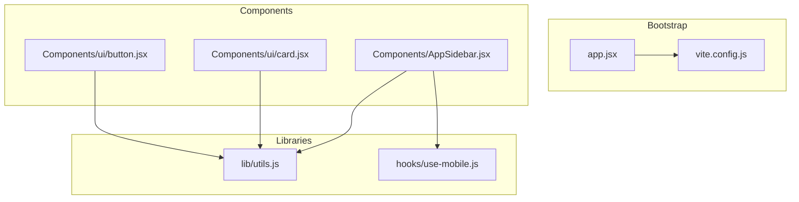
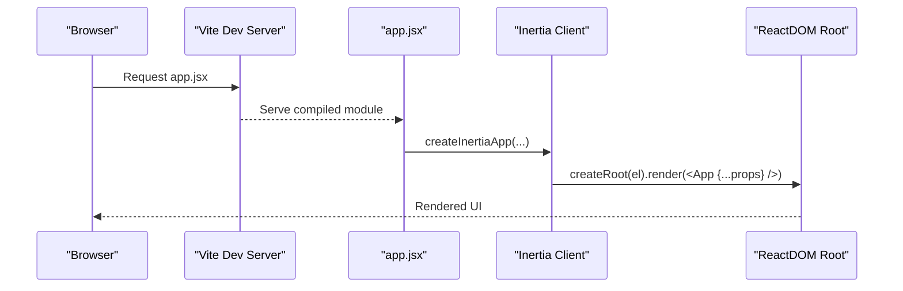
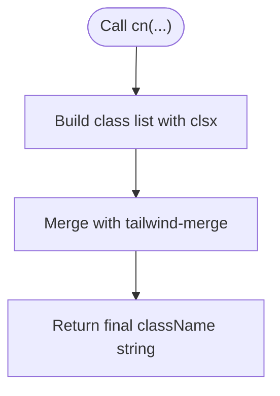
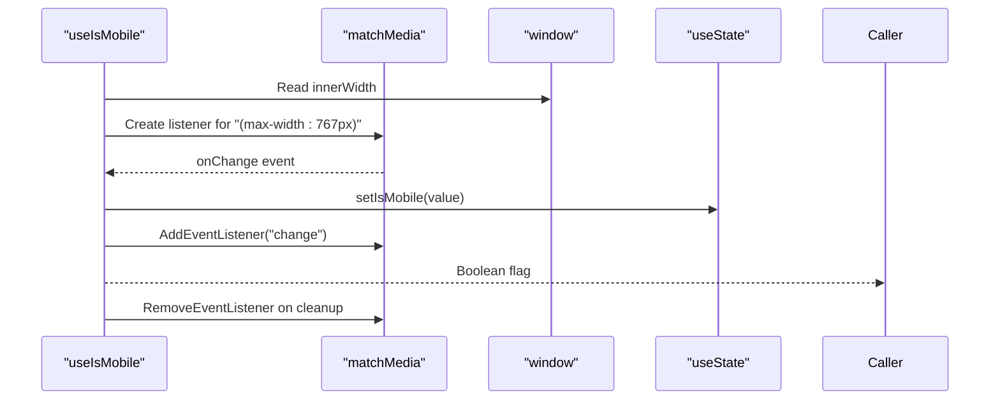
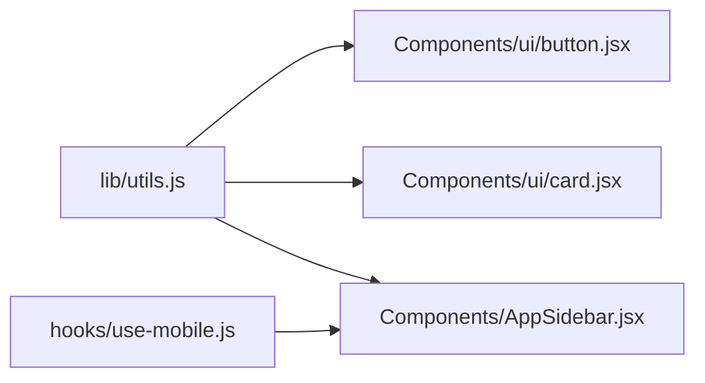
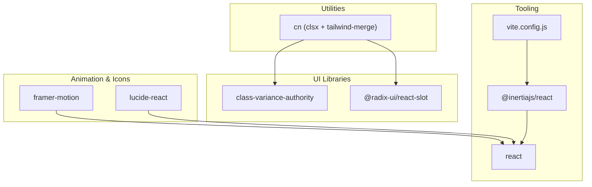

# Utility Functions and Helper Libraries

<cite>
**Referenced Files in This Document**
- [utils.js](file://resources/js/lib/utils.js)
- [use-mobile.js](file://resources/js/hooks/use-mobile.js)
- [app.jsx](file://resources/js/app.jsx)
- [vite.config.js](file://vite.config.js)
- [package.json](file://package.json)
- [button.jsx](file://resources/js/Components/ui/button.jsx)
- [card.jsx](file://resources/js/Components/ui/card.jsx)
- [AppSidebar.jsx](file://resources/js/Components/AppSidebar.jsx)
</cite>

## Table of Contents
1. [Introduction](#introduction)
2. [Project Structure](#project-structure)
3. [Core Components](#core-components)
4. [Architecture Overview](#architecture-overview)
5. [Detailed Component Analysis](#detailed-component-analysis)
6. [Dependency Analysis](#dependency-analysis)
7. [Performance Considerations](#performance-considerations)
8. [Testing Strategies](#testing-strategies)
9. [Best Practices](#best-practices)
10. [Conclusion](#conclusion)

## Introduction
This document focuses on the utility functions and helper libraries that power the frontend of the application. It covers:
- A concise Tailwind CSS class merging utility
- A mobile detection React hook
- Bootstrap configuration via Vite and Inertia
- Reusable component patterns that leverage utilities
- Performance considerations, testing strategies, and best practices for maintainable helpers

## Project Structure
The frontend stack is organized around React, Vite, and Inertia. Utilities live under a dedicated library module, while hooks are isolated for cross-component reuse. Components consistently import the utility function for class composition.

**Diagram sources**
- [app.jsx:1-26](file://resources/js/app.jsx#L1-L26)
- [vite.config.js:1-14](file://vite.config.js#L1-L14)
- [utils.js:1-7](file://resources/js/lib/utils.js#L1-L7)
- [use-mobile.js:1-20](file://resources/js/hooks/use-mobile.js#L1-L20)
- [button.jsx:1-49](file://resources/js/Components/ui/button.jsx#L1-L49)
- [card.jsx:1-61](file://resources/js/Components/ui/card.jsx#L1-L61)
- [AppSidebar.jsx:1-164](file://resources/js/Components/AppSidebar.jsx#L1-L164)

**Section sources**
- [app.jsx:1-26](file://resources/js/app.jsx#L1-L26)
- [vite.config.js:1-14](file://vite.config.js#L1-L14)

## Core Components
This section documents the two primary helper modules and their roles in the system.

- Utility Library: Provides a single exported function that merges Tailwind classes safely, combining clsx and tailwind-merge for predictable output.
- Mobile Detection Hook: Exposes a boolean flag indicating whether the current viewport qualifies as mobile, derived from media queries and window width checks.

Key characteristics:
- Minimal surface area for easy maintenance
- Predictable behavior through established libraries
- Hook encapsulates DOM APIs and lifecycle concerns

**Section sources**
- [utils.js:1-7](file://resources/js/lib/utils.js#L1-L7)
- [use-mobile.js:1-20](file://resources/js/hooks/use-mobile.js#L1-L20)

## Architecture Overview
The bootstrap pipeline initializes the React application with Inertia, enabling page navigation and progressive enhancement. Vite handles asset bundling and hot module replacement during development. The utility function is imported by UI components to compose Tailwind classes consistently.

**Diagram sources**
- [app.jsx:10-25](file://resources/js/app.jsx#L10-L25)
- [vite.config.js:6-12](file://vite.config.js#L6-L12)

## Detailed Component Analysis

### Utility Function: Class Composition (`cn`)
The utility function composes Tailwind classes using clsx for conditional class building and tailwind-merge to handle conflicts. This pattern ensures predictable class precedence and avoids duplicates.

Implementation highlights:
- Accepts variadic inputs suitable for conditional expressions
- Returns a merged string ready for React element className
- Centralized logic reduces duplication across components

Usage patterns observed:
- Components import the function and pass variant modifiers and additional classes
- Consistent application across buttons, cards, and layout components

**Diagram sources**
- [utils.js:4-6](file://resources/js/lib/utils.js#L4-L6)

**Section sources**
- [utils.js:1-7](file://resources/js/lib/utils.js#L1-L7)
- [button.jsx:5,40](file://resources/js/Components/ui/button.jsx#L5,L40)
- [card.jsx:2,47](file://resources/js/Components/ui/card.jsx#L2,L47)
- [AppSidebar.jsx:33,105](file://resources/js/Components/AppSidebar.jsx#L33,L105)

### Mobile Detection Hook (`useIsMobile`)
This hook detects mobile viewports using a media query listener and the current window width. It manages subscription lifecycle within a React effect and exposes a normalized boolean value.

Key behaviors:
- Uses a fixed breakpoint constant
- Subscribes to media query change events
- Initializes state based on current window width
- Cleans up listeners on unmount

**Diagram sources**
- [use-mobile.js:5-19](file://resources/js/hooks/use-mobile.js#L5-L19)

**Section sources**
- [use-mobile.js:1-20](file://resources/js/hooks/use-mobile.js#L1-L20)

### Component Integration Patterns
Components consistently rely on the utility function for class composition, ensuring design system alignment and reducing boilerplate.

- Button component imports the utility and variant definitions to produce consistent interactive elements.
- Card component uses the utility for container and content wrappers.
- Sidebar component integrates both the utility and the mobile hook to adapt layout behavior.

**Diagram sources**
- [button.jsx:5,40](file://resources/js/Components/ui/button.jsx#L5,L40)
- [card.jsx:2,47](file://resources/js/Components/ui/card.jsx#L2,L47)
- [AppSidebar.jsx:33,105](file://resources/js/Components/AppSidebar.jsx#L33,L105)
- [use-mobile.js:5-19](file://resources/js/hooks/use-mobile.js#L5-L19)

**Section sources**
- [button.jsx:1-49](file://resources/js/Components/ui/button.jsx#L1-L49)
- [card.jsx:1-61](file://resources/js/Components/ui/card.jsx#L1-L61)
- [AppSidebar.jsx:1-164](file://resources/js/Components/AppSidebar.jsx#L1-L164)

## Dependency Analysis
External dependencies supporting the utilities and hooks:

- Tailwind ecosystem: clsx and tailwind-merge for safe class merging
- UI primitives: class-variance-authority for component variants, radix-ui slot for flexible composition
- Animation and UX: framer-motion for motion effects, lucide-react for icons
- State and UI: @radix-ui packages for accessible UI primitives
- Tooling: Vite, React, Inertia, and related plugins

**Diagram sources**
- [package.json:24-47](file://package.json#L24-L47)
- [vite.config.js:1-14](file://vite.config.js#L1-L14)

**Section sources**
- [package.json:1-49](file://package.json#L1-L49)
- [vite.config.js:1-14](file://vite.config.js#L1-L14)

## Performance Considerations
Utility and hook performance patterns:

- Utility function
  - O(n) class concatenation with clsx, followed by conflict resolution with tailwind-merge
  - Prefer passing only necessary inputs to minimize string processing
  - Memoize computed class strings when inputs are static or infrequently changing

- Mobile detection hook
  - Media query listeners are efficient but avoid unnecessary re-renders by checking current state before updating
  - Cleanup listeners to prevent memory leaks and stale callbacks
  - Debounce or throttle resize-sensitive logic if extending beyond this hook

- Component rendering
  - Use the utility function to keep className computations outside render-heavy logic
  - Compose variants and sizes at definition sites to reduce runtime branching

[No sources needed since this section provides general guidance]

## Testing Strategies
Recommended approaches for utilities and hooks:

- Utility function
  - Unit tests for class composition with various input combinations (truthy/falsy, arrays, objects)
  - Edge-case coverage for empty inputs, conflicting classes, and order sensitivity
  - Snapshot tests to prevent unintended class regressions

- Mobile detection hook
  - Mock window and matchMedia to simulate breakpoints
  - Test initialization, change events, and cleanup behavior
  - Verify return values across boundary conditions near the breakpoint

- Component integration
  - Verify className outputs against expected Tailwind combinations
  - Test variant and size props propagate correctly through the utility function

[No sources needed since this section provides general guidance]

## Best Practices
Maintaining clean, reusable helpers:

- Keep utilities small and focused with explicit inputs and outputs
- Encapsulate DOM APIs behind hooks to isolate side effects
- Centralize design tokens and variants in shared modules for consistency
- Document expected input types and behavior for consumers
- Avoid tight coupling to specific frameworks; favor composition and configuration

[No sources needed since this section provides general guidance]

## Conclusion
The utility and helper systems in this project emphasize simplicity, consistency, and performance. The class composition utility and mobile detection hook provide reliable building blocks for components, while the bootstrap configuration ensures a smooth development and runtime experience. Following the recommended practices and testing strategies will help maintain a robust, scalable set of helpers.