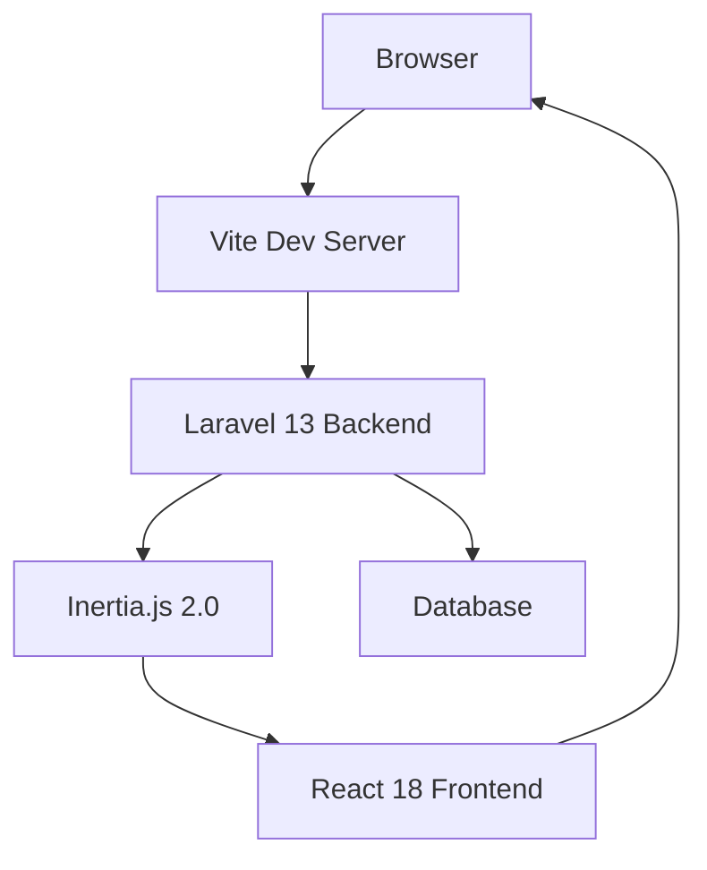
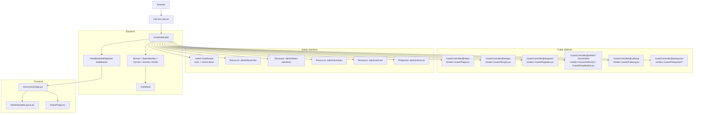
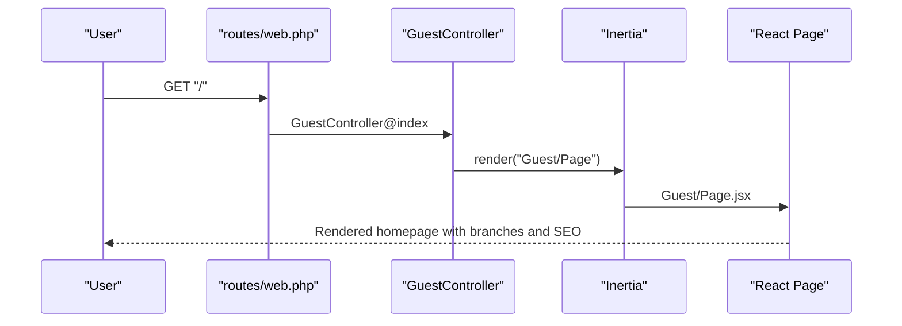
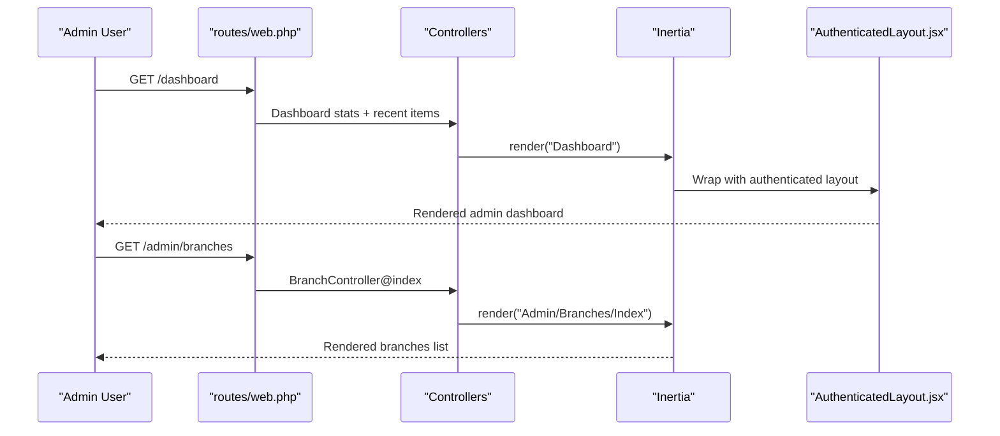
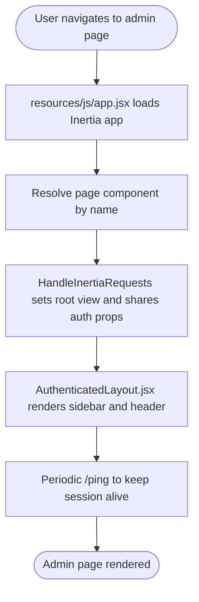
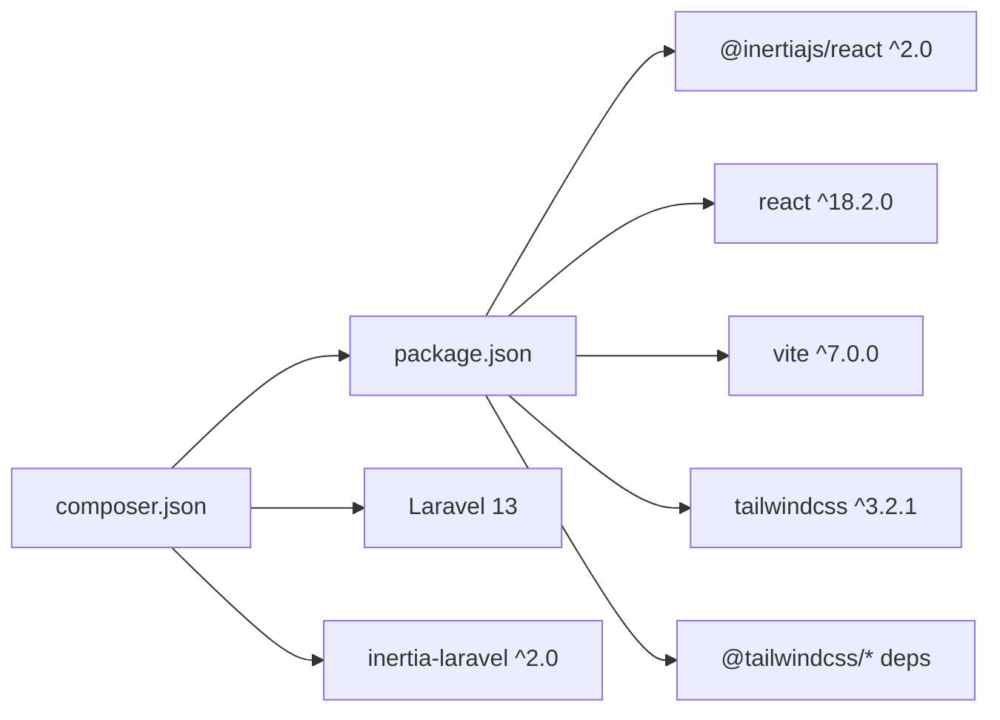

# Project Overview

<cite>
**Referenced Files in This Document**
- [README.md](file://README.md)
- [composer.json](file://composer.json)
- [package.json](file://package.json)
- [routes/web.php](file://routes/web.php)
- [app/Http/Middleware/HandleInertiaRequests.php](file://app/Http/Middleware/HandleInertiaRequests.php)
- [app/Http/Controllers/GuestController.php](file://app/Http/Controllers/GuestController.php)
- [app/Models/Branch.php](file://app/models/Branch.php)
- [app/Models/Service.php](file://app/models/Service.php)
- [app/Models/TeamMember.php](file://app/models/TeamMember.php)
- [resources/js/Pages/Guest/Page.jsx](file://resources/js/Pages/Guest/Page.jsx)
- [resources/js/Layouts/AuthenticatedLayout.jsx](file://resources/js/Layouts/AuthenticatedLayout.jsx)
- [resources/js/app.jsx](file://resources/js/app.jsx)
- [database/migrations/2026_04_20_133158_create_branches_table.php](file://database/migrations/2026_04_20_133158_create_branches_table.php)
- [database/migrations/2026_04_30_055559_create_services_table.php](file://database/migrations/2026_04_30_055559_create_services_table.php)
</cite>

## Table of Contents
1. [Introduction](#introduction)
2. [Project Structure](#project-structure)
3. [Core Components](#core-components)
4. [Architecture Overview](#architecture-overview)
5. [Detailed Component Analysis](#detailed-component-analysis)
6. [Dependency Analysis](#dependency-analysis)
7. [Performance Considerations](#performance-considerations)
8. [Troubleshooting Guide](#troubleshooting-guide)
9. [Conclusion](#conclusion)

## Introduction
EDUfa is a digital hub designed to support the educational and psychological services offered by EDUfa Centre for children with special needs. It serves as a unified platform connecting families and educators to the Centre’s offerings, including branches, team members, activities, articles, and services. The platform is built as a hybrid architecture: the backend runs on Laravel 13, while the frontend is powered by React 18 with Inertia.js 2.0, enabling a seamless single-page application experience while maintaining server-side rendering and SEO-friendly routes.

The system integrates with the broader educational technology ecosystem by:
- Presenting a public-facing website showcasing services, branches, team members, and activities.
- Providing an administrative interface for managing content and user roles.
- Supporting dynamic sitemaps and SEO metadata for improved discoverability.

## Project Structure
The repository follows a layered structure typical of a Laravel application with a React frontend:
- Backend (Laravel 13): Controllers, Models, Routes, Middleware, and database migrations define the service layer and data model.
- Frontend (React 18 + Inertia.js 2.0): Pages, Components, and Layouts render the user-facing experiences for guests and administrators.
- Build tooling: Vite orchestrates asset compilation and hot module replacement during development.

**Diagram sources**
- [resources/js/app.jsx:10-25](file://resources/js/app.jsx#L10-L25)
- [app/Http/Middleware/HandleInertiaRequests.php:8-38](file://app/Http/Middleware/HandleInertiaRequests.php#L8-L38)
- [routes/web.php:1-137](file://routes/web.php#L1-L137)

**Section sources**
- [routes/web.php:1-137](file://routes/web.php#L1-L137)
- [resources/js/app.jsx:1-26](file://resources/js/app.jsx#L1-L26)
- [composer.json:8-16](file://composer.json#L8-L16)
- [package.json:19-22](file://package.json#L19-L22)

## Core Components
This section outlines the primary building blocks that power EDUfa’s functionality.

- Public Website
  - GuestController handles routes for home, team members, activities, articles, branches, and service pages. It renders React pages via Inertia, passing domain-specific data such as branches, team members, activities, and service details.
  - Guest pages include the homepage, team profiles, activity listings, article listings and detail pages, branch locations, and service-specific landing pages.

- Administrative Interface
  - Admin-only routes expose dashboard statistics and resource management for branches, team members, activities, articles, and services. The authenticated layout provides a sidebar navigation and persistent keep-alive ping to maintain session stability.

- Data Models and Entities
  - Branch: Stores city, type, address, coordinates, and photo path; resolves a public photo URL.
  - TeamMember: Stores profile attributes and resolves a public image URL.
  - Service: Stores title, slug, and optional Google Form URL for service registration.

- Routing and SEO
  - Routes define public pages, service subpages, and administrative endpoints. A sitemap route generates XML dynamically from published articles and static paths.

**Section sources**
- [app/Http/Controllers/GuestController.php:14-118](file://app/Http/Controllers/GuestController.php#L14-L118)
- [resources/js/Pages/Guest/Page.jsx:35-545](file://resources/js/Pages/Guest/Page.jsx#L35-L545)
- [resources/js/Layouts/AuthenticatedLayout.jsx:11-53](file://resources/js/Layouts/AuthenticatedLayout.jsx#L11-L53)
- [app/Models/Branch.php:8-35](file://app/models/Branch.php#L8-L35)
- [app/Models/TeamMember.php:7-23](file://app/models/TeamMember.php#L7-L23)
- [app/Models/Service.php:7-14](file://app/models/Service.php#L7-L14)
- [routes/web.php:13-47](file://routes/web.php#L13-L47)
- [routes/web.php:51-66](file://routes/web.php#L51-L66)
- [routes/web.php:68-125](file://routes/web.php#L68-L125)

## Architecture Overview
EDUfa employs a hybrid architecture combining Laravel as the backend API provider and React with Inertia.js for the frontend. The middleware layer ensures the root template and shared props are consistently applied across requests.

**Diagram sources**
- [routes/web.php:13-47](file://routes/web.php#L13-L47)
- [routes/web.php:51-66](file://routes/web.php#L51-L66)
- [routes/web.php:68-125](file://routes/web.php#L68-L125)
- [app/Http/Middleware/HandleInertiaRequests.php:8-38](file://app/Http/Middleware/HandleInertiaRequests.php#L8-L38)
- [resources/js/app.jsx:10-25](file://resources/js/app.jsx#L10-L25)
- [resources/js/Layouts/AuthenticatedLayout.jsx:11-53](file://resources/js/Layouts/AuthenticatedLayout.jsx#L11-L53)
- [resources/js/Pages/Guest/Page.jsx:35-545](file://resources/js/Pages/Guest/Page.jsx#L35-L545)

## Detailed Component Analysis

### Public Website Features
The public website showcases EDUfa Centre’s offerings and information to visitors. Key pages and flows:
- Home page: Displays branches and integrates SEO metadata and interactive components.
- Team profiles: Lists team members with roles and photos.
- Activities: Presents recent activities.
- Articles: Lists published articles with excerpts and links to detail pages.
- Branches: Shows branch locations with maps and contact details.
- Services: Renders dedicated pages per service slug, pulling service metadata.

**Diagram sources**
- [routes/web.php:51-24](file://routes/web.php#L51-L24)
- [app/Http/Controllers/GuestController.php:19-24](file://app/Http/Controllers/GuestController.php#L19-L24)
- [resources/js/Pages/Guest/Page.jsx:35-545](file://resources/js/Pages/Guest/Page.jsx#L35-L545)

**Section sources**
- [routes/web.php:51-66](file://routes/web.php#L51-L66)
- [app/Http/Controllers/GuestController.php:19-118](file://app/Http/Controllers/GuestController.php#L19-L118)
- [resources/js/Pages/Guest/Page.jsx:35-545](file://resources/js/Pages/Guest/Page.jsx#L35-L545)

### Administrative Capabilities
Administrators manage content and users through resourceful routes and a dedicated dashboard:
- Dashboard: Displays counts and recent items for branches, team members, articles, and activities.
- Branches: CRUD operations for branch records.
- Team Members: CRUD operations for team member profiles.
- Activities: CRUD operations for activity listings.
- Articles: CRUD operations for article lifecycle (draft/published).
- Services: Index and update endpoints for service metadata.

**Diagram sources**
- [routes/web.php:68-125](file://routes/web.php#L68-L125)
- [resources/js/Layouts/AuthenticatedLayout.jsx:11-53](file://resources/js/Layouts/AuthenticatedLayout.jsx#L11-L53)

**Section sources**
- [routes/web.php:68-125](file://routes/web.php#L68-L125)
- [resources/js/Layouts/AuthenticatedLayout.jsx:11-53](file://resources/js/Layouts/AuthenticatedLayout.jsx#L11-L53)

### Integration Patterns
- Inertia.js integration: The middleware defines the root template and shares authentication state with the frontend.
- Asset pipeline: Vite compiles React pages and styles, resolving page components via Laravel’s inertia-helpers.
- Keep-alive session: The authenticated layout periodically pings the backend to prevent session timeouts.

**Diagram sources**
- [resources/js/app.jsx:10-25](file://resources/js/app.jsx#L10-L25)
- [app/Http/Middleware/HandleInertiaRequests.php:8-38](file://app/Http/Middleware/HandleInertiaRequests.php#L8-L38)
- [resources/js/Layouts/AuthenticatedLayout.jsx:14-23](file://resources/js/Layouts/AuthenticatedLayout.jsx#L14-L23)

**Section sources**
- [app/Http/Middleware/HandleInertiaRequests.php:8-38](file://app/Http/Middleware/HandleInertiaRequests.php#L8-L38)
- [resources/js/app.jsx:10-25](file://resources/js/app.jsx#L10-L25)
- [resources/js/Layouts/AuthenticatedLayout.jsx:14-23](file://resources/js/Layouts/AuthenticatedLayout.jsx#L14-L23)

## Dependency Analysis
Technology stack summary:
- Backend: Laravel 13, Inertia middleware, Sanctum, Sitemap generation.
- Frontend: React 18, Inertia for React, Vite, Tailwind CSS, Radix UI, TipTap, GSAP, Framer Motion, Leaflet for maps.
- Tooling: Laravel Vite plugin, concurrent dev scripts.

**Diagram sources**
- [composer.json:8-16](file://composer.json#L8-L16)
- [package.json:9-47](file://package.json#L9-L47)

**Section sources**
- [composer.json:8-16](file://composer.json#L8-L16)
- [package.json:9-47](file://package.json#L9-L47)

## Performance Considerations
- Efficient data fetching: GuestController prepares concise payloads (e.g., excerpt generation for articles) to reduce payload sizes.
- Lazy loading and animations: Frontend components leverage libraries like Framer Motion and GSAP for smooth UX without blocking initial render.
- Asset optimization: Vite builds optimized bundles for production, and Tailwind purges unused styles.
- Session keep-alive: The authenticated layout pings the backend periodically to avoid unnecessary re-authentication.

[No sources needed since this section provides general guidance]

## Troubleshooting Guide
Common operational checks:
- Verify Laravel and React dependencies are installed and up to date.
- Ensure Vite dev server is running and hot reload is enabled.
- Confirm Inertia middleware is configured to share authentication state.
- Validate database migrations for branches, services, and related tables.
- Test admin routes behind authentication and admin-only middleware.

**Section sources**
- [composer.json:8-16](file://composer.json#L8-L16)
- [package.json:9-47](file://package.json#L9-L47)
- [app/Http/Middleware/HandleInertiaRequests.php:8-38](file://app/Http/Middleware/HandleInertiaRequests.php#L8-L38)
- [database/migrations/2026_04_20_133158_create_branches_table.php:14-22](file://database/migrations/2026_04_20_133158_create_branches_table.php#L14-L22)
- [database/migrations/2026_04_30_055559_create_services_table.php:14-19](file://database/migrations/2026_04_30_055559_create_services_table.php#L14-L19)

## Conclusion
EDUfa is a cohesive digital platform that bridges EDUfa Centre’s educational and psychological services with families and educators. Its hybrid architecture—Laravel 13 for the backend, React 18 with Inertia.js 2.0 for the frontend—delivers a responsive, SEO-aware, and admin-driven experience. The platform’s public website highlights branches, team members, activities, articles, and services, while the administrative interface streamlines content and user management. This foundation supports scalable enhancements within the educational technology ecosystem.