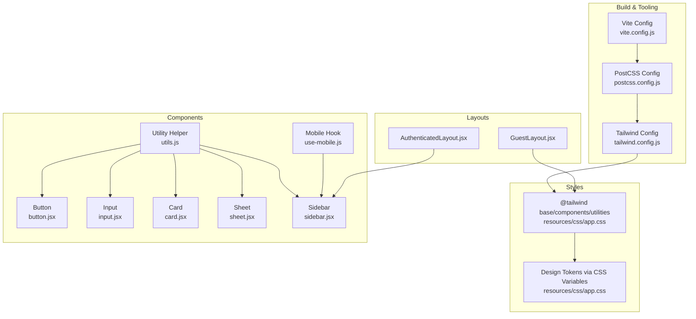
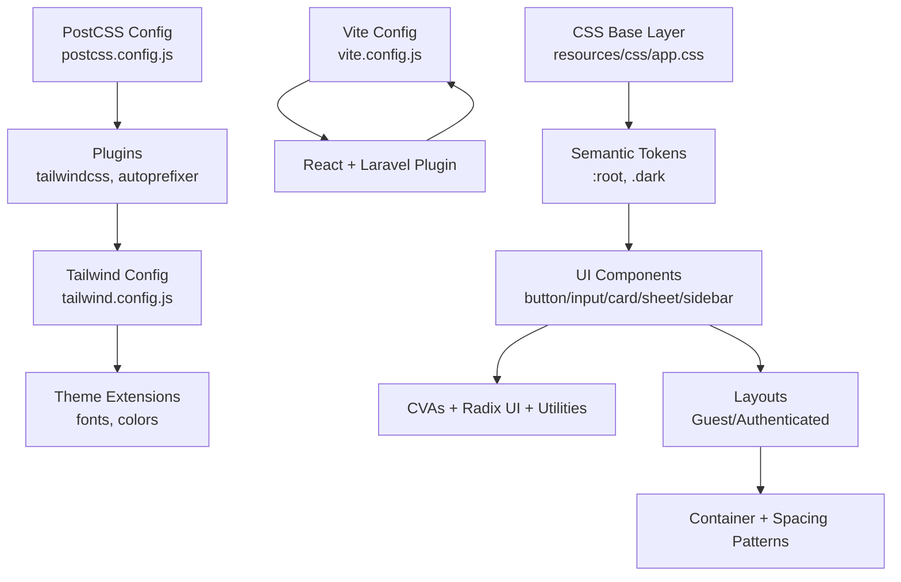
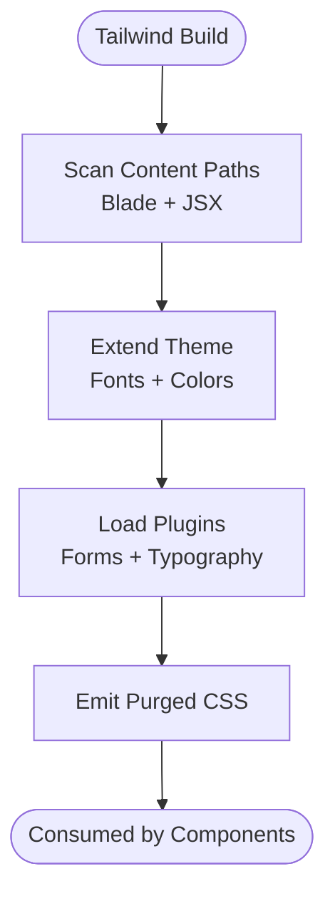
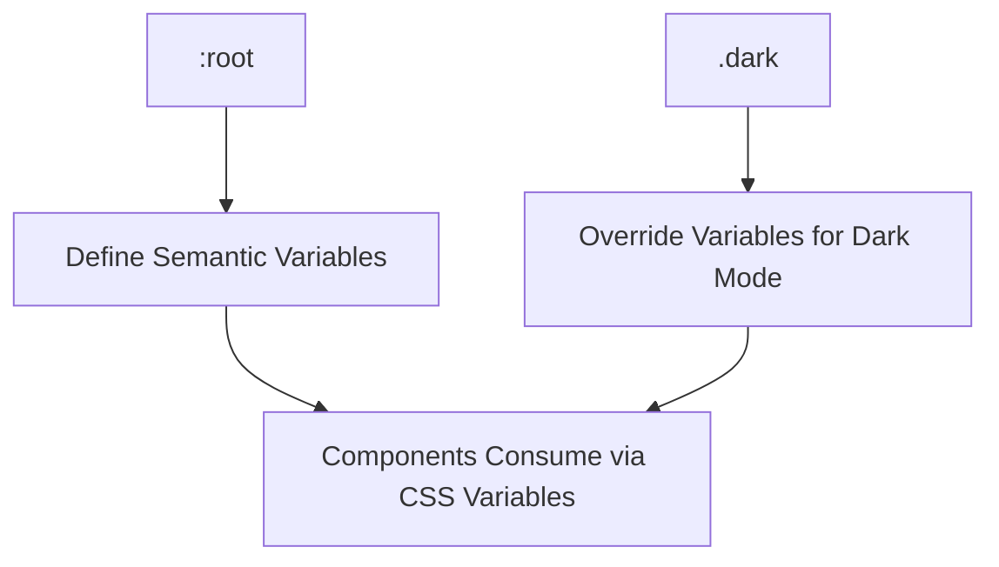
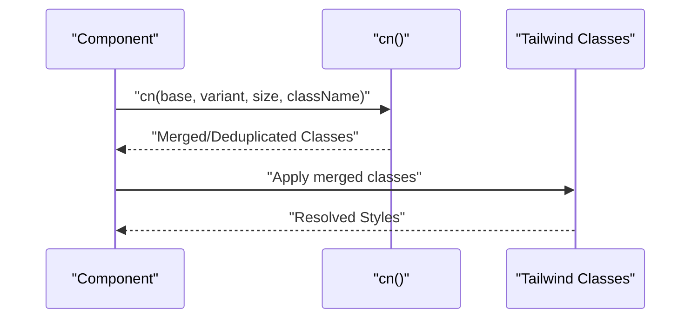
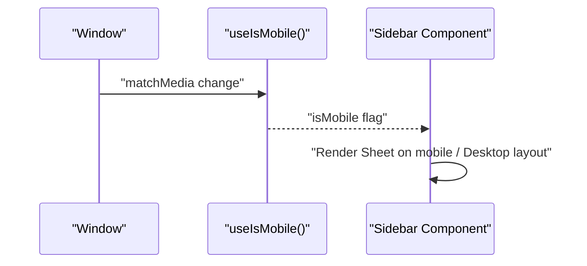
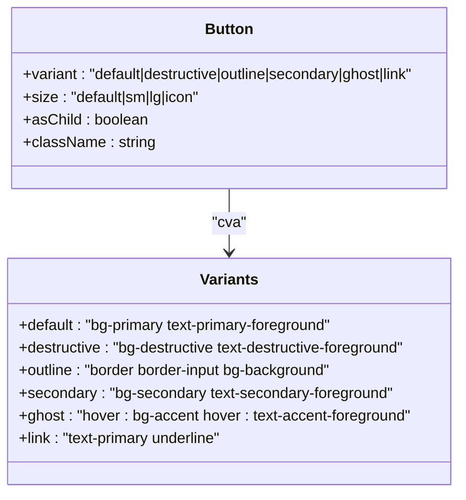
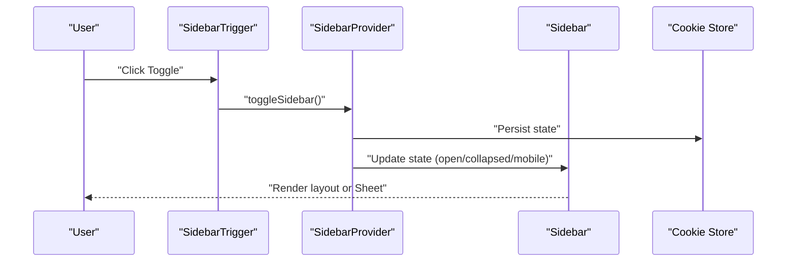
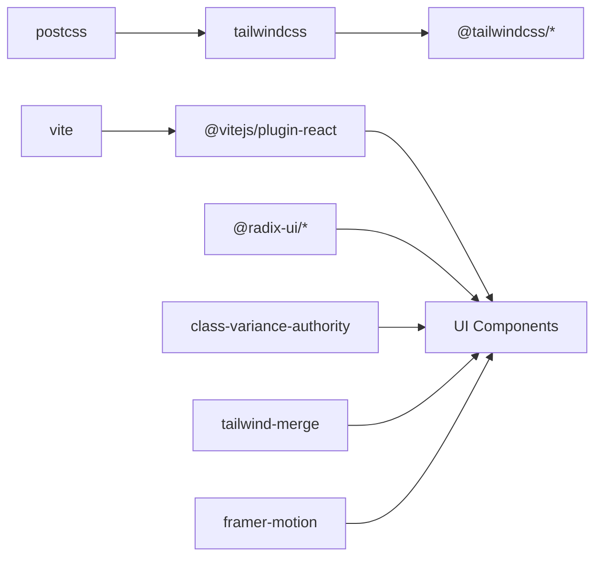

# Styling and Design System

<cite>
**Referenced Files in This Document**
- [tailwind.config.js](file://tailwind.config.js)
- [postcss.config.js](file://postcss.config.js)
- [resources/css/app.css](file://resources/css/app.css)
- [vite.config.js](file://vite.config.js)
- [package.json](file://package.json)
- [resources/js/lib/utils.js](file://resources/js/lib/utils.js)
- [resources/js/hooks/use-mobile.js](file://resources/js/hooks/use-mobile.js)
- [resources/js/Components/ui/button.jsx](file://resources/js/Components/ui/button.jsx)
- [resources/js/Components/ui/input.jsx](file://resources/js/Components/ui/input.jsx)
- [resources/js/Components/ui/card.jsx](file://resources/js/Components/ui/card.jsx)
- [resources/js/Components/ui/sheet.jsx](file://resources/js/Components/ui/sheet.jsx)
- [resources/js/Components/ui/sidebar.jsx](file://resources/js/Components/ui/sidebar.jsx)
- [resources/js/Layouts/GuestLayout.jsx](file://resources/js/Layouts/GuestLayout.jsx)
- [resources/js/Layouts/AuthenticatedLayout.jsx](file://resources/js/Layouts/AuthenticatedLayout.jsx)
- [resources/views/app.blade.php](file://resources/views/app.blade.php)
</cite>

## Table of Contents
1. [Introduction](#introduction)
2. [Project Structure](#project-structure)
3. [Core Components](#core-components)
4. [Architecture Overview](#architecture-overview)
5. [Detailed Component Analysis](#detailed-component-analysis)
6. [Dependency Analysis](#dependency-analysis)
7. [Performance Considerations](#performance-considerations)
8. [Accessibility Considerations](#accessibility-considerations)
9. [Extensibility and Consistency Guidelines](#extensibility-and-consistency-guidelines)
10. [Troubleshooting Guide](#troubleshooting-guide)
11. [Conclusion](#conclusion)

## Introduction
This document describes the EDUfa styling and design system built on TailwindCSS and React. It explains the Tailwind configuration, design tokens for typography and colors, responsive patterns, component styling guidelines, animation and transition systems, accessibility practices, and performance optimizations. It also provides guidance for extending the design system while maintaining visual consistency across the application.

## Project Structure
The styling pipeline integrates TailwindCSS with PostCSS and Vite, and applies design tokens via CSS custom properties and Tailwind’s theme extension. React components encapsulate reusable UI with consistent variants and sizes, and layouts demonstrate container and spacing patterns.

**Diagram sources**
- [vite.config.js:1-14](file://vite.config.js#L1-L14)
- [postcss.config.js:1-7](file://postcss.config.js#L1-L7)
- [tailwind.config.js:1-42](file://tailwind.config.js#L1-L42)
- [resources/css/app.css:1-30](file://resources/css/app.css#L1-L30)
- [resources/js/lib/utils.js:1-7](file://resources/js/lib/utils.js#L1-L7)
- [resources/js/hooks/use-mobile.js:1-20](file://resources/js/hooks/use-mobile.js#L1-L20)
- [resources/js/Components/ui/button.jsx:1-49](file://resources/js/Components/ui/button.jsx#L1-L49)
- [resources/js/Components/ui/input.jsx:1-20](file://resources/js/Components/ui/input.jsx#L1-L20)
- [resources/js/Components/ui/card.jsx:1-61](file://resources/js/Components/ui/card.jsx#L1-L61)
- [resources/js/Components/ui/sheet.jsx:1-123](file://resources/js/Components/ui/sheet.jsx#L1-L123)
- [resources/js/Components/ui/sidebar.jsx:1-652](file://resources/js/Components/ui/sidebar.jsx#L1-L652)
- [resources/js/Layouts/GuestLayout.jsx:1-19](file://resources/js/Layouts/GuestLayout.jsx#L1-L19)
- [resources/js/Layouts/AuthenticatedLayout.jsx:1-54](file://resources/js/Layouts/AuthenticatedLayout.jsx#L1-L54)

**Section sources**
- [tailwind.config.js:1-42](file://tailwind.config.js#L1-L42)
- [postcss.config.js:1-7](file://postcss.config.js#L1-L7)
- [resources/css/app.css:1-30](file://resources/css/app.css#L1-L30)
- [vite.config.js:1-14](file://vite.config.js#L1-L14)
- [package.json:1-49](file://package.json#L1-L49)

## Core Components
- Tailwind configuration extends fonts and colors, enables form and typography plugins, and scopes content scanning to Blade and JSX assets.
- CSS base layer defines semantic CSS variables for light/dark themes and a sidebar palette.
- Utility helper merges class names safely and deduplicates duplicates.
- Mobile hook detects mobile viewport to drive responsive behavior.
- UI primitives (Button, Input, Card, Sheet, Sidebar) implement consistent variants, sizes, and design tokens.

**Section sources**
- [tailwind.config.js:14-41](file://tailwind.config.js#L14-L41)
- [resources/css/app.css:5-29](file://resources/css/app.css#L5-L29)
- [resources/js/lib/utils.js:4-6](file://resources/js/lib/utils.js#L4-L6)
- [resources/js/hooks/use-mobile.js:3-18](file://resources/js/hooks/use-mobile.js#L3-L18)
- [resources/js/Components/ui/button.jsx:7-34](file://resources/js/Components/ui/button.jsx#L7-L34)
- [resources/js/Components/ui/input.jsx:4-15](file://resources/js/Components/ui/input.jsx#L4-L15)
- [resources/js/Components/ui/card.jsx:4-58](file://resources/js/Components/ui/card.jsx#L4-L58)
- [resources/js/Components/ui/sheet.jsx:16-62](file://resources/js/Components/ui/sheet.jsx#L16-L62)
- [resources/js/Components/ui/sidebar.jsx:40-132](file://resources/js/Components/ui/sidebar.jsx#L40-L132)

## Architecture Overview
The design system follows a layered approach:
- Build pipeline: Vite compiles React and CSS; PostCSS runs Tailwind and Autoprefixer; Tailwind scans templates and components for purging.
- Token layer: CSS variables define semantic tokens for backgrounds, foregrounds, borders, and rings, switching between light and dark modes.
- Component layer: Radix UI primitives, CVAs, and utility classes enforce consistent styles and interactions.
- Layout layer: Shared layouts apply global spacing, containers, and header structures.

**Diagram sources**
- [tailwind.config.js:6-41](file://tailwind.config.js#L6-L41)
- [postcss.config.js:1-7](file://postcss.config.js#L1-L7)
- [vite.config.js:5-12](file://vite.config.js#L5-L12)
- [resources/css/app.css:5-29](file://resources/css/app.css#L5-L29)
- [resources/js/Components/ui/button.jsx:3-5](file://resources/js/Components/ui/button.jsx#L3-L5)
- [resources/js/Components/ui/sidebar.jsx:10-14](file://resources/js/Components/ui/sidebar.jsx#L10-L14)
- [resources/js/Layouts/AuthenticatedLayout.jsx:25-51](file://resources/js/Layouts/AuthenticatedLayout.jsx#L25-L51)

## Detailed Component Analysis

### Tailwind Configuration and Design Tokens
- Content scanning targets Blade views, compiled views, and JSX components to enable purging.
- Theme extensions:
  - Font family prioritizes a system-safe stack with a custom font.
  - Color palette includes brand colors and a semantic sidebar palette backed by CSS variables.
- Plugins:
  - Forms plugin for consistent form controls.
  - Typography plugin for prose styles.

**Diagram sources**
- [tailwind.config.js:7-12](file://tailwind.config.js#L7-L12)
- [tailwind.config.js:14-38](file://tailwind.config.js#L14-L38)
- [tailwind.config.js:40](file://tailwind.config.js#L40)

**Section sources**
- [tailwind.config.js:7-41](file://tailwind.config.js#L7-L41)

### CSS Custom Properties and Dark Mode Tokens
- CSS variables define semantic tokens for backgrounds, foregrounds, accents, borders, and rings.
- Light and dark modes switch variable values to maintain consistent semantics across themes.
- Sidebar-specific tokens are applied across components to ensure coherent palette usage.

**Diagram sources**
- [resources/css/app.css:6-28](file://resources/css/app.css#L6-L28)

**Section sources**
- [resources/css/app.css:5-29](file://resources/css/app.css#L5-L29)

### Utility Helper: Class Merging
- Utility function merges and deduplicates class lists to avoid conflicts and reduce specificity issues.
- Used across all UI components to compose base, variant, and size classes.

**Diagram sources**
- [resources/js/lib/utils.js:4-6](file://resources/js/lib/utils.js#L4-L6)
- [resources/js/Components/ui/button.jsx:36-44](file://resources/js/Components/ui/button.jsx#L36-L44)

**Section sources**
- [resources/js/lib/utils.js:1-7](file://resources/js/lib/utils.js#L1-L7)

### Mobile-First Responsive Pattern
- Mobile detection hook uses a media query threshold to set state for responsive behavior.
- Sidebar adapts by switching to a slide-out Sheet on mobile and desktop layout on larger screens.
- Breakpoint-driven transitions and widths ensure consistent UX across devices.

**Diagram sources**
- [resources/js/hooks/use-mobile.js:8-16](file://resources/js/hooks/use-mobile.js#L8-L16)
- [resources/js/Components/ui/sidebar.jsx:53-76](file://resources/js/Components/ui/sidebar.jsx#L53-L76)
- [resources/js/Components/ui/sidebar.jsx:164-182](file://resources/js/Components/ui/sidebar.jsx#L164-L182)

**Section sources**
- [resources/js/hooks/use-mobile.js:1-20](file://resources/js/hooks/use-mobile.js#L1-L20)
- [resources/js/Components/ui/sidebar.jsx:147-182](file://resources/js/Components/ui/sidebar.jsx#L147-L182)

### Button Component Variants and Sizes
- Uses a variant system (default, destructive, outline, secondary, ghost, link) and sizes (default, sm, lg, icon).
- Integrates focus ring tokens and hover/focus states via Tailwind utilities.
- Supports “as child” rendering via a slot component for composition.

**Diagram sources**
- [resources/js/Components/ui/button.jsx:7-34](file://resources/js/Components/ui/button.jsx#L7-L34)

**Section sources**
- [resources/js/Components/ui/button.jsx:1-49](file://resources/js/Components/ui/button.jsx#L1-L49)

### Input Component Styling
- Inherits focus ring tokens and maintains consistent padding and typography.
- Provides a clean baseline for form inputs across the app.

**Section sources**
- [resources/js/Components/ui/input.jsx:1-20](file://resources/js/Components/ui/input.jsx#L1-L20)

### Card Component Composition
- Encapsulates header, title, description, content, and footer slots for consistent card layouts.
- Uses semantic background and foreground tokens for unified appearance.

**Section sources**
- [resources/js/Components/ui/card.jsx:1-61](file://resources/js/Components/ui/card.jsx#L1-L61)

### Sheet Component Animations and Transitions
- Uses Radix UI dialog primitives with slide-in/out animations and fade overlays.
- Applies motion tokens for duration and easing to ensure smooth transitions.

**Section sources**
- [resources/js/Components/ui/sheet.jsx:16-62](file://resources/js/Components/ui/sheet.jsx#L16-L62)

### Sidebar Component: Collapsible Navigation
- Implements provider/context pattern to coordinate open/collapsed states, keyboard shortcuts, cookies, and tooltips.
- Supports off-canvas, floating, and inset variants with responsive behavior.
- Consumes sidebar tokens for consistent colors and borders.

**Diagram sources**
- [resources/js/Components/ui/sidebar.jsx:22-76](file://resources/js/Components/ui/sidebar.jsx#L22-L76)
- [resources/js/Components/ui/sidebar.jsx:147-224](file://resources/js/Components/ui/sidebar.jsx#L147-L224)

**Section sources**
- [resources/js/Components/ui/sidebar.jsx:1-652](file://resources/js/Components/ui/sidebar.jsx#L1-L652)

### Layout Patterns
- Guest layout centers content with a light background and subtle shadows.
- Authenticated layout wraps content in a sidebar-aware inset with a header and controlled paddings.

**Section sources**
- [resources/js/Layouts/GuestLayout.jsx:1-19](file://resources/js/Layouts/GuestLayout.jsx#L1-L19)
- [resources/js/Layouts/AuthenticatedLayout.jsx:11-53](file://resources/js/Layouts/AuthenticatedLayout.jsx#L11-L53)

## Dependency Analysis
The design system relies on a small set of key dependencies:
- TailwindCSS and plugins for utility generation and typography.
- PostCSS for processing and autoprefixing.
- Vite for asset bundling and hot module replacement.
- Radix UI for accessible primitives and Sheet/dialogs.
- class-variance-authority and tailwind-merge for variant composition and class merging.
- Framer Motion for advanced animations.

**Diagram sources**
- [package.json:9-22](file://package.json#L9-L22)
- [package.json:24-47](file://package.json#L24-L47)

**Section sources**
- [package.json:1-49](file://package.json#L1-L49)

## Performance Considerations
- CSS purging: Tailwind content paths target Blade and JSX assets to remove unused styles.
- Critical path optimization: Ensure essential styles are inlined or preloaded where appropriate.
- Bundle size: Prefer component-level imports and avoid importing entire libraries.
- Animation performance: Use transform and opacity for GPU-accelerated transitions; limit heavy effects on low-powered devices.

**Section sources**
- [tailwind.config.js:7-12](file://tailwind.config.js#L7-L12)

## Accessibility Considerations
- Color contrast: Ensure sufficient contrast between foreground and background tokens; test against WCAG guidelines.
- Focus management: Components consistently apply focus rings and outlines for keyboard navigation.
- Screen reader support: Hidden “Close” and “Toggle Sidebar” labels are present for assistive technologies.
- Keyboard navigation: Shortcuts and focus traps are handled by Radix UI primitives.

**Section sources**
- [resources/js/Components/ui/button.jsx:8](file://resources/js/Components/ui/button.jsx#L8)
- [resources/js/Components/ui/sheet.jsx:56-58](file://resources/js/Components/ui/sheet.jsx#L56-L58)
- [resources/js/Components/ui/sidebar.jsx:246](file://resources/js/Components/ui/sidebar.jsx#L246)

## Extensibility and Consistency Guidelines
- Define new tokens in the CSS base layer and reference them via CSS variables.
- Add variants and sizes using CVAs in existing components or create new primitives with consistent naming.
- Keep component APIs minimal and reuse shared utilities (cn, slots, Radix UI).
- Maintain a single source of truth for design tokens and enforce usage through component props.
- Document new components and patterns in a centralized style guide.

[No sources needed since this section provides general guidance]

## Troubleshooting Guide
- Styles not applying:
  - Verify Tailwind content paths include current directories.
  - Ensure PostCSS and Vite are configured correctly.
- Dark mode not switching:
  - Confirm CSS variables update under the dark class.
- Mobile layout issues:
  - Check media query breakpoint and use the mobile detection hook.
- Animation glitches:
  - Reduce motion where necessary and prefer transform-based transitions.

**Section sources**
- [tailwind.config.js:7-12](file://tailwind.config.js#L7-L12)
- [resources/css/app.css:18-28](file://resources/css/app.css#L18-L28)
- [resources/js/hooks/use-mobile.js:8-16](file://resources/js/hooks/use-mobile.js#L8-L16)

## Conclusion
EDUfa’s design system combines TailwindCSS, CSS variables, and React primitives to deliver a consistent, accessible, and performant UI. By centralizing design tokens, enforcing component variants, and leveraging modern tooling, teams can extend the system confidently while preserving visual coherence across pages and devices.