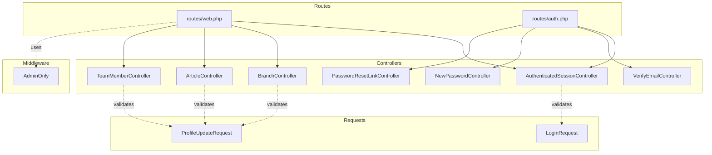
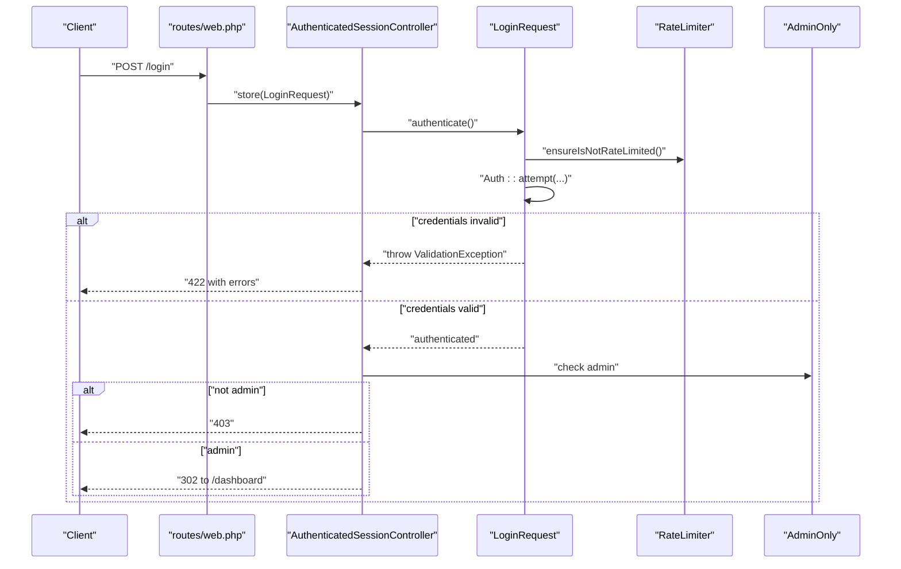
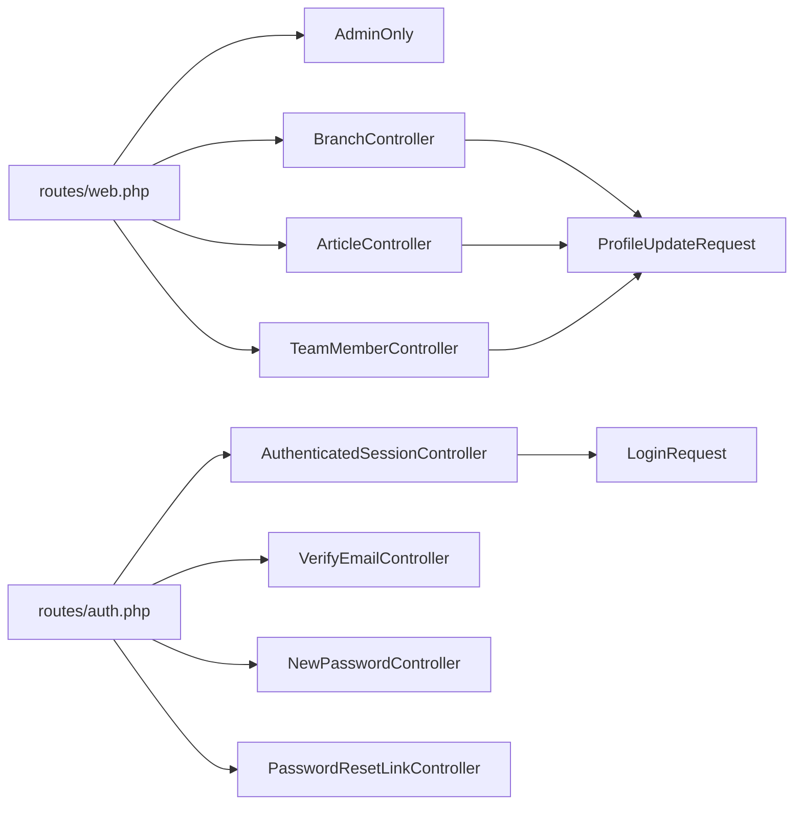

# API Testing

<cite>
**Referenced Files in This Document**
- [routes/web.php](file://routes/web.php)
- [routes/auth.php](file://routes/auth.php)
- [app/Http/Controllers/Auth/AuthenticatedSessionController.php](file://app/Http/Controllers/Auth/AuthenticatedSessionController.php)
- [app/Http/Controllers/Auth/VerifyEmailController.php](file://app/Http/Controllers/Auth/VerifyEmailController.php)
- [app/Http/Controllers/Auth/NewPasswordController.php](file://app/Http/Controllers/Auth/NewPasswordController.php)
- [app/Http/Controllers/Auth/PasswordResetLinkController.php](file://app/Http/Controllers/Auth/PasswordResetLinkController.php)
- [app/Http/Middleware/AdminOnly.php](file://app/Http/Middleware/AdminOnly.php)
- [app/Http/Requests/Auth/LoginRequest.php](file://app/Http/Requests/Auth/LoginRequest.php)
- [app/Http/Requests/ProfileUpdateRequest.php](file://app/Http/Requests/ProfileUpdateRequest.php)
- [app/Http/Controllers/BranchController.php](file://app/Http/Controllers/BranchController.php)
- [app/Http/Controllers/ArticleController.php](file://app/Http/Controllers/ArticleController.php)
- [app/Http/Controllers/TeamMemberController.php](file://app/Http/Controllers/TeamMemberController.php)
- [tests/Feature/Auth/AuthenticationTest.php](file://tests/Feature/Auth/AuthenticationTest.php)
- [tests/TestCase.php](file://tests/TestCase.php)
- [composer.json](file://composer.json)
- [phpunit.xml](file://phpunit.xml)
</cite>

## Table of Contents
1. [Introduction](#introduction)
2. [Project Structure](#project-structure)
3. [Core Components](#core-components)
4. [Architecture Overview](#architecture-overview)
5. [Detailed Component Analysis](#detailed-component-analysis)
6. [Dependency Analysis](#dependency-analysis)
7. [Performance Considerations](#performance-considerations)
8. [Troubleshooting Guide](#troubleshooting-guide)
9. [Conclusion](#conclusion)
10. [Appendices](#appendices)

## Introduction
This document defines a comprehensive API testing methodology for EDUfa’s RESTful backend. It focuses on authentication endpoints, administrative CRUD operations, and related validation and security controls. It also covers request/response validation, status code testing, error handling verification, protected route testing, permission validation, data serialization checks, file upload and image processing, external API integrations, rate limiting, CORS configuration, security headers, and mobile-responsive endpoint considerations.

## Project Structure
The backend uses Laravel routing and controllers. Administrative endpoints are grouped under middleware stacks for authentication and admin-only access. Authentication endpoints are exposed via dedicated controllers and requests. File upload endpoints exist for branches, articles, and team members. The testing stack leverages PHPUnit with a SQLite in-memory database and refreshable database per test.

**Diagram sources**
- [routes/web.php:1-141](file://routes/web.php#L1-L141)
- [routes/auth.php:1-44](file://routes/auth.php#L1-L44)
- [app/Http/Controllers/Auth/AuthenticatedSessionController.php:1-58](file://app/Http/Controllers/Auth/AuthenticatedSessionController.php#L1-L58)
- [app/Http/Controllers/Auth/VerifyEmailController.php:1-28](file://app/Http/Controllers/Auth/VerifyEmailController.php#L1-L28)
- [app/Http/Controllers/Auth/NewPasswordController.php:1-70](file://app/Http/Controllers/Auth/NewPasswordController.php#L1-L70)
- [app/Http/Controllers/Auth/PasswordResetLinkController.php:1-52](file://app/Http/Controllers/Auth/PasswordResetLinkController.php#L1-L52)
- [app/Http/Controllers/BranchController.php:1-88](file://app/Http/Controllers/BranchController.php#L1-L88)
- [app/Http/Controllers/ArticleController.php:1-122](file://app/Http/Controllers/ArticleController.php#L1-L122)
- [app/Http/Controllers/TeamMemberController.php:1-72](file://app/Http/Controllers/TeamMemberController.php#L1-L72)
- [app/Http/Middleware/AdminOnly.php:1-25](file://app/Http/Middleware/AdminOnly.php#L1-L25)
- [app/Http/Requests/Auth/LoginRequest.php:1-87](file://app/Http/Requests/Auth/LoginRequest.php#L1-L87)
- [app/Http/Requests/ProfileUpdateRequest.php:1-32](file://app/Http/Requests/ProfileUpdateRequest.php#L1-L32)

**Section sources**
- [routes/web.php:1-141](file://routes/web.php#L1-L141)
- [routes/auth.php:1-44](file://routes/auth.php#L1-L44)
- [composer.json:1-91](file://composer.json#L1-L91)
- [phpunit.xml:1-37](file://phpunit.xml#L1-L37)

## Core Components
- Authentication endpoints
  - Login screen rendering and submission, including admin-only restriction and rate limiting.
  - Password reset link request and password reset form handling.
  - Email verification endpoint.
- Administrative CRUD endpoints
  - Branches: listing, creation, update, deletion with optional photo uploads.
  - Articles: listing, creation, update, deletion with optional thumbnail uploads and content sanitization.
  - Team members: listing, creation, update, deletion with optional photo uploads.
- Middleware and validation
  - Admin-only middleware enforcing 403 for unauthorized users.
  - Request validation classes ensuring robust input sanitization and constraints.
- Testing infrastructure
  - PHPUnit suite with SQLite in-memory database and refreshable fixtures.

**Section sources**
- [routes/web.php:72-129](file://routes/web.php#L72-L129)
- [routes/auth.php:13-43](file://routes/auth.php#L13-L43)
- [app/Http/Controllers/Auth/AuthenticatedSessionController.php:13-58](file://app/Http/Controllers/Auth/AuthenticatedSessionController.php#L13-L58)
- [app/Http/Controllers/Auth/PasswordResetLinkController.php:13-52](file://app/Http/Controllers/Auth/PasswordResetLinkController.php#L13-L52)
- [app/Http/Controllers/Auth/NewPasswordController.php:17-70](file://app/Http/Controllers/Auth/NewPasswordController.php#L17-L70)
- [app/Http/Controllers/Auth/VerifyEmailController.php:10-28](file://app/Http/Controllers/Auth/VerifyEmailController.php#L10-L28)
- [app/Http/Middleware/AdminOnly.php:9-25](file://app/Http/Middleware/AdminOnly.php#L9-L25)
- [app/Http/Requests/Auth/LoginRequest.php:13-87](file://app/Http/Requests/Auth/LoginRequest.php#L13-L87)
- [app/Http/Requests/ProfileUpdateRequest.php:10-32](file://app/Http/Requests/ProfileUpdateRequest.php#L10-L32)
- [app/Http/Controllers/BranchController.php:12-88](file://app/Http/Controllers/BranchController.php#L12-L88)
- [app/Http/Controllers/ArticleController.php:11-122](file://app/Http/Controllers/ArticleController.php#L11-L122)
- [app/Http/Controllers/TeamMemberController.php:11-72](file://app/Http/Controllers/TeamMemberController.php#L11-L72)
- [tests/Feature/Auth/AuthenticationTest.php:9-55](file://tests/Feature/Auth/AuthenticationTest.php#L9-L55)
- [tests/TestCase.php:7-11](file://tests/TestCase.php#L7-L11)

## Architecture Overview
The backend exposes administrative endpoints behind an auth and admin middleware chain. Authentication is handled by dedicated controllers and requests. File upload endpoints leverage Laravel validation and storage to persist images. Testing is executed via PHPUnit against an in-memory SQLite database.

**Diagram sources**
- [routes/web.php:13-43](file://routes/web.php#L13-L43)
- [app/Http/Controllers/Auth/AuthenticatedSessionController.php:28-43](file://app/Http/Controllers/Auth/AuthenticatedSessionController.php#L28-L43)
- [app/Http/Requests/Auth/LoginRequest.php:41-77](file://app/Http/Requests/Auth/LoginRequest.php#L41-L77)
- [app/Http/Middleware/AdminOnly.php:16-23](file://app/Http/Middleware/AdminOnly.php#L16-L23)

## Detailed Component Analysis

### Authentication Endpoints
- Login
  - Endpoint: GET/HEAD /login renders the login page; POST /login authenticates and enforces admin-only access.
  - Validation: LoginRequest validates email/password and applies rate limiting.
  - Security: On invalid credentials, throttling messages are returned; non-admin users are logged out immediately.
- Password Reset Link
  - Endpoint: GET /forgot-password renders; POST sends reset link via Password facade.
- Reset Password
  - Endpoint: GET /reset-password/{token} renders; POST updates password and emits reset event.
- Email Verification
  - Endpoint: invoked route marks email as verified and redirects to dashboard with a flag.

Testing guidance:
- Status code assertions: 200 for GET /login; 302 on successful login; 403 for non-admin attempts; 422 for validation failures; 429 for throttling.
- Error payload verification: confirm presence of field-specific errors and throttling messages.
- Protected route tests: assert 401/403 when unauthenticated or insufficient permissions.

**Section sources**
- [routes/auth.php:13-43](file://routes/auth.php#L13-L43)
- [app/Http/Controllers/Auth/AuthenticatedSessionController.php:18-57](file://app/Http/Controllers/Auth/AuthenticatedSessionController.php#L18-L57)
- [app/Http/Requests/Auth/LoginRequest.php:28-87](file://app/Http/Requests/Auth/LoginRequest.php#L28-L87)
- [app/Http/Controllers/Auth/PasswordResetLinkController.php:18-50](file://app/Http/Controllers/Auth/PasswordResetLinkController.php#L18-L50)
- [app/Http/Controllers/Auth/NewPasswordController.php:22-68](file://app/Http/Controllers/Auth/NewPasswordController.php#L22-L68)
- [app/Http/Controllers/Auth/VerifyEmailController.php:15-26](file://app/Http/Controllers/Auth/VerifyEmailController.php#L15-L26)

### Administrative CRUD Endpoints
- Branches
  - Endpoints: resource routes under admin/branches.
  - Validation: city/address required; optional coordinates; photo image validation.
  - Behavior: uploads stored to public disk; existing files deleted on update/remove.
- Articles
  - Endpoints: resource routes under admin/articles.
  - Validation: title/content required; category/status constraints; optional thumbnail; author details; show_expert_voice boolean.
  - Behavior: content sanitized; thumbnails stored to public disk; slug generated; existing thumbnails deleted on update/remove.
- Team Members
  - Endpoints: resource routes under admin/team-members.
  - Validation: name/type/role required; type enum; optional description/photo.
  - Behavior: photos stored to public disk; existing files deleted on update/remove.

Testing guidance:
- Request validation: submit missing/invalid fields to assert 422 and specific error keys.
- File upload: attach valid images and assert successful persistence; test invalid types/mime sizes to trigger 422.
- Permissions: assert 403 when accessed without admin middleware.
- Serialization: verify JSON responses include expected fields and omit sensitive attributes.

**Section sources**
- [routes/web.php:90-128](file://routes/web.php#L90-L128)
- [app/Http/Controllers/BranchController.php:27-86](file://app/Http/Controllers/BranchController.php#L27-L86)
- [app/Http/Controllers/ArticleController.php:26-120](file://app/Http/Controllers/ArticleController.php#L26-L120)
- [app/Http/Controllers/TeamMemberController.php:20-70](file://app/Http/Controllers/TeamMemberController.php#L20-L70)

### Middleware and Permission Validation
- AdminOnly middleware
  - Enforces 403 for unauthenticated or non-admin users.
  - Used on admin dashboard and resource routes.

Testing guidance:
- Assert 403 responses for non-admin users on protected routes.
- Confirm admin users can access endpoints successfully.

**Section sources**
- [app/Http/Middleware/AdminOnly.php:16-23](file://app/Http/Middleware/AdminOnly.php#L16-L23)
- [routes/web.php:72-129](file://routes/web.php#L72-L129)

### Request and Response Validation
- LoginRequest
  - Validates email/password; ensures not rate limited; throws throttling messages; clears limiter on success.
- ProfileUpdateRequest
  - Validates name/email uniqueness against current user.

Testing guidance:
- Throttling: after repeated failed attempts, assert 429 with retry timing.
- Validation errors: assert presence of field-specific messages for malformed inputs.
- Serialization: ensure responses exclude internal fields and include expected metadata.

**Section sources**
- [app/Http/Requests/Auth/LoginRequest.php:28-87](file://app/Http/Requests/Auth/LoginRequest.php#L28-L87)
- [app/Http/Requests/ProfileUpdateRequest.php:17-30](file://app/Http/Requests/ProfileUpdateRequest.php#L17-L30)

### Protected Routes and Permission Testing
- Admin-only routes
  - Dashboard and resource routes under admin/* require admin privileges.
- Testing strategy
  - Authenticate as non-admin and assert 403.
  - Authenticate as admin and assert successful access.

**Section sources**
- [routes/web.php:72-129](file://routes/web.php#L72-L129)
- [app/Http/Middleware/AdminOnly.php:16-23](file://app/Http/Middleware/AdminOnly.php#L16-L23)

### Data Serialization and Content Sanitization
- Articles
  - Content sanitized to allow safe HTML tags; thumbnail path stored; author details included; boolean flags normalized.
- Testing guidance
  - Submit content with disallowed tags and assert sanitized output.
  - Verify thumbnail URLs and paths are persisted correctly.

**Section sources**
- [app/Http/Controllers/ArticleController.php:40-61](file://app/Http/Controllers/ArticleController.php#L40-L61)
- [app/Http/Controllers/ArticleController.php:83-105](file://app/Http/Controllers/ArticleController.php#L83-L105)

### File Upload Endpoints and Image Processing
- Supported endpoints
  - Branches: photo upload validation and storage.
  - Articles: thumbnail upload validation and storage.
  - Team Members: photo upload validation and storage.
- Testing guidance
  - Attach valid images (jpeg/png/jpg/webp, size limits) and assert success.
  - Attach invalid files (wrong type, oversized) and assert 422.
  - Verify cleanup of previous files on update/remove.

**Section sources**
- [app/Http/Controllers/BranchController.php:35-44](file://app/Http/Controllers/BranchController.php#L35-L44)
- [app/Http/Controllers/ArticleController.php:33-47](file://app/Http/Controllers/ArticleController.php#L33-L47)
- [app/Http/Controllers/TeamMemberController.php:27-36](file://app/Http/Controllers/TeamMemberController.php#L27-L36)

### External API Integrations
- Password reset link sending uses the Password facade; email delivery is external to the backend.
- Testing guidance
  - Validate request validation passes and status messages are returned.
  - Integration tests can verify email delivery via external tooling outside unit/feature scope.

**Section sources**
- [app/Http/Controllers/Auth/PasswordResetLinkController.php:30-50](file://app/Http/Controllers/Auth/PasswordResetLinkController.php#L30-L50)
- [app/Http/Controllers/Auth/NewPasswordController.php:35-68](file://app/Http/Controllers/Auth/NewPasswordController.php#L35-L68)

### Rate Limiting, CORS, and Security Headers
- Rate limiting
  - Implemented in LoginRequest via throttleKey and RateLimiter; excessive attempts trigger 429 with retry timing.
- CORS and Security Headers
  - No explicit CORS configuration present in the repository; security headers are not configured in the repository.
  - Testing guidance
    - Validate throttling behavior for repeated failed logins.
    - Configure CORS at the web server or framework level and verify preflight and response headers in integration tests.

**Section sources**
- [app/Http/Requests/Auth/LoginRequest.php:61-85](file://app/Http/Requests/Auth/LoginRequest.php#L61-L85)
- [composer.json:8-16](file://composer.json#L8-L16)

### Mobile-Responsive Endpoints
- Endpoints
  - Ping endpoint returns a lightweight JSON health check suitable for client-side polling.
- Testing guidance
  - Verify JSON shape and status for ping endpoint.
  - Validate caching and compression headers at the web server level if applicable.

**Section sources**
- [routes/web.php:135-137](file://routes/web.php#L135-L137)

## Dependency Analysis

**Diagram sources**
- [routes/web.php:1-141](file://routes/web.php#L1-L141)
- [routes/auth.php:1-44](file://routes/auth.php#L1-L44)
- [app/Http/Middleware/AdminOnly.php:1-25](file://app/Http/Middleware/AdminOnly.php#L1-L25)
- [app/Http/Controllers/BranchController.php:1-88](file://app/Http/Controllers/BranchController.php#L1-L88)
- [app/Http/Controllers/ArticleController.php:1-122](file://app/Http/Controllers/ArticleController.php#L1-L122)
- [app/Http/Controllers/TeamMemberController.php:1-72](file://app/Http/Controllers/TeamMemberController.php#L1-L72)
- [app/Http/Requests/Auth/LoginRequest.php:1-87](file://app/Http/Requests/Auth/LoginRequest.php#L1-L87)
- [app/Http/Requests/ProfileUpdateRequest.php:1-32](file://app/Http/Requests/ProfileUpdateRequest.php#L1-L32)

**Section sources**
- [routes/web.php:1-141](file://routes/web.php#L1-L141)
- [routes/auth.php:1-44](file://routes/auth.php#L1-L44)
- [app/Http/Middleware/AdminOnly.php:1-25](file://app/Http/Middleware/AdminOnly.php#L1-L25)
- [app/Http/Requests/Auth/LoginRequest.php:1-87](file://app/Http/Requests/Auth/LoginRequest.php#L1-L87)
- [app/Http/Requests/ProfileUpdateRequest.php:1-32](file://app/Http/Requests/ProfileUpdateRequest.php#L1-L32)

## Performance Considerations
- Use SQLite in-memory database for fast test runs as configured.
- Minimize fixture creation; rely on factory seeding sparingly.
- Avoid heavy image processing in tests; mock storage or use minimal assets.

[No sources needed since this section provides general guidance]

## Troubleshooting Guide
- Authentication failures
  - 422 indicates validation errors; confirm required fields and format.
  - 403 indicates non-admin access; ensure user has admin capability.
  - 429 indicates throttling; wait for the limiter window to expire.
- File upload failures
  - 422 for invalid mime types or oversized files; adjust client payload accordingly.
- CORS and security headers
  - If cross-origin requests fail, configure CORS at the web server or framework level and re-test.
- Database state
  - Tests use a fresh in-memory database; ensure migrations are applied during setup.

**Section sources**
- [tests/Feature/Auth/AuthenticationTest.php:13-53](file://tests/Feature/Auth/AuthenticationTest.php#L13-L53)
- [phpunit.xml:20-35](file://phpunit.xml#L20-L35)

## Conclusion
This testing methodology provides a structured approach to validating EDUfa’s authentication, administrative CRUD, file upload, and security controls. By focusing on request/response validation, status codes, error handling, and permission enforcement, teams can ensure reliable operation across admin workflows and protect sensitive endpoints effectively.

[No sources needed since this section summarizes without analyzing specific files]

## Appendices

### Appendix A: Test Environment Setup
- PHPUnit configuration uses SQLite in-memory database and refreshable fixtures.
- Composer scripts define test execution and environment variables.

**Section sources**
- [phpunit.xml:20-35](file://phpunit.xml#L20-L35)
- [composer.json:51-54](file://composer.json#L51-L54)

### Appendix B: Example Test Scenarios
- Authentication
  - Render login page and submit valid credentials to reach dashboard.
  - Submit invalid password to remain guest and receive validation errors.
  - Logout and verify redirection and guest state.
- Rate Limiting
  - Repeated failed login attempts should trigger throttling and 429 responses.
- Protected Routes
  - Non-admin users attempting admin routes should receive 403.
- File Uploads
  - Upload valid images to branch/article/team member endpoints and assert persistence.
  - Upload invalid files to assert 422 validation errors.

**Section sources**
- [tests/Feature/Auth/AuthenticationTest.php:13-53](file://tests/Feature/Auth/AuthenticationTest.php#L13-L53)
- [app/Http/Requests/Auth/LoginRequest.php:61-85](file://app/Http/Requests/Auth/LoginRequest.php#L61-L85)
- [app/Http/Middleware/AdminOnly.php:16-23](file://app/Http/Middleware/AdminOnly.php#L16-L23)
- [app/Http/Controllers/BranchController.php:35-44](file://app/Http/Controllers/BranchController.php#L35-L44)
- [app/Http/Controllers/ArticleController.php:33-47](file://app/Http/Controllers/ArticleController.php#L33-L47)
- [app/Http/Controllers/TeamMemberController.php:27-36](file://app/Http/Controllers/TeamMemberController.php#L27-L36)