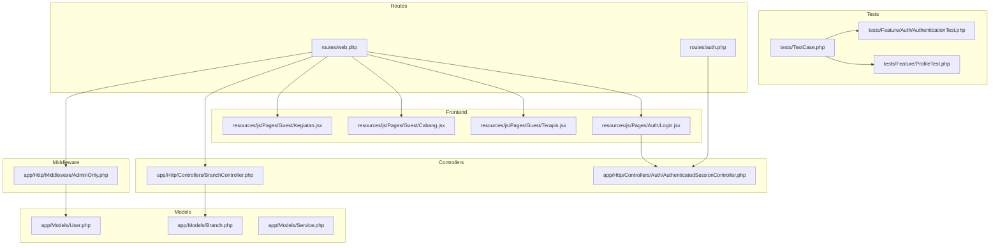
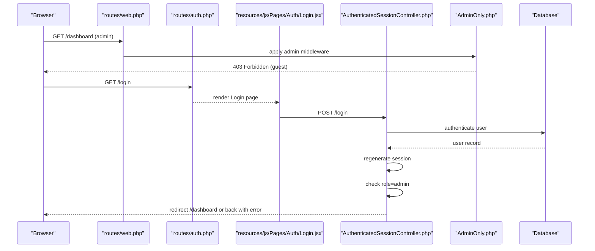
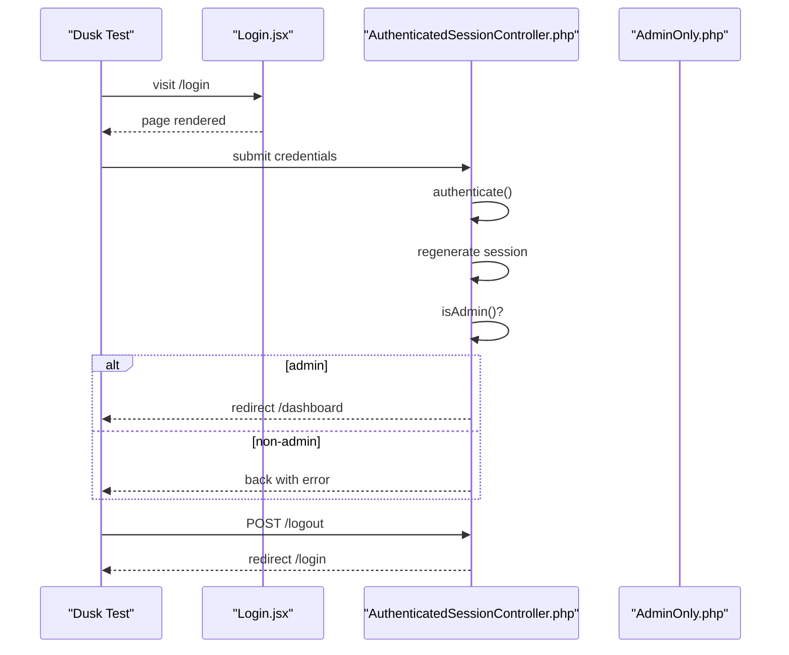
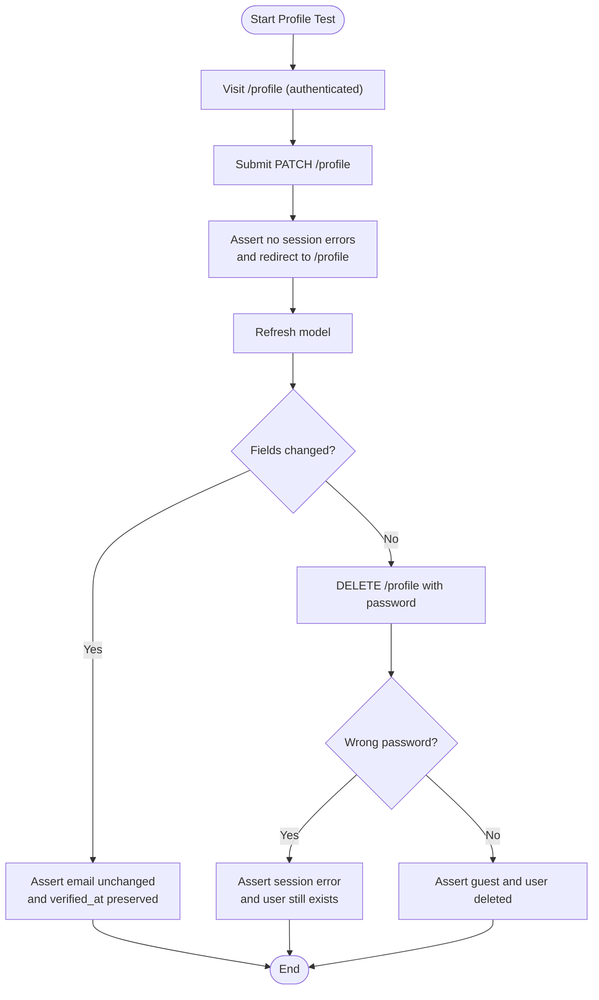
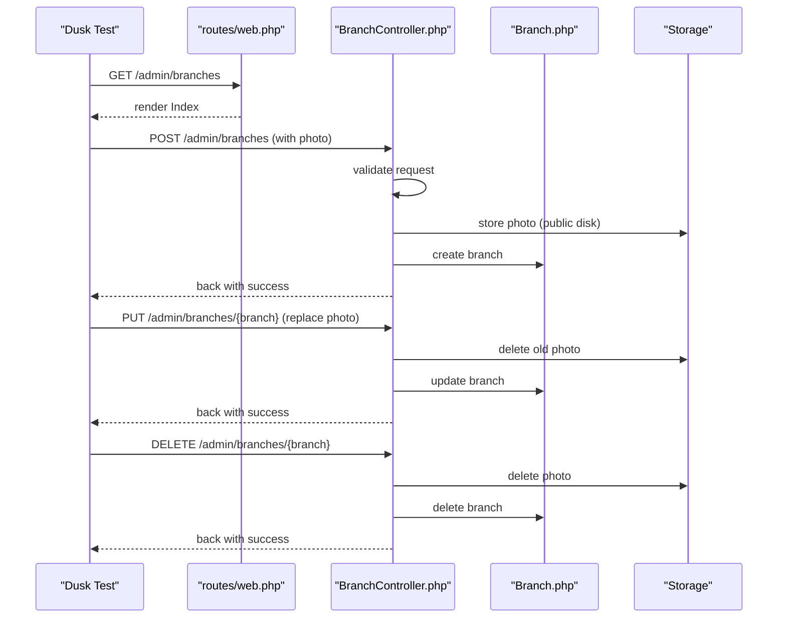
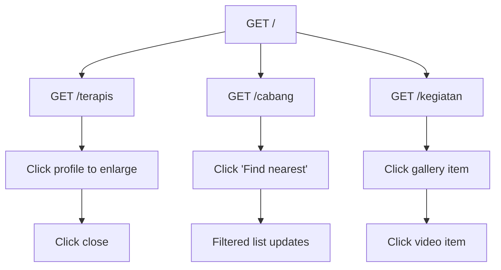
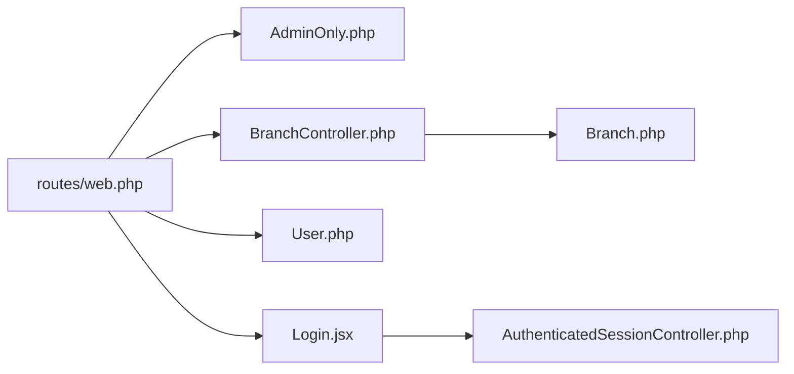

# Feature Testing

<cite>
**Referenced Files in This Document**
- [TestCase.php](file://tests/TestCase.php)
- [AuthenticationTest.php](file://tests/Feature/Auth/AuthenticationTest.php)
- [ProfileTest.php](file://tests/Feature/ProfileTest.php)
- [web.php](file://routes/web.php)
- [auth.php](file://routes/auth.php)
- [AuthenticatedSessionController.php](file://app/Http/Controllers/Auth/AuthenticatedSessionController.php)
- [AdminOnly.php](file://app/Http/Middleware/AdminOnly.php)
- [User.php](file://app/Models/User.php)
- [BranchController.php](file://app/Http/Controllers/BranchController.php)
- [Branch.php](file://app/Models/Branch.php)
- [Service.php](file://app/Models/Service.php)
- [Login.jsx](file://resources/js/Pages/Auth/Login.jsx)
- [Terapis.jsx](file://resources/js/Pages/Guest/Terapis.jsx)
- [Cabang.jsx](file://resources/js/Pages/Guest/Cabang.jsx)
- [Kegiatan.jsx](file://resources/js/Pages/Guest/Kegiatan.jsx)
</cite>

## Table of Contents
1. [Introduction](#introduction)
2. [Project Structure](#project-structure)
3. [Core Components](#core-components)
4. [Architecture Overview](#architecture-overview)
5. [Detailed Component Analysis](#detailed-component-analysis)
6. [Dependency Analysis](#dependency-analysis)
7. [Performance Considerations](#performance-considerations)
8. [Troubleshooting Guide](#troubleshooting-guide)
9. [Conclusion](#conclusion)
10. [Appendices](#appendices)

## Introduction
This document provides comprehensive feature testing guidance for the EDUfa Laravel application. It focuses on testing user workflows and end-to-end scenarios using Laravel Dusk or browser testing tools. Coverage includes authentication flows, form submissions, navigation, complex business processes (admin content management), database transactions, session handling, flash messages, email notifications, file uploads, external service integrations, and admin panel functionality.

## Project Structure
The application follows a classic Laravel architecture with Inertia.js for a single-page feel on the frontend. Feature tests reside under the tests/Feature directory and leverage Laravel’s built-in database refresh trait to isolate test state. Routes define both guest/admin surfaces and controller actions for admin content management.

**Diagram sources**
- [web.php:1-137](file://routes/web.php#L1-L137)
- [auth.php:1-44](file://routes/auth.php#L1-L44)
- [AuthenticatedSessionController.php:1-58](file://app/Http/Controllers/Auth/AuthenticatedSessionController.php#L1-L58)
- [AdminOnly.php:1-25](file://app/Http/Middleware/AdminOnly.php#L1-L25)
- [User.php:1-47](file://app/Models/User.php#L1-L47)
- [BranchController.php:1-88](file://app/Http/Controllers/BranchController.php#L1-L88)
- [Branch.php:1-36](file://app/Models/Branch.php#L1-L36)
- [Service.php:1-15](file://app/Models/Service.php#L1-L15)
- [Login.jsx:1-204](file://resources/js/Pages/Auth/Login.jsx#L1-L204)
- [Terapis.jsx:1-342](file://resources/js/Pages/Guest/Terapis.jsx#L1-L342)
- [Cabang.jsx:1-393](file://resources/js/Pages/Guest/Cabang.jsx#L1-L393)
- [Kegiatan.jsx:1-376](file://resources/js/Pages/Guest/Kegiatan.jsx#L1-L376)

**Section sources**
- [web.php:1-137](file://routes/web.php#L1-L137)
- [auth.php:1-44](file://routes/auth.php#L1-L44)
- [TestCase.php:1-11](file://tests/TestCase.php#L1-L11)

## Core Components
- Test base class: Provides shared setup for feature tests.
- Authentication tests: Validate login screen rendering, successful login, invalid credentials, and logout.
- Profile tests: Validate profile page access, updates, email verification behavior, account deletion, and password validation.
- Admin-only middleware: Restricts admin routes to authorized users.
- Admin controllers: Handle CRUD operations for branches and other admin resources.
- Frontend pages: Provide the UI for login and admin workflows.

Key testing patterns:
- Use RefreshDatabase to rollback the database after each test.
- Use actingAs to simulate logged-in users.
- Assert redirects, session flashes, and model state changes.
- Validate frontend interactions via Dusk selectors mapped to Inertia-rendered components.

**Section sources**
- [TestCase.php:1-11](file://tests/TestCase.php#L1-L11)
- [AuthenticationTest.php:1-55](file://tests/Feature/Auth/AuthenticationTest.php#L1-L55)
- [ProfileTest.php:1-100](file://tests/Feature/ProfileTest.php#L1-L100)
- [AdminOnly.php:1-25](file://app/Http/Middleware/AdminOnly.php#L1-L25)

## Architecture Overview
The application uses Inertia to render pages server-side while enabling client-side interactivity. Authentication routes are gated by middleware, and admin routes require both auth and admin permissions. Controllers coordinate with models and storage for uploads.

**Diagram sources**
- [web.php:68-80](file://routes/web.php#L68-L80)
- [auth.php:13-42](file://routes/auth.php#L13-L42)
- [Login.jsx:1-204](file://resources/js/Pages/Auth/Login.jsx#L1-L204)
- [AuthenticatedSessionController.php:18-57](file://app/Http/Controllers/Auth/AuthenticatedSessionController.php#L18-L57)
- [AdminOnly.php:16-23](file://app/Http/Middleware/AdminOnly.php#L16-L23)

## Detailed Component Analysis

### Authentication Flow Testing
Objective: Validate login UI rendering, successful admin login, role checks, and logout behavior.

Recommended Dusk steps:
- Navigate to the login page.
- Fill email and password fields.
- Submit the form.
- Assert redirect to dashboard or error message presence.
- Logout and assert redirect to home.

Validation points:
- Status code assertions for rendered login page.
- Session assertions for authenticated/guest state.
- Role-based redirect or error assertion in controller.

**Diagram sources**
- [Login.jsx:17-20](file://resources/js/Pages/Auth/Login.jsx#L17-L20)
- [AuthenticatedSessionController.php:28-42](file://app/Http/Controllers/Auth/AuthenticatedSessionController.php#L28-L42)
- [AdminOnly.php:18-20](file://app/Http/Middleware/AdminOnly.php#L18-L20)

**Section sources**
- [AuthenticationTest.php:13-53](file://tests/Feature/Auth/AuthenticationTest.php#L13-L53)
- [AuthenticatedSessionController.php:18-57](file://app/Http/Controllers/Auth/AuthenticatedSessionController.php#L18-L57)
- [auth.php:15-42](file://routes/auth.php#L15-L42)

### Profile Management Testing
Objective: Validate profile edit page access, update form submission, email verification behavior, and account deletion.

Recommended Dusk steps:
- Visit profile edit page while authenticated.
- Submit update form with valid data.
- Assert no session errors and redirect to profile.
- Refresh model and assert persisted changes.
- Attempt delete with wrong password and assert error and retention of user.

Validation points:
- SessionHasNoErrors and redirect assertions.
- Model refresh and field equality checks.
- Guest and null user assertions after deletion.

**Diagram sources**
- [ProfileTest.php:13-98](file://tests/Feature/ProfileTest.php#L13-L98)
- [web.php:127-134](file://routes/web.php#L127-L134)

**Section sources**
- [ProfileTest.php:13-98](file://tests/Feature/ProfileTest.php#L13-L98)
- [web.php:127-134](file://routes/web.php#L127-L134)

### Admin Panel Functionality Testing
Objective: Validate admin dashboard access, branch listing, and branch creation/update/delete with file upload.

Recommended Dusk steps:
- Access /dashboard as admin.
- Navigate to admin branches index.
- Submit branch creation form with optional photo.
- Assert success flash and listing update.
- Edit branch and replace photo.
- Delete branch and confirm media cleanup.
- Assert success flash and removal.

Validation points:
- Middleware guard prevents unauthorized access.
- Controller validates inputs and handles uploads.
- Storage cleanup on update/delete for local files.

**Diagram sources**
- [web.php:86-104](file://routes/web.php#L86-L104)
- [BranchController.php:27-86](file://app/Http/Controllers/BranchController.php#L27-L86)
- [Branch.php:23-34](file://app/Models/Branch.php#L23-L34)

**Section sources**
- [web.php:68-125](file://routes/web.php#L68-L125)
- [BranchController.php:17-86](file://app/Http/Controllers/BranchController.php#L17-L86)
- [Branch.php:12-34](file://app/Models/Branch.php#L12-L34)

### Navigation Testing
Objective: Validate smooth navigation across guest pages and admin sections.

Recommended Dusk steps:
- Navigate from home to therapist profiles, branches, and activities galleries.
- Click interactive elements (e.g., “Find nearest branch”, “Open in Maps”).
- Assert page content updates and modal interactions.

Validation points:
- Route names and dynamic links.
- Frontend component behavior for search, geolocation, and modals.

**Diagram sources**
- [web.php:51-66](file://routes/web.php#L51-L66)
- [Terapis.jsx:200-338](file://resources/js/Pages/Guest/Terapis.jsx#L200-L338)
- [Cabang.jsx:60-95](file://resources/js/Pages/Guest/Cabang.jsx#L60-L95)
- [Kegiatan.jsx:52-197](file://resources/js/Pages/Guest/Kegiatan.jsx#L52-L197)

**Section sources**
- [web.php:51-66](file://routes/web.php#L51-L66)
- [Terapis.jsx:195-338](file://resources/js/Pages/Guest/Terapis.jsx#L195-L338)
- [Cabang.jsx:55-95](file://resources/js/Pages/Guest/Cabang.jsx#L55-L95)
- [Kegiatan.jsx:52-197](file://resources/js/Pages/Guest/Kegiatan.jsx#L52-L197)

### Database Transaction Testing
Guidelines:
- Use RefreshDatabase in feature tests to ensure clean state per test.
- For complex sequences, wrap related assertions in a single test method to maintain transaction isolation.
- Use factories to create deterministic records and assert cascading effects (e.g., branch photo cleanup).

**Section sources**
- [AuthenticationTest.php:11](file://tests/Feature/Auth/AuthenticationTest.php#L11)
- [ProfileTest.php:11](file://tests/Feature/ProfileTest.php#L11)
- [BranchController.php:79-85](file://app/Http/Controllers/BranchController.php#L79-L85)

### Session Handling and Flash Messages
Guidelines:
- Assert session flashes after create/update/delete actions in admin controllers.
- Validate redirect behavior and success/error messages in Dusk tests.
- For authentication, assert guest/authenticated state transitions.

**Section sources**
- [BranchController.php:44](file://app/Http/Controllers/BranchController.php#L44)
- [BranchController.php:71](file://app/Http/Controllers/BranchController.php#L71)
- [BranchController.php:85](file://app/Http/Controllers/BranchController.php#L85)
- [AuthenticatedSessionController.php:48-57](file://app/Http/Controllers/Auth/AuthenticatedSessionController.php#L48-L57)

### Email Notifications Testing
Guidelines:
- Use Laravel’s built-in notification testing helpers to assert notification dispatch.
- For password reset and email verification, stub or intercept mailer in tests.
- Validate route availability and form submission for password reset and verification prompts.

**Section sources**
- [auth.php:20-31](file://routes/auth.php#L20-L31)

### File Uploads Testing
Guidelines:
- Use Dusk file upload selectors targeting input[type=file].
- Validate controller validation rules and storage disk usage.
- Assert success flash and asset URL resolution via model accessors.

**Section sources**
- [BranchController.php:35](file://app/Http/Controllers/BranchController.php#L35)
- [BranchController.php:58](file://app/Http/Controllers/BranchController.php#L58)
- [Branch.php:23-34](file://app/Models/Branch.php#L23-L34)

### External Service Integrations
Guidelines:
- Mock external APIs (e.g., Google Maps embed) in tests to avoid flakiness.
- Stub route generation and asset URLs for uploaded media.
- Validate that fallbacks occur when external URLs are provided.

**Section sources**
- [Cabang.jsx:342-349](file://resources/js/Pages/Guest/Cabang.jsx#L342-L349)
- [Branch.php:29-33](file://app/Models/Branch.php#L29-L33)

### Service Booking Workflow (Conceptual)
Note: No dedicated booking controller or model was found. To test a booking scenario:
- Define a Service model and controller actions.
- Add routes for listing services and submitting bookings.
- Implement validation, session handling, and flash messaging.
- Use Dusk to navigate to service pages, submit forms, and assert outcomes.

[No sources needed since this section proposes a conceptual extension]

## Dependency Analysis
The following diagram highlights key dependencies among routes, controllers, middleware, and models involved in admin workflows.

**Diagram sources**
- [web.php:68-125](file://routes/web.php#L68-L125)
- [AdminOnly.php:16-23](file://app/Http/Middleware/AdminOnly.php#L16-L23)
- [BranchController.php:17-86](file://app/Http/Controllers/BranchController.php#L17-L86)
- [Branch.php:12-34](file://app/Models/Branch.php#L12-L34)
- [User.php:32-45](file://app/Models/User.php#L32-L45)
- [Login.jsx:17-20](file://resources/js/Pages/Auth/Login.jsx#L17-L20)
- [AuthenticatedSessionController.php:28-42](file://app/Http/Controllers/Auth/AuthenticatedSessionController.php#L28-L42)

**Section sources**
- [web.php:68-125](file://routes/web.php#L68-L125)
- [AdminOnly.php:16-23](file://app/Http/Middleware/AdminOnly.php#L16-L23)
- [BranchController.php:17-86](file://app/Http/Controllers/BranchController.php#L17-L86)
- [Branch.php:12-34](file://app/Models/Branch.php#L12-L34)
- [User.php:32-45](file://app/Models/User.php#L32-L45)
- [Login.jsx:17-20](file://resources/js/Pages/Auth/Login.jsx#L17-L20)
- [AuthenticatedSessionController.php:28-42](file://app/Http/Controllers/Auth/AuthenticatedSessionController.php#L28-L42)

## Performance Considerations
- Prefer lightweight assertions in Dusk tests to reduce flakiness.
- Use minimal DOM selectors and avoid brittle XPath queries.
- Group related assertions in a single test to minimize repeated navigation.
- Cache static assets during CI runs to speed up page loads.

## Troubleshooting Guide
Common issues and resolutions:
- Unauthorized access to admin routes: Ensure admin middleware is applied and user has appropriate role.
- Upload failures: Verify storage disk permissions and validation rules.
- Session flashes not appearing: Confirm controller returns Redirect::back() with flash data.
- Geolocation errors: Handle browser permission prompts and network failures gracefully in tests.

**Section sources**
- [AdminOnly.php:18-20](file://app/Http/Middleware/AdminOnly.php#L18-L20)
- [BranchController.php:35](file://app/Http/Controllers/BranchController.php#L35)
- [BranchController.php:44](file://app/Http/Controllers/BranchController.php#L44)

## Conclusion
This guide outlines a comprehensive strategy for feature testing in EDUfa, covering authentication, profile management, admin workflows, navigation, uploads, and session handling. By combining unit-like assertions with Dusk-driven end-to-end flows, teams can reliably validate user journeys and admin operations while maintaining test isolation and clarity.

## Appendices
- Use RefreshDatabase in all feature tests to ensure database isolation.
- Map Dusk selectors to Inertia-rendered elements and form fields.
- Leverage model accessors for asset URLs and computed attributes.
- Keep frontend components modular to simplify targeted testing.