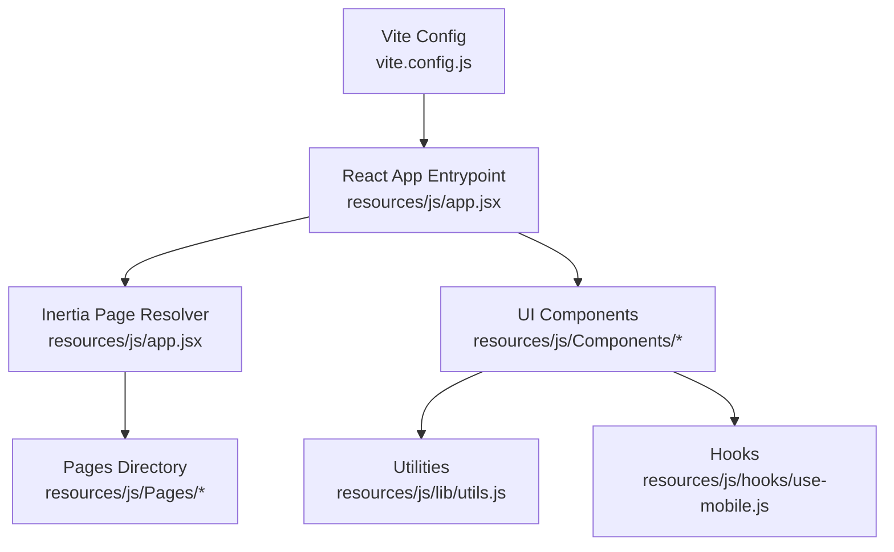
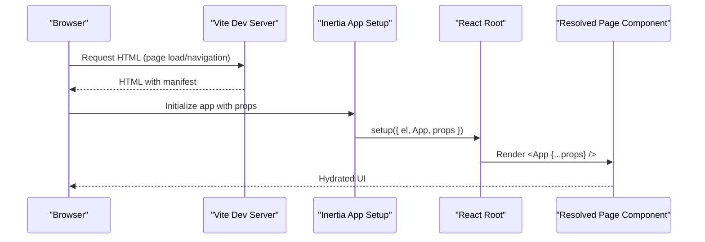
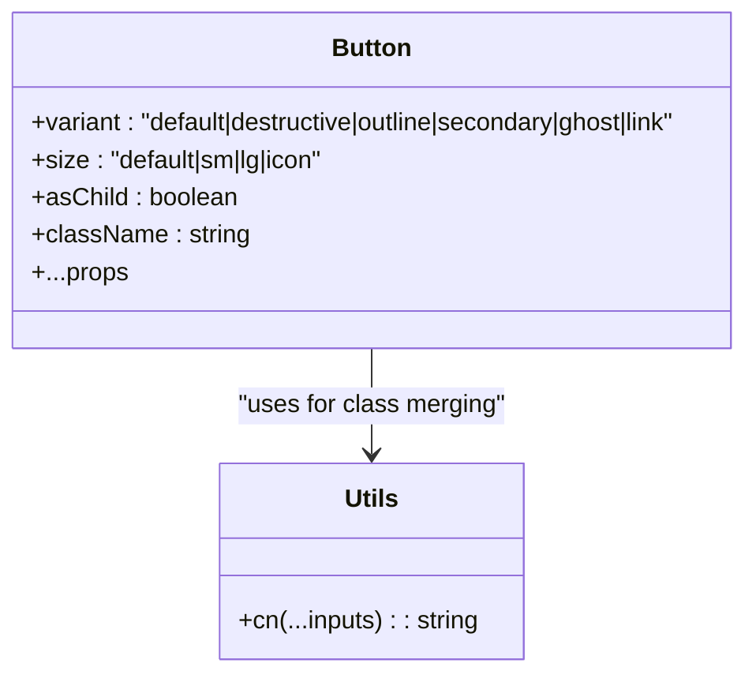
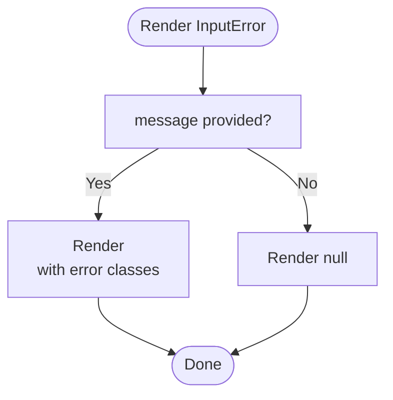
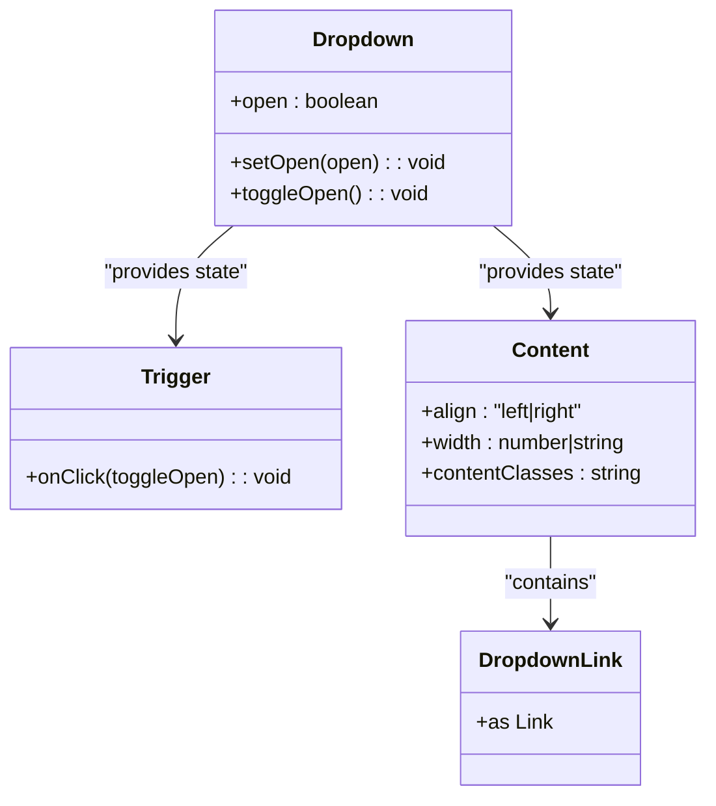
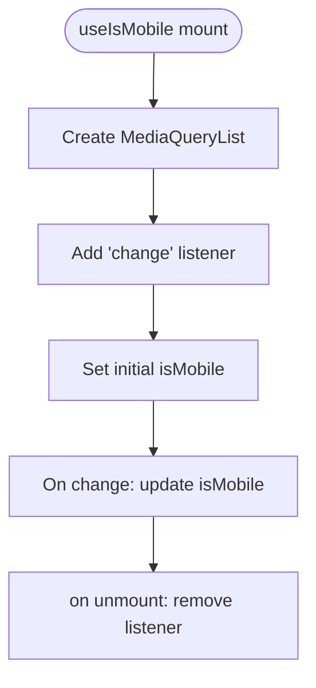
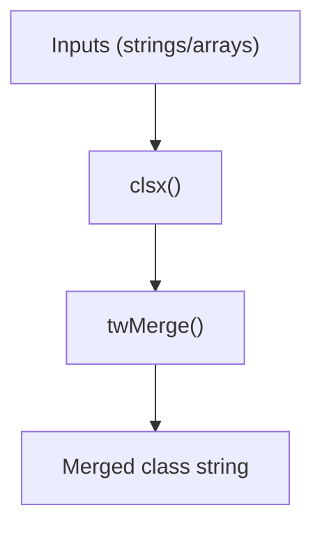
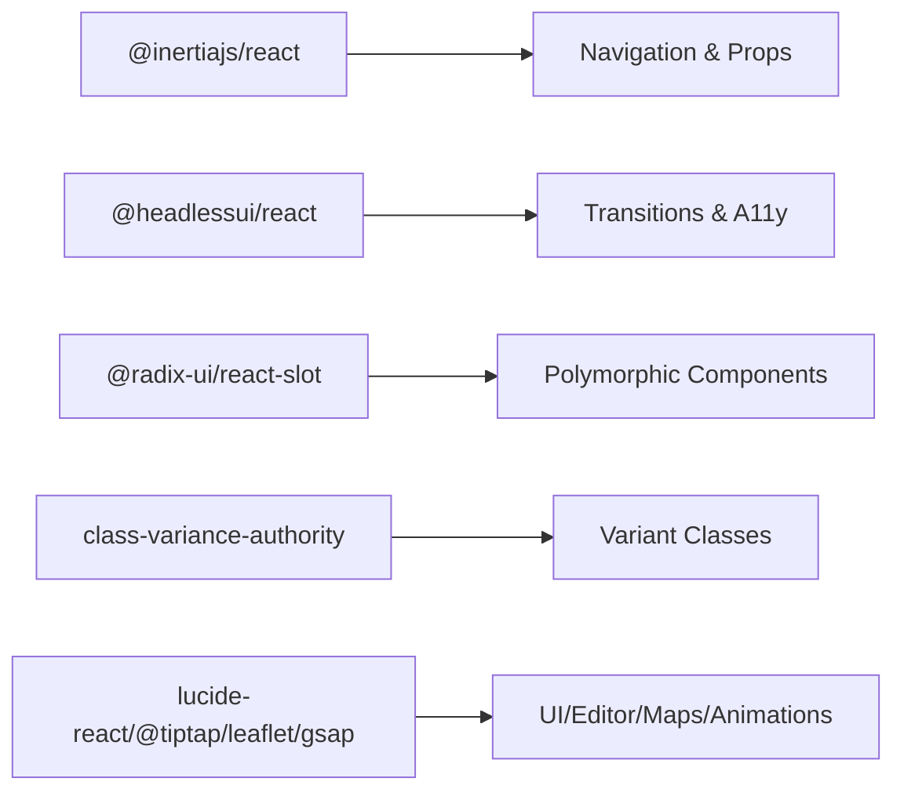

# Frontend Testing

<cite>
**Referenced Files in This Document**
- [package.json](file://package.json)
- [vite.config.js](file://vite.config.js)
- [resources/js/app.jsx](file://resources/js/app.jsx)
- [resources/js/Components/ui/button.jsx](file://resources/js/Components/ui/button.jsx)
- [resources/js/Components/InputError.jsx](file://resources/js/Components/InputError.jsx)
- [resources/js/Components/Dropdown.jsx](file://resources/js/Components/Dropdown.jsx)
- [resources/js/hooks/use-mobile.js](file://resources/js/hooks/use-mobile.js)
- [resources/js/lib/utils.js](file://resources/js/lib/utils.js)
</cite>

## Table of Contents
1. [Introduction](#introduction)
2. [Project Structure](#project-structure)
3. [Core Components](#core-components)
4. [Architecture Overview](#architecture-overview)
5. [Detailed Component Analysis](#detailed-component-analysis)
6. [Dependency Analysis](#dependency-analysis)
7. [Performance Considerations](#performance-considerations)
8. [Troubleshooting Guide](#troubleshooting-guide)
9. [Conclusion](#conclusion)
10. [Appendices](#appendices)

## Introduction
This document provides comprehensive frontend testing strategies for EDUfa’s React application. It focuses on testing React components using React Testing Library and Jest, with special attention to Inertia.js integration, form validation, state management, animations, responsive design, accessibility, custom hooks, context providers, and component composition. It also addresses SPA-specific challenges such as client-side routing and page transitions.

## Project Structure
EDUfa’s frontend is a React application bootstrapped via Vite and integrated with Inertia.js for server-driven navigation. The application entrypoint resolves pages dynamically and mounts the React root. UI primitives and shared components live under resources/js/Components, while reusable utilities and hooks reside under resources/js/lib and resources/js/hooks respectively.

**Diagram sources**
- [vite.config.js:1-14](file://vite.config.js#L1-L14)
- [resources/js/app.jsx:1-26](file://resources/js/app.jsx#L1-L26)

**Section sources**
- [vite.config.js:1-14](file://vite.config.js#L1-L14)
- [resources/js/app.jsx:1-26](file://resources/js/app.jsx#L1-L26)

## Core Components
Key areas to test include:
- UI primitives and layout components (e.g., Button, InputError, Dropdown)
- Hooks that encapsulate responsive behavior and state
- Utilities that merge Tailwind classes
- Inertia-powered page rendering and navigation

Recommended testing categories:
- Rendering and prop validation for UI components
- Interaction testing for interactive components (e.g., Dropdown trigger/content)
- Form validation and submission flows
- State management via context providers
- Accessibility attributes and keyboard navigation
- Responsive behavior using media queries
- Animations and transitions (Headless UI transitions)
- SPA routing and page transitions via Inertia

**Section sources**
- [resources/js/Components/ui/button.jsx:1-49](file://resources/js/Components/ui/button.jsx#L1-L49)
- [resources/js/Components/InputError.jsx:1-11](file://resources/js/Components/InputError.jsx#L1-L11)
- [resources/js/Components/Dropdown.jsx:1-108](file://resources/js/Components/Dropdown.jsx#L1-L108)
- [resources/js/hooks/use-mobile.js:1-20](file://resources/js/hooks/use-mobile.js#L1-L20)
- [resources/js/lib/utils.js:1-7](file://resources/js/lib/utils.js#L1-L7)

## Architecture Overview
The frontend uses Inertia.js to render React pages resolved by Laravel Vite. The setup function mounts the App shell with props passed from the server, enabling seamless SPA-like navigation while preserving server-rendered contexts.

**Diagram sources**
- [resources/js/app.jsx:10-25](file://resources/js/app.jsx#L10-L25)

**Section sources**
- [resources/js/app.jsx:1-26](file://resources/js/app.jsx#L1-L26)

## Detailed Component Analysis

### Button Component
The Button primitive demonstrates variant and size styling via class variance authority and Radix UI’s Slot pattern. Tests should verify:
- Variant and size classes apply correctly
- Forwarded ref and asChild behavior
- Disabled state and focus-visible styles

**Diagram sources**
- [resources/js/Components/ui/button.jsx:36-48](file://resources/js/Components/ui/button.jsx#L36-L48)
- [resources/js/lib/utils.js:4-6](file://resources/js/lib/utils.js#L4-L6)

**Section sources**
- [resources/js/Components/ui/button.jsx:1-49](file://resources/js/Components/ui/button.jsx#L1-L49)
- [resources/js/lib/utils.js:1-7](file://resources/js/lib/utils.js#L1-L7)

### InputError Component
A minimal component that renders an error message when present. Tests should verify:
- Conditional rendering based on message presence
- Prop forwarding and additional classes

**Diagram sources**
- [resources/js/Components/InputError.jsx:1-11](file://resources/js/Components/InputError.jsx#L1-L11)

**Section sources**
- [resources/js/Components/InputError.jsx:1-11](file://resources/js/Components/InputError.jsx#L1-L11)

### Dropdown Component (Context + Transitions)
The Dropdown composes a context provider with three parts: Trigger, Content, and DropdownLink. It integrates Headless UI transitions and Inertia Link. Tests should cover:
- Context propagation and state toggling
- Click-outside behavior and backdrop click-to-close
- Alignment and width variants
- Transition visibility and animation lifecycle
- Keyboard accessibility and focus management

**Diagram sources**
- [resources/js/Components/Dropdown.jsx:7-19](file://resources/js/Components/Dropdown.jsx#L7-L19)
- [resources/js/Components/Dropdown.jsx:21-36](file://resources/js/Components/Dropdown.jsx#L21-L36)
- [resources/js/Components/Dropdown.jsx:38-87](file://resources/js/Components/Dropdown.jsx#L38-L87)
- [resources/js/Components/Dropdown.jsx:89-101](file://resources/js/Components/Dropdown.jsx#L89-L101)

**Section sources**
- [resources/js/Components/Dropdown.jsx:1-108](file://resources/js/Components/Dropdown.jsx#L1-L108)

### useIsMobile Hook
A custom hook that tracks viewport width against a mobile breakpoint and updates on media query change. Tests should verify:
- Initial detection after mount
- Correct updates on resize/change events
- Cleanup of event listeners

**Diagram sources**
- [resources/js/hooks/use-mobile.js:5-19](file://resources/js/hooks/use-mobile.js#L5-L19)

**Section sources**
- [resources/js/hooks/use-mobile.js:1-20](file://resources/js/hooks/use-mobile.js#L1-L20)

### Utility: cn
The cn utility merges Tailwind classes using clsx and tailwind-merge. Tests should verify:
- Class deduplication and precedence
- String and array inputs handling

**Diagram sources**
- [resources/js/lib/utils.js:4-6](file://resources/js/lib/utils.js#L4-L6)

**Section sources**
- [resources/js/lib/utils.js:1-7](file://resources/js/lib/utils.js#L1-L7)

## Dependency Analysis
External libraries and their roles in testing:
- @inertiajs/react: Enables page navigation and props passing from server
- @headlessui/react: Provides Transition for animations and accessibility
- @radix-ui/react-slot: Enables polymorphic component behavior
- class-variance-authority: Manages variant classes for UI primitives
- lucide-react, @tiptap/react, leaflet, gsap/framer-motion: UI icons, editor, maps, and animations

**Diagram sources**
- [package.json:10-46](file://package.json#L10-L46)

**Section sources**
- [package.json:1-49](file://package.json#L1-L49)

## Performance Considerations
- Prefer shallow rendering for leaf components; deep render only when necessary
- Mock external effects (media queries, IntersectionObserver) to avoid flaky tests
- Use deterministic transitions and disable animations in tests where timing is not essential
- Limit DOM queries to visible elements to improve stability

## Troubleshooting Guide
Common testing pitfalls and remedies:
- Inertia page resolution: Ensure the resolver matches the Pages directory structure and glob pattern used by the app entrypoint
- Context providers: Wrap tests with the component’s Provider to ensure useContext reads the intended state
- Media queries: Use jsdom matchMedia polyfills or set window.innerWidth before mounting
- Transitions: Wait for enter/leave classes or use act to flush effects
- Form validation: Simulate user input and verify error messages appear/disappear as expected

## Conclusion
Testing EDUfa’s React frontend requires a balanced approach: validate component rendering and props, assert interactive behaviors via context and transitions, verify responsive logic with hooks, and ensure accessibility and animations behave as expected. Integrate Inertia-aware setups and mock external integrations to keep tests fast and reliable.

## Appendices
- Recommended test setup: React Testing Library + Jest + jsdom with @testing-library/jest-dom
- Environment variables: Configure Vite env for app name and ensure meta env usage mirrors runtime
- SPA routing: Test inertia-link clicks and confirm page transitions without full reloads