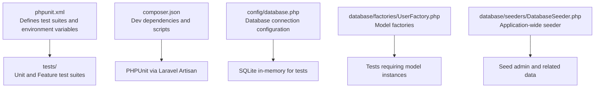
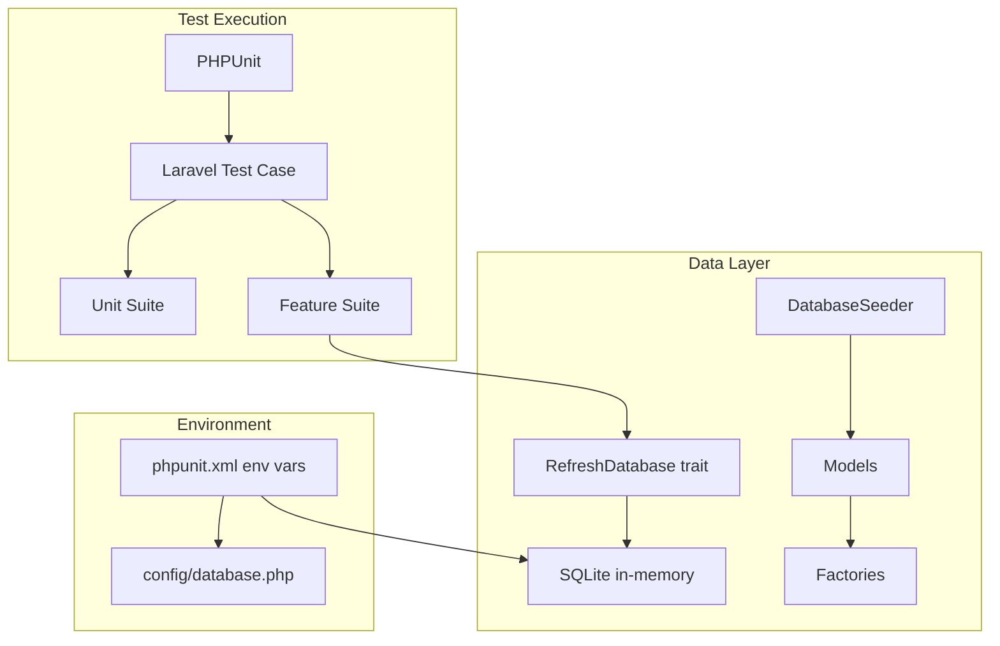
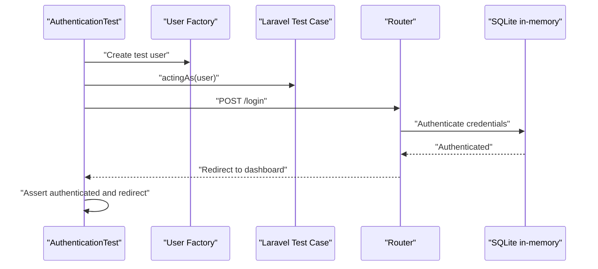
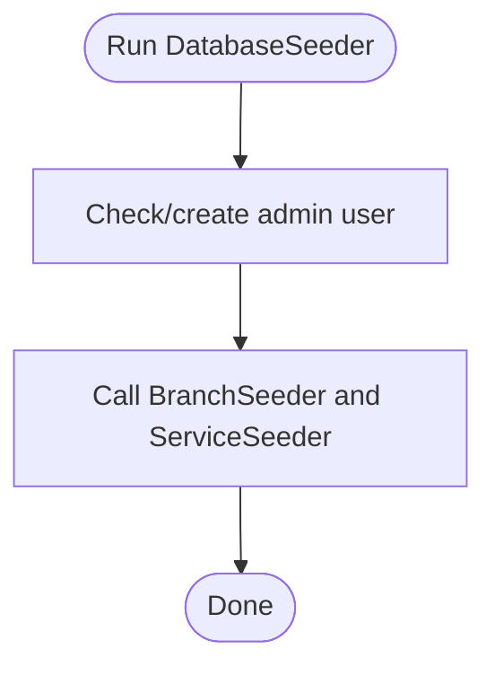
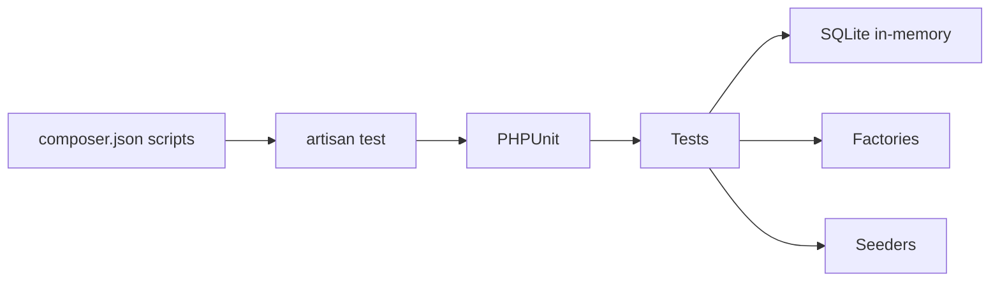

# Test Automation and CI/CD

<cite>
**Referenced Files in This Document**
- [phpunit.xml](file://phpunit.xml)
- [composer.json](file://composer.json)
- [tests/TestCase.php](file://tests/TestCase.php)
- [tests/Feature/Auth/AuthenticationTest.php](file://tests/Feature/Auth/AuthenticationTest.php)
- [tests/Feature/ExampleTest.php](file://tests/Feature/ExampleTest.php)
- [tests/Unit/ExampleTest.php](file://tests/Unit/ExampleTest.php)
- [database/seeders/DatabaseSeeder.php](file://database/seeders/DatabaseSeeder.php)
- [database/factories/UserFactory.php](file://database/factories/UserFactory.php)
- [config/database.php](file://config/database.php)
</cite>

## Table of Contents
1. [Introduction](#introduction)
2. [Project Structure](#project-structure)
3. [Core Components](#core-components)
4. [Architecture Overview](#architecture-overview)
5. [Detailed Component Analysis](#detailed-component-analysis)
6. [Dependency Analysis](#dependency-analysis)
7. [Performance Considerations](#performance-considerations)
8. [Troubleshooting Guide](#troubleshooting-guide)
9. [Conclusion](#conclusion)
10. [Appendices](#appendices)

## Introduction
This document provides a comprehensive guide to setting up test automation and continuous integration for EDUfa. It covers PHPUnit configuration, test environment isolation, database seeding for tests, and practical guidance for CI/CD pipelines. It also includes strategies for performance testing, memory leak detection, test suite optimization, test data management, environment variables and secrets handling, debugging CI failures, and maintaining test reliability across environments.

## Project Structure
EDUfa follows a standard Laravel project layout with dedicated directories for tests, factories, and seeders. The testing stack leverages PHPUnit and Laravel’s testing helpers, with environment-specific configuration via environment variables.

**Diagram sources**
- [phpunit.xml:1-37](file://phpunit.xml#L1-L37)
- [composer.json:17-25](file://composer.json#L17-L25)
- [config/database.php:20-45](file://config/database.php#L20-L45)
- [database/factories/UserFactory.php:13-46](file://database/factories/UserFactory.php#L13-L46)
- [database/seeders/DatabaseSeeder.php:9-32](file://database/seeders/DatabaseSeeder.php#L9-L32)

**Section sources**
- [phpunit.xml:1-37](file://phpunit.xml#L1-L37)
- [composer.json:17-25](file://composer.json#L17-L25)
- [config/database.php:20-45](file://config/database.php#L20-L45)
- [database/factories/UserFactory.php:13-46](file://database/factories/UserFactory.php#L13-L46)
- [database/seeders/DatabaseSeeder.php:9-32](file://database/seeders/DatabaseSeeder.php#L9-L32)

## Core Components
- PHPUnit configuration defines test suites, source inclusion, and environment variables tailored for testing.
- Composer dev dependencies include PHPUnit and related testing tools.
- Laravel base test case class provides shared testing utilities.
- Feature and unit tests demonstrate request-driven and isolated logic testing respectively.
- Factories and seeders supply deterministic test data and preconditions.

Key configuration highlights:
- Environment variables set during test runs include application environment, cache store, database driver/connection, mailer, queue, and session drivers.
- SQLite in-memory database is configured for fast, isolated tests.

**Section sources**
- [phpunit.xml:7-35](file://phpunit.xml#L7-L35)
- [composer.json:17-25](file://composer.json#L17-L25)
- [tests/TestCase.php:7-11](file://tests/TestCase.php#L7-L11)
- [tests/Feature/Auth/AuthenticationTest.php:9-55](file://tests/Feature/Auth/AuthenticationTest.php#L9-L55)
- [tests/Feature/ExampleTest.php:8-20](file://tests/Feature/ExampleTest.php#L8-L20)
- [tests/Unit/ExampleTest.php:7-17](file://tests/Unit/ExampleTest.php#L7-L17)
- [database/factories/UserFactory.php:13-46](file://database/factories/UserFactory.php#L13-L46)
- [database/seeders/DatabaseSeeder.php:9-32](file://database/seeders/DatabaseSeeder.php#L9-L32)

## Architecture Overview
The testing architecture centers around PHPUnit and Laravel’s testing helpers. Tests are grouped into Unit and Feature suites. Feature tests utilize database refresh traits and factories/seeders to establish controlled state. Environment variables ensure consistent and isolated test execution.

**Diagram sources**
- [phpunit.xml:7-35](file://phpunit.xml#L7-L35)
- [config/database.php:20-45](file://config/database.php#L20-L45)
- [database/seeders/DatabaseSeeder.php:9-32](file://database/seeders/DatabaseSeeder.php#L9-L32)
- [database/factories/UserFactory.php:13-46](file://database/factories/UserFactory.php#L13-L46)
- [tests/Feature/Auth/AuthenticationTest.php:9-55](file://tests/Feature/Auth/AuthenticationTest.php#L9-L55)

## Detailed Component Analysis

### PHPUnit Configuration and Test Suites
- Test suites: Unit and Feature directories are registered for discovery.
- Source inclusion: Application code under app/ is included for coverage analysis.
- Environment variables:
  - Application environment set to testing.
  - Maintenance, bcrypt rounds, broadcast, cache, database, mail, queue, session, and observability toggles optimized for tests.
  - Database configured to SQLite with in-memory database for speed and isolation.

Optimization opportunities:
- Add process isolation per test group to reduce cross-test interference.
- Enable parallel execution support via PHPUnit’s parallelization features when available.

**Section sources**
- [phpunit.xml:7-35](file://phpunit.xml#L7-L35)

### Laravel Base Test Case
- Extends the framework’s base test case to inherit common testing capabilities.
- Acts as a foundation for all tests in the suite.

**Section sources**
- [tests/TestCase.php:7-11](file://tests/TestCase.php#L7-L11)

### Feature Tests: Authentication Workflow
- Demonstrates rendering login screen, successful authentication, invalid credentials handling, and logout.
- Uses RefreshDatabase to reset the database between tests.
- Creates users via factories to avoid hard-coded credentials.

**Diagram sources**
- [tests/Feature/Auth/AuthenticationTest.php:9-55](file://tests/Feature/Auth/AuthenticationTest.php#L9-L55)
- [database/factories/UserFactory.php:13-46](file://database/factories/UserFactory.php#L13-L46)

**Section sources**
- [tests/Feature/Auth/AuthenticationTest.php:9-55](file://tests/Feature/Auth/AuthenticationTest.php#L9-L55)
- [database/factories/UserFactory.php:13-46](file://database/factories/UserFactory.php#L13-L46)

### Feature Tests: Basic Request Validation
- Validates a successful response from the homepage route.
- Demonstrates minimal feature test structure.

**Section sources**
- [tests/Feature/ExampleTest.php:8-20](file://tests/Feature/ExampleTest.php#L8-L20)

### Unit Tests: Isolated Logic
- Provides a baseline unit test example.
- Useful for validating pure functions or isolated logic without external dependencies.

**Section sources**
- [tests/Unit/ExampleTest.php:7-17](file://tests/Unit/ExampleTest.php#L7-L17)

### Database Seeding for Tests
- Seeds administrative user and related domain data.
- Uses environment variables for configurable credentials and attributes.
- Calls additional seeders for branches and services.

**Diagram sources**
- [database/seeders/DatabaseSeeder.php:9-32](file://database/seeders/DatabaseSeeder.php#L9-L32)

**Section sources**
- [database/seeders/DatabaseSeeder.php:9-32](file://database/seeders/DatabaseSeeder.php#L9-L32)

### Model Factories for Deterministic Data
- Generates realistic yet deterministic user records.
- Ensures consistent passwords across factory-generated users.
- Supports optional unverified email states.

**Section sources**
- [database/factories/UserFactory.php:13-46](file://database/factories/UserFactory.php#L13-L46)

### Database Configuration for Testing
- Default connection is SQLite.
- In-memory database for tests ensures speed and isolation.
- Foreign key constraint behavior can be tuned via environment variables.

**Section sources**
- [config/database.php:20-45](file://config/database.php#L20-L45)

## Dependency Analysis
- PHPUnit is declared as a development dependency and invoked via Laravel Artisan script.
- Composer scripts orchestrate setup, development, and testing tasks.
- Tests depend on Laravel’s testing framework and database refresh capabilities.

**Diagram sources**
- [composer.json:38-54](file://composer.json#L38-L54)
- [phpunit.xml:1-37](file://phpunit.xml#L1-L37)

**Section sources**
- [composer.json:17-25](file://composer.json#L17-L25)
- [composer.json:38-54](file://composer.json#L38-L54)
- [phpunit.xml:1-37](file://phpunit.xml#L1-L37)

## Performance Considerations
- Use SQLite in-memory database for tests to minimize I/O overhead.
- Leverage factories for lightweight, deterministic data generation.
- Apply RefreshDatabase trait judiciously; consider transaction-based rollbacks for faster resets when applicable.
- Group tests by suite to enable targeted execution and parallelization strategies.
- Keep test fixtures minimal and scoped to reduce setup time.
- Monitor memory usage during long-running test suites and refactor heavy fixtures.

[No sources needed since this section provides general guidance]

## Troubleshooting Guide
Common issues and remedies:
- Environment mismatch: Ensure APP_ENV is set to testing and database driver is SQLite with in-memory database.
- Slow tests: Switch to transaction rollbacks or reduce fixture complexity; avoid unnecessary migrations in tests.
- Authentication failures: Verify factory-generated passwords and email verification states.
- CI flakiness: Normalize environment variables across local and CI; avoid relying on ephemeral data or external services.

**Section sources**
- [phpunit.xml:20-35](file://phpunit.xml#L20-L35)
- [config/database.php:20-45](file://config/database.php#L20-L45)

## Conclusion
EDUfa’s testing setup leverages PHPUnit and Laravel’s testing ecosystem with environment-driven configuration and SQLite for fast, isolated tests. By combining factories, seeders, and disciplined environment management, teams can maintain reliable and efficient test suites. Extending this foundation with CI/CD pipelines, parallel execution, and robust secrets handling will further strengthen quality assurance.

[No sources needed since this section summarizes without analyzing specific files]

## Appendices

### CI/CD Pipeline Guidance (Conceptual)
- Trigger jobs on pull requests and pushes to main branch.
- Install PHP dependencies and build frontend assets.
- Run PHPUnit via Artisan script.
- Publish test artifacts and coverage reports.
- Enforce secrets via CI provider’s secret management.

[No sources needed since this section provides general guidance]

### Secrets and Environment Variables
- Store sensitive values in CI provider secrets and map to environment variables.
- Use environment-specific .env files locally and CI-specific variable injection in pipelines.
- Avoid committing secrets to version control.

[No sources needed since this section provides general guidance]