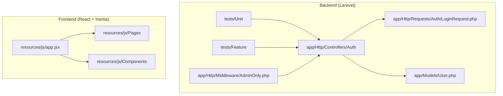
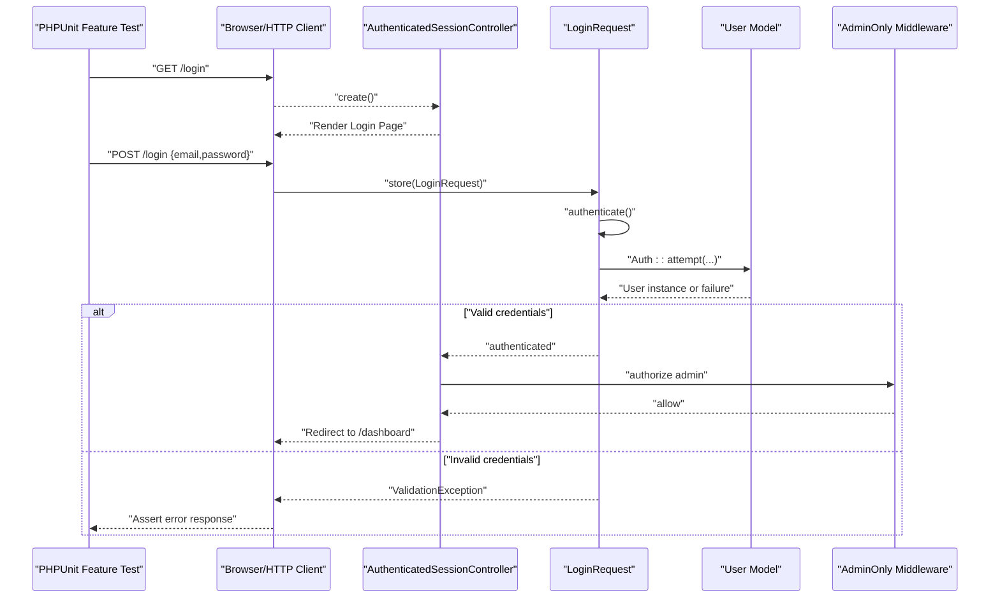
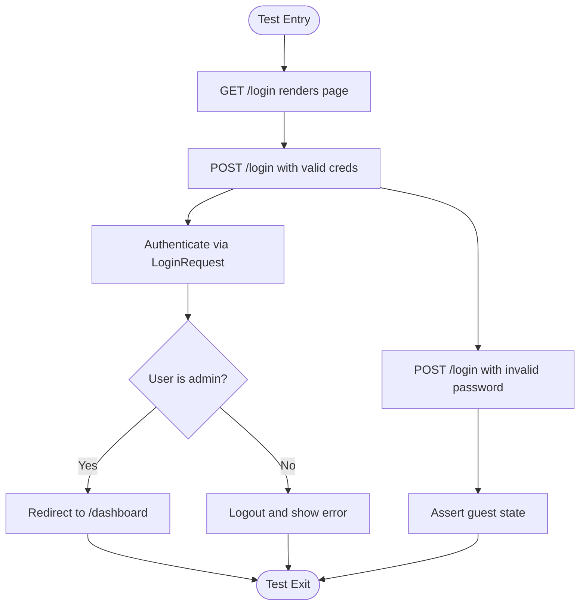
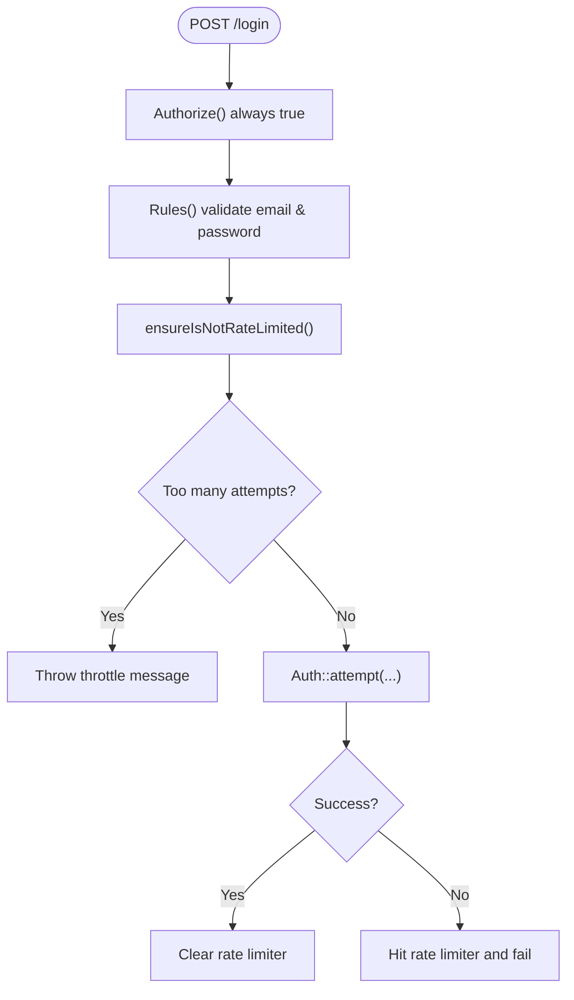
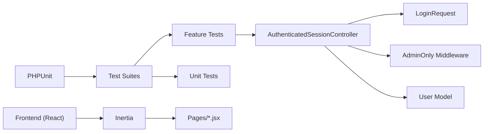

# Testing Strategy

<cite>
**Referenced Files in This Document**
- [phpunit.xml](file://phpunit.xml)
- [composer.json](file://composer.json)
- [package.json](file://package.json)
- [tests/TestCase.php](file://tests/TestCase.php)
- [tests/Unit/ExampleTest.php](file://tests/Unit/ExampleTest.php)
- [tests/Feature/ExampleTest.php](file://tests/Feature/ExampleTest.php)
- [tests/Feature/Auth/AuthenticationTest.php](file://tests/Feature/Auth/AuthenticationTest.php)
- [app/Http/Controllers/Auth/AuthenticatedSessionController.php](file://app/Http/Controllers/Auth/AuthenticatedSessionController.php)
- [app/Http/Requests/Auth/LoginRequest.php](file://app/Http/Requests/Auth/LoginRequest.php)
- [app/Http/Middleware/AdminOnly.php](file://app/Http/Middleware/AdminOnly.php)
- [app/Models/User.php](file://app/Models/User.php)
- [resources/js/app.jsx](file://resources/js/app.jsx)
</cite>

## Table of Contents
1. [Introduction](#introduction)
2. [Project Structure](#project-structure)
3. [Core Components](#core-components)
4. [Architecture Overview](#architecture-overview)
5. [Detailed Component Analysis](#detailed-component-analysis)
6. [Dependency Analysis](#dependency-analysis)
7. [Performance Considerations](#performance-considerations)
8. [Troubleshooting Guide](#troubleshooting-guide)
9. [Conclusion](#conclusion)
10. [Appendices](#appendices)

## Introduction
This document defines a comprehensive testing strategy for EDUfa, focusing on quality assurance and testing methodologies across backend, frontend, and API layers. It covers unit testing with PHPUnit, feature testing for user workflows, frontend testing with React Testing Library, API and authentication testing, CI-ready automation, best practices for Laravel controllers and React components, performance and load testing considerations, and practical debugging techniques for test environments.

## Project Structure
The repository follows a standard Laravel application layout with dedicated testing suites:
- Backend PHP tests reside under tests/Unit and tests/Feature.
- Frontend React pages and components are under resources/js/Pages and resources/js/Components.
- Test configuration is centralized via phpunit.xml and Composer scripts.

**Diagram sources**
- [phpunit.xml:1-37](file://phpunit.xml#L1-L37)
- [composer.json:17-24](file://composer.json#L17-L24)
- [package.json:1-49](file://package.json#L1-L49)
- [resources/js/app.jsx:1-26](file://resources/js/app.jsx#L1-L26)

**Section sources**
- [phpunit.xml:1-37](file://phpunit.xml#L1-L37)
- [composer.json:17-24](file://composer.json#L17-L24)
- [package.json:1-49](file://package.json#L1-L49)

## Core Components
- PHPUnit configuration defines two test suites (Unit, Feature) and environment overrides for fast, isolated testing (SQLite in-memory, array caches, sync queues).
- Composer scripts provide a unified test command invoking Laravel’s test runner.
- Basic test scaffolding exists for Unit and Feature layers, with a real-world Feature test covering authentication flows.

Key implementation references:
- Test suite configuration and environment: [phpunit.xml:7-35](file://phpunit.xml#L7-L35)
- Test script invocation: [composer.json:51-54](file://composer.json#L51-L54)
- Base test case: [tests/TestCase.php:1-11](file://tests/TestCase.php#L1-L11)
- Unit test example: [tests/Unit/ExampleTest.php:1-17](file://tests/Unit/ExampleTest.php#L1-L17)
- Feature test example: [tests/Feature/ExampleTest.php:1-20](file://tests/Feature/ExampleTest.php#L1-L20)
- Authentication feature test: [tests/Feature/Auth/AuthenticationTest.php:1-55](file://tests/Feature/Auth/AuthenticationTest.php#L1-L55)

**Section sources**
- [phpunit.xml:1-37](file://phpunit.xml#L1-L37)
- [composer.json:51-54](file://composer.json#L51-L54)
- [tests/TestCase.php:1-11](file://tests/TestCase.php#L1-L11)
- [tests/Unit/ExampleTest.php:1-17](file://tests/Unit/ExampleTest.php#L1-L17)
- [tests/Feature/ExampleTest.php:1-20](file://tests/Feature/ExampleTest.php#L1-L20)
- [tests/Feature/Auth/AuthenticationTest.php:1-55](file://tests/Feature/Auth/AuthenticationTest.php#L1-L55)

## Architecture Overview
The testing architecture integrates Laravel’s HTTP test capabilities with React-based UI rendering via Inertia. Authentication and authorization logic are validated through controller actions, form requests, and middleware.

**Diagram sources**
- [tests/Feature/Auth/AuthenticationTest.php:20-31](file://tests/Feature/Auth/AuthenticationTest.php#L20-L31)
- [app/Http/Controllers/Auth/AuthenticatedSessionController.php:28-43](file://app/Http/Controllers/Auth/AuthenticatedSessionController.php#L28-L43)
- [app/Http/Requests/Auth/LoginRequest.php:41-54](file://app/Http/Requests/Auth/LoginRequest.php#L41-L54)
- [app/Models/User.php:32-45](file://app/Models/User.php#L32-L45)
- [app/Http/Middleware/AdminOnly.php:16-23](file://app/Http/Middleware/AdminOnly.php#L16-L23)

## Detailed Component Analysis

### Authentication Controller Testing
- Purpose: Validate login page rendering, successful login redirection, invalid credential handling, and logout behavior.
- Coverage areas: Route handling, session regeneration, role-based access enforcement, and redirect logic.
- Implementation references:
  - Controller action and redirect flow: [app/Http/Controllers/Auth/AuthenticatedSessionController.php:18-43](file://app/Http/Controllers/Auth/AuthenticatedSessionController.php#L18-L43)
  - Role checks and admin-only restriction: [app/Models/User.php:32-45](file://app/Models/User.php#L32-L45), [app/Http/Middleware/AdminOnly.php:16-23](file://app/Http/Middleware/AdminOnly.php#L16-L23)
  - Feature test assertions: [tests/Feature/Auth/AuthenticationTest.php:13-53](file://tests/Feature/Auth/AuthenticationTest.php#L13-L53)

**Diagram sources**
- [tests/Feature/Auth/AuthenticationTest.php:13-53](file://tests/Feature/Auth/AuthenticationTest.php#L13-L53)
- [app/Http/Controllers/Auth/AuthenticatedSessionController.php:28-43](file://app/Http/Controllers/Auth/AuthenticatedSessionController.php#L28-L43)
- [app/Http/Middleware/AdminOnly.php:16-23](file://app/Http/Middleware/AdminOnly.php#L16-L23)

**Section sources**
- [app/Http/Controllers/Auth/AuthenticatedSessionController.php:18-43](file://app/Http/Controllers/Auth/AuthenticatedSessionController.php#L18-L43)
- [app/Http/Middleware/AdminOnly.php:16-23](file://app/Http/Middleware/AdminOnly.php#L16-L23)
- [tests/Feature/Auth/AuthenticationTest.php:13-53](file://tests/Feature/Auth/AuthenticationTest.php#L13-L53)

### Login Request Validation Testing
- Purpose: Validate input rules, rate limiting, and credential attempt logic.
- Coverage areas: Email/password presence, throttling behavior, and exception messaging.
- Implementation references:
  - Validation rules and throttle enforcement: [app/Http/Requests/Auth/LoginRequest.php:28-77](file://app/Http/Requests/Auth/LoginRequest.php#L28-L77)
  - Authentication attempt and rate limiter integration: [app/Http/Requests/Auth/LoginRequest.php:41-54](file://app/Http/Requests/Auth/LoginRequest.php#L41-L54)

**Diagram sources**
- [app/Http/Requests/Auth/LoginRequest.php:18-77](file://app/Http/Requests/Auth/LoginRequest.php#L18-L77)

**Section sources**
- [app/Http/Requests/Auth/LoginRequest.php:28-77](file://app/Http/Requests/Auth/LoginRequest.php#L28-L77)

### User Model Accessors Testing
- Purpose: Validate role-based access helpers used by controllers and middleware.
- Coverage areas: isAdmin, isEditor, canAccessAdmin.
- Implementation references:
  - Role helpers: [app/Models/User.php:32-45](file://app/Models/User.php#L32-L45)

Best practice:
- Add unit tests asserting each helper returns expected booleans for different roles.

**Section sources**
- [app/Models/User.php:32-45](file://app/Models/User.php#L32-L45)

### Frontend Testing with React Testing Library
- Current state: No explicit frontend test files are present in the repository snapshot.
- Recommended approach:
  - Use React Testing Library for component isolation and user-centric assertions.
  - Prefer testing rendered UI behavior over implementation details.
  - Mock Inertia navigation and API fetches to isolate component logic.
  - Complement with integration tests using Laravel Dusk or Cypress for full-page flows.
- References for frontend stack:
  - Inertia bootstrapping and page resolution: [resources/js/app.jsx:10-25](file://resources/js/app.jsx#L10-L25)

Guidelines:
- Write small, focused tests for individual components.
- Use screen queries aligned with accessibility labels.
- Avoid testing internal component state; assert visible UI outcomes.

**Section sources**
- [resources/js/app.jsx:10-25](file://resources/js/app.jsx#L10-L25)

### API Testing Procedures
- Endpoint validation:
  - Use Laravel’s HTTP test methods to assert status codes, redirects, and JSON responses.
  - For Inertia-driven pages, assert rendered props and status transitions.
- Authentication testing:
  - Validate protected routes with and without credentials.
  - Assert rate-limiting behavior and error messages.
- References:
  - Feature test pattern: [tests/Feature/Auth/AuthenticationTest.php:13-53](file://tests/Feature/Auth/AuthenticationTest.php#L13-L53)
  - Controller and middleware: [app/Http/Controllers/Auth/AuthenticatedSessionController.php:28-43](file://app/Http/Controllers/Auth/AuthenticatedSessionController.php#L28-L43), [app/Http/Middleware/AdminOnly.php:16-23](file://app/Http/Middleware/AdminOnly.php#L16-L23)

**Section sources**
- [tests/Feature/Auth/AuthenticationTest.php:13-53](file://tests/Feature/Auth/AuthenticationTest.php#L13-L53)
- [app/Http/Controllers/Auth/AuthenticatedSessionController.php:28-43](file://app/Http/Controllers/Auth/AuthenticatedSessionController.php#L28-L43)
- [app/Http/Middleware/AdminOnly.php:16-23](file://app/Http/Middleware/AdminOnly.php#L16-L23)

### Test Automation Setup and Continuous Integration
- Local automation:
  - Composer script runs the test suite via Laravel Artisan.
  - PHPUnit configuration sets environment to testing and uses SQLite in-memory database.
- CI pipeline recommendations:
  - Install dependencies, generate APP_KEY, run migrations, and execute tests.
  - Cache Composer and npm dependencies between runs.
  - Separate jobs for Unit and Feature tests to parallelize execution.
- References:
  - Test script: [composer.json:51-54](file://composer.json#L51-L54)
  - PHPUnit env overrides: [phpunit.xml:20-35](file://phpunit.xml#L20-L35)

**Section sources**
- [composer.json:51-54](file://composer.json#L51-L54)
- [phpunit.xml:20-35](file://phpunit.xml#L20-L35)

### Testing Best Practices for Laravel Controllers and Models
- Controllers:
  - Keep controllers thin; delegate business logic to services or models.
  - Assert redirects, status codes, and inertia-rendered props.
  - Use actingAs for authenticated scenarios.
- Models:
  - Use factories and seeding for deterministic data.
  - Test helper methods and attribute casting.
- References:
  - Controller base class: [app/Http/Controllers/Controller.php:1-9](file://app/Http/Controllers/Controller.php#L1-L9)
  - User model helpers: [app/Models/User.php:32-45](file://app/Models/User.php#L32-L45)

**Section sources**
- [app/Http/Controllers/Controller.php:1-9](file://app/Http/Controllers/Controller.php#L1-L9)
- [app/Models/User.php:32-45](file://app/Models/User.php#L32-L45)

### Writing Effective Test Cases and Maintaining Coverage
- Focus on behavior, not implementation:
  - Describe user goals and expected outcomes.
- Use descriptive names and arrange tests with AAA (Arrange, Act, Assert).
- Maintain a high signal-to-noise ratio by avoiding redundant assertions.
- Coverage targets:
  - Aim for >80% statement coverage in critical paths (authentication, admin middleware).
  - Prioritize feature tests for user journeys and unit tests for isolated logic.

[No sources needed since this section provides general guidance]

### Debugging Techniques for Test Failures
- Enable verbose output and dump payloads during failures.
- Inspect session state and flash messages after redirects.
- Temporarily lower bcrypt rounds and disable Telescope/Pulse for faster feedback.
- Use database snapshots or refreshDatabase per test to avoid cross-test contamination.
- References:
  - PHPUnit env tuning: [phpunit.xml:20-35](file://phpunit.xml#L20-L35)
  - Database refresh trait usage: [tests/Feature/Auth/AuthenticationTest.php:6](file://tests/Feature/Auth/AuthenticationTest.php#L6)

**Section sources**
- [phpunit.xml:20-35](file://phpunit.xml#L20-L35)
- [tests/Feature/Auth/AuthenticationTest.php:6](file://tests/Feature/Auth/AuthenticationTest.php#L6)

## Dependency Analysis
- Test harness depends on PHPUnit and Laravel’s testing traits.
- Authentication relies on User model, LoginRequest, controller, middleware, and session management.
- Frontend rendering depends on Inertia and React, resolved via Vite.

**Diagram sources**
- [phpunit.xml:7-14](file://phpunit.xml#L7-L14)
- [app/Http/Controllers/Auth/AuthenticatedSessionController.php:13-58](file://app/Http/Controllers/Auth/AuthenticatedSessionController.php#L13-L58)
- [app/Http/Requests/Auth/LoginRequest.php:13-87](file://app/Http/Requests/Auth/LoginRequest.php#L13-L87)
- [app/Http/Middleware/AdminOnly.php:9-25](file://app/Http/Middleware/AdminOnly.php#L9-L25)
- [app/Models/User.php:15-47](file://app/Models/User.php#L15-L47)
- [resources/js/app.jsx:10-25](file://resources/js/app.jsx#L10-L25)

**Section sources**
- [phpunit.xml:7-14](file://phpunit.xml#L7-L14)
- [app/Http/Controllers/Auth/AuthenticatedSessionController.php:13-58](file://app/Http/Controllers/Auth/AuthenticatedSessionController.php#L13-L58)
- [app/Http/Requests/Auth/LoginRequest.php:13-87](file://app/Http/Requests/Auth/LoginRequest.php#L13-L87)
- [app/Http/Middleware/AdminOnly.php:9-25](file://app/Http/Middleware/AdminOnly.php#L9-L25)
- [app/Models/User.php:15-47](file://app/Models/User.php#L15-L47)
- [resources/js/app.jsx:10-25](file://resources/js/app.jsx#L10-L25)

## Performance Considerations
- Database:
  - Use SQLite in-memory for tests; keep schema minimal.
  - Avoid heavy fixtures; prefer factories for targeted data.
- Caching and Queues:
  - Array cache and sync queue reduce overhead in tests.
- Frontend:
  - Disable animations and heavy effects in test builds.
- Load testing:
  - Use external tools (e.g., k6, Artillery) against production-like environments.
  - Validate authentication throttling and middleware under concurrency.

[No sources needed since this section provides general guidance]

## Troubleshooting Guide
Common issues and resolutions:
- Environment mismatch:
  - Ensure APP_ENV=testing and database connection set to sqlite with in-memory database.
- Session and CSRF:
  - Use Laravel’s testing helpers to manage sessions and tokens.
- Rate limiting:
  - Clear rate limiter keys between tests or adjust limits for test runs.
- Frontend rendering:
  - Confirm Inertia page resolution and ensure pages/components are built for testing.

References:
- Environment configuration: [phpunit.xml:20-35](file://phpunit.xml#L20-L35)
- Feature test scaffolding: [tests/Feature/ExampleTest.php:13-18](file://tests/Feature/ExampleTest.php#L13-L18)

**Section sources**
- [phpunit.xml:20-35](file://phpunit.xml#L20-L35)
- [tests/Feature/ExampleTest.php:13-18](file://tests/Feature/ExampleTest.php#L13-L18)

## Conclusion
EDUfa’s testing foundation leverages Laravel’s robust testing ecosystem and a clear separation between Unit and Feature tests. By expanding frontend tests with React Testing Library, enforcing role-based access validations, and integrating CI-friendly scripts, the project can achieve reliable, maintainable quality assurance. Prioritize user workflows, authentication, and middleware behavior while gradually introducing performance and load testing.

[No sources needed since this section summarizes without analyzing specific files]

## Appendices

### Appendix A: Test Execution Commands
- Run all tests: [composer.json:51-54](file://composer.json#L51-L54)
- PHPUnit configuration: [phpunit.xml:1-37](file://phpunit.xml#L1-37)

**Section sources**
- [composer.json:51-54](file://composer.json#L51-L54)
- [phpunit.xml:1-37](file://phpunit.xml#L1-37)