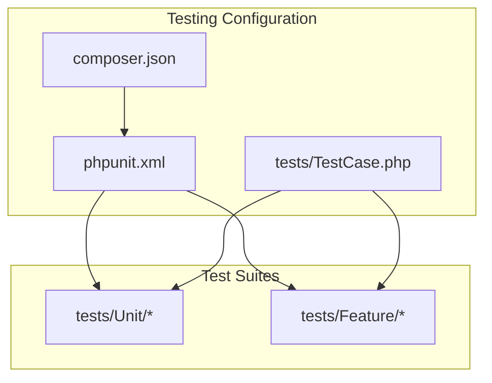
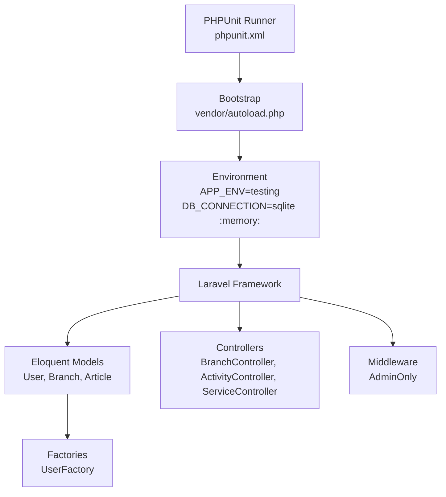
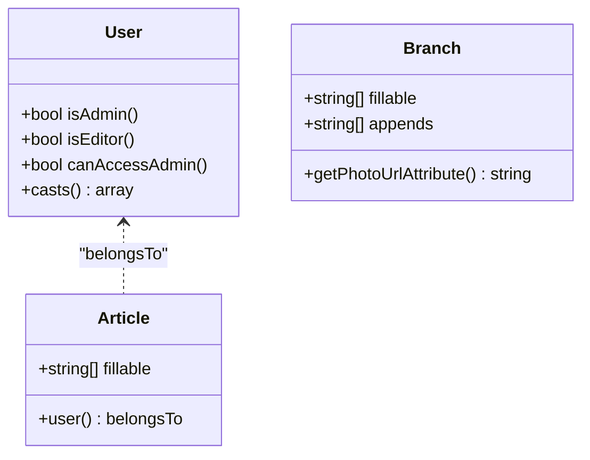
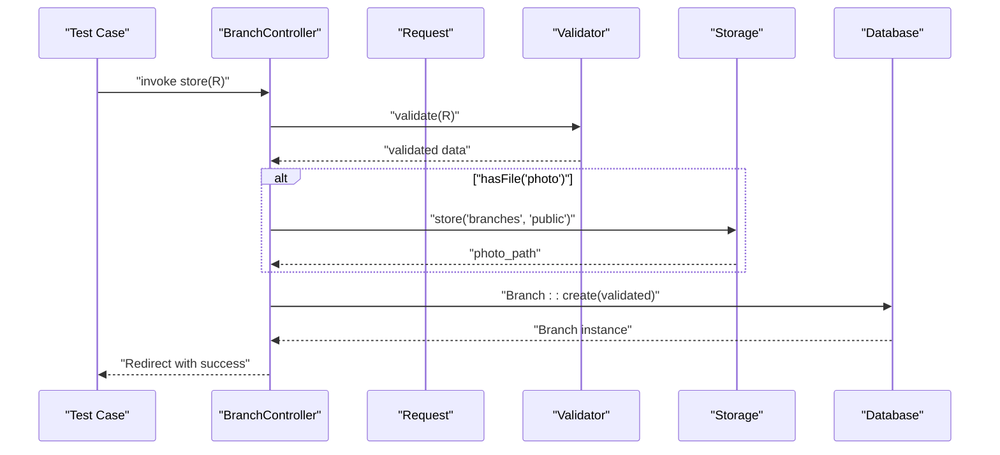
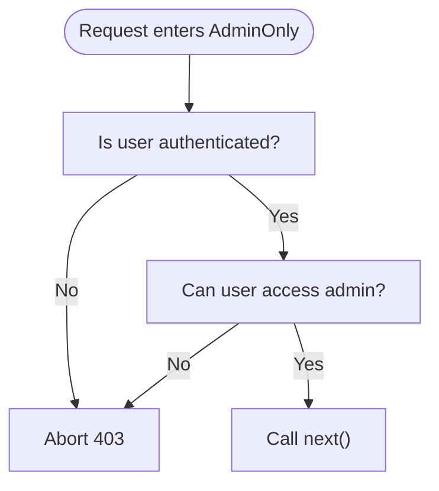
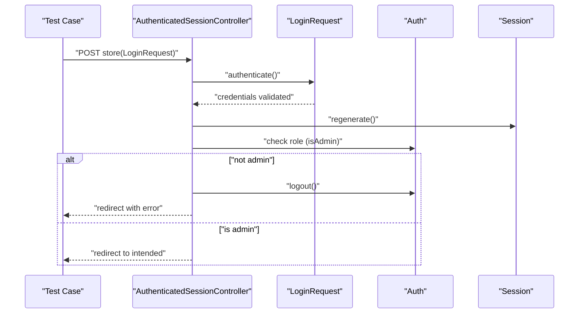
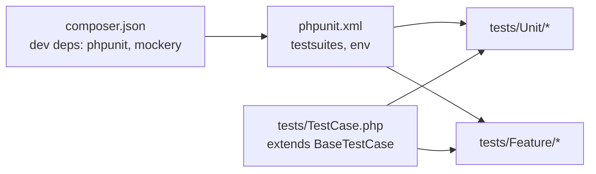

# Unit Testing

<cite>
**Referenced Files in This Document**
- [phpunit.xml](file://phpunit.xml)
- [composer.json](file://composer.json)
- [tests/TestCase.php](file://tests/TestCase.php)
- [tests/Unit/ExampleTest.php](file://tests/Unit/ExampleTest.php)
- [tests/Feature/ExampleTest.php](file://tests/Feature/ExampleTest.php)
- [tests/Feature/Auth/AuthenticationTest.php](file://tests/Feature/Auth/AuthenticationTest.php)
- [app/Models/User.php](file://app/Models/User.php)
- [app/Models/Branch.php](file://app/Models/Branch.php)
- [app/Models/Article.php](file://app/Models/Article.php)
- [app/Http/Controllers/Controller.php](file://app/Http/Controllers/Controller.php)
- [app/Http/Controllers/BranchController.php](file://app/Http/Controllers/BranchController.php)
- [app/Http/Controllers/ActivityController.php](file://app/Http/Controllers/ActivityController.php)
- [app/Http/Controllers/ServiceController.php](file://app/Http/Controllers/ServiceController.php)
- [app/Http/Controllers/Auth/AuthenticatedSessionController.php](file://app/Http/Controllers/Auth/AuthenticatedSessionController.php)
- [app/Http/Middleware/AdminOnly.php](file://app/Http/Middleware/AdminOnly.php)
- [database/factories/UserFactory.php](file://database/factories/UserFactory.php)
</cite>

## Table of Contents
1. [Introduction](#introduction)
2. [Project Structure](#project-structure)
3. [Core Components](#core-components)
4. [Architecture Overview](#architecture-overview)
5. [Detailed Component Analysis](#detailed-component-analysis)
6. [Dependency Analysis](#dependency-analysis)
7. [Performance Considerations](#performance-considerations)
8. [Troubleshooting Guide](#troubleshooting-guide)
9. [Conclusion](#conclusion)
10. [Appendices](#appendices)

## Introduction
This document explains the unit testing methodology for EDUfa, focusing on PHPUnit configuration, test isolation, and practical patterns for Laravel models, controllers, and service-like logic. It covers how to structure tests, manage test data via factories, mock dependencies where appropriate, assert outcomes, and avoid common anti-patterns. Guidance is grounded in the repository’s existing configuration and code samples.

## Project Structure
EDUfa organizes tests into two suites:
- Unit tests under tests/Unit
- Feature tests under tests/Feature

PHPUnit discovers these suites automatically and runs them with an isolated testing environment configured in phpunit.xml. Composer defines development dependencies for testing, including PHPUnit and Mockery.

**Diagram sources**
- [phpunit.xml:1-37](file://phpunit.xml#L1-L37)
- [composer.json:17-25](file://composer.json#L17-L25)
- [tests/TestCase.php:1-11](file://tests/TestCase.php#L1-L11)

**Section sources**
- [phpunit.xml:1-37](file://phpunit.xml#L1-L37)
- [composer.json:17-25](file://composer.json#L17-L25)
- [tests/TestCase.php:1-11](file://tests/TestCase.php#L1-L11)

## Core Components
- PHPUnit configuration: Defines test suites, source inclusion, and environment variables for fast, isolated testing.
- Test base class: Provides shared testing capabilities via Laravel’s base TestCase.
- Factories: Generate realistic test data for models like User.
- Models: Eloquent models with simple business logic suitable for unit tests.
- Controllers: HTTP entry points with validation and persistence logic; suitable for unit and feature tests depending on scope.
- Middleware: Access-control logic suitable for unit tests verifying authorization flows.

Key testing assets:
- phpunit.xml sets APP_ENV=testing and uses SQLite in-memory database for speed.
- composer.json lists phpunit/phpunit and mockery/mockery as dev dependencies.
- tests/TestCase.php extends Laravel’s base test case.

**Section sources**
- [phpunit.xml:20-35](file://phpunit.xml#L20-L35)
- [composer.json:17-25](file://composer.json#L17-L25)
- [tests/TestCase.php:7-10](file://tests/TestCase.php#L7-L10)

## Architecture Overview
The testing architecture centers on PHPUnit discovering tests, Laravel bootstrapping the framework in testing mode, and Eloquent models persisting data to an in-memory SQLite database. Feature tests use HTTP helpers to simulate requests; unit tests focus on isolated logic.

**Diagram sources**
- [phpunit.xml:4,21-28](file://phpunit.xml#L4,L21-L28)
- [composer.json:17-25](file://composer.json#L17-L25)
- [app/Models/User.php:15-46](file://app/Models/User.php#L15-L46)
- [app/Models/Branch.php:8-35](file://app/Models/Branch.php#L8-L35)
- [app/Models/Article.php:7-27](file://app/Models/Article.php#L7-L27)
- [app/Http/Controllers/BranchController.php:12-87](file://app/Http/Controllers/BranchController.php#L12-L87)
- [app/Http/Middleware/AdminOnly.php:9-24](file://app/Http/Middleware/AdminOnly.php#L9-L24)
- [database/factories/UserFactory.php:13-45](file://database/factories/UserFactory.php#L13-L45)

## Detailed Component Analysis

### PHPUnit Configuration and Setup
- Test suites: Unit and Feature directories are registered for discovery.
- Source inclusion: The app directory is included for coverage reporting.
- Environment: APP_ENV=testing enables testing-specific behavior; DB_CONNECTION=sqlite with DB_DATABASE=:memory: ensures fast, isolated database tests without touching disk.

Recommended practices derived from configuration:
- Keep tests self-contained; rely on in-memory database and array caches for speed.
- Use RefreshDatabase trait in feature tests to reset schema per test if needed.
- Leverage factory-generated data for deterministic, reproducible tests.

**Section sources**
- [phpunit.xml:7-19](file://phpunit.xml#L7-L19)
- [phpunit.xml:21-28](file://phpunit.xml#L21-L28)
- [composer.json:17-25](file://composer.json#L17-L25)

### Test Base Class and Isolation
- tests/TestCase.php extends Laravel’s base test case, providing convenient helpers for HTTP testing, database assertions, and session handling.
- Isolation: Environment variables in phpunit.xml ensure tests run independently from production configuration.

Guidelines:
- Extend Tests\TestCase in all tests to inherit Laravel testing helpers.
- Avoid global state; use factories and seeded data to initialize state deterministically.

**Section sources**
- [tests/TestCase.php:7-10](file://tests/TestCase.php#L7-L10)
- [phpunit.xml:21-28](file://phpunit.xml#L21-L28)

### Testing Patterns for Laravel Models
Models in EDUfa are straightforward Eloquent entities suitable for unit tests. Focus areas:
- Attribute casting and accessors
- Business predicates (role checks)
- Relationship definitions

Examples to emulate:
- Role checks in User model: test predicates like isAdmin, isEditor, canAccessAdmin.
- Photo URL resolution in Branch model: test photo_url accessor with various inputs.
- Article relationships: assert belongsTo relationship with User.

**Diagram sources**
- [app/Models/User.php:15-46](file://app/Models/User.php#L15-L46)
- [app/Models/Branch.php:8-35](file://app/Models/Branch.php#L8-L35)
- [app/Models/Article.php:7-27](file://app/Models/Article.php#L7-L27)

**Section sources**
- [app/Models/User.php:32-45](file://app/Models/User.php#L32-L45)
- [app/Models/Branch.php:23-34](file://app/Models/Branch.php#L23-L34)
- [app/Models/Article.php:23-26](file://app/Models/Article.php#L23-L26)

### Testing Controllers: Validation, Persistence, and Responses
Controllers encapsulate request validation, persistence, and response generation. Suitable for:
- Unit tests: validation rules, business logic branching, and response decisions.
- Feature tests: full HTTP request lifecycle with middleware and redirects.

Patterns:
- Validation: Assert request validation rules trigger expected failures.
- Persistence: Use factories to create related records; assert model creation/update.
- Responses: Assert redirects, flash messages, and rendered views via Inertia.

Representative controller logic to test:
- BranchController: index, store, update, destroy with file handling and storage deletion.
- ActivityController: media selection logic (photo vs video) and storage updates.
- ServiceController: simple update of a single field.

**Diagram sources**
- [app/Http/Controllers/BranchController.php:27-45](file://app/Http/Controllers/BranchController.php#L27-L45)

**Section sources**
- [app/Http/Controllers/BranchController.php:17-86](file://app/Http/Controllers/BranchController.php#L17-L86)
- [app/Http/Controllers/ActivityController.php:25-105](file://app/Http/Controllers/ActivityController.php#L25-L105)
- [app/Http/Controllers/ServiceController.php:11-30](file://app/Http/Controllers/ServiceController.php#L11-L30)

### Testing Middleware Authorization
AdminOnly middleware enforces role-based access. Unit tests can verify:
- Unauthorized users receive 403
- Authorized users pass through

**Diagram sources**
- [app/Http/Middleware/AdminOnly.php:16-23](file://app/Http/Middleware/AdminOnly.php#L16-L23)

**Section sources**
- [app/Http/Middleware/AdminOnly.php:16-23](file://app/Http/Middleware/AdminOnly.php#L16-L23)

### Testing Authentication Controllers and Requests
Authentication controllers and requests combine validation, session management, and authorization. Representative flows:
- AuthenticatedSessionController: renders login, authenticates, regenerates session, validates admin role, and logs out.
- AdminOnly middleware: guards admin-only actions.

**Diagram sources**
- [app/Http/Controllers/Auth/AuthenticatedSessionController.php:28-43](file://app/Http/Controllers/Auth/AuthenticatedSessionController.php#L28-L43)
- [app/Http/Middleware/AdminOnly.php:16-23](file://app/Http/Middleware/AdminOnly.php#L16-L23)

**Section sources**
- [app/Http/Controllers/Auth/AuthenticatedSessionController.php:18-57](file://app/Http/Controllers/Auth/AuthenticatedSessionController.php#L18-L57)
- [app/Http/Middleware/AdminOnly.php:16-23](file://app/Http/Middleware/AdminOnly.php#L16-L23)

### Mocking Dependencies
Where appropriate, mock external collaborators:
- Storage facade for file operations in controllers
- Auth facade for guard checks in middleware
- Request objects for validation scenarios

Use Mockery via composer dev dependencies to stub behaviors and assert interactions.

**Section sources**
- [composer.json:22-24](file://composer.json#L22-L24)

### Testing Database Interactions
- Use factories to create records deterministically.
- For feature tests, consider RefreshDatabase to reset schema per test.
- For unit tests, rely on in-memory SQLite and factories to avoid cross-test contamination.

**Section sources**
- [database/factories/UserFactory.php:25-44](file://database/factories/UserFactory.php#L25-L44)
- [tests/Feature/Auth/AuthenticationTest.php:11-53](file://tests/Feature/Auth/AuthenticationTest.php#L11-L53)

### Validating Business Logic
- Models: Assert predicates and attribute behaviors.
- Controllers: Assert validation outcomes, persistence, and response decisions.
- Middleware: Assert authorization outcomes.

**Section sources**
- [app/Models/User.php:32-45](file://app/Models/User.php#L32-L45)
- [app/Http/Controllers/BranchController.php:29-44](file://app/Http/Controllers/BranchController.php#L29-L44)
- [app/Http/Middleware/AdminOnly.php:18-20](file://app/Http/Middleware/AdminOnly.php#L18-L20)

### Assertion Techniques
- Status assertions for HTTP responses
- Redirect and flash message assertions
- Authentication and guest assertions
- Model existence and attribute assertions

**Section sources**
- [tests/Feature/ExampleTest.php:13-18](file://tests/Feature/ExampleTest.php#L13-L18)
- [tests/Feature/Auth/AuthenticationTest.php:29,42,51](file://tests/Feature/Auth/AuthenticationTest.php#L29,L42,L51)

### Test Data Management
- Factories: Generate realistic, consistent records for models.
- Traits: Use RefreshDatabase in feature tests to reset database state.
- Fixtures: Prefer factories over hardcoded fixtures for maintainability.

**Section sources**
- [database/factories/UserFactory.php:25-44](file://database/factories/UserFactory.php#L25-L44)
- [tests/Feature/Auth/AuthenticationTest.php:11](file://tests/Feature/Auth/AuthenticationTest.php#L11)

### Writing Maintainable Unit Tests
- One assertion per concept; group closely related assertions in named tests.
- Use descriptive test names that communicate intent.
- Keep tests independent; avoid shared mutable state.
- Favor factories and minimal setup.

**Section sources**
- [tests/Unit/ExampleTest.php:12-15](file://tests/Unit/ExampleTest.php#L12-L15)
- [tests/Feature/ExampleTest.php:13-18](file://tests/Feature/ExampleTest.php#L13-L18)

### Achieving Optimal Test Coverage
- Target high coverage for business logic in models and controllers.
- Use factories to exercise multiple branches (valid/invalid inputs, authorized/unauthorized).
- Combine unit and feature tests: unit for logic, feature for integration.

[No sources needed since this section provides general guidance]

## Dependency Analysis
The testing stack relies on PHPUnit and Laravel’s framework bootstrap. Composer dev dependencies include phpunit/phpunit and mockery/mockery. phpunit.xml configures the environment and test discovery.

**Diagram sources**
- [composer.json:17-25](file://composer.json#L17-L25)
- [phpunit.xml:7-14](file://phpunit.xml#L7-L14)
- [tests/TestCase.php:7-10](file://tests/TestCase.php#L7-L10)

**Section sources**
- [composer.json:17-25](file://composer.json#L17-L25)
- [phpunit.xml:7-14](file://phpunit.xml#L7-L14)
- [tests/TestCase.php:7-10](file://tests/TestCase.php#L7-L10)

## Performance Considerations
- Use SQLite in-memory database for fast test execution.
- Keep tests isolated; avoid heavy fixtures.
- Prefer unit tests for pure logic; reserve feature tests for integration.

**Section sources**
- [phpunit.xml:26-28](file://phpunit.xml#L26-L28)

## Troubleshooting Guide
Common issues and resolutions:
- Database errors in tests: Ensure environment variables are loaded and schema is migrated for feature tests using RefreshDatabase.
- Authentication assertions failing: Verify actingAs usage and session regeneration in controller tests.
- Middleware blocking requests: Confirm user roles and authentication state in tests.

**Section sources**
- [phpunit.xml:21-35](file://phpunit.xml#L21-L35)
- [tests/Feature/Auth/AuthenticationTest.php:47-52](file://tests/Feature/Auth/AuthenticationTest.php#L47-L52)
- [app/Http/Middleware/AdminOnly.php:18-20](file://app/Http/Middleware/AdminOnly.php#L18-L20)

## Conclusion
EDUfa’s testing setup provides a solid foundation for unit and feature tests. By leveraging factories, in-memory databases, and Laravel’s testing helpers, teams can write fast, maintainable tests that validate models, controllers, and middleware. Focus on isolating logic, asserting outcomes clearly, and using mocks judiciously to keep tests reliable and readable.

[No sources needed since this section summarizes without analyzing specific files]

## Appendices

### Quick Reference: Where to Add Tests
- Unit tests: tests/Unit/*
- Feature tests: tests/Feature/*
- Shared base: tests/TestCase.php
- Factories: database/factories/*

**Section sources**
- [tests/Unit/ExampleTest.php:1-17](file://tests/Unit/ExampleTest.php#L1-L17)
- [tests/Feature/ExampleTest.php:1-20](file://tests/Feature/ExampleTest.php#L1-L20)
- [tests/TestCase.php:1-11](file://tests/TestCase.php#L1-L11)
- [database/factories/UserFactory.php:1-46](file://database/factories/UserFactory.php#L1-L46)