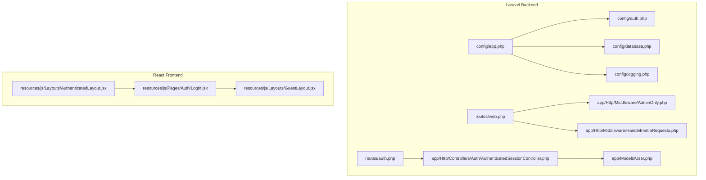
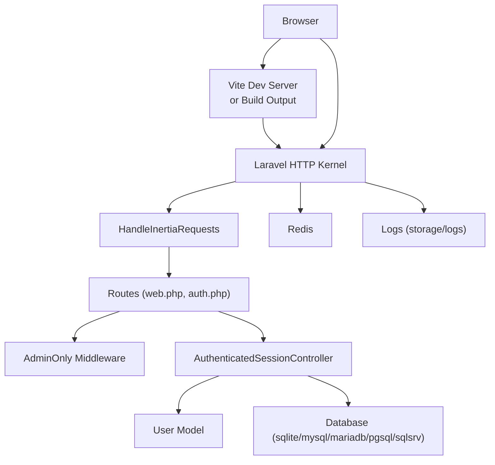
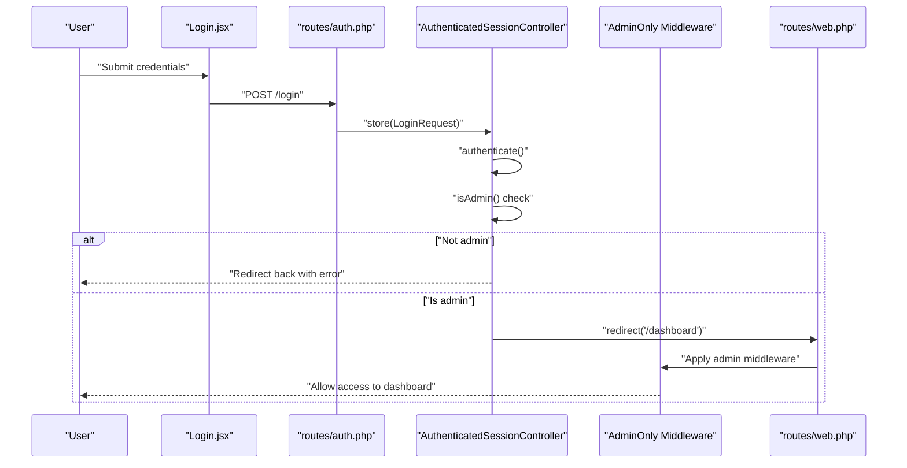
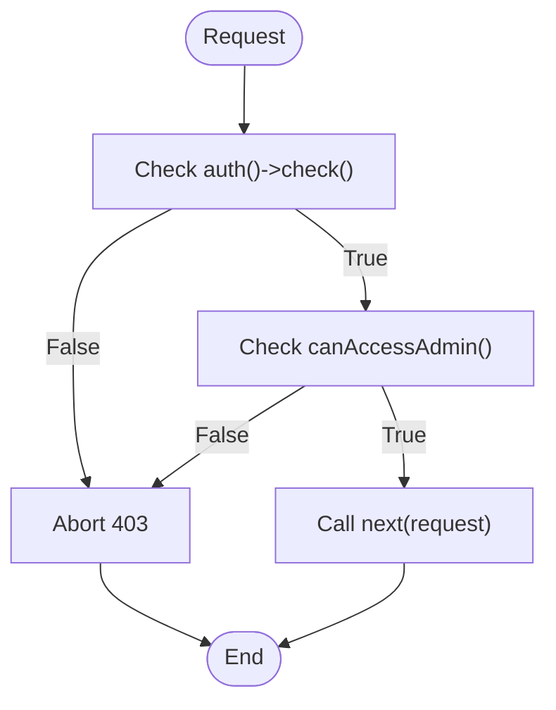
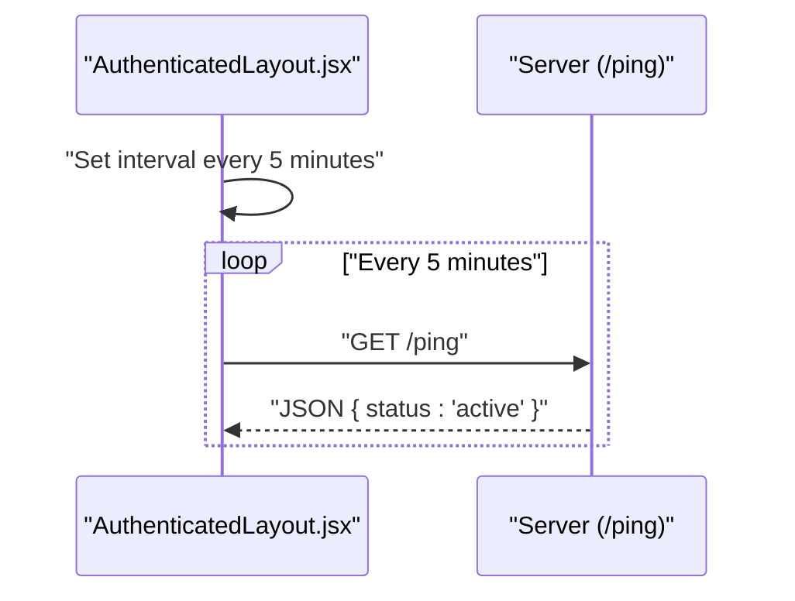
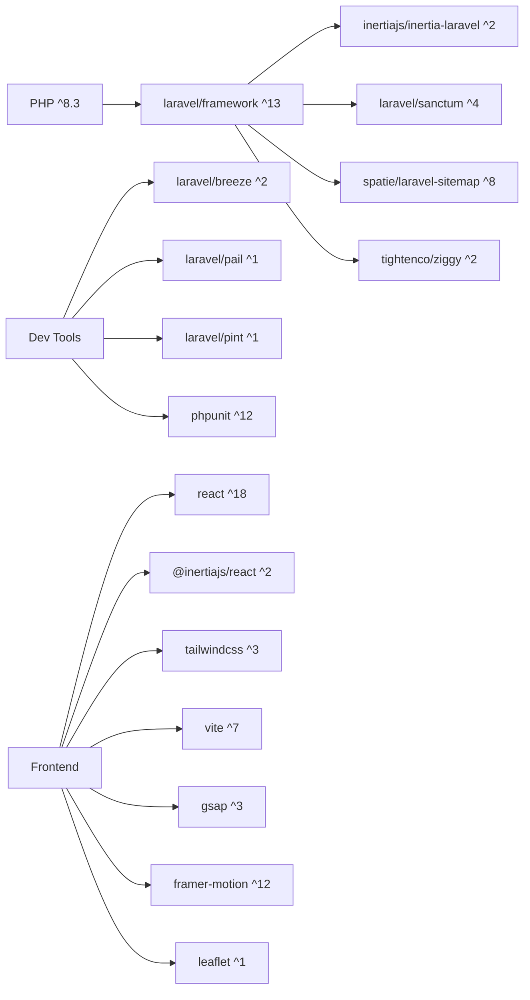

# Troubleshooting and FAQ

<cite>
**Referenced Files in This Document**
- [README.md](file://README.md)
- [composer.json](file://composer.json)
- [package.json](file://package.json)
- [config/app.php](file://config/app.php)
- [config/auth.php](file://config/auth.php)
- [config/database.php](file://config/database.php)
- [config/logging.php](file://config/logging.php)
- [routes/web.php](file://routes/web.php)
- [routes/auth.php](file://routes/auth.php)
- [app/Http/Middleware/AdminOnly.php](file://app/Http/Middleware/AdminOnly.php)
- [app/Http/Middleware/HandleInertiaRequests.php](file://app/Http/Middleware/HandleInertiaRequests.php)
- [app/Http/Controllers/Auth/AuthenticatedSessionController.php](file://app/Http/Controllers/Auth/AuthenticatedSessionController.php)
- [app/Models/User.php](file://app/Models/User.php)
- [resources/js/Pages/Auth/Login.jsx](file://resources/js/Pages/Auth/Login.jsx)
- [resources/js/Layouts/GuestLayout.jsx](file://resources/js/Layouts/GuestLayout.jsx)
- [resources/js/Layouts/AuthenticatedLayout.jsx](file://resources/js/Layouts/AuthenticatedLayout.jsx)
- [storage/logs](file://storage/logs)
- [database/database.sqlite](file://database/database.sqlite)
</cite>

## Table of Contents
1. [Introduction](#introduction)
2. [Project Structure](#project-structure)
3. [Core Components](#core-components)
4. [Architecture Overview](#architecture-overview)
5. [Detailed Component Analysis](#detailed-component-analysis)
6. [Dependency Analysis](#dependency-analysis)
7. [Performance Considerations](#performance-considerations)
8. [Troubleshooting Guide](#troubleshooting-guide)
9. [Conclusion](#conclusion)
10. [Appendices](#appendices)

## Introduction
This document provides a comprehensive Troubleshooting and FAQ guide for EDUfa, focusing on common installation issues, environment setup, database connectivity, authentication and authorization failures, permission and file upload problems, debugging techniques for Laravel and React, performance tuning, logging and monitoring, browser compatibility and responsive design, and community resources. It is designed to help administrators and developers diagnose and resolve issues efficiently while avoiding common pitfalls.

## Project Structure
EDUfa is a Laravel 13 application with Inertia.js and React frontend. Key areas relevant to troubleshooting include:
- Laravel configuration for environment, logging, database, and auth
- Routes grouped by authentication and admin middleware
- Middleware enforcing admin-only access and sharing auth state to the frontend
- Authentication controllers and user roles
- Frontend pages and layouts using Inertia and Vite

**Diagram sources**
- [config/app.php:1-127](file://config/app.php#L1-L127)
- [config/auth.php:1-118](file://config/auth.php#L1-L118)
- [config/database.php:1-185](file://config/database.php#L1-L185)
- [config/logging.php:1-133](file://config/logging.php#L1-L133)
- [routes/web.php:1-137](file://routes/web.php#L1-L137)
- [routes/auth.php:1-44](file://routes/auth.php#L1-L44)
- [app/Http/Middleware/AdminOnly.php:1-25](file://app/Http/Middleware/AdminOnly.php#L1-L25)
- [app/Http/Middleware/HandleInertiaRequests.php:1-40](file://app/Http/Middleware/HandleInertiaRequests.php#L1-L40)
- [app/Http/Controllers/Auth/AuthenticatedSessionController.php:1-58](file://app/Http/Controllers/Auth/AuthenticatedSessionController.php#L1-L58)
- [app/Models/User.php:1-47](file://app/Models/User.php#L1-L47)
- [resources/js/Pages/Auth/Login.jsx:1-204](file://resources/js/Pages/Auth/Login.jsx#L1-L204)
- [resources/js/Layouts/GuestLayout.jsx:1-19](file://resources/js/Layouts/GuestLayout.jsx#L1-L19)
- [resources/js/Layouts/AuthenticatedLayout.jsx:1-54](file://resources/js/Layouts/AuthenticatedLayout.jsx#L1-L54)

**Section sources**
- [config/app.php:1-127](file://config/app.php#L1-L127)
- [config/auth.php:1-118](file://config/auth.php#L1-L118)
- [config/database.php:1-185](file://config/database.php#L1-L185)
- [config/logging.php:1-133](file://config/logging.php#L1-L133)
- [routes/web.php:1-137](file://routes/web.php#L1-L137)
- [routes/auth.php:1-44](file://routes/auth.php#L1-L44)
- [app/Http/Middleware/AdminOnly.php:1-25](file://app/Http/Middleware/AdminOnly.php#L1-L25)
- [app/Http/Middleware/HandleInertiaRequests.php:1-40](file://app/Http/Middleware/HandleInertiaRequests.php#L1-L40)
- [app/Http/Controllers/Auth/AuthenticatedSessionController.php:1-58](file://app/Http/Controllers/Auth/AuthenticatedSessionController.php#L1-L58)
- [app/Models/User.php:1-47](file://app/Models/User.php#L1-L47)
- [resources/js/Pages/Auth/Login.jsx:1-204](file://resources/js/Pages/Auth/Login.jsx#L1-L204)
- [resources/js/Layouts/GuestLayout.jsx:1-19](file://resources/js/Layouts/GuestLayout.jsx#L1-L19)
- [resources/js/Layouts/AuthenticatedLayout.jsx:1-54](file://resources/js/Layouts/AuthenticatedLayout.jsx#L1-L54)

## Core Components
- Environment and application settings: APP_DEBUG, APP_URL, timezone, locale, encryption key, maintenance mode.
- Authentication: guards, providers, password reset configuration, password confirmation timeout.
- Database: default connection, multiple drivers (sqlite/mysql/mariadb/pgsql/sqlsrv), Redis client and options.
- Logging: default channel, deprecation channel, stack channels, daily rotation, Slack, syslog, stderr, papertrail.
- Routing: guest/auth/admin groups, dashboard route, profile routes, sitemap generation.
- Middleware: admin-only enforcement and Inertia prop sharing for auth state.
- Authentication controller: login flow, role checks, logout.
- User model: role-based access helpers (admin/editor).
- Frontend: Login page, guest layout, authenticated layout with keep-alive ping.

**Section sources**
- [config/app.php:1-127](file://config/app.php#L1-L127)
- [config/auth.php:1-118](file://config/auth.php#L1-L118)
- [config/database.php:1-185](file://config/database.php#L1-L185)
- [config/logging.php:1-133](file://config/logging.php#L1-L133)
- [routes/web.php:1-137](file://routes/web.php#L1-L137)
- [routes/auth.php:1-44](file://routes/auth.php#L1-L44)
- [app/Http/Middleware/AdminOnly.php:1-25](file://app/Http/Middleware/AdminOnly.php#L1-L25)
- [app/Http/Middleware/HandleInertiaRequests.php:1-40](file://app/Http/Middleware/HandleInertiaRequests.php#L1-L40)
- [app/Http/Controllers/Auth/AuthenticatedSessionController.php:1-58](file://app/Http/Controllers/Auth/AuthenticatedSessionController.php#L1-L58)
- [app/Models/User.php:1-47](file://app/Models/User.php#L1-L47)
- [resources/js/Pages/Auth/Login.jsx:1-204](file://resources/js/Pages/Auth/Login.jsx#L1-L204)
- [resources/js/Layouts/GuestLayout.jsx:1-19](file://resources/js/Layouts/GuestLayout.jsx#L1-L19)
- [resources/js/Layouts/AuthenticatedLayout.jsx:1-54](file://resources/js/Layouts/AuthenticatedLayout.jsx#L1-L54)

## Architecture Overview
The system integrates Laravel backend with React frontend via Inertia. Authentication is enforced at the route level and via middleware. Admin-only access is controlled centrally. Logging is configurable for development and production environments.

**Diagram sources**
- [routes/web.php:1-137](file://routes/web.php#L1-L137)
- [routes/auth.php:1-44](file://routes/auth.php#L1-L44)
- [app/Http/Middleware/AdminOnly.php:1-25](file://app/Http/Middleware/AdminOnly.php#L1-L25)
- [app/Http/Middleware/HandleInertiaRequests.php:1-40](file://app/Http/Middleware/HandleInertiaRequests.php#L1-L40)
- [app/Http/Controllers/Auth/AuthenticatedSessionController.php:1-58](file://app/Http/Controllers/Auth/AuthenticatedSessionController.php#L1-L58)
- [app/Models/User.php:1-47](file://app/Models/User.php#L1-L47)
- [config/database.php:1-185](file://config/database.php#L1-L185)
- [config/logging.php:1-133](file://config/logging.php#L1-L133)

## Detailed Component Analysis

### Authentication Flow (Login)
This sequence illustrates the login flow, including role verification and redirection to the admin dashboard.

**Diagram sources**
- [resources/js/Pages/Auth/Login.jsx:1-204](file://resources/js/Pages/Auth/Login.jsx#L1-L204)
- [routes/auth.php:1-44](file://routes/auth.php#L1-L44)
- [app/Http/Controllers/Auth/AuthenticatedSessionController.php:1-58](file://app/Http/Controllers/Auth/AuthenticatedSessionController.php#L1-L58)
- [app/Http/Middleware/AdminOnly.php:1-25](file://app/Http/Middleware/AdminOnly.php#L1-L25)
- [routes/web.php:1-137](file://routes/web.php#L1-L137)

**Section sources**
- [resources/js/Pages/Auth/Login.jsx:1-204](file://resources/js/Pages/Auth/Login.jsx#L1-L204)
- [routes/auth.php:1-44](file://routes/auth.php#L1-L44)
- [app/Http/Controllers/Auth/AuthenticatedSessionController.php:1-58](file://app/Http/Controllers/Auth/AuthenticatedSessionController.php#L1-L58)
- [app/Http/Middleware/AdminOnly.php:1-25](file://app/Http/Middleware/AdminOnly.php#L1-L25)
- [routes/web.php:1-137](file://routes/web.php#L1-L137)

### Admin Access Control
The admin-only middleware enforces that only authenticated users with sufficient roles can access admin routes.

**Diagram sources**
- [app/Http/Middleware/AdminOnly.php:1-25](file://app/Http/Middleware/AdminOnly.php#L1-L25)
- [app/Models/User.php:1-47](file://app/Models/User.php#L1-L47)

**Section sources**
- [app/Http/Middleware/AdminOnly.php:1-25](file://app/Http/Middleware/AdminOnly.php#L1-L25)
- [app/Models/User.php:1-47](file://app/Models/User.php#L1-L47)

### Session Keep-Alive in Authenticated Layout
The authenticated layout periodically pings the server to prevent session timeouts during admin work.

**Diagram sources**
- [resources/js/Layouts/AuthenticatedLayout.jsx:1-54](file://resources/js/Layouts/AuthenticatedLayout.jsx#L1-L54)
- [routes/web.php:1-137](file://routes/web.php#L1-L137)

**Section sources**
- [resources/js/Layouts/AuthenticatedLayout.jsx:1-54](file://resources/js/Layouts/AuthenticatedLayout.jsx#L1-L54)
- [routes/web.php:1-137](file://routes/web.php#L1-L137)

## Dependency Analysis
Key runtime dependencies and scripts:
- PHP ^8.3, Laravel Framework ^13, Inertia Laravel, Sanctum, Tinker, Sitemap, Ziggy
- Development: Breeze, Pail, Pint, PHPUnit, Collision
- Frontend: React 18, Inertia React, Tailwind, Vite, GSAP, Framer Motion, TipTap, Radix UI, Leaflet

**Diagram sources**
- [composer.json:1-91](file://composer.json#L1-L91)
- [package.json:1-49](file://package.json#L1-L49)

**Section sources**
- [composer.json:1-91](file://composer.json#L1-L91)
- [package.json:1-49](file://package.json#L1-L49)

## Performance Considerations
- Database defaults to sqlite for simplicity; switch to mysql/mariadb/pgsql/sqlsrv for production workloads. Tune charset/collation and strict modes per driver.
- Enable Redis for caching and queues if scaling; configure client, cluster, prefix, and retry/backoff policies.
- Use daily log rotation and appropriate log levels to balance verbosity and disk usage.
- Optimize frontend builds with Vite; ensure Tailwind purging targets production assets.
- Monitor slow queries and N+1 selects; eager-load relations in controllers and views.
- Use browser devtools to profile rendering and network requests; leverage React profiling in development.

[No sources needed since this section provides general guidance]

## Troubleshooting Guide

### Installation and Environment Setup
Common issues and resolutions:
- PHP version mismatch: Ensure PHP ^8.3 as required by the project.
  - Verify with: php -v
  - Align local or container runtime to ^8.3
  - Section sources
    - [composer.json:8-16](file://composer.json#L8-L16)
- Composer dependencies fail:
  - Clear caches and reinstall: composer install
  - Ensure environment file exists: cp .env.example .env
  - Generate app key: php artisan key:generate
  - Section sources
    - [composer.json:38-72](file://composer.json#L38-L72)
- Node/npm dependencies:
  - Install frontend deps: npm install
  - Build assets: npm run build
  - Section sources
    - [package.json:5-8](file://package.json#L5-L8)
- Default database:
  - SQLite database file: database/database.sqlite is created automatically during setup
  - Section sources
    - [composer.json:66-68](file://composer.json#L66-L68)
    - [config/database.php:35-45](file://config/database.php#L35-L45)

### Dependency Conflicts
- Symptom: Composer update/install fails with conflicting requirements.
- Actions:
  - Review locked versions and constraints in composer.json
  - Run composer update with --with-dependencies
  - Check plugin allowances under config.allow-plugins
  - Section sources
    - [composer.json:79-89](file://composer.json#L79-L89)

### Environment Variables and Configuration
- APP_DEBUG and APP_ENV:
  - Set APP_DEBUG=true for development diagnostics; false for production
  - Section sources
    - [config/app.php:42](file://config/app.php#L42)
- APP_URL:
  - Ensure APP_URL matches the host used by Vite and reverse proxies
  - Section sources
    - [config/app.php:55](file://config/app.php#L55)
- APP_KEY:
  - Required for encryption; regenerate after deployment
  - Section sources
    - [config/app.php:100](file://config/app.php#L100)

### Database Connection Errors
Symptoms:
- SQLSTATE[HY000] [1045] Access denied
- could not find driver for sqlite/mysql/pgsql/sqlsrv
- Target database not found

Resolutions:
- Choose a driver and set DB_CONNECTION accordingly:
  - sqlite: default; ensure database path exists
  - mysql/mariadb: set DB_HOST, DB_PORT, DB_DATABASE, DB_USERNAME, DB_PASSWORD
  - pgsql: set DB_HOST, DB_PORT, DB_DATABASE, DB_USERNAME, DB_PASSWORD
  - sqlsrv: set DB_HOST, DB_PORT, DB_DATABASE, DB_USERNAME, DB_PASSWORD
- Verify charset/collation and strict mode settings per driver
- For SSL/TLS, configure PDO options and SSL CA as applicable
- Redis connectivity: set REDIS_* variables and client type
- Section sources
  - [config/database.php:20](file://config/database.php#L20)
  - [config/database.php:35-115](file://config/database.php#L35-L115)
  - [config/database.php:146-182](file://config/database.php#L146-L182)

### Authentication Failures
Symptoms:
- Login redirects back with “Akses hanya untuk admin.”
- 403 Forbidden on admin routes
- Session timeout during admin work

Resolutions:
- Ensure the logged-in user has role=admin or role=editor
- The login controller enforces admin-only access; non-admins are logged out immediately
- The authenticated layout sends periodic /ping requests to keep the session alive
- Section sources
  - [app/Http/Controllers/Auth/AuthenticatedSessionController.php:35-42](file://app/Http/Controllers/Auth/AuthenticatedSessionController.php#L35-L42)
  - [app/Models/User.php:32-45](file://app/Models/User.php#L32-L45)
  - [resources/js/Layouts/AuthenticatedLayout.jsx:14-23](file://resources/js/Layouts/AuthenticatedLayout.jsx#L14-L23)
  - [routes/web.php:68-80](file://routes/web.php#L68-L80)
  - [app/Http/Middleware/AdminOnly.php:16-23](file://app/Http/Middleware/AdminOnly.php#L16-L23)

### Permission Issues
- Web server user must have write permissions to:
  - storage/
  - bootstrap/cache/
  - database/database.sqlite (when using sqlite)
- Section sources
  - [storage/logs](file://storage/logs)
  - [database/database.sqlite](file://database/database.sqlite)

### File Upload Problems
- Verify storage/app/public is linked to public/storage for file visibility
- Ensure proper MIME types and size limits in request validation
- Check filesystems configuration for disk drivers and visibility
- Section sources
  - [config/filesystems.php](file://config/filesystems.php)

### Debugging Laravel Application Issues
Techniques:
- Enable APP_DEBUG=true locally to show detailed error pages
- Use php artisan serve for local development
- Inspect logs in storage/logs; rotate daily logs for long-running instances
- Use Laravel Pail for remote log viewing in production
- Section sources
  - [config/app.php:42](file://config/app.php#L42)
  - [config/logging.php:53-130](file://config/logging.php#L53-L130)
  - [composer.json:20](file://composer.json#L20)

### Debugging React Component Problems
Techniques:
- Run development server: npm run dev
- Use React DevTools and browser console
- Validate Inertia props shared via HandleInertiaRequests
- Section sources
  - [package.json:7](file://package.json#L7)
  - [app/Http/Middleware/HandleInertiaRequests.php:30-38](file://app/Http/Middleware/HandleInertiaRequests.php#L30-L38)

### Build Process Failures
Symptoms:
- Vite build errors, missing modules, or Tailwind purge issues

Actions:
- Clear node_modules/.vite cache and reinstall dependencies
- Ensure Vite and Laravel Vite Plugin versions align with the project
- Verify Tailwind and PostCSS configuration
- Section sources
  - [package.json:9-23](file://package.json#L9-L23)
  - [vite.config.js](file://vite.config.js)

### Slow Page Loads
- Database:
  - Check for missing indexes on foreign keys and filters
  - Use eager loading to avoid N+1 queries
  - Analyze slow queries with database profiling tools
- Frontend:
  - Audit bundle size and tree-shaking
  - Minimize heavy animations and third-party libraries
- Caching:
  - Configure Redis cache and optimize cache keys
- Section sources
  - [config/database.php:146-182](file://config/database.php#L146-L182)

### Memory Usage Issues
- Reduce payload sizes in API responses
- Paginate large datasets
- Use streaming responses for large exports
- Monitor PHP memory limit and adjust as needed
- Section sources
  - [config/app.php:68](file://config/app.php#L68)

### Database Query Optimization
- Use EXPLAIN/ANALYZE to inspect query plans
- Add indexes on frequently filtered columns
- Normalize denormalized joins
- Leverage query builder or Eloquent relationships appropriately
- Section sources
  - [config/database.php:35-115](file://config/database.php#L35-L115)

### Logging and Monitoring
- Default channel stack supports multiple channels
- Daily rotation reduces log file sizes
- Slack, Papertrail, syslog, and stderr handlers available
- Use Laravel Pail for centralized log viewing
- Section sources
  - [config/logging.php:21](file://config/logging.php#L21)
  - [config/logging.php:53-130](file://config/logging.php#L53-L130)
  - [composer.json:20](file://composer.json#L20)

### Browser Compatibility and Responsive Design
- Test across modern browsers; use Tailwind’s responsive utilities
- Validate viewport meta tag and base URL
- Use React DevTools and browser devtools to inspect rendering differences
- Section sources
  - [resources/js/Layouts/GuestLayout.jsx:1-19](file://resources/js/Layouts/GuestLayout.jsx#L1-L19)
  - [resources/js/Layouts/AuthenticatedLayout.jsx:1-54](file://resources/js/Layouts/AuthenticatedLayout.jsx#L1-L54)

### Community Resources and Support
- Laravel official documentation and forums
- GitHub Discussions for this repository
- Stack Overflow with laravel and inertia tags
- React community and Vite documentation
- Section sources
  - [README.md](file://README.md)

### Preventive Measures and Best Practices
- Keep dependencies updated within compatible ranges
- Use .env.local for local overrides; never commit secrets
- Automate setup with composer scripts
- Enforce code quality with Laravel Pint and PHPUnit
- Section sources
  - [composer.json:38-72](file://composer.json#L38-L72)
  - [composer.json:79-89](file://composer.json#L79-L89)

## Conclusion
By aligning environment variables, ensuring correct database and Redis configuration, validating authentication roles, and leveraging logging and monitoring, most EDUfa issues can be resolved quickly. Adopting the recommended preventive measures and best practices will minimize future incidents and improve maintainability.

## Appendices

### Quick Checklist
- PHP ^8.3 installed
- APP_KEY generated
- DB_CONNECTION set and reachable
- Redis configured (optional)
- Storage writable by web server
- APP_DEBUG enabled for development
- Vite dev/build working
- Admin user with role=admin or role=editor

[No sources needed since this section summarizes without analyzing specific files]