# Base UI Components

<cite>
**Referenced Files in This Document**
- [button.jsx](file://resources/js/Components/ui/button.jsx)
- [input.jsx](file://resources/js/Components/ui/input.jsx)
- [label.jsx](file://resources/js/Components/ui/label.jsx)
- [card.jsx](file://resources/js/Components/ui/card.jsx)
- [sheet.jsx](file://resources/js/Components/ui/sheet.jsx)
- [tooltip.jsx](file://resources/js/Components/ui/tooltip.jsx)
- [separator.jsx](file://resources/js/Components/ui/separator.jsx)
- [skeleton.jsx](file://resources/js/Components/ui/skeleton.jsx)
- [sidebar.jsx](file://resources/js/Components/ui/sidebar.jsx)
- [utils.js](file://resources/js/lib/utils.js)
- [tailwind.config.js](file://tailwind.config.js)
- [app.css](file://resources/css/app.css)
</cite>

## Table of Contents
1. [Introduction](#introduction)
2. [Project Structure](#project-structure)
3. [Core Components](#core-components)
4. [Architecture Overview](#architecture-overview)
5. [Detailed Component Analysis](#detailed-component-analysis)
6. [Dependency Analysis](#dependency-analysis)
7. [Performance Considerations](#performance-considerations)
8. [Troubleshooting Guide](#troubleshooting-guide)
9. [Conclusion](#conclusion)
10. [Appendices](#appendices)

## Introduction
This document describes the base UI components used across the application: Button, Input, Label, Card, Sheet, Tooltip, Separator, and Skeleton. It explains props/attributes, styling options, usage patterns, component states, hover/focus behavior, accessibility features, keyboard navigation, composition guidelines, and TailwindCSS theming. The goal is to help developers build consistent, accessible, and responsive user interfaces while leveraging shared primitives.

## Project Structure
These components live under the UI module and are composed by higher-level layouts and pages. They rely on:
- Radix UI primitives for accessible semantics and behavior
- Class Variance Authority (cva) for variant and size styling
- Tailwind CSS with a custom theme and merge utility

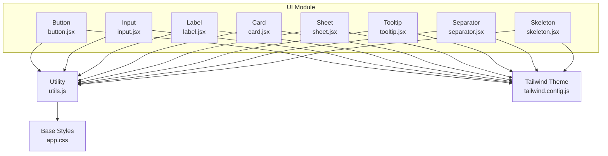

**Diagram sources**
- [button.jsx:1-49](file://resources/js/Components/ui/button.jsx#L1-L49)
- [input.jsx:1-20](file://resources/js/Components/ui/input.jsx#L1-L20)
- [label.jsx:1-21](file://resources/js/Components/ui/label.jsx#L1-L21)
- [card.jsx:1-61](file://resources/js/Components/ui/card.jsx#L1-L61)
- [sheet.jsx:1-123](file://resources/js/Components/ui/sheet.jsx#L1-L123)
- [tooltip.jsx:1-26](file://resources/js/Components/ui/tooltip.jsx#L1-L26)
- [separator.jsx:1-26](file://resources/js/Components/ui/separator.jsx#L1-L26)
- [skeleton.jsx:1-17](file://resources/js/Components/ui/skeleton.jsx#L1-L17)
- [utils.js:1-7](file://resources/js/lib/utils.js#L1-L7)
- [tailwind.config.js:1-42](file://tailwind.config.js#L1-L42)
- [app.css:1-29](file://resources/css/app.css#L1-L29)

**Section sources**
- [button.jsx:1-49](file://resources/js/Components/ui/button.jsx#L1-L49)
- [input.jsx:1-20](file://resources/js/Components/ui/input.jsx#L1-L20)
- [label.jsx:1-21](file://resources/js/Components/ui/label.jsx#L1-L21)
- [card.jsx:1-61](file://resources/js/Components/ui/card.jsx#L1-L61)
- [sheet.jsx:1-123](file://resources/js/Components/ui/sheet.jsx#L1-L123)
- [tooltip.jsx:1-26](file://resources/js/Components/ui/tooltip.jsx#L1-L26)
- [separator.jsx:1-26](file://resources/js/Components/ui/separator.jsx#L1-L26)
- [skeleton.jsx:1-17](file://resources/js/Components/ui/skeleton.jsx#L1-L17)
- [utils.js:1-7](file://resources/js/lib/utils.js#L1-L7)
- [tailwind.config.js:1-42](file://tailwind.config.js#L1-L42)
- [app.css:1-29](file://resources/css/app.css#L1-L29)

## Core Components
Below are the base components with their props, styling, states, and usage patterns.

- Button
  - Props: className, variant, size, asChild, rest spread to native element
  - Variants: default, destructive, outline, secondary, ghost, link
  - Sizes: default, sm, lg, icon
  - States: hover, focus-visible, disabled
  - Accessibility: inherits focus-visible ring pattern; supports asChild for composition
  - Usage patterns: inline actions, form controls, icon-only toggles

- Input
  - Props: className, type, rest spread to native input
  - States: focus-visible ring, disabled cursor and opacity
  - Accessibility: integrates with associated Label via peer selectors
  - Usage patterns: text, password, number, file inputs

- Label
  - Props: className, rest spread to primitive root
  - States: peer-disabled cursor and opacity
  - Accessibility: semantic labeling for form controls
  - Usage patterns: pairing with Input and other controls

- Card
  - Parts: Card, CardHeader, CardTitle, CardDescription, CardContent, CardFooter
  - Props: className, rest spread to each part
  - Usage patterns: grouping related content, forms, and metadata

- Sheet
  - Parts: Sheet, SheetTrigger, SheetClose, SheetPortal, SheetOverlay, SheetContent, SheetHeader, SheetFooter, SheetTitle, SheetDescription
  - Props: side (top, bottom, left, right), className, children
  - States: open/closed animations, focus-visible ring on close button
  - Accessibility: overlay click-to-close, sr-only close label, portal rendering
  - Usage patterns: mobile drawers, off-canvas navigation, dialogs

- Tooltip
  - Parts: TooltipProvider, Tooltip, TooltipTrigger, TooltipContent
  - Props: sideOffset, className, rest to primitive content
  - States: show/hide animations, focus-visible ring on trigger
  - Accessibility: provider context, primitive ARIA attributes
  - Usage patterns: contextual help, icon buttons, menu items

- Separator
  - Props: className, orientation (horizontal|vertical), decorative, rest to primitive
  - Accessibility: respects decorative flag and orientation
  - Usage patterns: dividers in menus, cards, lists

- Skeleton
  - Props: className, rest spread to container
  - States: animated pulse
  - Usage patterns: loading placeholders, layout shims

**Section sources**
- [button.jsx:7-34](file://resources/js/Components/ui/button.jsx#L7-L34)
- [input.jsx:4-16](file://resources/js/Components/ui/input.jsx#L4-L16)
- [label.jsx:7-18](file://resources/js/Components/ui/label.jsx#L7-L18)
- [card.jsx:4-60](file://resources/js/Components/ui/card.jsx#L4-L60)
- [sheet.jsx:16-63](file://resources/js/Components/ui/sheet.jsx#L16-L63)
- [tooltip.jsx:12-22](file://resources/js/Components/ui/tooltip.jsx#L12-L22)
- [separator.jsx:5-22](file://resources/js/Components/ui/separator.jsx#L5-L22)
- [skeleton.jsx:4-14](file://resources/js/Components/ui/skeleton.jsx#L4-L14)

## Architecture Overview
The components share a consistent styling pipeline:
- Utility function merges Tailwind classes safely
- Variants defined via cva for predictable overrides
- Radix UI primitives ensure accessible behavior and semantics
- Theming extends Tailwind’s default palette and adds brand tokens

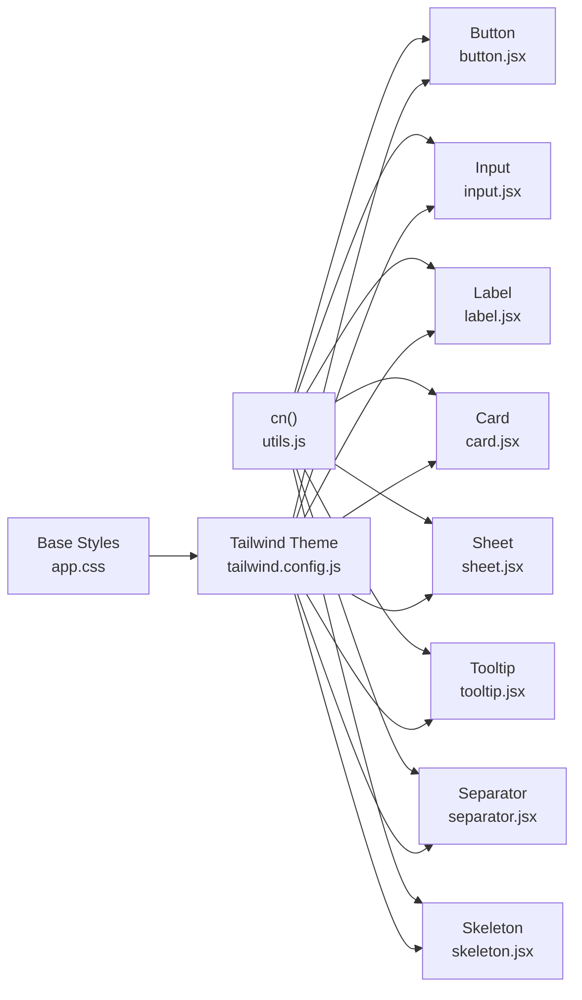

**Diagram sources**
- [utils.js:4-6](file://resources/js/lib/utils.js#L4-L6)
- [button.jsx:1-6](file://resources/js/Components/ui/button.jsx#L1-L6)
- [input.jsx:1-3](file://resources/js/Components/ui/input.jsx#L1-L3)
- [label.jsx:1-6](file://resources/js/Components/ui/label.jsx#L1-L6)
- [card.jsx:1-3](file://resources/js/Components/ui/card.jsx#L1-L3)
- [sheet.jsx:1-7](file://resources/js/Components/ui/sheet.jsx#L1-L7)
- [tooltip.jsx:1-5](file://resources/js/Components/ui/tooltip.jsx#L1-L5)
- [separator.jsx:1-4](file://resources/js/Components/ui/separator.jsx#L1-L4)
- [skeleton.jsx:1-3](file://resources/js/Components/ui/skeleton.jsx#L1-L3)
- [tailwind.config.js:14-38](file://tailwind.config.js#L14-L38)
- [app.css:5-29](file://resources/css/app.css#L5-L29)

## Detailed Component Analysis

### Button
- Props
  - className: additional Tailwind classes
  - variant: selects background/text/palette
  - size: controls height/width/padding
  - asChild: renders children as a slot for composition
- States and Effects
  - Hover: variant-specific hover color
  - Focus: focus-visible ring around button
  - Disabled: reduced opacity and pointer events
- Accessibility
  - Inherits focus-visible ring pattern
  - asChild allows wrapping links or custom triggers
- Composition
  - Combine with icons, text, or other components
  - Use size/icon for compact actions
- Theming
  - Variant colors derive from theme palettes
  - Override via className for exceptions

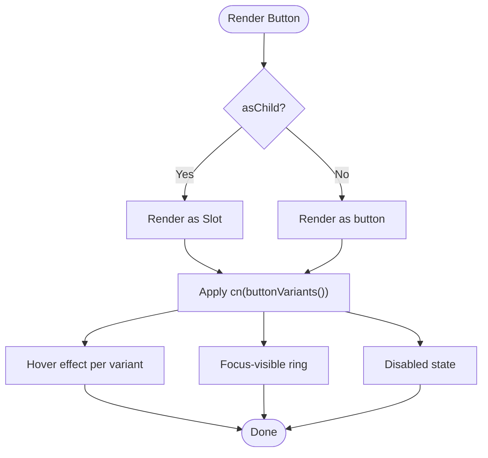

**Diagram sources**
- [button.jsx:36-45](file://resources/js/Components/ui/button.jsx#L36-L45)
- [button.jsx:7-34](file://resources/js/Components/ui/button.jsx#L7-L34)

**Section sources**
- [button.jsx:7-34](file://resources/js/Components/ui/button.jsx#L7-L34)
- [button.jsx:36-45](file://resources/js/Components/ui/button.jsx#L36-L45)

### Input
- Props
  - className: additional Tailwind classes
  - type: native input type
- States and Effects
  - Focus-visible ring around input
  - Disabled cursor and opacity
- Accessibility
  - Pair with Label for screen reader support
- Composition
  - Use inside forms, search bars, and filters
- Theming
  - Inherits border/background/placeholder colors from theme

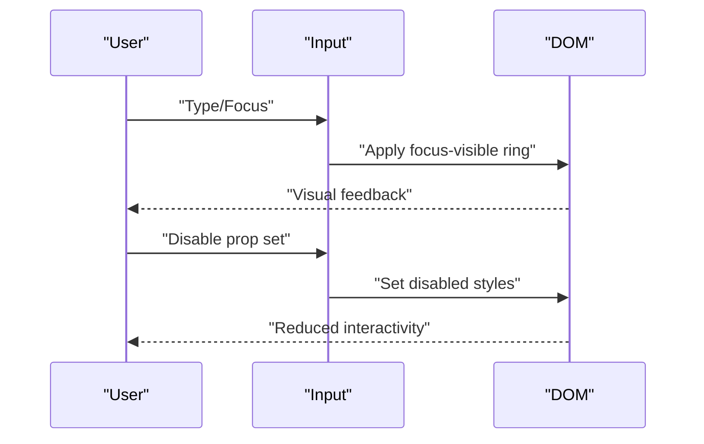

**Diagram sources**
- [input.jsx:4-16](file://resources/js/Components/ui/input.jsx#L4-L16)

**Section sources**
- [input.jsx:4-16](file://resources/js/Components/ui/input.jsx#L4-L16)

### Label
- Props
  - className: additional Tailwind classes
- States and Effects
  - Peer-disabled cursor and opacity when paired with disabled input
- Accessibility
  - Semantic association with form controls improves usability
- Composition
  - Wrap text or short descriptions for inputs
- Theming
  - Inherits typography and spacing from theme

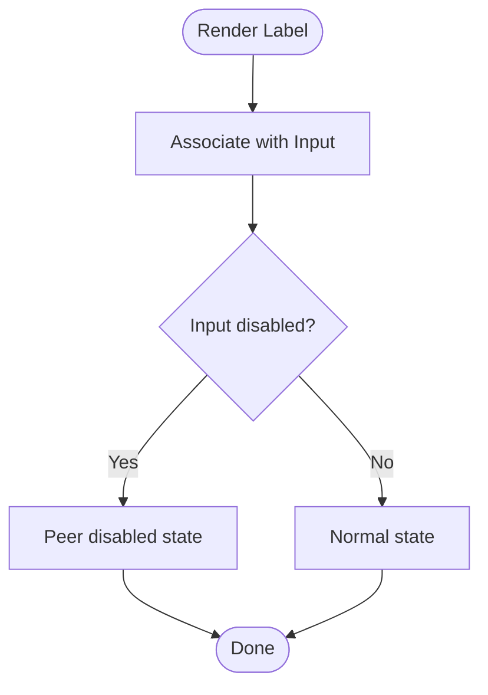

**Diagram sources**
- [label.jsx:11-18](file://resources/js/Components/ui/label.jsx#L11-L18)

**Section sources**
- [label.jsx:7-18](file://resources/js/Components/ui/label.jsx#L7-L18)

### Card
- Parts and Props
  - Card: outer container
  - CardHeader: header area
  - CardTitle: title text
  - CardDescription: subtitle/description
  - CardContent: body content
  - CardFooter: footer actions
- Composition
  - Stack parts to build structured content blocks
- Theming
  - Uses card foreground/background and shadows from theme

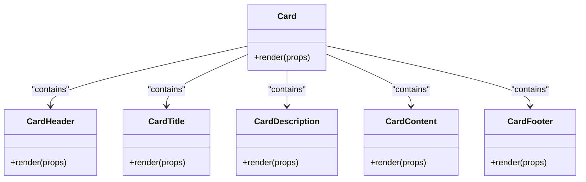

**Diagram sources**
- [card.jsx:4-60](file://resources/js/Components/ui/card.jsx#L4-L60)

**Section sources**
- [card.jsx:4-60](file://resources/js/Components/ui/card.jsx#L4-L60)

### Sheet
- Parts and Props
  - Sheet, SheetTrigger, SheetClose, SheetPortal, SheetOverlay
  - SheetContent: side (top, bottom, left, right), className, children
  - SheetHeader, SheetFooter, SheetTitle, SheetDescription
- States and Effects
  - Overlay fade and slide animations
  - Close button with focus-visible ring and sr-only label
- Accessibility
  - Portal rendering, overlay click-to-dismiss, keyboard-friendly close
- Composition
  - Use for mobile navigation, filters, and dialogs
- Theming
  - Background and border colors from theme; side-specific animations

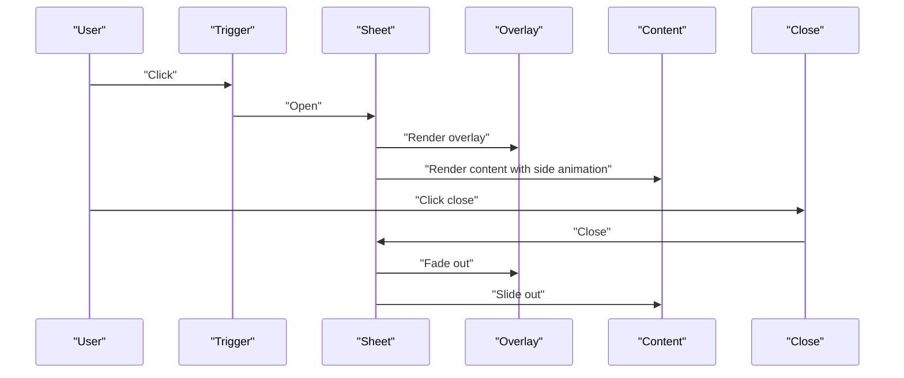

**Diagram sources**
- [sheet.jsx:16-63](file://resources/js/Components/ui/sheet.jsx#L16-L63)

**Section sources**
- [sheet.jsx:16-63](file://resources/js/Components/ui/sheet.jsx#L16-L63)

### Tooltip
- Parts and Props
  - TooltipProvider, Tooltip, TooltipTrigger, TooltipContent
  - TooltipContent: sideOffset, className, rest props
- States and Effects
  - Animations for appear/disappear and directional slides
  - Focus-visible ring on trigger
- Accessibility
  - Provider context ensures proper nesting and ARIA attributes
- Composition
  - Pair with buttons, icons, and menu items
- Theming
  - Popover background and text colors from theme

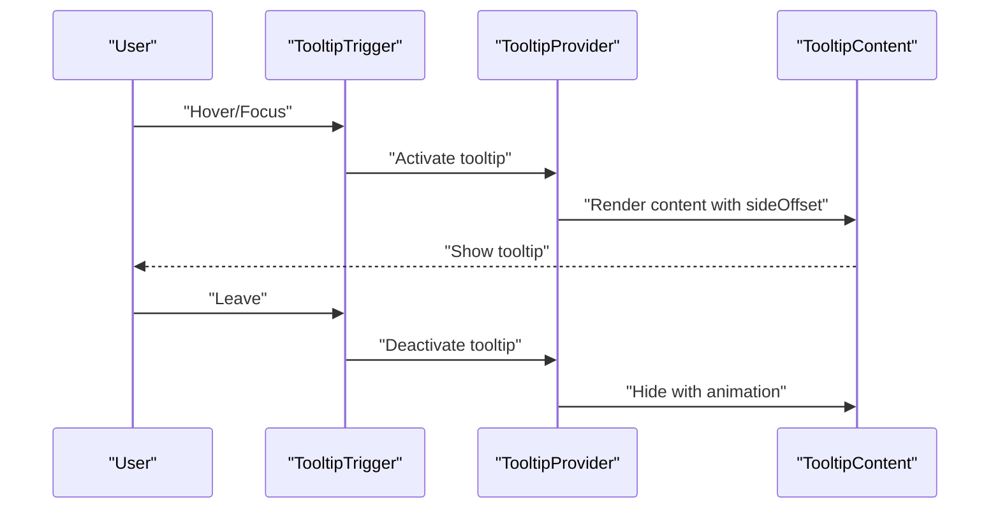

**Diagram sources**
- [tooltip.jsx:6-22](file://resources/js/Components/ui/tooltip.jsx#L6-L22)

**Section sources**
- [tooltip.jsx:6-22](file://resources/js/Components/ui/tooltip.jsx#L6-L22)

### Separator
- Props
  - className: additional Tailwind classes
  - orientation: horizontal or vertical
  - decorative: whether to expose as structural divider
- Accessibility
  - Respects decorative flag to avoid confusing assistive tech
- Composition
  - Use in menus, cards, and lists to separate content
- Theming
  - Border color from theme

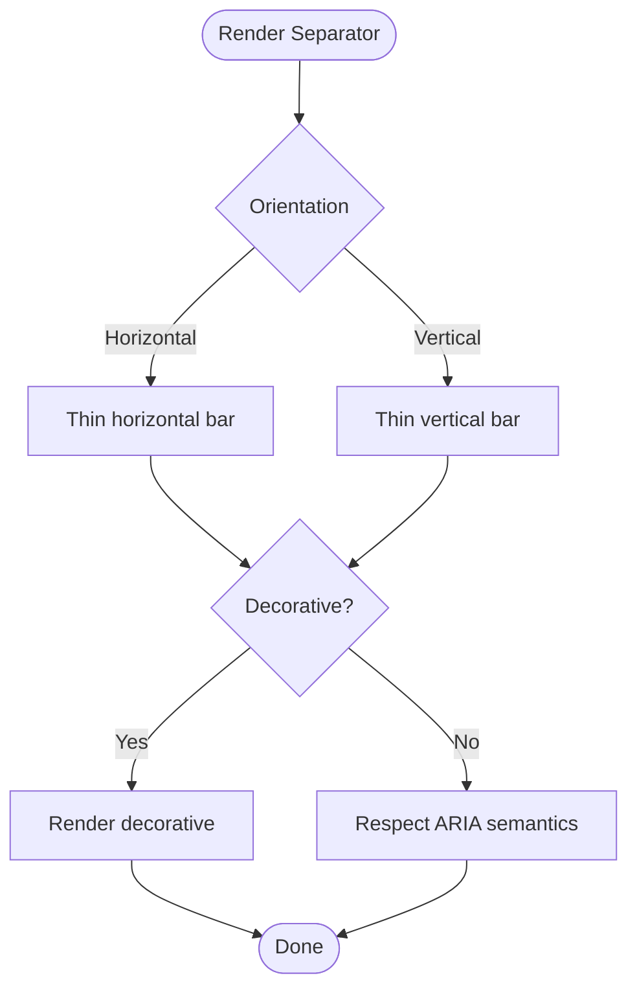

**Diagram sources**
- [separator.jsx:5-22](file://resources/js/Components/ui/separator.jsx#L5-L22)

**Section sources**
- [separator.jsx:5-22](file://resources/js/Components/ui/separator.jsx#L5-L22)

### Skeleton
- Props
  - className: additional Tailwind classes
- States and Effects
  - Animated pulse to indicate loading
- Composition
  - Placeholders for images, text, and layout areas
- Theming
  - Muted background color from theme

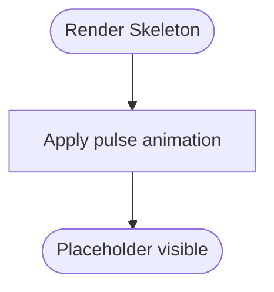

**Diagram sources**
- [skeleton.jsx:4-14](file://resources/js/Components/ui/skeleton.jsx#L4-L14)

**Section sources**
- [skeleton.jsx:4-14](file://resources/js/Components/ui/skeleton.jsx#L4-L14)

## Dependency Analysis
- Internal dependencies
  - All components depend on the cn utility for safe class merging
  - Button, Label, Separator, Skeleton import Radix UI primitives
  - Sheet composes Radix Dialog primitives
  - Tooltip composes Radix Tooltip primitives
- Theming dependencies
  - Tailwind theme defines color scales and extended brand colors
  - Base layer sets CSS variables for dark/light modes
- Composition examples
  - Sidebar composes Button, Input, Separator, Sheet, and Skeleton to build a responsive navigation shell

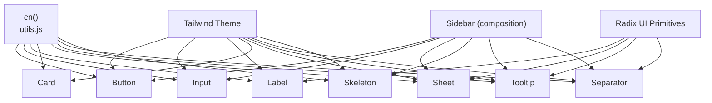

**Diagram sources**
- [utils.js:4-6](file://resources/js/lib/utils.js#L4-L6)
- [button.jsx:1-6](file://resources/js/Components/ui/button.jsx#L1-L6)
- [input.jsx:1-3](file://resources/js/Components/ui/input.jsx#L1-L3)
- [label.jsx:1-6](file://resources/js/Components/ui/label.jsx#L1-L6)
- [card.jsx:1-3](file://resources/js/Components/ui/card.jsx#L1-L3)
- [sheet.jsx:1-7](file://resources/js/Components/ui/sheet.jsx#L1-L7)
- [tooltip.jsx:1-5](file://resources/js/Components/ui/tooltip.jsx#L1-L5)
- [separator.jsx:1-4](file://resources/js/Components/ui/separator.jsx#L1-L4)
- [skeleton.jsx:1-3](file://resources/js/Components/ui/skeleton.jsx#L1-L3)
- [tailwind.config.js:14-38](file://tailwind.config.js#L14-L38)
- [sidebar.jsx:10-20](file://resources/js/Components/ui/sidebar.jsx#L10-L20)

**Section sources**
- [utils.js:4-6](file://resources/js/lib/utils.js#L4-L6)
- [tailwind.config.js:14-38](file://tailwind.config.js#L14-L38)
- [sidebar.jsx:10-20](file://resources/js/Components/ui/sidebar.jsx#L10-L20)

## Performance Considerations
- Prefer variant props over ad-hoc className overrides to keep the style surface small
- Use Skeleton sparingly; excessive placeholders can cause layout shifts
- Avoid heavy animations on low-power devices; consider prefers-reduced-motion
- Keep Sheet overlays minimal; render only necessary content inside SheetContent
- Use asChild where appropriate to reduce DOM nodes and improve composition

## Troubleshooting Guide
- Focus ring not visible
  - Ensure focus-visible ring utilities are present in your base styles
  - Verify the component exposes focus-visible ring (Button, Input, TooltipTrigger)
- Disabled state not applying
  - Confirm disabled prop is passed and className does not override opacity
- Tooltip not showing
  - Ensure TooltipProvider wraps the trigger and content
  - Check sideOffset and positioning constraints
- Sheet overlay not closing
  - Verify SheetTrigger and SheetClose are wired correctly
  - Confirm Portal rendering and overlay click handlers
- Label not associated with input
  - Use htmlFor on Label and id on Input for explicit association
  - Alternatively, wrap inputs in Label for implicit association

**Section sources**
- [button.jsx:8-8](file://resources/js/Components/ui/button.jsx#L8-L8)
- [input.jsx:9-9](file://resources/js/Components/ui/input.jsx#L9-L9)
- [tooltip.jsx:6-22](file://resources/js/Components/ui/tooltip.jsx#L6-L22)
- [sheet.jsx:16-63](file://resources/js/Components/ui/sheet.jsx#L16-L63)
- [label.jsx:11-18](file://resources/js/Components/ui/label.jsx#L11-L18)

## Conclusion
These base UI components provide a consistent, accessible, and themeable foundation. By composing them thoughtfully and adhering to the stated patterns, teams can build scalable interfaces that remain maintainable and inclusive across devices and platforms.

## Appendices

### Props Reference Summary
- Button
  - className, variant, size, asChild
- Input
  - className, type
- Label
  - className
- Card parts
  - Card, CardHeader, CardTitle, CardDescription, CardContent, CardFooter
- Sheet parts
  - Sheet, SheetTrigger, SheetClose, SheetPortal, SheetOverlay, SheetContent (side), SheetHeader, SheetFooter, SheetTitle, SheetDescription
- Tooltip parts
  - TooltipProvider, Tooltip, TooltipTrigger, TooltipContent (sideOffset)
- Separator
  - className, orientation, decorative
- Skeleton
  - className

**Section sources**
- [button.jsx:36-45](file://resources/js/Components/ui/button.jsx#L36-L45)
- [input.jsx:4-16](file://resources/js/Components/ui/input.jsx#L4-L16)
- [label.jsx:11-18](file://resources/js/Components/ui/label.jsx#L11-L18)
- [card.jsx:4-60](file://resources/js/Components/ui/card.jsx#L4-L60)
- [sheet.jsx:47-63](file://resources/js/Components/ui/sheet.jsx#L47-L63)
- [tooltip.jsx:12-22](file://resources/js/Components/ui/tooltip.jsx#L12-L22)
- [separator.jsx:5-22](file://resources/js/Components/ui/separator.jsx#L5-L22)
- [skeleton.jsx:4-14](file://resources/js/Components/ui/skeleton.jsx#L4-L14)

### Styling and Theming Guidelines
- Use Tailwind utilities for layout and spacing
- Leverage cva variants for consistent color and sizing
- Extend theme colors via tailwind.config.js for brand alignment
- Apply dark mode variables from base layer for seamless transitions
- Merge classes with cn to avoid specificity conflicts

**Section sources**
- [utils.js:4-6](file://resources/js/lib/utils.js#L4-L6)
- [tailwind.config.js:14-38](file://tailwind.config.js#L14-L38)
- [app.css:5-29](file://resources/css/app.css#L5-L29)

### Accessibility and Keyboard Navigation
- Focus management
  - Components expose focus-visible rings; ensure focus order is logical
- Screen readers
  - Use semantic HTML and labels; pair Label with Input
  - Provide sr-only text for decorative icons
- Interactions
  - Respect disabled states and pointer-events
  - Ensure tooltips and sheets are dismissible via Escape and clicks

**Section sources**
- [button.jsx:8-8](file://resources/js/Components/ui/button.jsx#L8-L8)
- [input.jsx:9-9](file://resources/js/Components/ui/input.jsx#L9-L9)
- [label.jsx:11-18](file://resources/js/Components/ui/label.jsx#L11-L18)
- [tooltip.jsx:12-22](file://resources/js/Components/ui/tooltip.jsx#L12-L22)
- [sheet.jsx:56-59](file://resources/js/Components/ui/sheet.jsx#L56-L59)

### Responsive Design and Cross-Browser Compatibility
- Responsive utilities
  - Use responsive modifiers (e.g., sm:, md:) for breakpoints
- Browser support
  - Tailwind base layer normalizes defaults
  - Polyfills may be needed for older browsers relying on modern JS features
- Device-specific behavior
  - Sheet is ideal for mobile; test gesture interactions and overlay taps
  - Tooltip placement adapts; test near viewport edges

**Section sources**
- [sheet.jsx:32-38](file://resources/js/Components/ui/sheet.jsx#L32-L38)
- [tooltip.jsx:12-22](file://resources/js/Components/ui/tooltip.jsx#L12-L22)
- [app.css:1-3](file://resources/css/app.css#L1-L3)