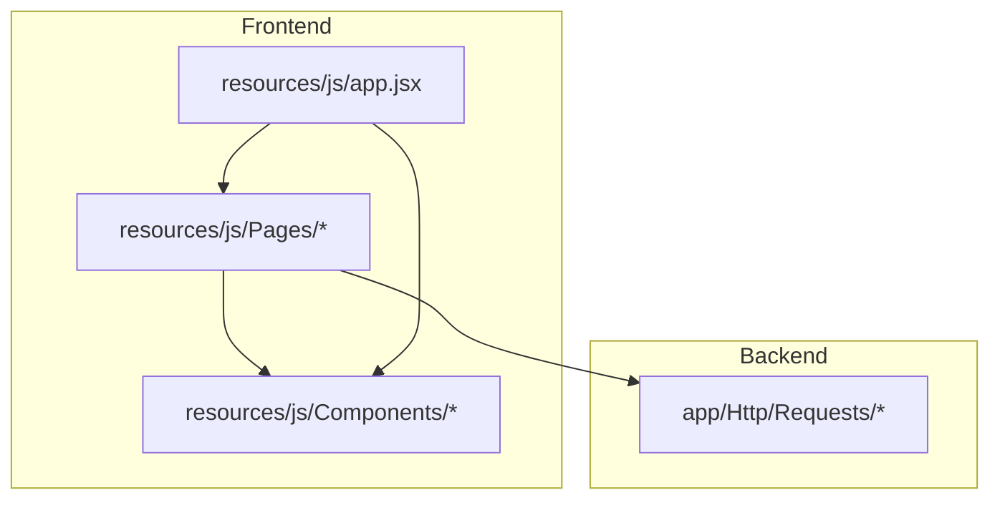
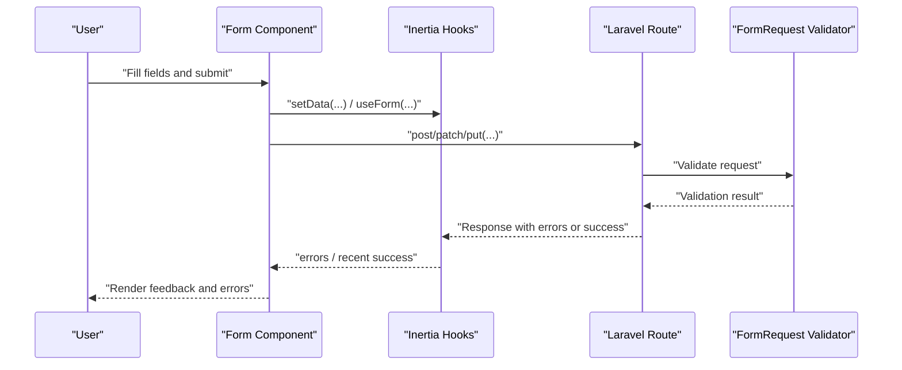
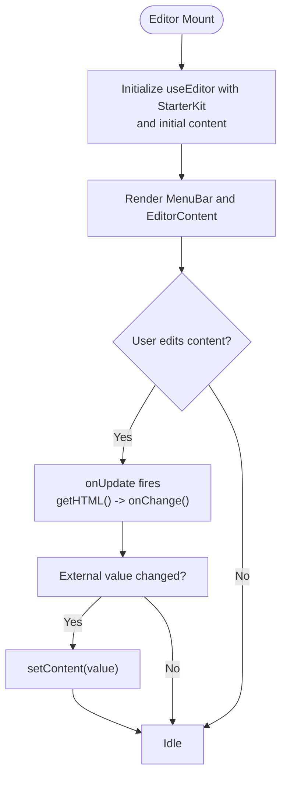
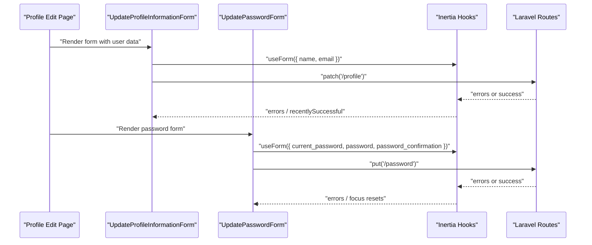
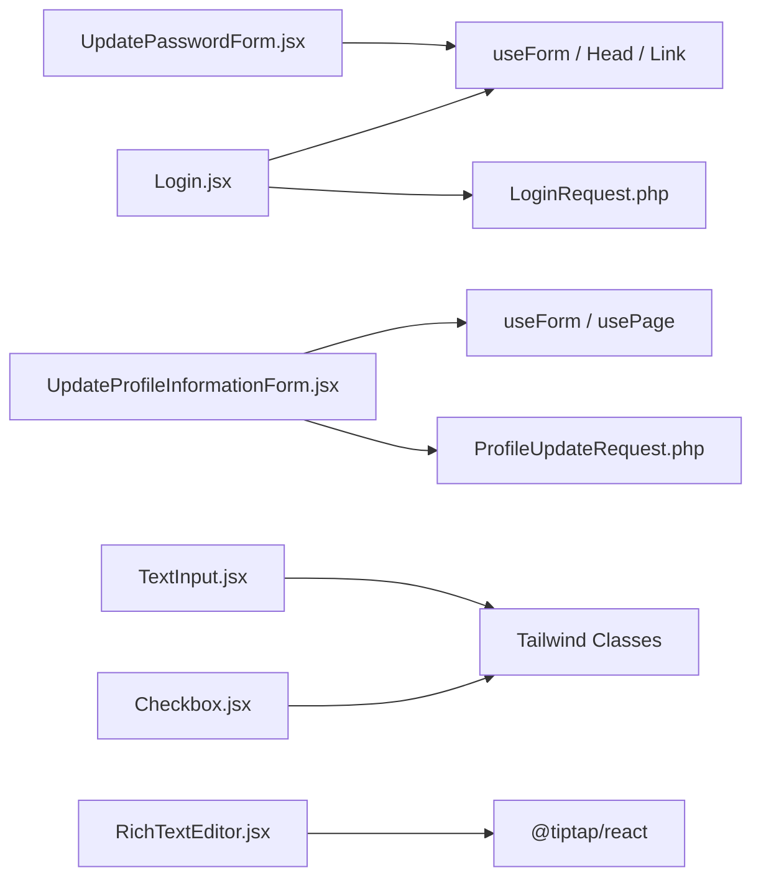

# Form Controls

<cite>
**Referenced Files in This Document**
- [Checkbox.jsx](file://resources/js/Components/Checkbox.jsx)
- [RichTextEditor.jsx](file://resources/js/Components/RichTextEditor.jsx)
- [TextInput.jsx](file://resources/js/Components/TextInput.jsx)
- [InputError.jsx](file://resources/js/Components/InputError.jsx)
- [InputLabel.jsx](file://resources/js/Components/InputLabel.jsx)
- [Login.jsx](file://resources/js/Pages/Auth/Login.jsx)
- [UpdateProfileInformationForm.jsx](file://resources/js/Pages/Profile/Partials/UpdateProfileInformationForm.jsx)
- [UpdatePasswordForm.jsx](file://resources/js/Pages/Profile/Partials/UpdatePasswordForm.jsx)
- [Edit.jsx](file://resources/js/Pages/Profile/Edit.jsx)
- [LoginRequest.php](file://app/Http/Requests/Auth/LoginRequest.php)
- [ProfileUpdateRequest.php](file://app/Http/Requests/ProfileUpdateRequest.php)
- [app.jsx](file://resources/js/app.jsx)
</cite>

## Table of Contents
1. [Introduction](#introduction)
2. [Project Structure](#project-structure)
3. [Core Components](#core-components)
4. [Architecture Overview](#architecture-overview)
5. [Detailed Component Analysis](#detailed-component-analysis)
6. [Dependency Analysis](#dependency-analysis)
7. [Performance Considerations](#performance-considerations)
8. [Accessibility Guidelines](#accessibility-guidelines)
9. [Styling and Responsive Design](#styling-and-responsive-design)
10. [Troubleshooting Guide](#troubleshooting-guide)
11. [Conclusion](#conclusion)

## Introduction
This document provides comprehensive guidance for form controls and validation in the project, focusing on reusable components such as checkboxes, rich text editors, and text inputs, along with validation patterns and error handling. It explains how form state is managed using Inertia.js hooks, how frontend components integrate with Laravel backend validation requests, and how to build complex forms with multiple validation rules and conditional rendering. Accessibility, styling, responsiveness, and mobile optimization are also covered to ensure inclusive and usable forms.

## Project Structure
The form-related code is organized around:
- Reusable UI components under resources/js/Components
- Example forms under resources/js/Pages
- Backend validation under app/Http/Requests
- Inertia.js bootstrapping under resources/js/app.jsx

**Diagram sources**
- [app.jsx:1-26](file://resources/js/app.jsx#L1-L26)
- [Login.jsx:1-204](file://resources/js/Pages/Auth/Login.jsx#L1-L204)
- [UpdateProfileInformationForm.jsx:1-95](file://resources/js/Pages/Profile/Partials/UpdateProfileInformationForm.jsx#L1-L95)
- [UpdatePasswordForm.jsx:1-147](file://resources/js/Pages/Profile/Partials/UpdatePasswordForm.jsx#L1-L147)
- [LoginRequest.php:1-87](file://app/Http/Requests/Auth/LoginRequest.php#L1-L87)
- [ProfileUpdateRequest.php:1-32](file://app/Http/Requests/ProfileUpdateRequest.php#L1-L32)

**Section sources**
- [app.jsx:1-26](file://resources/js/app.jsx#L1-L26)

## Core Components
This section documents the core form components and their responsibilities.

- Checkbox: A minimal checkbox input wrapper with consistent styling and optional className extension.
- RichTextEditor: A TipTap-powered editor with toolbar actions, controlled via onChange and value props, and focused editing experience.
- TextInput: A forwardRef-enabled text input supporting autofocus, imperative focus control, and consistent styling.
- InputError: A lightweight error message renderer that displays only when a message exists.
- InputLabel: A label component that renders either a passed value or children with consistent typography and spacing.

Implementation highlights:
- Checkbox and TextInput apply consistent Tailwind utility classes for rounded borders, focus rings, and indigo accents.
- RichTextEditor integrates TipTap StarterKit, exposes HTML content via onChange, and updates internal content when value changes externally.
- InputError and InputLabel provide predictable markup for accessible forms.

**Section sources**
- [Checkbox.jsx:1-13](file://resources/js/Components/Checkbox.jsx#L1-L13)
- [RichTextEditor.jsx:1-131](file://resources/js/Components/RichTextEditor.jsx#L1-L131)
- [TextInput.jsx:1-31](file://resources/js/Components/TextInput.jsx#L1-L31)
- [InputError.jsx:1-11](file://resources/js/Components/InputError.jsx#L1-L11)
- [InputLabel.jsx:1-19](file://resources/js/Components/InputLabel.jsx#L1-L19)

## Architecture Overview
The form architecture follows a unidirectional data flow:
- Components manage local state via Inertia.js useForm/usePage.
- Forms dispatch actions (post/patch/put) to Laravel routes.
- Laravel FormRequest validates incoming data and returns validation errors to the frontend.
- Frontend components render errors and success states using InputError and transitions.

**Diagram sources**
- [Login.jsx:8-20](file://resources/js/Pages/Auth/Login.jsx#L8-L20)
- [UpdateProfileInformationForm.jsx:14-24](file://resources/js/Pages/Profile/Partials/UpdateProfileInformationForm.jsx#L14-L24)
- [UpdatePasswordForm.jsx:13-44](file://resources/js/Pages/Profile/Partials/UpdatePasswordForm.jsx#L13-L44)
- [LoginRequest.php:28-34](file://app/Http/Requests/Auth/LoginRequest.php#L28-L34)
- [ProfileUpdateRequest.php:17-30](file://app/Http/Requests/ProfileUpdateRequest.php#L17-L30)

## Detailed Component Analysis

### Checkbox Component
Purpose:
- Provide a styled checkbox input with consistent appearance and optional className extension.

Behavior:
- Spreads additional props to the native input element.
- Applies rounded borders, indigo accent color, and focus ring styles.

Accessibility considerations:
- Ensure labels are programmatically associated via htmlFor to enable keyboard focus and screen reader announcements.

Usage patterns:
- Use with form state to toggle boolean values and render server-side errors conditionally.

**Section sources**
- [Checkbox.jsx:1-13](file://resources/js/Components/Checkbox.jsx#L1-L13)

### RichTextEditor Component
Purpose:
- Deliver a WYSIWYG-like editing experience with toolbar controls and HTML output.

Key features:
- Toolbar buttons for bold, italic, headings, lists, blockquote, undo, and redo.
- Controlled via value and onChange props; updates external state on content change.
- Prose-focused editor content area with minimum height and padding.
- External content synchronization via useEffect when value changes.

Processing logic:
- Uses TipTap’s useEditor with StarterKit.
- Updates editor content when value prop changes.
- Emits HTML via onChange on editor updates.

**Diagram sources**
- [RichTextEditor.jsx:101-122](file://resources/js/Components/RichTextEditor.jsx#L101-L122)

Accessibility considerations:
- Provide visible focus indicators and keyboard shortcuts for toolbar actions.
- Announce active states (e.g., bold/italic) to assistive technologies.

**Section sources**
- [RichTextEditor.jsx:1-131](file://resources/js/Components/RichTextEditor.jsx#L1-L131)

### TextInput Component
Purpose:
- Provide a reusable text input with optional autofocus and imperative focus control.

Capabilities:
- ForwardRef enables parent components to call focus().
- Auto-focus behavior when isFocused is true.
- Consistent styling for rounded borders, focus rings, and indigo emphasis.

Usage patterns:
- Integrate with useForm to bind value and onChange handlers.
- Use with InputLabel and InputError for accessible labeling and error display.

**Section sources**
- [TextInput.jsx:1-31](file://resources/js/Components/TextInput.jsx#L1-L31)

### InputError and InputLabel
Purpose:
- InputError: Conditionally render error messages with consistent styling.
- InputLabel: Render labels with consistent typography and spacing.

Patterns:
- InputError renders only when a message exists, preventing empty spans.
- InputLabel supports either value or children, enabling flexible label composition.

**Section sources**
- [InputError.jsx:1-11](file://resources/js/Components/InputError.jsx#L1-L11)
- [InputLabel.jsx:1-19](file://resources/js/Components/InputLabel.jsx#L1-L19)

### Example Forms: Login, Profile Update, Password Update
These pages demonstrate practical form state management and validation integration.

- Login page:
  - Uses useForm to manage email, password, and remember fields.
  - Submits via post to a route with onFinish handling.
  - Renders per-field errors using inline error paragraphs.

- Profile Information Update:
  - Initializes useForm with user data from usePage().
  - Submits via patch to profile.update.
  - Displays a success message after save using transition states.

- Password Update:
  - Manages current_password, password, and password_confirmation.
  - Submits via put to password.update with preserveScroll and error-driven focus resets.
  - Resets specific fields on validation errors and focuses the appropriate input.

**Diagram sources**
- [Edit.jsx:1-35](file://resources/js/Pages/Profile/Edit.jsx#L1-L35)
- [UpdateProfileInformationForm.jsx:14-24](file://resources/js/Pages/Profile/Partials/UpdateProfileInformationForm.jsx#L14-L24)
- [UpdatePasswordForm.jsx:13-44](file://resources/js/Pages/Profile/Partials/UpdatePasswordForm.jsx#L13-L44)

**Section sources**
- [Login.jsx:8-20](file://resources/js/Pages/Auth/Login.jsx#L8-L20)
- [UpdateProfileInformationForm.jsx:14-24](file://resources/js/Pages/Profile/Partials/UpdateProfileInformationForm.jsx#L14-L24)
- [UpdatePasswordForm.jsx:13-44](file://resources/js/Pages/Profile/Partials/UpdatePasswordForm.jsx#L13-L44)
- [Edit.jsx:1-35](file://resources/js/Pages/Profile/Edit.jsx#L1-L35)

## Dependency Analysis
Form components depend on:
- Inertia.js hooks (useForm, usePage, Link) for state and navigation.
- Laravel FormRequest classes for validation rules and error messages.
- Tailwind CSS for styling and responsive behavior.

**Diagram sources**
- [Login.jsx:1-3](file://resources/js/Pages/Auth/Login.jsx#L1-L3)
- [UpdateProfileInformationForm.jsx:1-6](file://resources/js/Pages/Profile/Partials/UpdateProfileInformationForm.jsx#L1-L6)
- [UpdatePasswordForm.jsx:1-7](file://resources/js/Pages/Profile/Partials/UpdatePasswordForm.jsx#L1-L7)
- [LoginRequest.php:1-87](file://app/Http/Requests/Auth/LoginRequest.php#L1-L87)
- [ProfileUpdateRequest.php:1-32](file://app/Http/Requests/ProfileUpdateRequest.php#L1-L32)
- [Checkbox.jsx:1-13](file://resources/js/Components/Checkbox.jsx#L1-L13)
- [TextInput.jsx:1-31](file://resources/js/Components/TextInput.jsx#L1-L31)
- [RichTextEditor.jsx:1-14](file://resources/js/Components/RichTextEditor.jsx#L1-L14)

**Section sources**
- [Login.jsx:1-3](file://resources/js/Pages/Auth/Login.jsx#L1-L3)
- [UpdateProfileInformationForm.jsx:1-6](file://resources/js/Pages/Profile/Partials/UpdateProfileInformationForm.jsx#L1-L6)
- [UpdatePasswordForm.jsx:1-7](file://resources/js/Pages/Profile/Partials/UpdatePasswordForm.jsx#L1-L7)
- [LoginRequest.php:28-34](file://app/Http/Requests/Auth/LoginRequest.php#L28-L34)
- [ProfileUpdateRequest.php:17-30](file://app/Http/Requests/ProfileUpdateRequest.php#L17-L30)

## Performance Considerations
- Minimize re-renders by keeping form state granular and updating only necessary fields.
- Debounce expensive validations (e.g., uniqueness checks) to reduce backend load.
- Use lazy loading for rich text editor initialization when forms are offscreen.
- Avoid unnecessary prop drilling by grouping related fields and passing shared state via useForm.

## Accessibility Guidelines
Keyboard navigation:
- Ensure all interactive elements (inputs, buttons, toolbar) are reachable via Tab.
- Provide visible focus indicators and skip links for long forms.

Labels and ARIA:
- Associate labels with inputs using htmlFor/id.
- Use aria-describedby for helper text or error messages.
- Announce error states with role="alert" when appropriate.

Screen reader support:
- Use InputLabel to render semantic labels.
- Display InputError messages immediately adjacent to inputs.
- Announce success states via live regions or visually hidden messages.

Color contrast and focus:
- Maintain sufficient contrast for text, borders, and focus rings.
- Ensure focus outlines are visible and not overridden by custom styles.

## Styling and Responsive Design
- Use Tailwind utilities for consistent spacing, typography, and focus states.
- Apply responsive breakpoints to adjust layout and font sizes across devices.
- Ensure inputs and buttons maintain touch-friendly targets on mobile.
- Preserve readable line heights and adequate padding for content-rich forms.

Mobile optimization:
- Prefer stacked layouts on small screens; switch to grid or split-pane on larger screens.
- Use safe areas and viewport units to avoid content cutoff.
- Test gesture interactions (swipe, pinch) with rich text editor and avoid conflicting shortcuts.

## Troubleshooting Guide
Common issues and resolutions:
- Empty or missing error messages:
  - Verify that useForm receives errors from the backend and that InputError is rendered conditionally.
  - Check that Laravel FormRequest rules match the submitted field names.

- Rich text editor not updating:
  - Confirm value prop changes trigger setContent in useEffect.
  - Ensure onChange emits HTML content and that parent state updates accordingly.

- Focus resets on validation failures:
  - Use refs with TextInput to programmatically focus the correct input on error.
  - Reset only affected fields to avoid clearing unrelated data.

- Styling inconsistencies:
  - Standardize component classes across Checkbox, TextInput, and InputError.
  - Use theme tokens (e.g., indigo focus ring) consistently.

**Section sources**
- [InputError.jsx:1-11](file://resources/js/Components/InputError.jsx#L1-L11)
- [RichTextEditor.jsx:118-122](file://resources/js/Components/RichTextEditor.jsx#L118-L122)
- [UpdatePasswordForm.jsx:33-44](file://resources/js/Pages/Profile/Partials/UpdatePasswordForm.jsx#L33-L44)
- [LoginRequest.php:28-34](file://app/Http/Requests/Auth/LoginRequest.php#L28-L34)
- [ProfileUpdateRequest.php:17-30](file://app/Http/Requests/ProfileUpdateRequest.php#L17-L30)

## Conclusion
The project’s form system combines reusable React components with Inertia.js state management and robust Laravel validation. By following the patterns outlined here—consistent component APIs, explicit error rendering, accessible labeling, and responsive design—you can build reliable, user-friendly forms that scale across complex scenarios. Integrate rich text editing where needed, enforce strong validation rules, and prioritize accessibility and mobile usability for inclusive experiences.