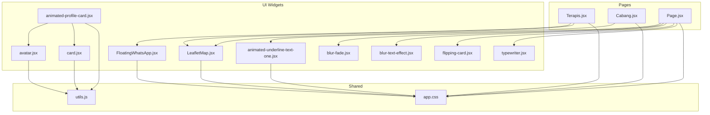
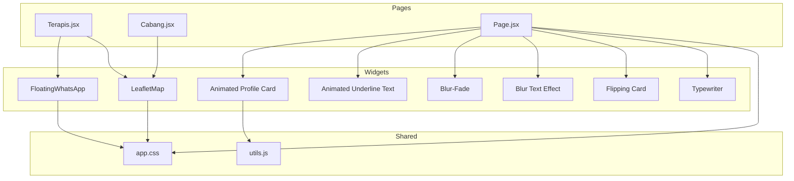
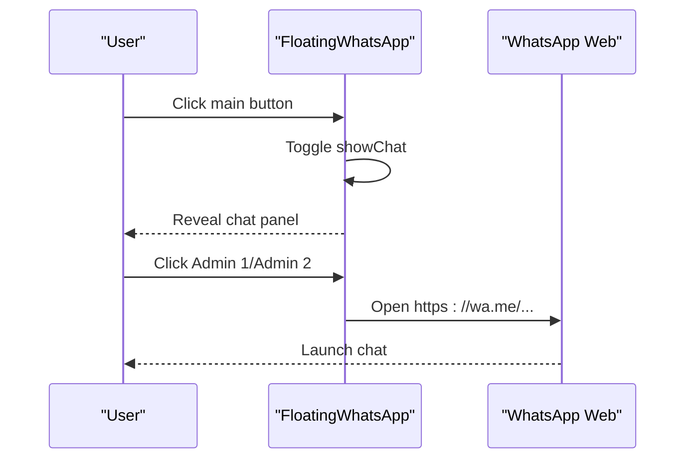
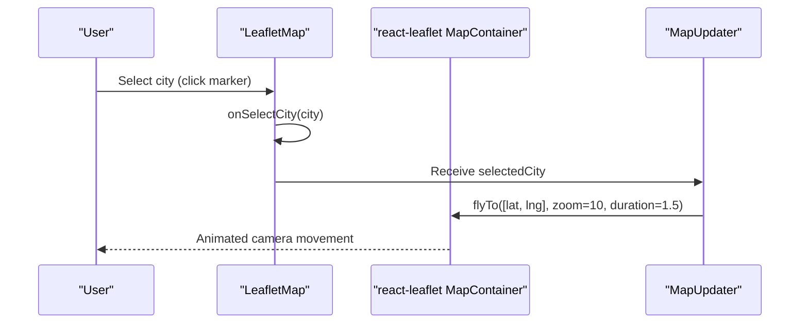
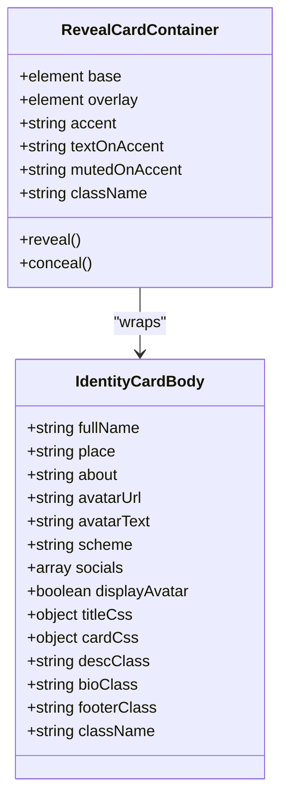
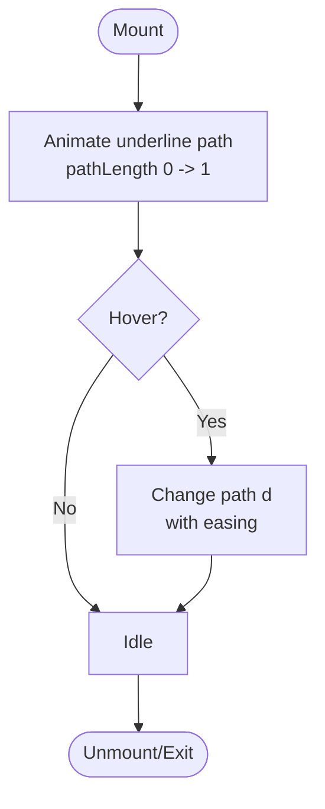
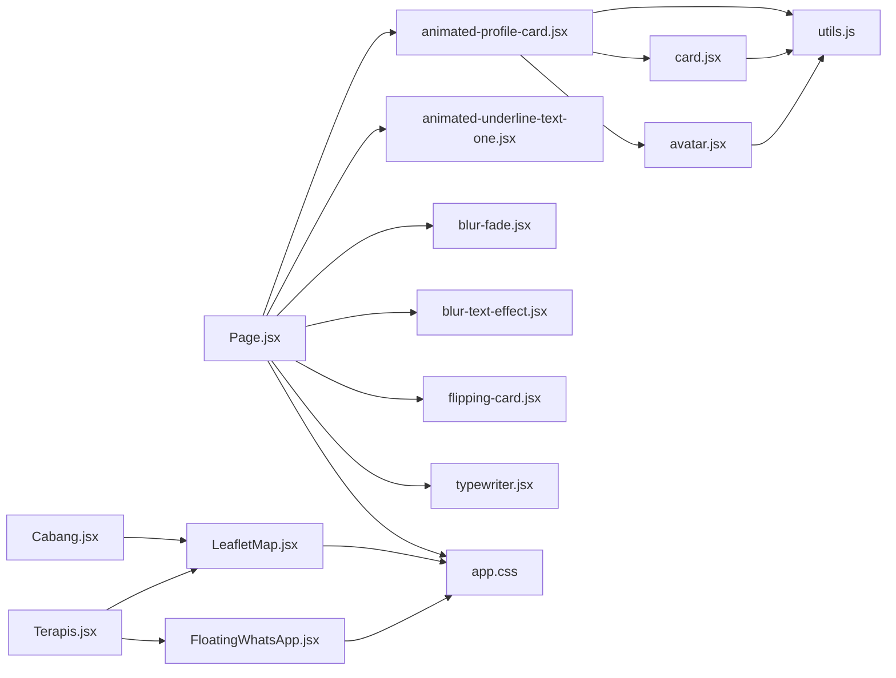

# Interactive Widgets

<cite>
**Referenced Files in This Document**
- [FloatingWhatsApp.jsx](file://resources/js/Components/ui/FloatingWhatsApp.jsx)
- [LeafletMap.jsx](file://resources/js/Components/ui/LeafletMap.jsx)
- [animated-profile-card.jsx](file://resources/js/Components/ui/animated-profile-card.jsx)
- [animated-profile-card-demo.jsx](file://resources/js/Components/ui/animated-profile-card-demo.jsx)
- [animated-underline-text-one.jsx](file://resources/js/Components/ui/animated-underline-text-one.jsx)
- [avatar.jsx](file://resources/js/Components/ui/avatar.jsx)
- [card.jsx](file://resources/js/Components/ui/card.jsx)
- [utils.js](file://resources/js/lib/utils.js)
- [app.css](file://resources/css/app.css)
- [Terapis.jsx](file://resources/js/Pages/Guest/Terapis.jsx)
- [Cabang.jsx](file://resources/js/Pages/Guest/Cabang.jsx)
- [Page.jsx](file://resources/js/Pages/Guest/Page.jsx)
- [blur-fade.jsx](file://resources/js/Components/ui/blur-fade.jsx)
- [blur-text-effect.jsx](file://resources/js/Components/ui/blur-text-effect.jsx)
- [flipping-card.jsx](file://resources/js/Components/ui/flipping-card.jsx)
- [typewriter.jsx](file://resources/js/Components/ui/typewriter.jsx)
</cite>

## Table of Contents
1. [Introduction](#introduction)
2. [Project Structure](#project-structure)
3. [Core Components](#core-components)
4. [Architecture Overview](#architecture-overview)
5. [Detailed Component Analysis](#detailed-component-analysis)
6. [Dependency Analysis](#dependency-analysis)
7. [Performance Considerations](#performance-considerations)
8. [Troubleshooting Guide](#troubleshooting-guide)
9. [Conclusion](#conclusion)
10. [Appendices](#appendices)

## Introduction
This document provides comprehensive documentation for interactive widgets used across the application, focusing on:
- Floating WhatsApp integration
- Interactive Leaflet map with dynamic markers and fly-to behavior
- Animated profile cards with reveal effects powered by GSAP
- Animated text effects with SVG underlines and framer-motion

It covers configuration options, event handlers, customization parameters, integration examples with external APIs, animation properties, performance optimizations, responsive behavior, accessibility considerations, and mobile compatibility. It also includes troubleshooting guidance for common integration issues.

## Project Structure
The interactive widgets are implemented as reusable React components located under resources/js/Components/ui/. They integrate with page-level components under resources/js/Pages/Guest/ to demonstrate real-world usage. Shared utilities and styles live under resources/js/lib/utils.js and resources/css/app.css.

**Diagram sources**
- [FloatingWhatsApp.jsx:1-214](file://resources/js/Components/ui/FloatingWhatsApp.jsx#L1-L214)
- [LeafletMap.jsx:1-78](file://resources/js/Components/ui/LeafletMap.jsx#L1-L78)
- [animated-profile-card.jsx:1-224](file://resources/js/Components/ui/animated-profile-card.jsx#L1-L224)
- [animated-underline-text-one.jsx:1-78](file://resources/js/Components/ui/animated-underline-text-one.jsx#L1-L78)
- [avatar.jsx:1-42](file://resources/js/Components/ui/avatar.jsx#L1-L42)
- [card.jsx:1-61](file://resources/js/Components/ui/card.jsx#L1-L61)
- [blur-fade.jsx:1-47](file://resources/js/Components/ui/blur-fade.jsx#L1-L47)
- [blur-text-effect.jsx:1-39](file://resources/js/Components/ui/blur-text-effect.jsx#L1-L39)
- [flipping-card.jsx:1-55](file://resources/js/Components/ui/flipping-card.jsx#L1-L55)
- [typewriter.jsx:1-115](file://resources/js/Components/ui/typewriter.jsx#L1-L115)
- [Terapis.jsx:1-342](file://resources/js/Pages/Guest/Terapis.jsx#L1-L342)
- [Cabang.jsx:1-393](file://resources/js/Pages/Guest/Cabang.jsx#L1-L393)
- [Page.jsx:1-545](file://resources/js/Pages/Guest/Page.jsx#L1-L545)
- [utils.js:1-7](file://resources/js/lib/utils.js#L1-L7)
- [app.css:1-30](file://resources/css/app.css#L1-L30)

**Section sources**
- [FloatingWhatsApp.jsx:1-214](file://resources/js/Components/ui/FloatingWhatsApp.jsx#L1-L214)
- [LeafletMap.jsx:1-78](file://resources/js/Components/ui/LeafletMap.jsx#L1-L78)
- [animated-profile-card.jsx:1-224](file://resources/js/Components/ui/animated-profile-card.jsx#L1-L224)
- [animated-underline-text-one.jsx:1-78](file://resources/js/Components/ui/animated-underline-text-one.jsx#L1-L78)
- [avatar.jsx:1-42](file://resources/js/Components/ui/avatar.jsx#L1-L42)
- [card.jsx:1-61](file://resources/js/Components/ui/card.jsx#L1-L61)
- [blur-fade.jsx:1-47](file://resources/js/Components/ui/blur-fade.jsx#L1-L47)
- [blur-text-effect.jsx:1-39](file://resources/js/Components/ui/blur-text-effect.jsx#L1-L39)
- [flipping-card.jsx:1-55](file://resources/js/Components/ui/flipping-card.jsx#L1-L55)
- [typewriter.jsx:1-115](file://resources/js/Components/ui/typewriter.jsx#L1-L115)
- [Terapis.jsx:1-342](file://resources/js/Pages/Guest/Terapis.jsx#L1-L342)
- [Cabang.jsx:1-393](file://resources/js/Pages/Guest/Cabang.jsx#L1-L393)
- [Page.jsx:1-545](file://resources/js/Pages/Guest/Page.jsx#L1-L545)
- [utils.js:1-7](file://resources/js/lib/utils.js#L1-L7)
- [app.css:1-30](file://resources/css/app.css#L1-L30)

## Core Components
This section documents each interactive widget’s purpose, configuration, events, and customization options.

- FloatingWhatsApp
  - Purpose: A floating, animated button that reveals a chat preview panel with two clickable links to WhatsApp numbers.
  - Key behaviors:
    - Delayed visibility after page load
    - Animated tooltip and main button with pulse and bounce effects
    - Toggleable chat panel with spring animations
    - Icon toggles between WhatsApp icon and close icon
  - Configuration options:
    - None exposed as props; hardcoded phone numbers and messages
  - Event handlers:
    - Click on tooltip/button toggles chat panel
    - Click on “close” hides chat panel
    - Click on “Admin 1/Admin 2” opens external WhatsApp links in new tabs
  - Accessibility:
    - Uses semantic buttons and SVG icons
    - Close button has keyboard-accessible focus styles
  - Mobile compatibility:
    - Large touch targets, fixed positioning, and pointer-events controls ensure usability on small screens

- LeafletMap
  - Purpose: A styled map with custom markers, city selection, and fly-to transitions.
  - Key behaviors:
    - Custom marker rendering via divIcon with Tailwind classes
    - Fly-to animation to selected city coordinates
    - Popup with city and address
  - Configuration options:
    - branches: array of branch objects with latitude/longitude and address
    - selectedCity: currently selected city string
    - onSelectCity: callback receiving the chosen city
  - Event handlers:
    - Marker click triggers onSelectCity
  - External integrations:
    - Uses Carto basemap tiles
    - Opens Google Maps for directions via external link

- Animated Profile Card
  - Purpose: A layered card with identity content and an overlay that reveals on hover, using GSAP for animations.
  - Key behaviors:
    - Base card with avatar, title, description, and optional social links
    - Overlay card with accent theme and avatar toggle
    - Idle floating animation and reveal/conceal on mouse enter/leave
  - Configuration options:
    - IdentityCardBody:
      - fullName, place, about, avatarUrl, avatarText, scheme ("plain" or "accented")
      - socials: array of { id, url, label, icon }
      - displayAvatar: toggle avatar visibility
      - titleCss, cardCss, descClass, bioClass, footerClass, className
    - RevealCardContainer:
      - base, overlay, accent, textOnAccent, mutedOnAccent, className
  - Event handlers:
    - Mouse enter/leave trigger reveal/conceal
  - Accessibility:
    - Social links include aria-labels
    - Focus styles via parent card

- Animated Underline Text
  - Purpose: A headline with animated SVG underline that responds to hover.
  - Key behaviors:
    - Initial fade-in and slight scale-up
    - Animated underline path drawing on mount
    - Hover changes underline shape and easing
  - Configuration options:
    - text, textClassName, underlineClassName
    - underlinePath, underlineHoverPath, underlineDuration
  - Event handlers:
    - whileHover scaling on text
    - whileHover path change on underline

**Section sources**
- [FloatingWhatsApp.jsx:1-214](file://resources/js/Components/ui/FloatingWhatsApp.jsx#L1-L214)
- [LeafletMap.jsx:1-78](file://resources/js/Components/ui/LeafletMap.jsx#L1-L78)
- [animated-profile-card.jsx:1-224](file://resources/js/Components/ui/animated-profile-card.jsx#L1-L224)
- [animated-underline-text-one.jsx:1-78](file://resources/js/Components/ui/animated-underline-text-one.jsx#L1-L78)
- [avatar.jsx:1-42](file://resources/js/Components/ui/avatar.jsx#L1-L42)
- [card.jsx:1-61](file://resources/js/Components/ui/card.jsx#L1-L61)
- [utils.js:1-7](file://resources/js/lib/utils.js#L1-L7)
- [app.css:1-30](file://resources/css/app.css#L1-L30)

## Architecture Overview
The widgets are composed into page layouts to deliver cohesive user experiences. Pages orchestrate data fetching and pass props to widgets. Styles are centralized via Tailwind and CSS variables.

**Diagram sources**
- [Terapis.jsx:1-342](file://resources/js/Pages/Guest/Terapis.jsx#L1-L342)
- [Cabang.jsx:1-393](file://resources/js/Pages/Guest/Cabang.jsx#L1-L393)
- [Page.jsx:1-545](file://resources/js/Pages/Guest/Page.jsx#L1-L545)
- [FloatingWhatsApp.jsx:1-214](file://resources/js/Components/ui/FloatingWhatsApp.jsx#L1-L214)
- [LeafletMap.jsx:1-78](file://resources/js/Components/ui/LeafletMap.jsx#L1-L78)
- [animated-profile-card.jsx:1-224](file://resources/js/Components/ui/animated-profile-card.jsx#L1-L224)
- [animated-underline-text-one.jsx:1-78](file://resources/js/Components/ui/animated-underline-text-one.jsx#L1-L78)
- [blur-fade.jsx:1-47](file://resources/js/Components/ui/blur-fade.jsx#L1-L47)
- [blur-text-effect.jsx:1-39](file://resources/js/Components/ui/blur-text-effect.jsx#L1-L39)
- [flipping-card.jsx:1-55](file://resources/js/Components/ui/flipping-card.jsx#L1-L55)
- [typewriter.jsx:1-115](file://resources/js/Components/ui/typewriter.jsx#L1-L115)
- [utils.js:1-7](file://resources/js/lib/utils.js#L1-L7)
- [app.css:1-30](file://resources/css/app.css#L1-L30)

## Detailed Component Analysis

### FloatingWhatsApp
- Implementation highlights:
  - Uses AnimatePresence and motion primitives for smooth entrance/exit
  - Two-tiered animations: tooltip and main button with different easing and delays
  - Icon toggling via AnimatePresence with key-based switching
  - Notification badge with bounce animation
- Configuration and customization:
  - Colors and brand accents controlled via CSS variables and Tailwind utilities
  - No props; phone numbers and pre-filled message are embedded
- Integration example:
  - Included on team and branch pages to provide instant consultation access
- Accessibility and mobile:
  - Large hit areas, fixed positioning, and pointer-events management ensure touch-friendly interactions

**Diagram sources**
- [FloatingWhatsApp.jsx:1-214](file://resources/js/Components/ui/FloatingWhatsApp.jsx#L1-L214)

**Section sources**
- [FloatingWhatsApp.jsx:1-214](file://resources/js/Components/ui/FloatingWhatsApp.jsx#L1-L214)
- [Terapis.jsx:1-342](file://resources/js/Pages/Guest/Terapis.jsx#L1-L342)
- [Cabang.jsx:1-393](file://resources/js/Pages/Guest/Cabang.jsx#L1-L393)

### LeafletMap
- Implementation highlights:
  - Custom marker via divIcon to render animated dots with ring and pulse effects
  - MapUpdater component uses useMap to fly-to selected city with configurable duration
  - Popups display city and address
- Configuration and customization:
  - Props: branches, selectedCity, onSelectCity
  - Styling via Tailwind classes applied to marker HTML and popup
- Integration example:
  - Used in the Branches page to visualize locations and enable city selection
- External APIs:
  - Basemap tiles from CARTO
  - Directions open external link to Google Maps

**Diagram sources**
- [LeafletMap.jsx:1-78](file://resources/js/Components/ui/LeafletMap.jsx#L1-L78)

**Section sources**
- [LeafletMap.jsx:1-78](file://resources/js/Components/ui/LeafletMap.jsx#L1-L78)
- [Cabang.jsx:1-393](file://resources/js/Pages/Guest/Cabang.jsx#L1-L393)

### Animated Profile Card
- Implementation highlights:
  - IdentityCardBody composes Avatar and Card components with optional social links
  - RevealCardContainer wraps base and overlay cards with GSAP-driven clip-path reveal
  - Idle floating animation using GSAP yoyo
- Configuration and customization:
  - IdentityCardBody supports scheme, displayAvatar, and style overrides
  - RevealCardContainer accepts accent colors and overlay content
- Integration example:
  - Demonstrated in animated-profile-card-demo.jsx with a sample profile
- Accessibility:
  - Social links include aria-labels and target="_blank" with rel="noopener noreferrer"

**Diagram sources**
- [animated-profile-card.jsx:1-224](file://resources/js/Components/ui/animated-profile-card.jsx#L1-L224)
- [avatar.jsx:1-42](file://resources/js/Components/ui/avatar.jsx#L1-L42)
- [card.jsx:1-61](file://resources/js/Components/ui/card.jsx#L1-L61)

**Section sources**
- [animated-profile-card.jsx:1-224](file://resources/js/Components/ui/animated-profile-card.jsx#L1-L224)
- [animated-profile-card-demo.jsx:1-48](file://resources/js/Components/ui/animated-profile-card-demo.jsx#L1-L48)
- [avatar.jsx:1-42](file://resources/js/Components/ui/avatar.jsx#L1-L42)
- [card.jsx:1-61](file://resources/js/Components/ui/card.jsx#L1-L61)

### Animated Underline Text
- Implementation highlights:
  - Uses framer-motion for text fade-in and subtle scale
  - SVG path animates underline length on mount and on hover
  - Configurable path shapes and durations
- Configuration and customization:
  - text, textClassName, underlineClassName
  - underlinePath, underlineHoverPath, underlineDuration
- Integration example:
  - Used in Page.jsx for hero headings and emphasis

**Diagram sources**
- [animated-underline-text-one.jsx:1-78](file://resources/js/Components/ui/animated-underline-text-one.jsx#L1-L78)

**Section sources**
- [animated-underline-text-one.jsx:1-78](file://resources/js/Components/ui/animated-underline-text-one.jsx#L1-L78)
- [Page.jsx:1-545](file://resources/js/Pages/Guest/Page.jsx#L1-L545)

### Additional Text Effects and Cards
- Blur-Fade: A generic motion wrapper with blur and y-offset transitions, ideal for page sections and hero blocks.
- Blur Text Effect: Character-level GSAP blur reveal for headings and titles.
- Flipping Card: 3D flip effect with front/back content and customizable accent color.
- Typewriter: Multi-text looping typewriter with configurable speed, wait time, and cursor animation.

These components complement the primary widgets and can be composed similarly to the animated underline text.

**Section sources**
- [blur-fade.jsx:1-47](file://resources/js/Components/ui/blur-fade.jsx#L1-L47)
- [blur-text-effect.jsx:1-39](file://resources/js/Components/ui/blur-text-effect.jsx#L1-L39)
- [flipping-card.jsx:1-55](file://resources/js/Components/ui/flipping-card.jsx#L1-L55)
- [typewriter.jsx:1-115](file://resources/js/Components/ui/typewriter.jsx#L1-L115)

## Dependency Analysis
- Widget-to-page dependencies:
  - Terapis.jsx integrates FloatingWhatsApp and LeafletMap for team and staff profiles
  - Cabang.jsx integrates LeafletMap for branch locations and distance calculation
  - Page.jsx integrates animated profile cards, blur effects, and underline text
- Internal dependencies:
  - animated-profile-card.jsx depends on avatar.jsx and card.jsx
  - All widgets depend on utils.js for className merging
  - Styles rely on app.css for CSS variables and Tailwind utilities

**Diagram sources**
- [Terapis.jsx:1-342](file://resources/js/Pages/Guest/Terapis.jsx#L1-L342)
- [Cabang.jsx:1-393](file://resources/js/Pages/Guest/Cabang.jsx#L1-L393)
- [Page.jsx:1-545](file://resources/js/Pages/Guest/Page.jsx#L1-L545)
- [FloatingWhatsApp.jsx:1-214](file://resources/js/Components/ui/FloatingWhatsApp.jsx#L1-L214)
- [LeafletMap.jsx:1-78](file://resources/js/Components/ui/LeafletMap.jsx#L1-L78)
- [animated-profile-card.jsx:1-224](file://resources/js/Components/ui/animated-profile-card.jsx#L1-L224)
- [animated-underline-text-one.jsx:1-78](file://resources/js/Components/ui/animated-underline-text-one.jsx#L1-L78)
- [blur-fade.jsx:1-47](file://resources/js/Components/ui/blur-fade.jsx#L1-L47)
- [blur-text-effect.jsx:1-39](file://resources/js/Components/ui/blur-text-effect.jsx#L1-L39)
- [flipping-card.jsx:1-55](file://resources/js/Components/ui/flipping-card.jsx#L1-L55)
- [typewriter.jsx:1-115](file://resources/js/Components/ui/typewriter.jsx#L1-L115)
- [avatar.jsx:1-42](file://resources/js/Components/ui/avatar.jsx#L1-L42)
- [card.jsx:1-61](file://resources/js/Components/ui/card.jsx#L1-L61)
- [utils.js:1-7](file://resources/js/lib/utils.js#L1-L7)
- [app.css:1-30](file://resources/css/app.css#L1-L30)

**Section sources**
- [Terapis.jsx:1-342](file://resources/js/Pages/Guest/Terapis.jsx#L1-L342)
- [Cabang.jsx:1-393](file://resources/js/Pages/Guest/Cabang.jsx#L1-L393)
- [Page.jsx:1-545](file://resources/js/Pages/Guest/Page.jsx#L1-L545)
- [animated-profile-card.jsx:1-224](file://resources/js/Components/ui/animated-profile-card.jsx#L1-L224)
- [avatar.jsx:1-42](file://resources/js/Components/ui/avatar.jsx#L1-L42)
- [card.jsx:1-61](file://resources/js/Components/ui/card.jsx#L1-L61)
- [utils.js:1-7](file://resources/js/lib/utils.js#L1-L7)
- [app.css:1-30](file://resources/css/app.css#L1-L30)

## Performance Considerations
- Animations
  - FloatingWhatsApp uses AnimatePresence and motion primitives; consider disabling animations on reduced-motion preferences via prefers-reduced-motion media queries.
  - Animated Profile Card uses GSAP; ensure animations are destroyed on unmount to prevent memory leaks.
  - LeafletMap fly-to uses a fixed duration; keep it reasonable to avoid long blocking transitions.
- Rendering
  - LeafletMap filters branches to only render those with valid coordinates.
  - Blur-Fade and animated underline text use viewport-based in-view triggers to minimize unnecessary work.
- Assets
  - External image URLs are lazy-loaded; handle fallbacks and error cases to avoid layout shifts.
- Accessibility
  - Ensure focus outlines remain visible and keyboard navigation remains functional during hover-triggered animations.
- Mobile
  - Touch-friendly targets and pointer-events management improve usability on small screens.

[No sources needed since this section provides general guidance]

## Troubleshooting Guide
- FloatingWhatsApp not appearing
  - Ensure AnimatePresence conditions are met and useEffect timers are not blocked by heavy synchronous code.
  - Verify Tailwind utilities and z-index stacking context.
- LeafletMap not centered or markers missing
  - Confirm branches include valid numeric latitude/longitude fields.
  - Check that selectedCity matches a city string in branches.
  - Verify CSS imports for leaflet and carto tiles are present.
- Animated Profile Card not revealing
  - Ensure GSAP and @gsap/react are installed and imported.
  - Confirm mouse enter/leave events are not prevented by parent containers.
- External links not opening
  - For WhatsApp links, verify URLs are constructed with proper encoding and target="_blank" with rel="noopener noreferrer".
  - For Google Maps, confirm address concatenation and encodeURIComponent usage.
- Performance issues
  - Reduce animation complexity on lower-end devices.
  - Defer non-critical animations until viewport in-view.
  - Avoid frequent re-renders by memoizing props passed to widgets.

**Section sources**
- [FloatingWhatsApp.jsx:1-214](file://resources/js/Components/ui/FloatingWhatsApp.jsx#L1-L214)
- [LeafletMap.jsx:1-78](file://resources/js/Components/ui/LeafletMap.jsx#L1-L78)
- [animated-profile-card.jsx:1-224](file://resources/js/Components/ui/animated-profile-card.jsx#L1-L224)
- [Cabang.jsx:1-393](file://resources/js/Pages/Guest/Cabang.jsx#L1-L393)

## Conclusion
The interactive widgets provide a cohesive, animated, and accessible user experience across the site. By leveraging framer-motion, GSAP, react-leaflet, and Tailwind utilities, the components are both visually engaging and performant. Integrating them into pages follows predictable patterns: pass data via props, wire event handlers, and apply shared styles and utilities.

[No sources needed since this section summarizes without analyzing specific files]

## Appendices
- Integration examples
  - Terapis.jsx demonstrates FloatingWhatsApp and LeafletMap usage for team profiles.
  - Cabang.jsx showcases LeafletMap with geolocation and distance calculations.
  - Page.jsx illustrates animated profile cards, blur effects, underline text, and typewriter components.
- Customization checklist
  - Colors: adjust CSS variables in app.css for brand consistency.
  - Typography: use textClassName and className props to align with design tokens.
  - Interactions: configure hover-triggered animations and event callbacks thoughtfully.
  - Responsiveness: test on multiple screen sizes and adjust padding/margins accordingly.

**Section sources**
- [Terapis.jsx:1-342](file://resources/js/Pages/Guest/Terapis.jsx#L1-L342)
- [Cabang.jsx:1-393](file://resources/js/Pages/Guest/Cabang.jsx#L1-L393)
- [Page.jsx:1-545](file://resources/js/Pages/Guest/Page.jsx#L1-L545)
- [app.css:1-30](file://resources/css/app.css#L1-L30)