# Layout System

<cite>
**Referenced Files in This Document**
- [AuthenticatedLayout.jsx](file://resources/js/Layouts/AuthenticatedLayout.jsx)
- [GuestLayout.jsx](file://resources/js/Layouts/GuestLayout.jsx)
- [Header.jsx](file://resources/js/Components/Header.jsx)
- [AppSidebar.jsx](file://resources/js/Components/AppSidebar.jsx)
- [Hero.jsx](file://resources/js/Components/Hero.jsx)
- [FloatingShapes.jsx](file://resources/js/Components/FloatingShapes.jsx)
- [sidebar.jsx](file://resources/js/Components/ui/sidebar.jsx)
- [Dropdown.jsx](file://resources/js/Components/Dropdown.jsx)
- [ResponsiveNavLink.jsx](file://resources/js/Components/ResponsiveNavLink.jsx)
- [use-mobile.js](file://resources/js/hooks/use-mobile.js)
- [tailwind.config.js](file://tailwind.config.js)
- [app.css](file://resources/css/app.css)
- [utils.js](file://resources/js/lib/utils.js)
- [app.blade.php](file://resources/views/app.blade.php)
</cite>

## Table of Contents
1. [Introduction](#introduction)
2. [Project Structure](#project-structure)
3. [Core Components](#core-components)
4. [Architecture Overview](#architecture-overview)
5. [Detailed Component Analysis](#detailed-component-analysis)
6. [Dependency Analysis](#dependency-analysis)
7. [Performance Considerations](#performance-considerations)
8. [Troubleshooting Guide](#troubleshooting-guide)
9. [Conclusion](#conclusion)

## Introduction
This document describes the layout system for a Laravel + React application using Inertia.js. It covers header navigation, sidebar components, hero sections, and floating shapes. It explains layout composition patterns, responsive breakpoints, mobile navigation behavior, conditional rendering for authenticated and guest layouts, user state management, component hierarchy, prop drilling patterns, state sharing between layout components, styling approaches using TailwindCSS and custom CSS variables, and performance considerations for layout rendering and navigation optimization.

## Project Structure
The layout system is composed of:
- Two page-level layouts: authenticated and guest
- Shared UI primitives: sidebar provider/inset/trigger and related components
- Reusable navigation components: header, dropdown menus, responsive navigation links
- Hero section with floating shapes and animations
- Styling via TailwindCSS and custom CSS variables

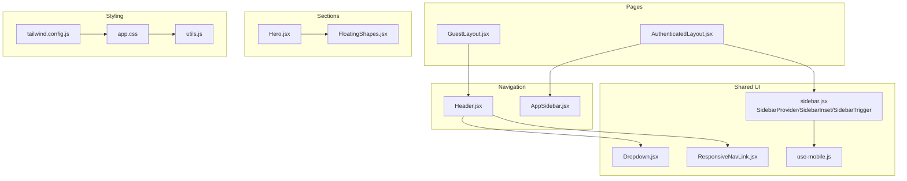

**Diagram sources**
- [AuthenticatedLayout.jsx:11-52](file://resources/js/Layouts/AuthenticatedLayout.jsx#L11-L52)
- [GuestLayout.jsx:4-16](file://resources/js/Layouts/GuestLayout.jsx#L4-L16)
- [sidebar.jsx:40-132](file://resources/js/Components/ui/sidebar.jsx#L40-L132)
- [Dropdown.jsx:7-19](file://resources/js/Components/Dropdown.jsx#L7-L19)
- [ResponsiveNavLink.jsx:3-20](file://resources/js/Components/ResponsiveNavLink.jsx#L3-L20)
- [Header.jsx:9-185](file://resources/js/Components/Header.jsx#L9-L185)
- [AppSidebar.jsx:35-163](file://resources/js/Components/AppSidebar.jsx#L35-L163)
- [Hero.jsx:33-295](file://resources/js/Components/Hero.jsx#L33-L295)
- [FloatingShapes.jsx:4-44](file://resources/js/Components/FloatingShapes.jsx#L4-L44)
- [use-mobile.js:5-18](file://resources/js/hooks/use-mobile.js#L5-L18)
- [tailwind.config.js:6-41](file://tailwind.config.js#L6-L41)
- [app.css:5-29](file://resources/css/app.css#L5-L29)
- [utils.js:4-6](file://resources/js/lib/utils.js#L4-L6)

**Section sources**
- [AuthenticatedLayout.jsx:11-52](file://resources/js/Layouts/AuthenticatedLayout.jsx#L11-L52)
- [GuestLayout.jsx:4-16](file://resources/js/Layouts/GuestLayout.jsx#L4-L16)
- [sidebar.jsx:40-132](file://resources/js/Components/ui/sidebar.jsx#L40-L132)
- [Header.jsx:9-185](file://resources/js/Components/Header.jsx#L9-L185)
- [AppSidebar.jsx:35-163](file://resources/js/Components/AppSidebar.jsx#L35-L163)
- [Hero.jsx:33-295](file://resources/js/Components/Hero.jsx#L33-L295)
- [FloatingShapes.jsx:4-44](file://resources/js/Components/FloatingShapes.jsx#L4-L44)
- [Dropdown.jsx:7-19](file://resources/js/Components/Dropdown.jsx#L7-L19)
- [ResponsiveNavLink.jsx:3-20](file://resources/js/Components/ResponsiveNavLink.jsx#L3-L20)
- [use-mobile.js:5-18](file://resources/js/hooks/use-mobile.js#L5-L18)
- [tailwind.config.js:6-41](file://tailwind.config.js#L6-L41)
- [app.css:5-29](file://resources/css/app.css#L5-L29)
- [utils.js:4-6](file://resources/js/lib/utils.js#L4-L6)
- [app.blade.php:25-34](file://resources/views/app.blade.php#L25-L34)

## Core Components
- AuthenticatedLayout: Provides admin shell with sidebar, header, and main content area. Manages periodic keep-alive pings to prevent session timeout.
- GuestLayout: Provides a centered guest container with logo and child content.
- AppSidebar: Collapsible sidebar with navigation items and user footer; integrates with sidebar provider.
- Header: Sticky top navigation bar with desktop and mobile menus, animated transitions, and floating WhatsApp widget.
- Hero: Fullscreen hero with video background, branded overlays, animated text, and floating shapes.
- FloatingShapes: Animated floating shapes layered beneath content.
- sidebar.jsx: Sidebar provider/inset/trigger and supporting components implementing responsive behavior and keyboard shortcuts.
- Dropdown: Context-based dropdown with trigger/content/link components.
- ResponsiveNavLink: Mobile-friendly navigation link styled for small screens.
- use-mobile.js: Hook returning a boolean for mobile breakpoint detection.
- tailwind.config.js and app.css: Tailwind configuration and CSS custom properties for sidebar theming.

**Section sources**
- [AuthenticatedLayout.jsx:11-52](file://resources/js/Layouts/AuthenticatedLayout.jsx#L11-L52)
- [GuestLayout.jsx:4-16](file://resources/js/Layouts/GuestLayout.jsx#L4-L16)
- [AppSidebar.jsx:35-163](file://resources/js/Components/AppSidebar.jsx#L35-L163)
- [Header.jsx:9-185](file://resources/js/Components/Header.jsx#L9-L185)
- [Hero.jsx:33-295](file://resources/js/Components/Hero.jsx#L33-L295)
- [FloatingShapes.jsx:4-44](file://resources/js/Components/FloatingShapes.jsx#L4-L44)
- [sidebar.jsx:40-132](file://resources/js/Components/ui/sidebar.jsx#L40-L132)
- [Dropdown.jsx:7-19](file://resources/js/Components/Dropdown.jsx#L7-L19)
- [ResponsiveNavLink.jsx:3-20](file://resources/js/Components/ResponsiveNavLink.jsx#L3-L20)
- [use-mobile.js:5-18](file://resources/js/hooks/use-mobile.js#L5-L18)
- [tailwind.config.js:6-41](file://tailwind.config.js#L6-L41)
- [app.css:5-29](file://resources/css/app.css#L5-L29)

## Architecture Overview
The layout system composes pages with shared UI primitives:
- Authenticated pages wrap content in a sidebar-enabled shell with a sticky header.
- Guest pages render centered content inside a guest container.
- Navigation components share state via React contexts and hooks.
- Animations and floating elements are layered under main content for performance.

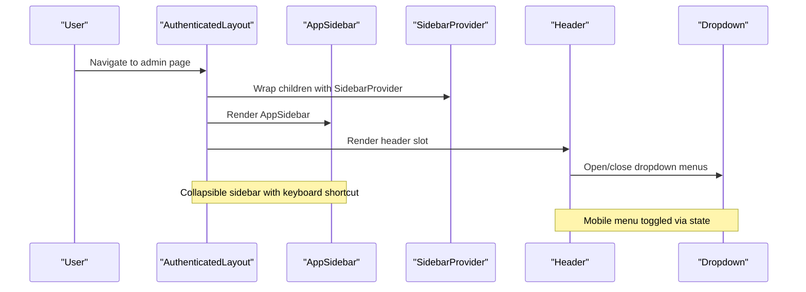

**Diagram sources**
- [AuthenticatedLayout.jsx:25-51](file://resources/js/Layouts/AuthenticatedLayout.jsx#L25-L51)
- [AppSidebar.jsx:35-163](file://resources/js/Components/AppSidebar.jsx#L35-L163)
- [sidebar.jsx:40-132](file://resources/js/Components/ui/sidebar.jsx#L40-L132)
- [Header.jsx:9-185](file://resources/js/Components/Header.jsx#L9-L185)
- [Dropdown.jsx:7-19](file://resources/js/Components/Dropdown.jsx#L7-L19)

## Detailed Component Analysis

### Authenticated Layout
- Purpose: Admin shell with persistent sidebar and header.
- Behavior:
  - Uses SidebarProvider to enable sidebar state management.
  - Renders AppSidebar and a SidebarInset containing header and main content.
  - Accepts a header slot for dynamic breadcrumbs or actions.
  - Periodic keep-alive requests to prevent session timeout.
- Props: header (optional), children (required).
- User state: Reads user from Inertia page props for sidebar footer.

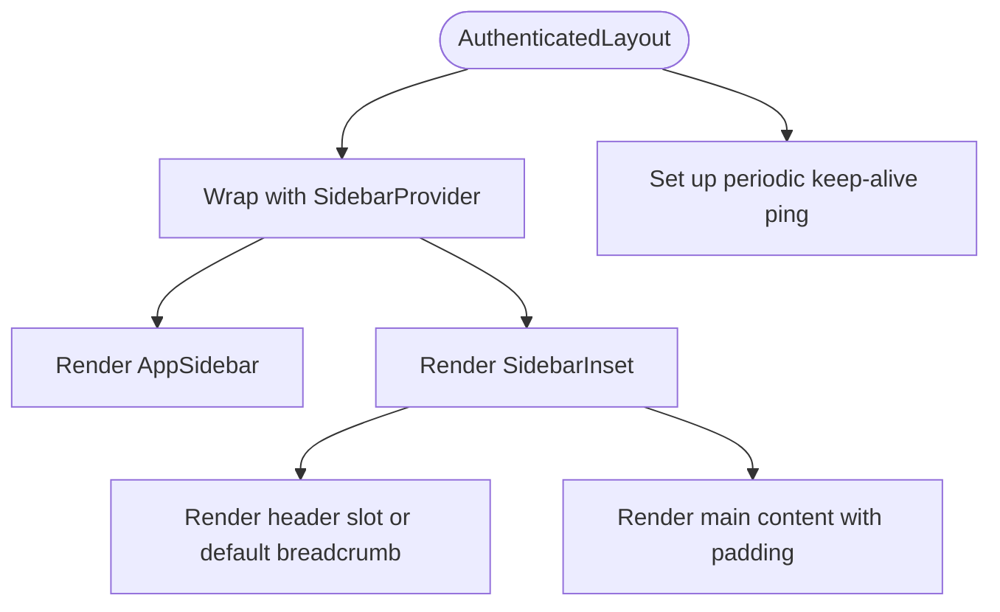

**Diagram sources**
- [AuthenticatedLayout.jsx:11-52](file://resources/js/Layouts/AuthenticatedLayout.jsx#L11-L52)

**Section sources**
- [AuthenticatedLayout.jsx:11-52](file://resources/js/Layouts/AuthenticatedLayout.jsx#L11-L52)

### Guest Layout
- Purpose: Minimal guest shell for authentication and landing pages.
- Behavior:
  - Centers content vertically and horizontally on small screens.
  - Renders a logo link and a bordered card for form content.
- Props: children (required).

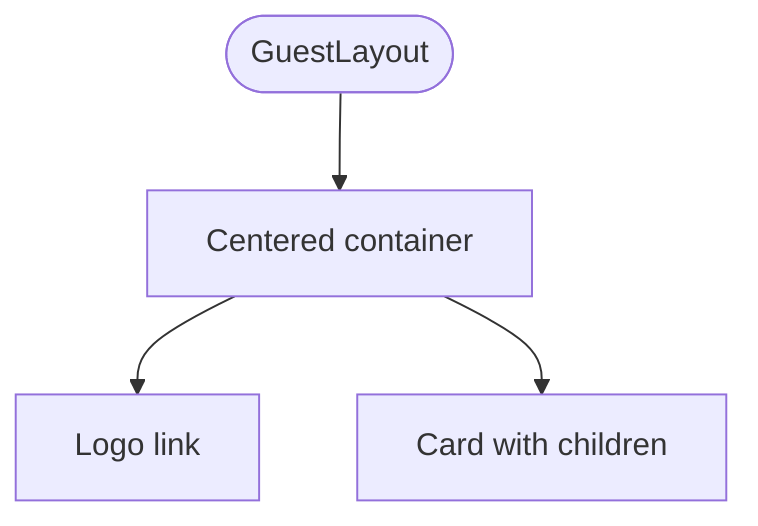

**Diagram sources**
- [GuestLayout.jsx:4-16](file://resources/js/Layouts/GuestLayout.jsx#L4-L16)

**Section sources**
- [GuestLayout.jsx:4-16](file://resources/js/Layouts/GuestLayout.jsx#L4-L16)

### AppSidebar
- Purpose: Collapsible sidebar with navigation items and user footer.
- Behavior:
  - Uses sidebar context to detect collapsed/expanded state and mobile mode.
  - Renders grouped navigation items with icons and active states.
  - Displays current user name/email and logout link.
- Responsive:
  - On mobile: renders as a sheet overlay.
  - On desktop: fixed sidebar with collapsible icon mode.
- Active routing: Uses route helpers to compute active states.

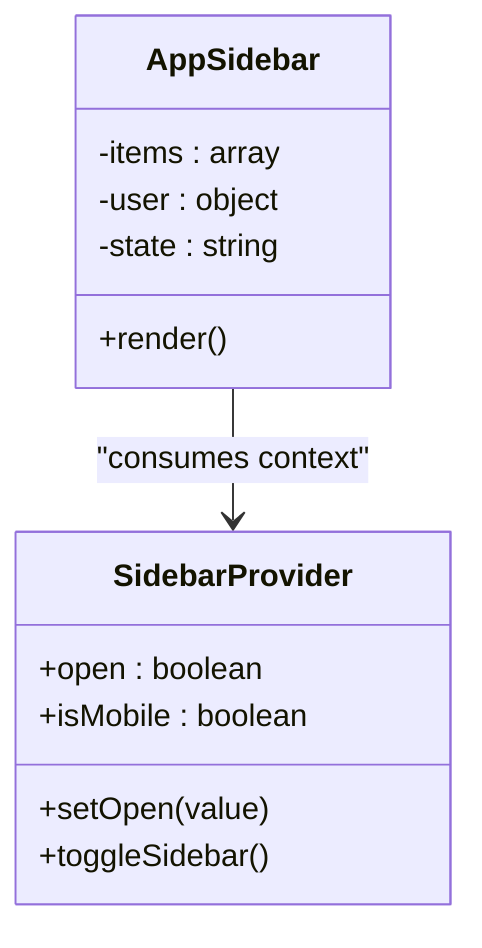

**Diagram sources**
- [AppSidebar.jsx:35-163](file://resources/js/Components/AppSidebar.jsx#L35-L163)
- [sidebar.jsx:40-132](file://resources/js/Components/ui/sidebar.jsx#L40-L132)

**Section sources**
- [AppSidebar.jsx:35-163](file://resources/js/Components/AppSidebar.jsx#L35-L163)
- [sidebar.jsx:40-132](file://resources/js/Components/ui/sidebar.jsx#L40-L132)

### Header Navigation
- Purpose: Sticky top navigation with desktop and mobile menus.
- Behavior:
  - Desktop: Centered horizontal nav with animated entries and a dropdown for services.
  - Mobile: Hamburger menu toggling a slide-down list; nested service menu with accordion behavior.
  - FloatingWhatsApp integrated at the bottom of the nav.
- State:
  - Tracks visibility of main and service menus.
  - Uses framer-motion for entrance/exit animations.

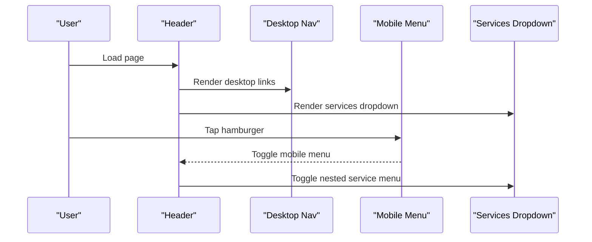

**Diagram sources**
- [Header.jsx:9-185](file://resources/js/Components/Header.jsx#L9-L185)
- [Dropdown.jsx:7-19](file://resources/js/Components/Dropdown.jsx#L7-L19)

**Section sources**
- [Header.jsx:9-185](file://resources/js/Components/Header.jsx#L9-L185)
- [Dropdown.jsx:7-19](file://resources/js/Components/Dropdown.jsx#L7-L19)

### Hero Section and Floating Shapes
- Purpose: Immersive hero with layered backgrounds, animated text, and interactive elements.
- Behavior:
  - Background: Video with multiple overlays and grid pattern.
  - Foreground: Animated headline, typewriter text, and action buttons.
  - Floating shapes: Animated blurred circles in the background layer.
  - Modals: Email copy modal rendered via React portal.
- Responsive:
  - Uses clamp units for scalable typography and spacing.
  - Service menu adapts between modal and dropdown based on viewport.

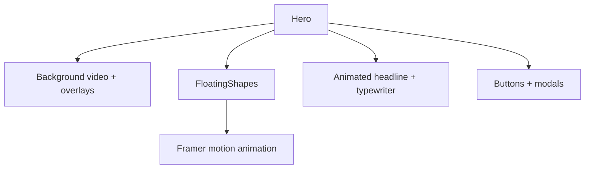

**Diagram sources**
- [Hero.jsx:33-295](file://resources/js/Components/Hero.jsx#L33-L295)
- [FloatingShapes.jsx:4-44](file://resources/js/Components/FloatingShapes.jsx#L4-L44)

**Section sources**
- [Hero.jsx:33-295](file://resources/js/Components/Hero.jsx#L33-L295)
- [FloatingShapes.jsx:4-44](file://resources/js/Components/FloatingShapes.jsx#L4-L44)

### Sidebar UI Primitives
- Purpose: Provide a reusable, responsive sidebar system with keyboard shortcuts and cookie persistence.
- Features:
  - SidebarProvider manages open/collapsed state and mobile overlay.
  - Sidebar supports offcanvas, floating, and inset variants.
  - SidebarTrigger toggles sidebar state.
  - SidebarInset adjusts main content margins.
  - Cookie persists sidebar state across reloads.
  - Keyboard shortcut toggles sidebar on desktop.
- Breakpoints:
  - Mobile detection via useIsMobile hook.
  - Different sidebar widths for mobile and desktop.

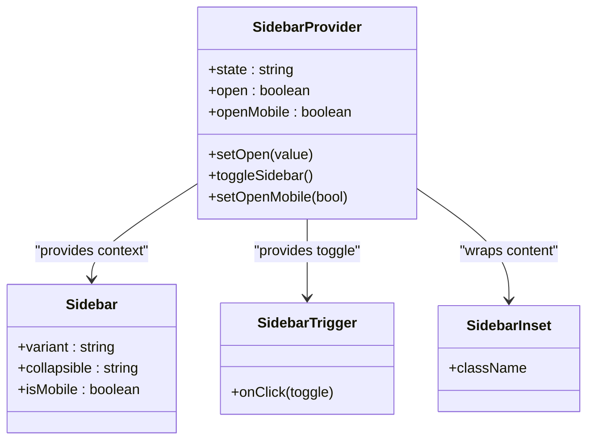

**Diagram sources**
- [sidebar.jsx:40-132](file://resources/js/Components/ui/sidebar.jsx#L40-L132)
- [sidebar.jsx:135-226](file://resources/js/Components/ui/sidebar.jsx#L135-L226)
- [sidebar.jsx:229-250](file://resources/js/Components/ui/sidebar.jsx#L229-L250)
- [sidebar.jsx:278-291](file://resources/js/Components/ui/sidebar.jsx#L278-L291)

**Section sources**
- [sidebar.jsx:40-132](file://resources/js/Components/ui/sidebar.jsx#L40-L132)
- [sidebar.jsx:135-226](file://resources/js/Components/ui/sidebar.jsx#L135-L226)
- [sidebar.jsx:229-250](file://resources/js/Components/ui/sidebar.jsx#L229-L250)
- [sidebar.jsx:278-291](file://resources/js/Components/ui/sidebar.jsx#L278-L291)

### Responsive Breakpoints and Mobile Navigation
- Breakpoint:
  - Mobile threshold defined by useIsMobile hook at 768px.
- Behavior:
  - Sidebar collapses to icon-only on desktop; opens as overlay on mobile.
  - Header switches between desktop and mobile navigation modes.
  - Service menu becomes a modal on small screens and a dropdown on larger screens.

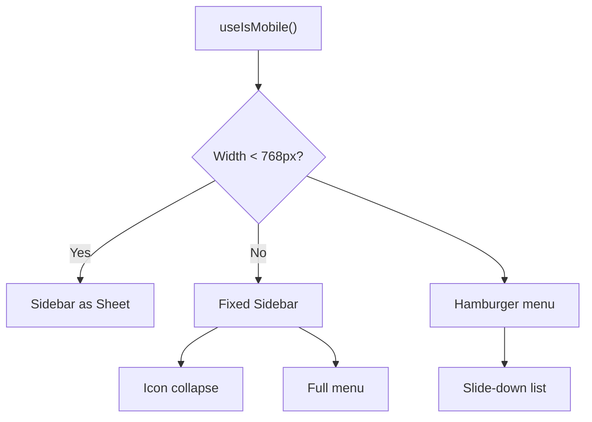

**Diagram sources**
- [use-mobile.js:5-18](file://resources/js/hooks/use-mobile.js#L5-L18)
- [sidebar.jsx:164-182](file://resources/js/Components/ui/sidebar.jsx#L164-L182)
- [Header.jsx:86-178](file://resources/js/Components/Header.jsx#L86-L178)

**Section sources**
- [use-mobile.js:5-18](file://resources/js/hooks/use-mobile.js#L5-L18)
- [sidebar.jsx:164-182](file://resources/js/Components/ui/sidebar.jsx#L164-L182)
- [Header.jsx:86-178](file://resources/js/Components/Header.jsx#L86-L178)

### Conditional Rendering and User State Management
- Authenticated vs Guest:
  - AuthenticatedLayout composes admin pages with sidebar/header.
  - GuestLayout composes authentication and landing pages with minimal shell.
- User state:
  - AuthenticatedLayout reads user from Inertia props for header breadcrumbs.
  - AppSidebar reads user from props for footer display.
- Prop drilling:
  - Minimal prop drilling achieved by consuming contexts (sidebar, page props).
  - Dropdown uses a local context to manage open state internally.

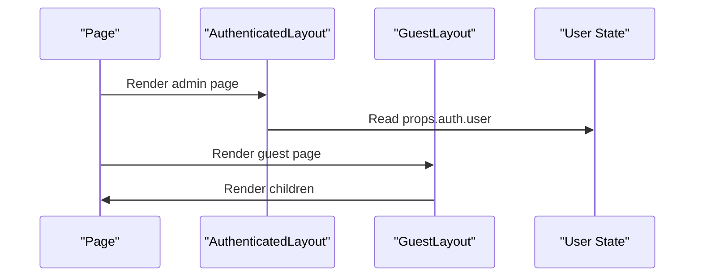

**Diagram sources**
- [AuthenticatedLayout.jsx:12](file://resources/js/Layouts/AuthenticatedLayout.jsx#L12)
- [AppSidebar.jsx:36](file://resources/js/Components/AppSidebar.jsx#L36)
- [GuestLayout.jsx:4](file://resources/js/Layouts/GuestLayout.jsx#L4)

**Section sources**
- [AuthenticatedLayout.jsx:12](file://resources/js/Layouts/AuthenticatedLayout.jsx#L12)
- [AppSidebar.jsx:36](file://resources/js/Components/AppSidebar.jsx#L36)
- [GuestLayout.jsx:4](file://resources/js/Layouts/GuestLayout.jsx#L4)

### Styling Approaches: TailwindCSS and Custom CSS Variables
- Tailwind configuration:
  - Extends colors with EDUfa brand palette and a dedicated sidebar namespace.
- CSS variables:
  - Defines light/dark theme variables for sidebar colors.
- Utility merging:
  - cn helper merges Tailwind classes safely.

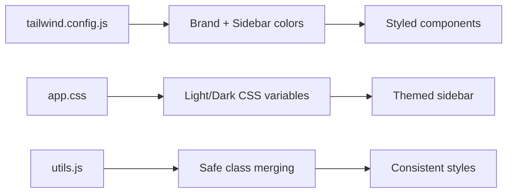

**Diagram sources**
- [tailwind.config.js:14-38](file://tailwind.config.js#L14-L38)
- [app.css:5-29](file://resources/css/app.css#L5-L29)
- [utils.js:4-6](file://resources/js/lib/utils.js#L4-L6)

**Section sources**
- [tailwind.config.js:14-38](file://tailwind.config.js#L14-L38)
- [app.css:5-29](file://resources/css/app.css#L5-L29)
- [utils.js:4-6](file://resources/js/lib/utils.js#L4-L6)

## Dependency Analysis
- Component coupling:
  - AuthenticatedLayout depends on sidebar primitives and AppSidebar.
  - Header depends on Dropdown and ResponsiveNavLink.
  - Hero depends on FloatingShapes and various UI components.
- External dependencies:
  - Inertia for page props and routing helpers.
  - Radix UI for slots and tooltips.
  - Headless UI for dropdown transitions.
  - Framer Motion for animations.
- Potential circular dependencies:
  - None observed among layout components; contexts break cycles.

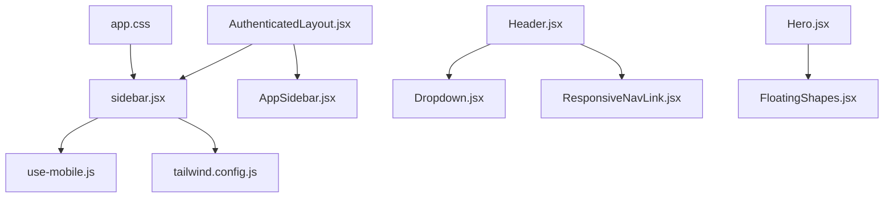

**Diagram sources**
- [AuthenticatedLayout.jsx:11-52](file://resources/js/Layouts/AuthenticatedLayout.jsx#L11-L52)
- [AppSidebar.jsx:35-163](file://resources/js/Components/AppSidebar.jsx#L35-L163)
- [sidebar.jsx:40-132](file://resources/js/Components/ui/sidebar.jsx#L40-L132)
- [Header.jsx:9-185](file://resources/js/Components/Header.jsx#L9-L185)
- [Dropdown.jsx:7-19](file://resources/js/Components/Dropdown.jsx#L7-L19)
- [ResponsiveNavLink.jsx:3-20](file://resources/js/Components/ResponsiveNavLink.jsx#L3-L20)
- [Hero.jsx:33-295](file://resources/js/Components/Hero.jsx#L33-L295)
- [FloatingShapes.jsx:4-44](file://resources/js/Components/FloatingShapes.jsx#L4-L44)
- [use-mobile.js:5-18](file://resources/js/hooks/use-mobile.js#L5-L18)
- [tailwind.config.js:6-41](file://tailwind.config.js#L6-L41)
- [app.css:5-29](file://resources/css/app.css#L5-L29)

**Section sources**
- [AuthenticatedLayout.jsx:11-52](file://resources/js/Layouts/AuthenticatedLayout.jsx#L11-L52)
- [AppSidebar.jsx:35-163](file://resources/js/Components/AppSidebar.jsx#L35-L163)
- [sidebar.jsx:40-132](file://resources/js/Components/ui/sidebar.jsx#L40-L132)
- [Header.jsx:9-185](file://resources/js/Components/Header.jsx#L9-L185)
- [Dropdown.jsx:7-19](file://resources/js/Components/Dropdown.jsx#L7-L19)
- [ResponsiveNavLink.jsx:3-20](file://resources/js/Components/ResponsiveNavLink.jsx#L3-L20)
- [Hero.jsx:33-295](file://resources/js/Components/Hero.jsx#L33-L295)
- [FloatingShapes.jsx:4-44](file://resources/js/Components/FloatingShapes.jsx#L4-L44)
- [use-mobile.js:5-18](file://resources/js/hooks/use-mobile.js#L5-L18)
- [tailwind.config.js:6-41](file://tailwind.config.js#L6-L41)
- [app.css:5-29](file://resources/css/app.css#L5-L29)

## Performance Considerations
- Keep-alive pings:
  - AuthenticatedLayout sets a periodic fetch to prevent session timeouts; tune interval carefully to balance UX and network load.
- Animation costs:
  - FloatingShapes and Hero animations use framer-motion; ensure transforms and opacity changes leverage GPU acceleration.
- Mobile rendering:
  - Sidebar overlay on mobile avoids heavy desktop-only DOM; keep nested menus shallow to reduce reflows.
- CSS variables:
  - Prefer CSS variables for theming to avoid expensive JS-driven style recalculations.
- Bundle and hydration:
  - Ensure Vite/Vite React refresh is configured in Blade to minimize hydration mismatches.

[No sources needed since this section provides general guidance]

## Troubleshooting Guide
- Sidebar not toggling:
  - Verify SidebarProvider wraps the layout and SidebarTrigger is placed inside SidebarInset.
- Mobile menu not appearing:
  - Confirm useIsMobile detects viewport correctly and Sidebar renders as a Sheet on small screens.
- Dropdown not closing:
  - Ensure Dropdown triggers click-outside handler and content closes on item click.
- Hero video not playing:
  - Check browser autoplay policies and verify video source path exists.
- Session timeout during idle:
  - Adjust keep-alive interval in AuthenticatedLayout to a suitable cadence.

**Section sources**
- [AuthenticatedLayout.jsx:14-23](file://resources/js/Layouts/AuthenticatedLayout.jsx#L14-L23)
- [sidebar.jsx:164-182](file://resources/js/Components/ui/sidebar.jsx#L164-L182)
- [Dropdown.jsx:28-34](file://resources/js/Components/Dropdown.jsx#L28-L34)
- [Hero.jsx:54-63](file://resources/js/Components/Hero.jsx#L54-L63)

## Conclusion
The layout system combines reusable UI primitives with thoughtful responsive behavior and animations. Authenticated and guest layouts encapsulate distinct presentation needs, while shared components like the sidebar provider, header, and hero maintain consistency and performance. TailwindCSS and CSS variables enable a cohesive design system, and hooks simplify mobile detection and state management.