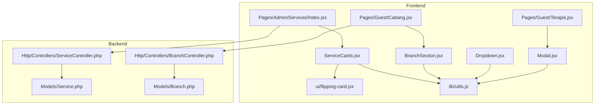
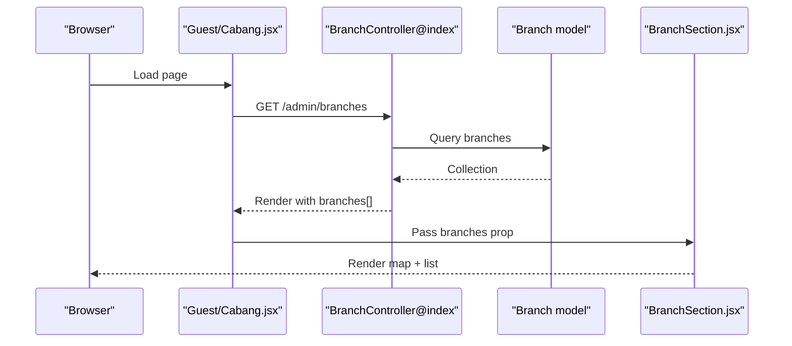
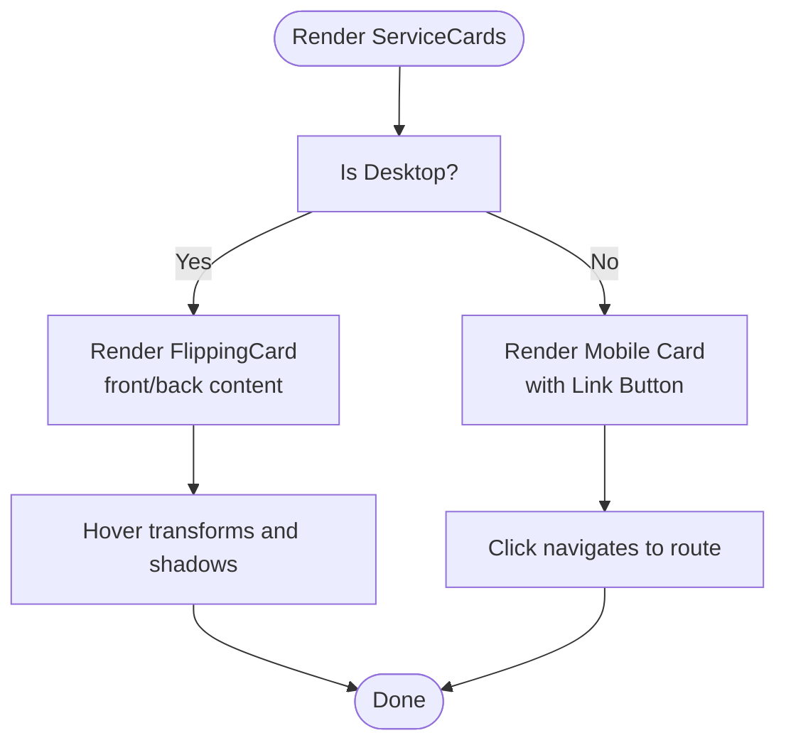
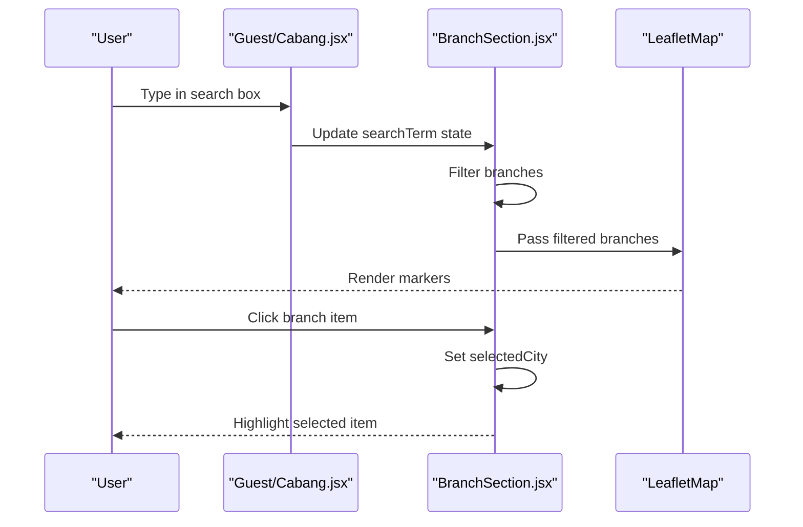
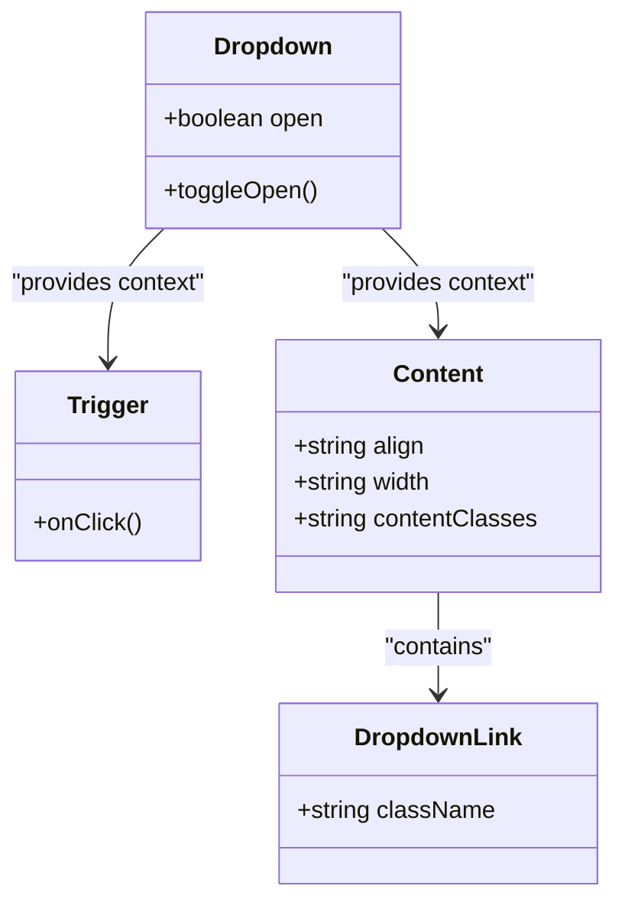
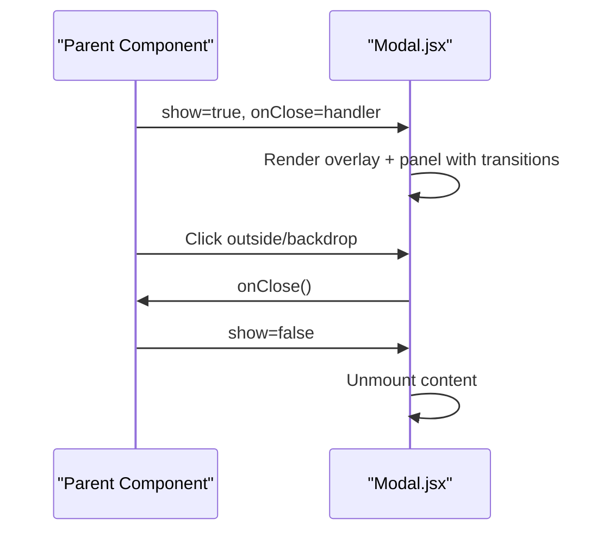
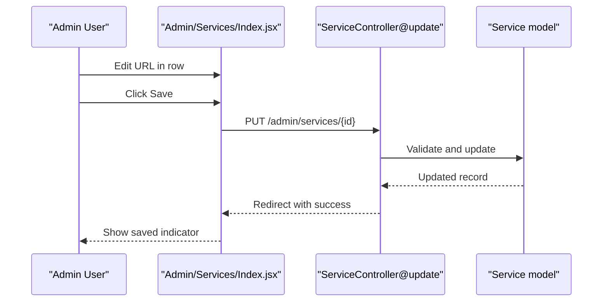
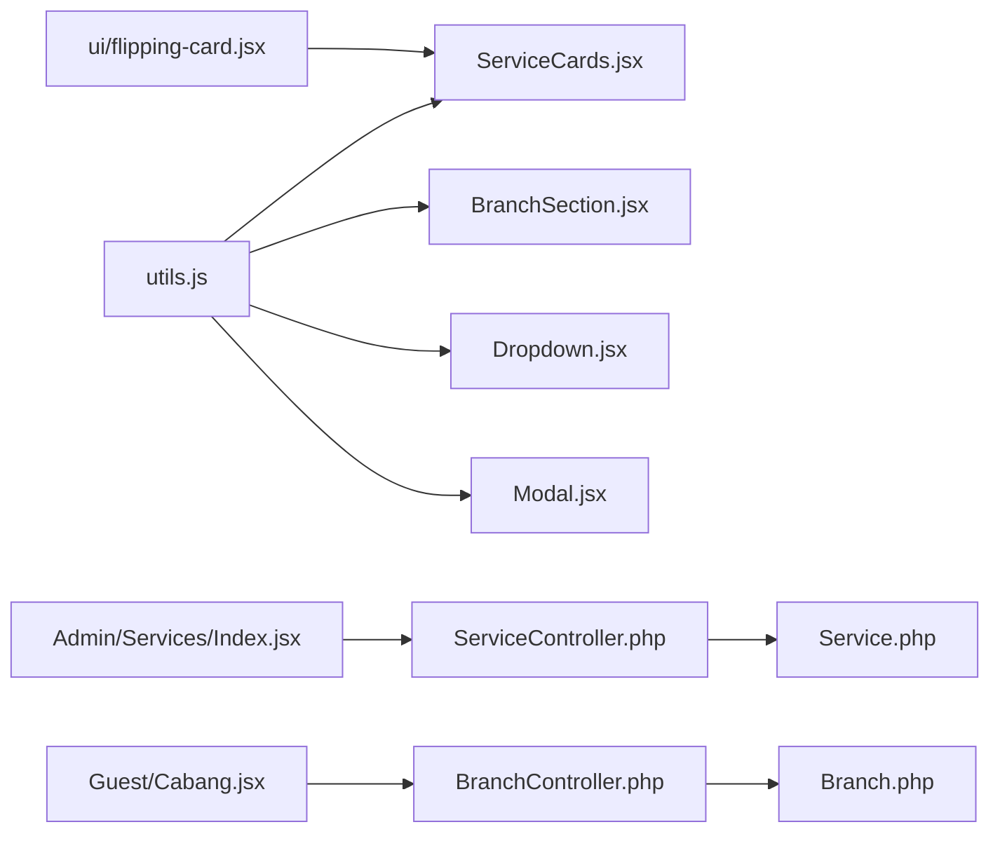

# Service-Specific Components

<cite>
**Referenced Files in This Document**
- [ServiceCards.jsx](file://resources/js/Components/ServiceCards.jsx)
- [BranchSection.jsx](file://resources/js/Components/BranchSection.jsx)
- [Dropdown.jsx](file://resources/js/Components/Dropdown.jsx)
- [Modal.jsx](file://resources/js/Components/Modal.jsx)
- [flipping-card.jsx](file://resources/js/Components/ui/flipping-card.jsx)
- [utils.js](file://resources/js/lib/utils.js)
- [Cabang.jsx](file://resources/js/Pages/Guest/Cabang.jsx)
- [Terapis.jsx](file://resources/js/Pages/Guest/Terapis.jsx)
- [Index.jsx](file://resources/js/Pages/Admin/Services/Index.jsx)
- [ServiceController.php](file://app/Http/Controllers/ServiceController.php)
- [BranchController.php](file://app/Http/Controllers/BranchController.php)
- [Service.php](file://app/Models/Service.php)
- [Branch.php](file://app/Models/Branch.php)
</cite>

## Table of Contents
1. [Introduction](#introduction)
2. [Project Structure](#project-structure)
3. [Core Components](#core-components)
4. [Architecture Overview](#architecture-overview)
5. [Detailed Component Analysis](#detailed-component-analysis)
6. [Dependency Analysis](#dependency-analysis)
7. [Performance Considerations](#performance-considerations)
8. [Troubleshooting Guide](#troubleshooting-guide)
9. [Conclusion](#conclusion)

## Introduction
This document focuses on service-specific UI components that render branch locations, service cards, modals, and dropdown menus. It explains how these components bind to backend data models, integrate with page layouts, and handle dynamic content updates. It also covers animation transitions, loading states, error handling, and performance strategies for large datasets and infinite scrolling scenarios.

## Project Structure
The service-related frontend components are organized under resources/js/Components and resources/js/Pages. Backend models and controllers reside under app/Models and app/Http/Controllers. Pages consume data passed from controllers and render components that present dynamic content.

**Diagram sources**
- [ServiceCards.jsx:1-213](file://resources/js/Components/ServiceCards.jsx#L1-L213)
- [BranchSection.jsx:1-135](file://resources/js/Components/BranchSection.jsx#L1-L135)
- [Dropdown.jsx:1-108](file://resources/js/Components/Dropdown.jsx#L1-L108)
- [Modal.jsx:1-66](file://resources/js/Components/Modal.jsx#L1-L66)
- [flipping-card.jsx:1-55](file://resources/js/Components/ui/flipping-card.jsx#L1-L55)
- [utils.js:1-7](file://resources/js/lib/utils.js#L1-L7)
- [Cabang.jsx:1-393](file://resources/js/Pages/Guest/Cabang.jsx#L1-L393)
- [Terapis.jsx:1-342](file://resources/js/Pages/Guest/Terapis.jsx#L1-L342)
- [Index.jsx:1-135](file://resources/js/Pages/Admin/Services/Index.jsx#L1-L135)
- [ServiceController.php:1-31](file://app/Http/Controllers/ServiceController.php#L1-L31)
- [BranchController.php:1-88](file://app/Http/Controllers/BranchController.php#L1-L88)
- [Service.php:1-15](file://app/Models/Service.php#L1-L15)
- [Branch.php:1-36](file://app/Models/Branch.php#L1-L36)

**Section sources**
- [ServiceCards.jsx:1-213](file://resources/js/Components/ServiceCards.jsx#L1-L213)
- [BranchSection.jsx:1-135](file://resources/js/Components/BranchSection.jsx#L1-L135)
- [Dropdown.jsx:1-108](file://resources/js/Components/Dropdown.jsx#L1-L108)
- [Modal.jsx:1-66](file://resources/js/Components/Modal.jsx#L1-L66)
- [flipping-card.jsx:1-55](file://resources/js/Components/ui/flipping-card.jsx#L1-L55)
- [utils.js:1-7](file://resources/js/lib/utils.js#L1-L7)
- [Cabang.jsx:1-393](file://resources/js/Pages/Guest/Cabang.jsx#L1-L393)
- [Terapis.jsx:1-342](file://resources/js/Pages/Guest/Terapis.jsx#L1-L342)
- [Index.jsx:1-135](file://resources/js/Pages/Admin/Services/Index.jsx#L1-L135)
- [ServiceController.php:1-31](file://app/Http/Controllers/ServiceController.php#L1-L31)
- [BranchController.php:1-88](file://app/Http/Controllers/BranchController.php#L1-L88)
- [Service.php:1-15](file://app/Models/Service.php#L1-L15)
- [Branch.php:1-36](file://app/Models/Branch.php#L1-L36)

## Core Components
This section documents the primary service-specific components and their roles.

- ServiceCards: Renders interactive service cards with flip animations and mobile-friendly buttons. It binds to predefined service metadata and navigates to route endpoints.
- BranchSection: Displays a searchable list of branches with a map preview and city filtering. It binds to branch data models and supports photo URLs.
- Dropdown: Provides a reusable dropdown menu with trigger/content/link components, transitions, and alignment options.
- Modal: Offers a reusable modal dialog with configurable max widths, transitions, and close behavior.

Key binding patterns:
- ServiceCards binds to a static service array with icon, color, and route metadata.
- BranchSection receives branches as props and filters them client-side by city/address.
- Dropdown and Modal expose props for customization and state-driven rendering.

**Section sources**
- [ServiceCards.jsx:18-82](file://resources/js/Components/ServiceCards.jsx#L18-L82)
- [ServiceCards.jsx:118-213](file://resources/js/Components/ServiceCards.jsx#L118-L213)
- [BranchSection.jsx:4-135](file://resources/js/Components/BranchSection.jsx#L4-L135)
- [Dropdown.jsx:1-108](file://resources/js/Components/Dropdown.jsx#L1-L108)
- [Modal.jsx:1-66](file://resources/js/Components/Modal.jsx#L1-L66)

## Architecture Overview
The frontend pages fetch data from backend controllers and pass it to components. Components use Tailwind classes, utility helpers, and third-party libraries for animations and transitions.

**Diagram sources**
- [Cabang.jsx:46-230](file://resources/js/Pages/Guest/Cabang.jsx#L46-L230)
- [BranchController.php:17-22](file://app/Http/Controllers/BranchController.php#L17-L22)
- [Branch.php:1-36](file://app/Models/Branch.php#L1-L36)
- [BranchSection.jsx:4-135](file://resources/js/Components/BranchSection.jsx#L4-L135)

## Detailed Component Analysis

### Service Cards Component
Purpose:
- Present service offerings with animated flipping cards on desktop and static cards on mobile, linking to route endpoints.

Key features:
- Uses a predefined service array with icon, accent color, light background, icon color, and route href.
- Desktop: FlippingCard component renders front/back faces with hover effects.
- Mobile: Simplified card with a link button.
- Horizontal scroll container with snapping and navigation controls.

Data binding pattern:
- Static service metadata drives rendering. To bind to backend data, replace the static array with props received from a page that queries Service model.

Animation and transitions:
- CSS transforms and hover effects on the flipping card.
- Smooth horizontal scrolling with snap behavior.

Accessibility:
- Uses aria-labels for navigation buttons.

Integration example:
- Admin page for services passes services prop to a layout-rendered page that can host ServiceCards.

**Diagram sources**
- [ServiceCards.jsx:118-213](file://resources/js/Components/ServiceCards.jsx#L118-L213)
- [flipping-card.jsx:8-55](file://resources/js/Components/ui/flipping-card.jsx#L8-L55)

**Section sources**
- [ServiceCards.jsx:18-82](file://resources/js/Components/ServiceCards.jsx#L18-L82)
- [ServiceCards.jsx:84-116](file://resources/js/Components/ServiceCards.jsx#L84-L116)
- [ServiceCards.jsx:118-213](file://resources/js/Components/ServiceCards.jsx#L118-L213)
- [flipping-card.jsx:1-55](file://resources/js/Components/ui/flipping-card.jsx#L1-L55)

### Branch Location Display Component
Purpose:
- Allow users to search branches by city/address and view them alongside a map preview.

Key features:
- Search input filters branches client-side.
- List items highlight selection and show icons/photos.
- Map component renders markers for branches.
- Photo URL resolution handled by the Branch model.

Data binding pattern:
- Receives branches prop from the page.
- Filters branches based on searchTerm.
- Supports selecting a city to highlight related entries.

Real-time updates:
- Filtering occurs immediately as the user types.
- Selection updates the map and list visuals.

**Diagram sources**
- [Cabang.jsx:46-95](file://resources/js/Pages/Guest/Cabang.jsx#L46-L95)
- [BranchSection.jsx:4-135](file://resources/js/Components/BranchSection.jsx#L4-L135)

**Section sources**
- [BranchSection.jsx:4-135](file://resources/js/Components/BranchSection.jsx#L4-L135)
- [Branch.php:21-34](file://app/Models/Branch.php#L21-L34)

### Dropdown Menu Component
Purpose:
- Provide a reusable dropdown with trigger, content, and link elements, supporting alignment and transitions.

Key features:
- Context-based state management for open/close.
- Transition animations for show/hide.
- Alignment options (left/right) and customizable width/content classes.
- Click-outside to close.

Props interface:
- Trigger: children
- Content: align, width, contentClasses, children
- Link: className, plus Link props

Usage:
- Wrap trigger with Dropdown, place Content inside, and use Dropdown.Link for items.

**Diagram sources**
- [Dropdown.jsx:7-108](file://resources/js/Components/Dropdown.jsx#L7-L108)

**Section sources**
- [Dropdown.jsx:1-108](file://resources/js/Components/Dropdown.jsx#L1-L108)

### Modal Component
Purpose:
- Provide a reusable modal dialog with configurable max width, transitions, and close behavior.

Key features:
- Controlled visibility via show prop.
- Transition animations for overlay and panel.
- Closeable via backdrop click or programmatic onClose.
- maxWidth mapped to Tailwind classes.

Props interface:
- children, show, maxWidth, closeable, onClose

Usage:
- Conditionally render based on state and pass onClose handler.

**Diagram sources**
- [Modal.jsx:8-66](file://resources/js/Components/Modal.jsx#L8-L66)

**Section sources**
- [Modal.jsx:1-66](file://resources/js/Components/Modal.jsx#L1-L66)

### Service Link Management Page
Purpose:
- Admin page to manage Google Form links for each service.

Key features:
- Table rows with form inputs bound to service data.
- useForm hook manages local state and submission.
- Validation ensures URL correctness.
- Visual indicators for active/inactive links.

Data binding pattern:
- Each row initializes with service.google_form_url.
- Submit triggers controller update endpoint.

**Diagram sources**
- [Index.jsx:9-92](file://resources/js/Pages/Admin/Services/Index.jsx#L9-L92)
- [ServiceController.php:18-29](file://app/Http/Controllers/ServiceController.php#L18-L29)
- [Service.php:9-14](file://app/Models/Service.php#L9-L14)

**Section sources**
- [Index.jsx:94-135](file://resources/js/Pages/Admin/Services/Index.jsx#L94-L135)
- [ServiceController.php:11-29](file://app/Http/Controllers/ServiceController.php#L11-L29)
- [Service.php:1-15](file://app/Models/Service.php#L1-L15)

## Dependency Analysis
Component dependencies and coupling:
- ServiceCards depends on utils for class merging and FlippingCard for 3D effect.
- BranchSection depends on utils and a map component (LeafletMap) to render branch locations.
- Dropdown and Modal depend on Headless UI for transitions and context for state.
- Pages depend on controllers/models for data fetching and binding.

Potential circular dependencies:
- None observed among these components.

External dependencies:
- Headless UI for transitions and dropdown/modal internals.
- Framer Motion for page-level animations in guest pages.
- Lucide icons for UI elements.

**Diagram sources**
- [utils.js:1-7](file://resources/js/lib/utils.js#L1-L7)
- [ServiceCards.jsx:1-16](file://resources/js/Components/ServiceCards.jsx#L1-L16)
- [flipping-card.jsx:1-55](file://resources/js/Components/ui/flipping-card.jsx#L1-L55)
- [BranchSection.jsx:1-4](file://resources/js/Components/BranchSection.jsx#L1-L4)
- [Dropdown.jsx:1-3](file://resources/js/Components/Dropdown.jsx#L1-L3)
- [Modal.jsx:1-6](file://resources/js/Components/Modal.jsx#L1-L6)
- [ServiceController.php:1-31](file://app/Http/Controllers/ServiceController.php#L1-L31)
- [BranchController.php:1-88](file://app/Http/Controllers/BranchController.php#L1-L88)
- [Service.php:1-15](file://app/Models/Service.php#L1-L15)
- [Branch.php:1-36](file://app/Models/Branch.php#L1-L36)
- [Index.jsx:1-8](file://resources/js/Pages/Admin/Services/Index.jsx#L1-L8)
- [Cabang.jsx:1-7](file://resources/js/Pages/Guest/Cabang.jsx#L1-L7)

**Section sources**
- [utils.js:1-7](file://resources/js/lib/utils.js#L1-L7)
- [ServiceCards.jsx:1-16](file://resources/js/Components/ServiceCards.jsx#L1-L16)
- [flipping-card.jsx:1-55](file://resources/js/Components/ui/flipping-card.jsx#L1-L55)
- [BranchSection.jsx:1-4](file://resources/js/Components/BranchSection.jsx#L1-L4)
- [Dropdown.jsx:1-3](file://resources/js/Components/Dropdown.jsx#L1-L3)
- [Modal.jsx:1-6](file://resources/js/Components/Modal.jsx#L1-L6)
- [ServiceController.php:1-31](file://app/Http/Controllers/ServiceController.php#L1-L31)
- [BranchController.php:1-88](file://app/Http/Controllers/BranchController.php#L1-L88)
- [Service.php:1-15](file://app/Models/Service.php#L1-L15)
- [Branch.php:1-36](file://app/Models/Branch.php#L1-L36)
- [Index.jsx:1-8](file://resources/js/Pages/Admin/Services/Index.jsx#L1-L8)
- [Cabang.jsx:1-7](file://resources/js/Pages/Guest/Cabang.jsx#L1-L7)

## Performance Considerations
Large datasets and infinite scrolling:
- Current components use client-side filtering and rendering. For very large datasets, implement virtualized lists or pagination.
- BranchSection and Cabang.jsx filter arrays on the client; consider server-side filtering or pagination in controllers.

Optimization opportunities:
- Memoize computed values (e.g., filtered branches) to avoid unnecessary recalculations.
- Lazy-load images and map components to reduce initial payload.
- Debounce search input handlers to limit frequent re-renders.

Animations and transitions:
- Keep transition durations reasonable to prevent jank on low-end devices.
- Prefer transform/opacity for GPU-accelerated animations.

Loading states:
- Introduce skeleton loaders for cards and lists during data fetch.
- Show progress indicators for long-running operations like geolocation.

Error handling:
- Provide fallback UI when photos fail to load.
- Display user-friendly messages for geolocation errors and empty results.

[No sources needed since this section provides general guidance]

## Troubleshooting Guide
Common issues and resolutions:
- Dropdown does not close on outside click: ensure the overlay click handler sets open to false and that the trigger toggles correctly.
- Modal remains open after close: verify the show prop and onClose callback are properly wired.
- Branch photos not displaying: confirm Branch model resolves photo_url correctly and handles missing assets gracefully.
- Service links not saving: check validation rules and ensure the form posts to the correct route.

Debugging tips:
- Use browser devtools to inspect component props and state.
- Add temporary console logs around event handlers to trace execution.
- Validate backend responses and error messages returned by controllers.

**Section sources**
- [Dropdown.jsx:28-34](file://resources/js/Components/Dropdown.jsx#L28-L34)
- [Modal.jsx:15-19](file://resources/js/Components/Modal.jsx#L15-L19)
- [Branch.php:23-34](file://app/Models/Branch.php#L23-L34)
- [ServiceController.php:20-26](file://app/Http/Controllers/ServiceController.php#L20-L26)

## Conclusion
The service-specific components provide robust, reusable UI elements for displaying services and branch locations, managing dropdowns and modals, and integrating with backend data models. By adopting the documented binding patterns, prop interfaces, and performance strategies, teams can extend these components for various contexts while maintaining consistency and responsiveness.