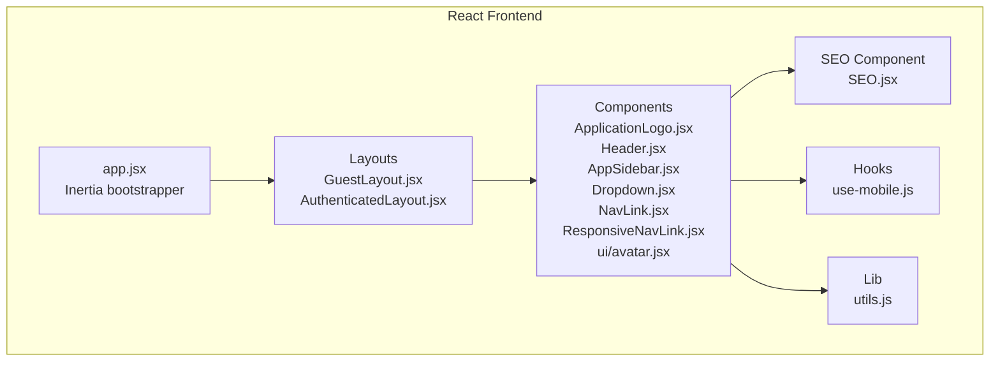
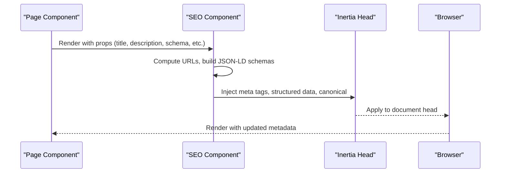
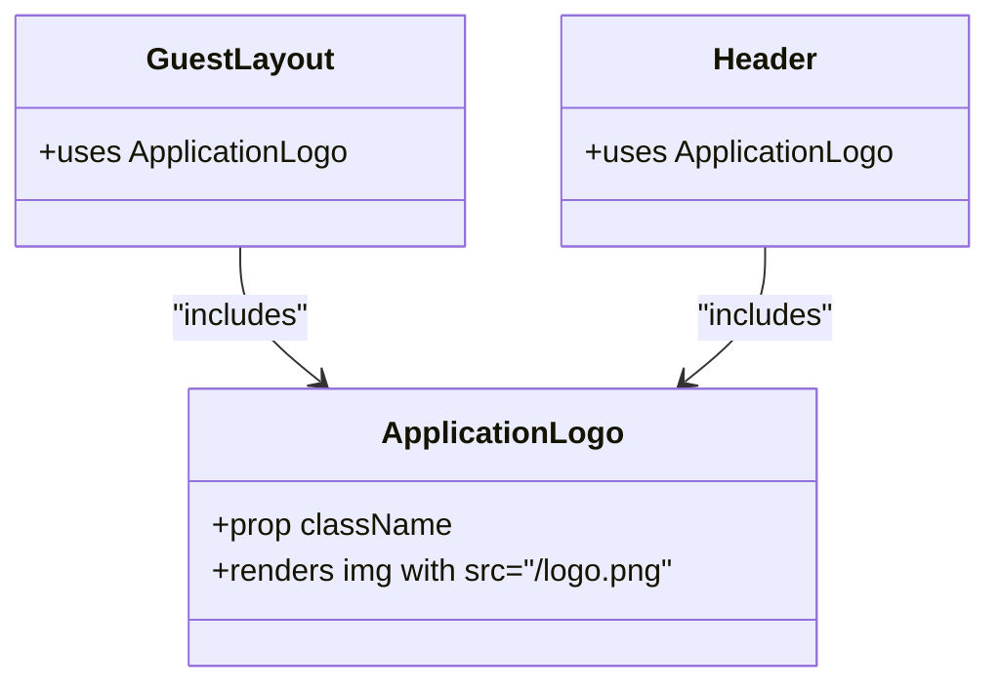
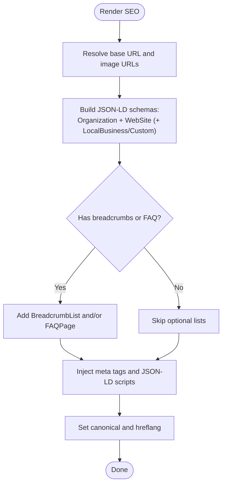
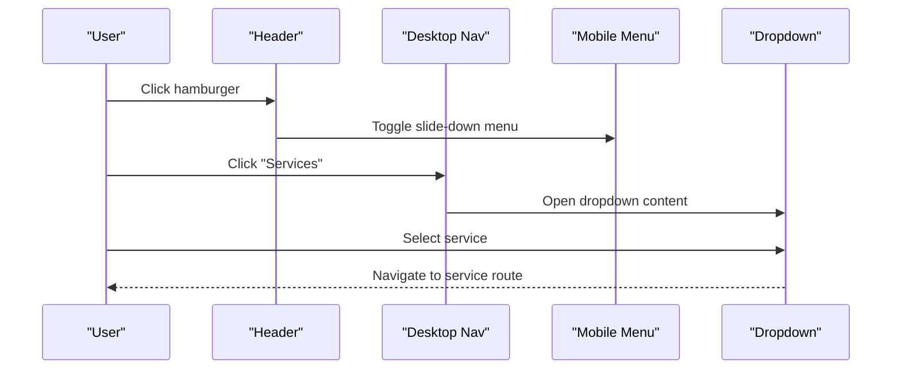
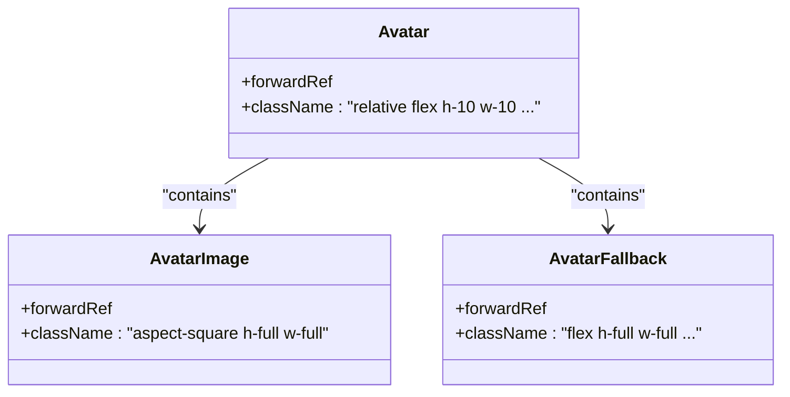
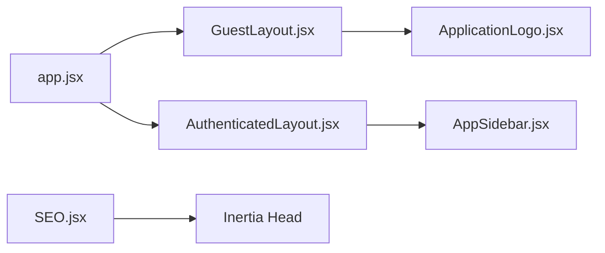
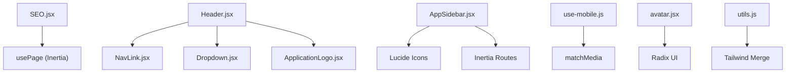

# Specialized Features

<cite>
**Referenced Files in This Document**
- [ApplicationLogo.jsx](file://resources/js/Components/ApplicationLogo.jsx)
- [SEO.jsx](file://resources/js/Components/SEO.jsx)
- [Header.jsx](file://resources/js/Components/Header.jsx)
- [AppSidebar.jsx](file://resources/js/Components/AppSidebar.jsx)
- [ResponsiveNavLink.jsx](file://resources/js/Components/ResponsiveNavLink.jsx)
- [NavLink.jsx](file://resources/js/Components/NavLink.jsx)
- [Dropdown.jsx](file://resources/js/Components/Dropdown.jsx)
- [avatar.jsx](file://resources/js/Components/ui/avatar.jsx)
- [GuestLayout.jsx](file://resources/js/Layouts/GuestLayout.jsx)
- [AuthenticatedLayout.jsx](file://resources/js/Layouts/AuthenticatedLayout.jsx)
- [use-mobile.js](file://resources/js/hooks/use-mobile.js)
- [utils.js](file://resources/js/lib/utils.js)
- [app.jsx](file://resources/js/app.jsx)
- [logo.png](file://public/logo.png)
</cite>

## Table of Contents
1. [Introduction](#introduction)
2. [Project Structure](#project-structure)
3. [Core Components](#core-components)
4. [Architecture Overview](#architecture-overview)
5. [Detailed Component Analysis](#detailed-component-analysis)
6. [Dependency Analysis](#dependency-analysis)
7. [Performance Considerations](#performance-considerations)
8. [Internationalization and Localization](#internationalization-and-localization)
9. [Troubleshooting Guide](#troubleshooting-guide)
10. [Conclusion](#conclusion)

## Introduction
This document focuses on specialized frontend components that define brand identity, enhance SEO, and enable responsive navigation. It covers:
- Branding consistency via a dedicated application logo component and consistent color/typography tokens
- SEO optimization through meta tag generation, structured data (JSON-LD), and social media integration
- Navigation components for desktop and mobile, including dropdowns and responsive links
- Performance strategies such as lazy loading, caching, and efficient rendering
- Internationalization and localization considerations for global accessibility

## Project Structure
The specialized features are primarily implemented in the React-based frontend under resources/js. Key areas:
- Components: reusable UI building blocks (logo, navigation, dropdown, avatar)
- Layouts: guest and authenticated layouts that wrap pages
- Hooks: device detection for responsive behavior
- Utilities: shared class merging helpers
- SEO: a centralized SEO component that injects metadata and structured data

**Diagram sources**
- [app.jsx:1-26](file://resources/js/app.jsx#L1-L26)
- [GuestLayout.jsx:1-19](file://resources/js/Layouts/GuestLayout.jsx#L1-L19)
- [AuthenticatedLayout.jsx:1-54](file://resources/js/Layouts/AuthenticatedLayout.jsx#L1-L54)
- [ApplicationLogo.jsx:1-11](file://resources/js/Components/ApplicationLogo.jsx#L1-L11)
- [Header.jsx:1-186](file://resources/js/Components/Header.jsx#L1-L186)
- [AppSidebar.jsx:1-164](file://resources/js/Components/AppSidebar.jsx#L1-L164)
- [Dropdown.jsx:1-108](file://resources/js/Components/Dropdown.jsx#L1-L108)
- [NavLink.jsx:1-24](file://resources/js/Components/NavLink.jsx#L1-L24)
- [ResponsiveNavLink.jsx:1-22](file://resources/js/Components/ResponsiveNavLink.jsx#L1-L22)
- [avatar.jsx:1-42](file://resources/js/Components/ui/avatar.jsx#L1-L42)
- [use-mobile.js:1-20](file://resources/js/hooks/use-mobile.js#L1-L20)
- [utils.js:1-7](file://resources/js/lib/utils.js#L1-L7)
- [SEO.jsx:1-239](file://resources/js/Components/SEO.jsx#L1-L239)

**Section sources**
- [app.jsx:1-26](file://resources/js/app.jsx#L1-L26)
- [GuestLayout.jsx:1-19](file://resources/js/Layouts/GuestLayout.jsx#L1-L19)
- [AuthenticatedLayout.jsx:1-54](file://resources/js/Layouts/AuthenticatedLayout.jsx#L1-L54)

## Core Components
- ApplicationLogo: a lightweight, branded logo component with optional className extension and transitions
- SEO: a comprehensive SEO helper that generates meta tags, Open Graph, Twitter, canonical, alternate hreflangs, and structured data (JSON-LD)
- Header: primary navigation bar with logo, main links, a dropdown menu for services, and a mobile hamburger menu
- AppSidebar: admin sidebar with icons, active states, and user profile/logout
- Dropdown: a composable dropdown with trigger/content/link parts and transitions
- NavLink and ResponsiveNavLink: styled navigation links for desktop and mobile
- Avatar: Radix UI-based avatar with image and fallback
- use-mobile: hook to detect mobile viewport for responsive behavior
- utils.cn: utility for merging Tailwind classes safely

**Section sources**
- [ApplicationLogo.jsx:1-11](file://resources/js/Components/ApplicationLogo.jsx#L1-L11)
- [SEO.jsx:1-239](file://resources/js/Components/SEO.jsx#L1-L239)
- [Header.jsx:1-186](file://resources/js/Components/Header.jsx#L1-L186)
- [AppSidebar.jsx:1-164](file://resources/js/Components/AppSidebar.jsx#L1-L164)
- [Dropdown.jsx:1-108](file://resources/js/Components/Dropdown.jsx#L1-L108)
- [NavLink.jsx:1-24](file://resources/js/Components/NavLink.jsx#L1-L24)
- [ResponsiveNavLink.jsx:1-22](file://resources/js/Components/ResponsiveNavLink.jsx#L1-L22)
- [avatar.jsx:1-42](file://resources/js/Components/ui/avatar.jsx#L1-L42)
- [use-mobile.js:1-20](file://resources/js/hooks/use-mobile.js#L1-L20)
- [utils.js:1-7](file://resources/js/lib/utils.js#L1-L7)

## Architecture Overview
The specialized components integrate with Inertia’s head management to inject SEO metadata and with layout wrappers to maintain consistent branding across pages.

**Diagram sources**
- [SEO.jsx:1-239](file://resources/js/Components/SEO.jsx#L1-L239)
- [app.jsx:10-25](file://resources/js/app.jsx#L10-L25)

## Detailed Component Analysis

### Branding and Logo Component
- Purpose: Provide a consistent, branded logo across the application with hover effects and transitions
- Implementation highlights:
  - Uses a static asset path for the logo
  - Accepts className for extension and forwards extra props
  - Integrated into layouts and navigation for brand continuity

**Diagram sources**
- [ApplicationLogo.jsx:1-11](file://resources/js/Components/ApplicationLogo.jsx#L1-L11)
- [GuestLayout.jsx:1-19](file://resources/js/Layouts/GuestLayout.jsx#L1-L19)
- [Header.jsx:1-186](file://resources/js/Components/Header.jsx#L1-L186)

**Section sources**
- [ApplicationLogo.jsx:1-11](file://resources/js/Components/ApplicationLogo.jsx#L1-L11)
- [GuestLayout.jsx:1-19](file://resources/js/Layouts/GuestLayout.jsx#L1-L19)
- [AuthenticatedLayout.jsx:1-54](file://resources/js/Layouts/AuthenticatedLayout.jsx#L1-L54)

### SEO Component
- Functionality:
  - Generates primary meta tags (title, description, keywords, robots)
  - Adds geo, theme-color, and app-related meta tags
  - Builds and injects structured data (Organization, WebSite, LocalBusiness, BreadcrumbList, FAQPage)
  - Supports canonical URLs, alternate/hreflang for multilingual targeting
  - Integrates Open Graph and Twitter cards
  - Resolves absolute URLs for images and links
- Schema composition:
  - Always includes Organization and WebSite schemas
  - Conditionally adds LocalBusiness or custom schema
  - Optionally adds BreadcrumbList and FAQPage based on props
- Social media integration:
  - Open Graph and Twitter meta tags with image, alt, and locale
- Robots and indexing:
  - Conditional noindex/follow behavior

**Diagram sources**
- [SEO.jsx:170-238](file://resources/js/Components/SEO.jsx#L170-L238)

**Section sources**
- [SEO.jsx:1-239](file://resources/js/Components/SEO.jsx#L1-L239)

### Navigation Components
- Header:
  - Desktop: centered main links and a dropdown for “Services”
  - Mobile: hamburger menu with animated slide-down content and nested expandable “Services” section
  - Uses NavLink for active states and ResponsiveNavLink for mobile
- AppSidebar (Admin):
  - Collapsible sidebar with icons, active highlighting, and user info/footer actions
  - Integrates ApplicationLogo in header and maintains consistent color scheme
- Dropdown:
  - Composable pattern with Trigger, Content, and Link parts
  - Controlled open state and overlay click-to-close
- ResponsiveNavLink and NavLink:
  - Styled active/inactive states with consistent borders and transitions
  - Used in both desktop and mobile navigation contexts

**Diagram sources**
- [Header.jsx:86-179](file://resources/js/Components/Header.jsx#L86-L179)
- [Dropdown.jsx:1-108](file://resources/js/Components/Dropdown.jsx#L1-L108)
- [ResponsiveNavLink.jsx:1-22](file://resources/js/Components/ResponsiveNavLink.jsx#L1-L22)
- [NavLink.jsx:1-24](file://resources/js/Components/NavLink.jsx#L1-L24)

**Section sources**
- [Header.jsx:1-186](file://resources/js/Components/Header.jsx#L1-L186)
- [AppSidebar.jsx:1-164](file://resources/js/Components/AppSidebar.jsx#L1-L164)
- [Dropdown.jsx:1-108](file://resources/js/Components/Dropdown.jsx#L1-L108)
- [ResponsiveNavLink.jsx:1-22](file://resources/js/Components/ResponsiveNavLink.jsx#L1-L22)
- [NavLink.jsx:1-24](file://resources/js/Components/NavLink.jsx#L1-L24)

### Avatar Component
- Purpose: Consistent user avatars with fallbacks using Radix UI primitives
- Features:
  - Root container with rounded-full sizing
  - Image element with aspect-square scaling
  - Fallback placeholder with muted background
  - Forwarded refs and className propagation

**Diagram sources**
- [avatar.jsx:8-41](file://resources/js/Components/ui/avatar.jsx#L8-L41)

**Section sources**
- [avatar.jsx:1-42](file://resources/js/Components/ui/avatar.jsx#L1-L42)

### Layout Integration and Brand Continuity
- GuestLayout and AuthenticatedLayout wrap page content and ensure consistent branding via ApplicationLogo
- AuthenticatedLayout integrates AppSidebar and sets up a keep-alive mechanism to maintain session state
- Inertia’s head management ensures SEO metadata is applied per-page

**Diagram sources**
- [GuestLayout.jsx:1-19](file://resources/js/Layouts/GuestLayout.jsx#L1-L19)
- [AuthenticatedLayout.jsx:1-54](file://resources/js/Layouts/AuthenticatedLayout.jsx#L1-L54)
- [ApplicationLogo.jsx:1-11](file://resources/js/Components/ApplicationLogo.jsx#L1-L11)
- [AppSidebar.jsx:1-164](file://resources/js/Components/AppSidebar.jsx#L1-L164)
- [SEO.jsx:1-239](file://resources/js/Components/SEO.jsx#L1-L239)
- [app.jsx:10-25](file://resources/js/app.jsx#L10-L25)

**Section sources**
- [GuestLayout.jsx:1-19](file://resources/js/Layouts/GuestLayout.jsx#L1-L19)
- [AuthenticatedLayout.jsx:1-54](file://resources/js/Layouts/AuthenticatedLayout.jsx#L1-L54)
- [app.jsx:10-25](file://resources/js/app.jsx#L10-L25)

## Dependency Analysis
- SEO depends on Inertia’s usePage for current URL and window location origin
- Header composes NavLink, Dropdown, FloatingWhatsApp, and motion/AnimatePresence for animations
- AppSidebar depends on Lucide icons, Radix UI utilities, and Inertia routing
- use-mobile leverages matchMedia for responsive breakpoints
- utils.cn merges Tailwind classes safely

**Diagram sources**
- [SEO.jsx:17-20](file://resources/js/Components/SEO.jsx#L17-L20)
- [Header.jsx:2-7](file://resources/js/Components/Header.jsx#L2-L7)
- [AppSidebar.jsx:17-28](file://resources/js/Components/AppSidebar.jsx#L17-L28)
- [use-mobile.js:3-16](file://resources/js/hooks/use-mobile.js#L3-L16)
- [avatar.jsx:3-6](file://resources/js/Components/ui/avatar.jsx#L3-L6)
- [utils.js:1-7](file://resources/js/lib/utils.js#L1-L7)

**Section sources**
- [SEO.jsx:17-20](file://resources/js/Components/SEO.jsx#L17-L20)
- [Header.jsx:2-7](file://resources/js/Components/Header.jsx#L2-L7)
- [AppSidebar.jsx:17-28](file://resources/js/Components/AppSidebar.jsx#L17-L28)
- [use-mobile.js:3-16](file://resources/js/hooks/use-mobile.js#L3-L16)
- [avatar.jsx:3-6](file://resources/js/Components/ui/avatar.jsx#L3-L6)
- [utils.js:1-7](file://resources/js/lib/utils.js#L1-L7)

## Performance Considerations
- Lazy loading and code splitting:
  - Inertia resolves page components dynamically; leverage route-based code splitting by organizing pages under Pages and using dynamic imports via the resolver
  - Keep heavy components (e.g., maps, editors) as page-level lazy-loaded chunks
- Asset optimization:
  - Host logo and images on CDN or optimized static assets; ensure proper caching headers
  - Use appropriate image sizes and formats; lazy-load offscreen images
- Rendering efficiency:
  - Memoize computed SEO props (e.g., canonical URL) to avoid recomputation
  - Use CSS transitions sparingly; prefer hardware-accelerated properties for animations
- Caching:
  - Leverage browser caching for static assets and CDN caching for HTML/JS/CSS
  - Use HTTP caching headers and ETags for API endpoints backing SEO data
- Bundle size:
  - Tree-shake unused utilities; consolidate shared utilities in utils.js
  - Minimize third-party dependencies; prefer lightweight alternatives (e.g., use-radix vs heavier libraries)

[No sources needed since this section provides general guidance]

## Internationalization and Localization
- Current state:
  - SEO component defaults to Indonesian locale and content
  - Site name and meta descriptions are localized strings
- Recommendations:
  - Extract all hardcoded strings into translation files
  - Use a library like react-i18next to manage translations
  - Parameterize locales and hreflangs dynamically based on detected language
  - Support pluralization and date/time formatting for localized content
  - Ensure structured data remains valid across locales (e.g., address, opening hours)

[No sources needed since this section provides general guidance]

## Troubleshooting Guide
- Logo not appearing:
  - Verify the static asset path matches the deployed location
  - Confirm the logo exists at the expected path
  - Check for CSP restrictions blocking local assets
- SEO metadata missing:
  - Ensure the SEO component is rendered on each page
  - Confirm Inertia head management is active and not overridden
  - Validate canonical and image URLs are absolute
- Dropdown not closing:
  - Check overlay click handler and controlled state updates
  - Ensure transitions do not block pointer events unintentionally
- Mobile navigation issues:
  - Confirm use-mobile hook detects viewport correctly
  - Validate animation libraries are loaded and unblocked
- Session timeout in admin:
  - Review keep-alive interval and endpoint availability
  - Inspect network tab for failed pings and adjust intervals accordingly

**Section sources**
- [ApplicationLogo.jsx:1-11](file://resources/js/Components/ApplicationLogo.jsx#L1-L11)
- [SEO.jsx:170-238](file://resources/js/Components/SEO.jsx#L170-L238)
- [Dropdown.jsx:28-34](file://resources/js/Components/Dropdown.jsx#L28-L34)
- [use-mobile.js:8-16](file://resources/js/hooks/use-mobile.js#L8-L16)
- [AuthenticatedLayout.jsx:14-23](file://resources/js/Layouts/AuthenticatedLayout.jsx#L14-L23)

## Conclusion
The specialized components deliver a cohesive, branded, and SEO-ready frontend:
- ApplicationLogo and layout wrappers ensure consistent brand presence
- SEO component centralizes metadata and structured data for discoverability
- Navigation components provide robust desktop and mobile experiences
- Utility hooks and helpers improve responsiveness and maintainability
Adopting the recommended performance and internationalization practices will further strengthen the application’s scalability and global reach.