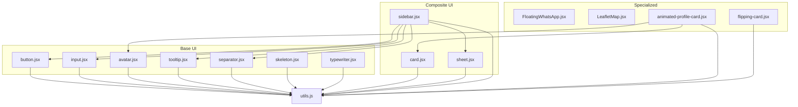
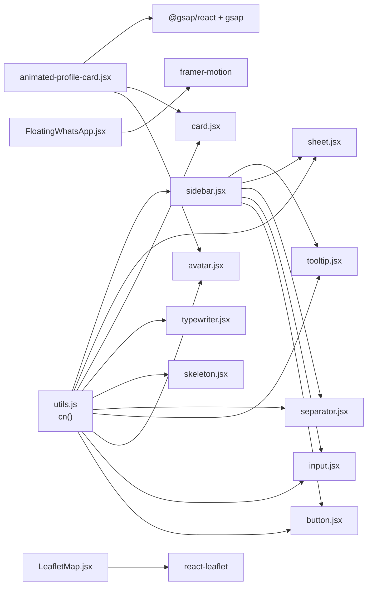
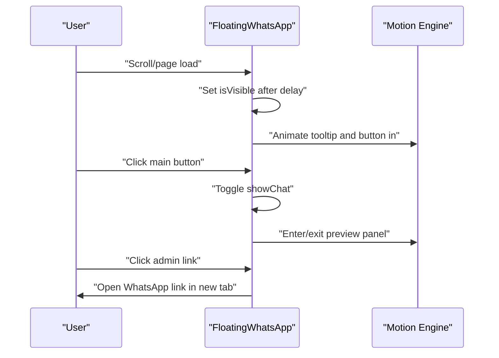
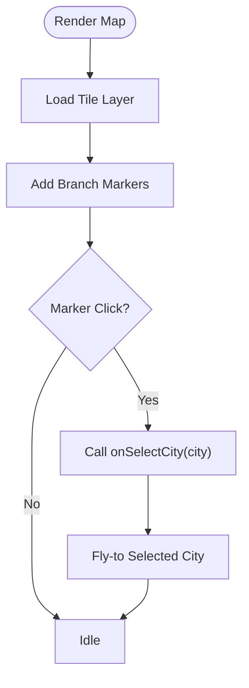
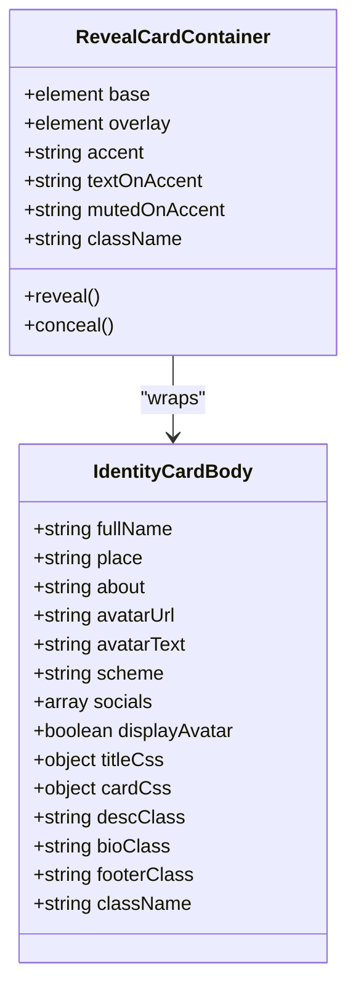
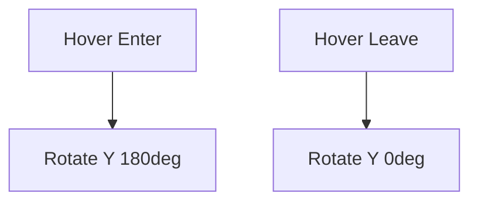
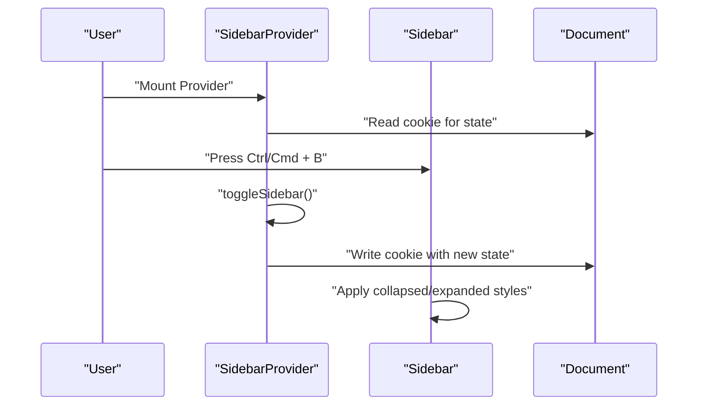
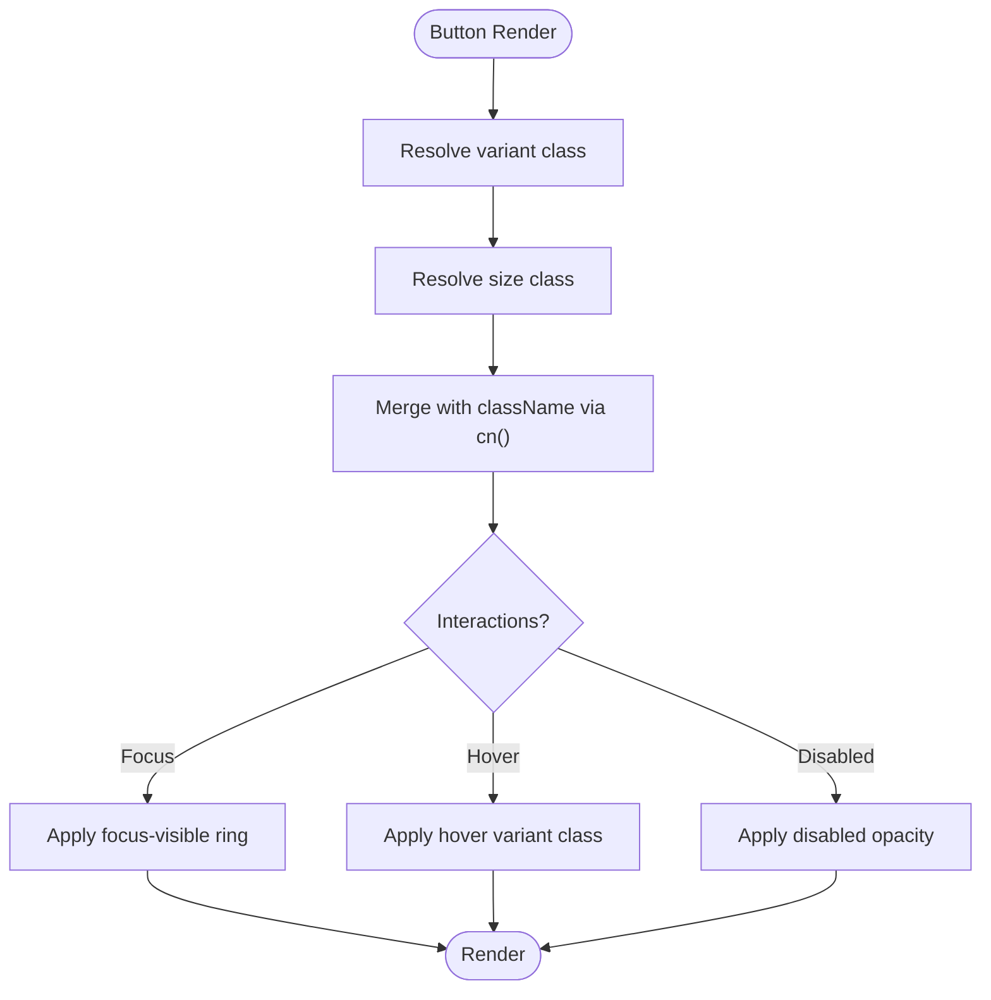
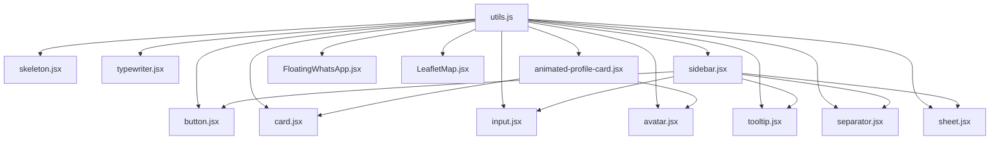

# UI Component Library

<cite>
**Referenced Files in This Document**
- [button.jsx](file://resources/js/Components/ui/button.jsx)
- [card.jsx](file://resources/js/Components/ui/card.jsx)
- [input.jsx](file://resources/js/Components/ui/input.jsx)
- [sidebar.jsx](file://resources/js/Components/ui/sidebar.jsx)
- [sheet.jsx](file://resources/js/Components/ui/sheet.jsx)
- [FloatingWhatsApp.jsx](file://resources/js/Components/ui/FloatingWhatsApp.jsx)
- [LeafletMap.jsx](file://resources/js/Components/ui/LeafletMap.jsx)
- [animated-profile-card.jsx](file://resources/js/Components/ui/animated-profile-card.jsx)
- [flipping-card.jsx](file://resources/js/Components/ui/flipping-card.jsx)
- [avatar.jsx](file://resources/js/Components/ui/avatar.jsx)
- [tooltip.jsx](file://resources/js/Components/ui/tooltip.jsx)
- [separator.jsx](file://resources/js/Components/ui/separator.jsx)
- [skeleton.jsx](file://resources/js/Components/ui/skeleton.jsx)
- [typewriter.jsx](file://resources/js/Components/ui/typewriter.jsx)
- [utils.js](file://resources/js/lib/utils.js)
</cite>

## Table of Contents
1. [Introduction](#introduction)
2. [Project Structure](#project-structure)
3. [Core Components](#core-components)
4. [Architecture Overview](#architecture-overview)
5. [Detailed Component Analysis](#detailed-component-analysis)
6. [Dependency Analysis](#dependency-analysis)
7. [Performance Considerations](#performance-considerations)
8. [Troubleshooting Guide](#troubleshooting-guide)
9. [Conclusion](#conclusion)
10. [Appendices](#appendices)

## Introduction
This document describes the EDUfa UI component library, a React-based design system tailored for educational and administrative interfaces. It covers reusable base UI components, layout scaffolding, and specialized components such as an interactive floating WhatsApp widget, an animated profile card, a 3D flipping card, and an interactive map. The guide documents component props, states, animations, customization via Tailwind CSS and CSS variables, accessibility, responsive behavior, and integration patterns within the application.

## Project Structure
The UI components are organized under resources/js/Components/ui, grouped by functional categories:
- Base UI primitives: button, input, avatar, tooltip, separator, skeleton, typewriter
- Composite layouts: card, sheet, sidebar
- Specialized educational/administrative components: FloatingWhatsApp, LeafletMap, animated-profile-card, flipping-card

**Diagram sources**
- [button.jsx:1-49](file://resources/js/Components/ui/button.jsx#L1-L49)
- [input.jsx:1-20](file://resources/js/Components/ui/input.jsx#L1-L20)
- [avatar.jsx:1-42](file://resources/js/Components/ui/avatar.jsx#L1-L42)
- [tooltip.jsx:1-26](file://resources/js/Components/ui/tooltip.jsx#L1-L26)
- [separator.jsx:1-26](file://resources/js/Components/ui/separator.jsx#L1-L26)
- [skeleton.jsx:1-17](file://resources/js/Components/ui/skeleton.jsx#L1-L17)
- [typewriter.jsx:1-115](file://resources/js/Components/ui/typewriter.jsx#L1-L115)
- [card.jsx:1-61](file://resources/js/Components/ui/card.jsx#L1-L61)
- [sheet.jsx:1-123](file://resources/js/Components/ui/sheet.jsx#L1-L123)
- [sidebar.jsx:1-652](file://resources/js/Components/ui/sidebar.jsx#L1-L652)
- [FloatingWhatsApp.jsx:1-214](file://resources/js/Components/ui/FloatingWhatsApp.jsx#L1-L214)
- [LeafletMap.jsx:1-78](file://resources/js/Components/ui/LeafletMap.jsx#L1-L78)
- [animated-profile-card.jsx:1-224](file://resources/js/Components/ui/animated-profile-card.jsx#L1-L224)
- [flipping-card.jsx:1-55](file://resources/js/Components/ui/flipping-card.jsx#L1-L55)
- [utils.js:1-7](file://resources/js/lib/utils.js#L1-L7)

**Section sources**
- [button.jsx:1-49](file://resources/js/Components/ui/button.jsx#L1-L49)
- [card.jsx:1-61](file://resources/js/Components/ui/card.jsx#L1-L61)
- [input.jsx:1-20](file://resources/js/Components/ui/input.jsx#L1-L20)
- [sidebar.jsx:1-652](file://resources/js/Components/ui/sidebar.jsx#L1-L652)
- [sheet.jsx:1-123](file://resources/js/Components/ui/sheet.jsx#L1-L123)
- [FloatingWhatsApp.jsx:1-214](file://resources/js/Components/ui/FloatingWhatsApp.jsx#L1-L214)
- [LeafletMap.jsx:1-78](file://resources/js/Components/ui/LeafletMap.jsx#L1-L78)
- [animated-profile-card.jsx:1-224](file://resources/js/Components/ui/animated-profile-card.jsx#L1-L224)
- [flipping-card.jsx:1-55](file://resources/js/Components/ui/flipping-card.jsx#L1-L55)
- [avatar.jsx:1-42](file://resources/js/Components/ui/avatar.jsx#L1-L42)
- [tooltip.jsx:1-26](file://resources/js/Components/ui/tooltip.jsx#L1-L26)
- [separator.jsx:1-26](file://resources/js/Components/ui/separator.jsx#L1-L26)
- [skeleton.jsx:1-17](file://resources/js/Components/ui/skeleton.jsx#L1-L17)
- [typewriter.jsx:1-115](file://resources/js/Components/ui/typewriter.jsx#L1-L115)
- [utils.js:1-7](file://resources/js/lib/utils.js#L1-L7)

## Core Components
This section documents the foundational UI primitives and their customization options.

- Button
  - Purpose: Standard action element with variant and size scales.
  - Props:
    - variant: default | destructive | outline | secondary | ghost | link
    - size: default | sm | lg | icon
    - asChild: boolean (render underlying Radix Slot)
    - className: string
    - rest spread to button or Slot
  - States and Events: Focus-visible ring, disabled state, click handlers via forwarded ref.
  - Theming: Uses class-variance-authority variants and Tailwind utilities; supports className merging via cn.
  - Accessibility: Inherits native button semantics; focus-visible ring for keyboard navigation.

- Input
  - Purpose: Text input with consistent styling and focus states.
  - Props:
    - type: string (input type)
    - className: string
    - rest spread to input
  - States and Events: Disabled state, focus-visible ring, placeholder styling.
  - Theming: Merges Tailwind classes with cn.

- Avatar
  - Purpose: User identity with image fallback.
  - Components:
    - Avatar: Root container
    - AvatarImage: Image slot
    - AvatarFallback: Fallback content
  - Props: className for each part; forwards ref.
  - Accessibility: Uses Radix primitives; semantic roles handled internally.

- Tooltip
  - Purpose: Contextual help or labeling.
  - Components:
    - TooltipProvider: Global provider
    - Tooltip: Root
    - TooltipTrigger: Trigger element
    - TooltipContent: Popover content with directional animations
  - Props: sideOffset, className; forwards ref.
  - Accessibility: Uses Radix Tooltip primitives; supports keyboard navigation.

- Separator
  - Purpose: Visual divider.
  - Props: orientation (horizontal | vertical), decorative, className.
  - Accessibility: Decorative by default; adjust for meaningful separators.

- Skeleton
  - Purpose: Loading placeholders.
  - Props: className.
  - Behavior: Applies pulse animation via Tailwind.

- Typewriter
  - Purpose: Animated text typing effect with optional deletion and looping.
  - Props:
    - text: string | string[]
    - speed: number (chars per interval)
    - initialDelay: number
    - waitTime: number (pause between loops)
    - deleteSpeed: number
    - loop: boolean
    - showCursor: boolean
    - hideCursorOnType: boolean
    - cursorChar: string
    - cursorClassName: string
    - cursorAnimationVariants: motion variants
    - className: string
  - States and Events: Internal state machine for typing/deleting; controlled by effects.
  - Accessibility: Consider screen reader pauses; optional cursor animation variants.

- Card
  - Purpose: Content grouping with header/title/description/content/footer slots.
  - Components:
    - Card
    - CardHeader
    - CardTitle
    - CardDescription
    - CardContent
    - CardFooter
  - Props: className for each; forwards ref.
  - Theming: Uses Tailwind utilities and semantic tokens.

- Sheet
  - Purpose: Slide-in panel for modals or overlays.
  - Components:
    - Sheet, SheetPortal, SheetOverlay
    - SheetTrigger, SheetClose
    - SheetContent (side: top | bottom | left | right)
    - SheetHeader, SheetFooter, SheetTitle, SheetDescription
  - Props: side, className; forwards ref.
  - Animations: slide-in/out transitions; overlay fade.

- Sidebar (Provider, Sidebar, Trigger, Rail, Inset, Menu family)
  - Purpose: Navigation scaffold with responsive behavior and keyboard shortcuts.
  - Key behaviors:
    - Mobile off-canvas via Sheet
    - Desktop collapsible/floating/inset variants
    - Keyboard shortcut (Ctrl/Cmd + B) to toggle
    - Cookie persistence for expanded/collapsed state
  - Components:
    - SidebarProvider (context, state, toggle)
    - Sidebar (side, variant, collapsible)
    - SidebarTrigger, SidebarRail
    - SidebarInset
    - SidebarHeader, SidebarFooter, SidebarSeparator, SidebarContent
    - SidebarGroup, SidebarGroupLabel, SidebarGroupAction, SidebarGroupContent
    - SidebarMenu, SidebarMenuItem, SidebarMenuButton, SidebarMenuAction, SidebarMenuBadge, SidebarMenuSkeleton, SidebarMenuSub, SidebarMenuSubButton
    - SidebarInput
  - Props: extensive; includes variant, size, tooltip, isActive, collapsible, side.
  - Accessibility: TooltipProvider, sr-only labels, keyboard focus management.

Usage example references:
- Button: [button.jsx:36-46](file://resources/js/Components/ui/button.jsx#L36-L46)
- Input: [input.jsx:4-16](file://resources/js/Components/ui/input.jsx#L4-L16)
- Avatar: [avatar.jsx:8-39](file://resources/js/Components/ui/avatar.jsx#L8-L39)
- Tooltip: [tooltip.jsx:12-22](file://resources/js/Components/ui/tooltip.jsx#L12-L22)
- Separator: [separator.jsx:5-22](file://resources/js/Components/ui/separator.jsx#L5-L22)
- Skeleton: [skeleton.jsx:4-14](file://resources/js/Components/ui/skeleton.jsx#L4-L14)
- Typewriter: [typewriter.jsx:5-29](file://resources/js/Components/ui/typewriter.jsx#L5-L29)
- Card: [card.jsx:4-60](file://resources/js/Components/ui/card.jsx#L4-L60)
- Sheet: [sheet.jsx:47-63](file://resources/js/Components/ui/sheet.jsx#L47-L63)
- Sidebar: [sidebar.jsx:135-226](file://resources/js/Components/ui/sidebar.jsx#L135-L226)

**Section sources**
- [button.jsx:1-49](file://resources/js/Components/ui/button.jsx#L1-L49)
- [input.jsx:1-20](file://resources/js/Components/ui/input.jsx#L1-L20)
- [avatar.jsx:1-42](file://resources/js/Components/ui/avatar.jsx#L1-L42)
- [tooltip.jsx:1-26](file://resources/js/Components/ui/tooltip.jsx#L1-L26)
- [separator.jsx:1-26](file://resources/js/Components/ui/separator.jsx#L1-L26)
- [skeleton.jsx:1-17](file://resources/js/Components/ui/skeleton.jsx#L1-L17)
- [typewriter.jsx:1-115](file://resources/js/Components/ui/typewriter.jsx#L1-L115)
- [card.jsx:1-61](file://resources/js/Components/ui/card.jsx#L1-L61)
- [sheet.jsx:1-123](file://resources/js/Components/ui/sheet.jsx#L1-L123)
- [sidebar.jsx:1-652](file://resources/js/Components/ui/sidebar.jsx#L1-L652)

## Architecture Overview
The UI library composes small, single-purpose primitives into larger composite components. Utility functions merge Tailwind classes safely. Specialized components integrate external libraries (framer-motion for animations, GSAP for advanced animations, react-leaflet for maps).

**Diagram sources**
- [utils.js:1-7](file://resources/js/lib/utils.js#L1-L7)
- [button.jsx:1-49](file://resources/js/Components/ui/button.jsx#L1-L49)
- [input.jsx:1-20](file://resources/js/Components/ui/input.jsx#L1-L20)
- [avatar.jsx:1-42](file://resources/js/Components/ui/avatar.jsx#L1-L42)
- [tooltip.jsx:1-26](file://resources/js/Components/ui/tooltip.jsx#L1-L26)
- [separator.jsx:1-26](file://resources/js/Components/ui/separator.jsx#L1-L26)
- [skeleton.jsx:1-17](file://resources/js/Components/ui/skeleton.jsx#L1-L17)
- [typewriter.jsx:1-115](file://resources/js/Components/ui/typewriter.jsx#L1-L115)
- [card.jsx:1-61](file://resources/js/Components/ui/card.jsx#L1-L61)
- [sheet.jsx:1-123](file://resources/js/Components/ui/sheet.jsx#L1-L123)
- [sidebar.jsx:1-652](file://resources/js/Components/ui/sidebar.jsx#L1-L652)
- [animated-profile-card.jsx:1-224](file://resources/js/Components/ui/animated-profile-card.jsx#L1-L224)
- [FloatingWhatsApp.jsx:1-214](file://resources/js/Components/ui/FloatingWhatsApp.jsx#L1-L214)
- [LeafletMap.jsx:1-78](file://resources/js/Components/ui/LeafletMap.jsx#L1-L78)

## Detailed Component Analysis

### FloatingWhatsApp
- Purpose: Prominent floating action with animated chat preview and two contact links.
- States:
  - isVisible: appears after initial delay
  - showChat: toggles chat preview visibility
- Props: none (hardcoded links and styles)
- Interactions:
  - Hover/idle tooltip glow and bounce badge
  - Clicking main button toggles chat panel
  - Clicking close hides preview
  - Hover effects on preview links
- Animations:
  - Framer Motion: staggered entrance, spring-like reveals, pulsing badges, icon rotation/toggle
- Accessibility:
  - Close button has screen-reader label
  - Links open in new tabs with safe attributes
- Customization:
  - Colors via Tailwind classes (EDUfa brand palette)
  - Sizes via remapped classes on buttons and text
  - Positioning via fixed positioning and z-index

**Diagram sources**
- [FloatingWhatsApp.jsx:15-22](file://resources/js/Components/ui/FloatingWhatsApp.jsx#L15-L22)
- [FloatingWhatsApp.jsx:136-146](file://resources/js/Components/ui/FloatingWhatsApp.jsx#L136-L146)
- [FloatingWhatsApp.jsx:165-206](file://resources/js/Components/ui/FloatingWhatsApp.jsx#L165-L206)

**Section sources**
- [FloatingWhatsApp.jsx:1-214](file://resources/js/Components/ui/FloatingWhatsApp.jsx#L1-L214)

### LeafletMap
- Purpose: Interactive map with custom markers and city selection.
- Props:
  - branches: array of branch objects with lat/lng and city/address
  - selectedCity: currently selected city
  - onSelectCity: callback receiving city on marker click
- Features:
  - Custom markers via divIcon with Tailwind classes
  - Fly-to animation to selected city
  - Carto tile layer
  - Click handlers on markers to update selection
- Styling:
  - Rounded corners, background color, responsive sizing
- Accessibility:
  - Popup content is accessible; ensure focus management if extended

**Diagram sources**
- [LeafletMap.jsx:36-77](file://resources/js/Components/ui/LeafletMap.jsx#L36-L77)
- [LeafletMap.jsx:19-34](file://resources/js/Components/ui/LeafletMap.jsx#L19-L34)

**Section sources**
- [LeafletMap.jsx:1-78](file://resources/js/Components/ui/LeafletMap.jsx#L1-L78)

### Animated Profile Card
- Purpose: Identity card with layered reveal animation and optional accent theme.
- Composition:
  - IdentityCardBody: renders avatar, title, description, bio, and social links
  - RevealCardContainer: animates overlay using GSAP clip-path and idle float
- Props:
  - IdentityCardBody:
    - fullName, place, about, avatarUrl, avatarText, scheme ("plain" | "accented")
    - socials: array of { id, url, label, icon }
    - displayAvatar, titleCss, cardCss, descClass, bioClass, footerClass, className
  - RevealCardContainer:
    - base, overlay, accent, textOnAccent, mutedOnAccent, className
- Animations:
  - GSAP: clip-path reveal/conceal on hover; idle floating
  - Framer Motion: subtle entrance in preview
- Theming:
  - CSS variables for accent colors and on-accent text
  - Tailwind classes for backgrounds and borders
- Accessibility:
  - Social links include aria-labels; ensure sufficient color contrast

**Diagram sources**
- [animated-profile-card.jsx:18-133](file://resources/js/Components/ui/animated-profile-card.jsx#L18-L133)
- [animated-profile-card.jsx:137-224](file://resources/js/Components/ui/animated-profile-card.jsx#L137-L224)

**Section sources**
- [animated-profile-card.jsx:1-224](file://resources/js/Components/ui/animated-profile-card.jsx#L1-L224)

### Flipping Card
- Purpose: 3D flip card showing front/back content on hover.
- Props:
  - className, frontContent, backContent, height, width, accentColor
- Styling:
  - Perspective and preserve-3d transforms
  - Backface visibility hidden for clean flip
  - Accent color applied via CSS variable
- Accessibility:
  - Consider static fallback for reduced motion users

**Diagram sources**
- [flipping-card.jsx:16-54](file://resources/js/Components/ui/flipping-card.jsx#L16-L54)

**Section sources**
- [flipping-card.jsx:1-55](file://resources/js/Components/ui/flipping-card.jsx#L1-L55)

### Sidebar (Provider, Sidebar, Menu Family)
- Purpose: Navigation scaffold with responsive behavior, keyboard shortcuts, and persistent state.
- Key behaviors:
  - Mobile: Sheet-based off-canvas
  - Desktop: Collapsible/floating/inset variants
  - Keyboard shortcut: Ctrl/Cmd + B to toggle
  - Cookie persistence for expanded/collapsed state
- Props:
  - SidebarProvider: defaultOpen, open/onOpenChange, className, style
  - Sidebar: side, variant, collapsible, className
  - SidebarMenuButton: variant, size, tooltip, isActive, asChild
  - SidebarMenuAction: asChild, showOnHover
  - SidebarMenuSubButton: size, isActive, asChild
  - Others: asChild, tooltip, className, etc.
- Accessibility:
  - TooltipProvider enabled globally
  - Screen-reader labels on triggers
  - Focus management for menu actions

**Diagram sources**
- [sidebar.jsx:40-132](file://resources/js/Components/ui/sidebar.jsx#L40-L132)
- [sidebar.jsx:135-226](file://resources/js/Components/ui/sidebar.jsx#L135-L226)

**Section sources**
- [sidebar.jsx:1-652](file://resources/js/Components/ui/sidebar.jsx#L1-L652)

### Button Variants and States
- Variants: default, destructive, outline, secondary, ghost, link
- Sizes: default, sm, lg, icon
- States: disabled, focus-visible ring, hover states
- Implementation pattern: class-variance-authority with cn merging

**Diagram sources**
- [button.jsx:7-34](file://resources/js/Components/ui/button.jsx#L7-L34)
- [button.jsx:36-46](file://resources/js/Components/ui/button.jsx#L36-L46)
- [utils.js:4-6](file://resources/js/lib/utils.js#L4-L6)

**Section sources**
- [button.jsx:1-49](file://resources/js/Components/ui/button.jsx#L1-L49)
- [utils.js:1-7](file://resources/js/lib/utils.js#L1-L7)

## Dependency Analysis
- Internal dependencies:
  - All components depend on cn() from utils.js for safe Tailwind class merging.
  - Sidebar composes Button, Input, Separator, Sheet, Tooltip, and Skeleton.
  - Animated profile card composes Avatar, Card, and uses @gsap/react + gsap.
  - FloatingWhatsApp integrates framer-motion.
  - LeafletMap integrates react-leaflet and leaflet CSS.
- External libraries:
  - @radix-ui/react-slot, @radix-ui/react-dialog, @radix-ui/react-tooltip, @radix-ui/react-separator, @radix-ui/react-avatar
  - lucide-react icons
  - class-variance-authority for variants
  - framer-motion for animations
  - @gsap/react and gsap for advanced animations
  - react-leaflet and leaflet for maps

**Diagram sources**
- [utils.js:1-7](file://resources/js/lib/utils.js#L1-L7)
- [button.jsx:1-49](file://resources/js/Components/ui/button.jsx#L1-L49)
- [card.jsx:1-61](file://resources/js/Components/ui/card.jsx#L1-L61)
- [input.jsx:1-20](file://resources/js/Components/ui/input.jsx#L1-L20)
- [avatar.jsx:1-42](file://resources/js/Components/ui/avatar.jsx#L1-L42)
- [tooltip.jsx:1-26](file://resources/js/Components/ui/tooltip.jsx#L1-L26)
- [separator.jsx:1-26](file://resources/js/Components/ui/separator.jsx#L1-L26)
- [skeleton.jsx:1-17](file://resources/js/Components/ui/skeleton.jsx#L1-L17)
- [typewriter.jsx:1-115](file://resources/js/Components/ui/typewriter.jsx#L1-L115)
- [sheet.jsx:1-123](file://resources/js/Components/ui/sheet.jsx#L1-L123)
- [sidebar.jsx:1-652](file://resources/js/Components/ui/sidebar.jsx#L1-L652)
- [animated-profile-card.jsx:1-224](file://resources/js/Components/ui/animated-profile-card.jsx#L1-L224)
- [FloatingWhatsApp.jsx:1-214](file://resources/js/Components/ui/FloatingWhatsApp.jsx#L1-L214)
- [LeafletMap.jsx:1-78](file://resources/js/Components/ui/LeafletMap.jsx#L1-L78)

**Section sources**
- [utils.js:1-7](file://resources/js/lib/utils.js#L1-L7)
- [sidebar.jsx:1-652](file://resources/js/Components/ui/sidebar.jsx#L1-L652)
- [animated-profile-card.jsx:1-224](file://resources/js/Components/ui/animated-profile-card.jsx#L1-L224)
- [FloatingWhatsApp.jsx:1-214](file://resources/js/Components/ui/FloatingWhatsApp.jsx#L1-L214)
- [LeafletMap.jsx:1-78](file://resources/js/Components/ui/LeafletMap.jsx#L1-L78)

## Performance Considerations
- Prefer lightweight primitives and compose via cn() to minimize extra DOM nodes.
- Defer heavy animations (GSAP) to user interaction to reduce initial paint cost.
- Use Skeleton for async content areas to maintain perceived performance.
- Memoize computed values (e.g., random widths in skeletons) to avoid re-computation.
- Avoid unnecessary re-renders by passing stable callbacks and avoiding inline prop objects.
- Lazy-load map components if they are not immediately visible.
- Use CSS containment and transform-style for smoother 3D flips and overlays.

## Troubleshooting Guide
- Button focus ring not visible:
  - Ensure focus-visible ring utilities are included in Tailwind build.
  - Verify focus-visible polyfills if targeting older browsers.
- Tooltip not showing:
  - Wrap content in TooltipProvider at the nearest ancestor.
  - Confirm TooltipTrigger is used as a child of Tooltip.
- Sidebar keyboard shortcut not working:
  - Ensure SidebarProvider is mounted above trigger.
  - Check browser key combination conflicts.
- FloatingWhatsApp not appearing:
  - Confirm motion library is installed and initialized.
  - Verify fixed positioning context and z-index stacking.
- LeafletMap not rendering:
  - Ensure react-leaflet and leaflet CSS are imported.
  - Confirm branch coordinates are present and numeric.
- Animated profile card not animating:
  - Ensure GSAP and @gsap/react are installed.
  - Verify container has sufficient space and no overflow clipping.

**Section sources**
- [tooltip.jsx:6-22](file://resources/js/Components/ui/tooltip.jsx#L6-L22)
- [sidebar.jsx:40-132](file://resources/js/Components/ui/sidebar.jsx#L40-L132)
- [FloatingWhatsApp.jsx:15-22](file://resources/js/Components/ui/FloatingWhatsApp.jsx#L15-L22)
- [LeafletMap.jsx:1-78](file://resources/js/Components/ui/LeafletMap.jsx#L1-L78)
- [animated-profile-card.jsx:166-178](file://resources/js/Components/ui/animated-profile-card.jsx#L166-L178)

## Conclusion
The EDUfa UI component library provides a cohesive set of base primitives, layout scaffolding, and specialized components optimized for education and administration. By leveraging Tailwind CSS, class-variance-authority, and modern animation libraries, components are highly customizable, accessible, and performant. The Sidebar offers robust responsive behavior, while FloatingWhatsApp, LeafletMap, animated profile cards, and flipping cards deliver engaging user experiences.

## Appendices
- Responsive design patterns:
  - Use mobile-first Tailwind utilities; leverage responsive variants (sm:, md:, lg:).
  - Sidebar adapts automatically to mobile via Sheet and desktop via fixed panels.
  - FloatingWhatsApp adjusts sizes for small screens with remapped classes.
- Accessibility compliance:
  - Buttons and links include focus-visible rings and aria labels where applicable.
  - Tooltips and popovers use Radix primitives with proper keyboard navigation.
  - Images include fallbacks via AvatarFallback.
- Cross-browser compatibility:
  - Ensure CSS variables are supported or polyfilled.
  - Verify transform-style and preserve-3d support for 3D effects.
  - Test motion libraries in constrained environments.
- Style customization:
  - Override default variants via className; use CSS variables for theming.
  - Compose components with Tailwind utilities for quick overrides.
- Component composition:
  - Build complex UIs by composing primitives (e.g., SidebarMenuButton inside SidebarMenu).
  - Use cn() to merge defaults with custom classes safely.